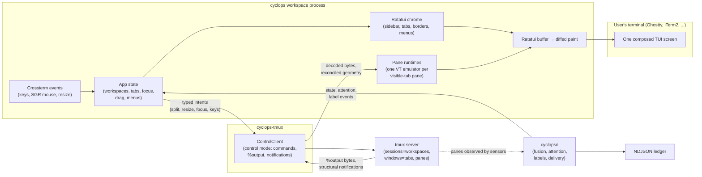
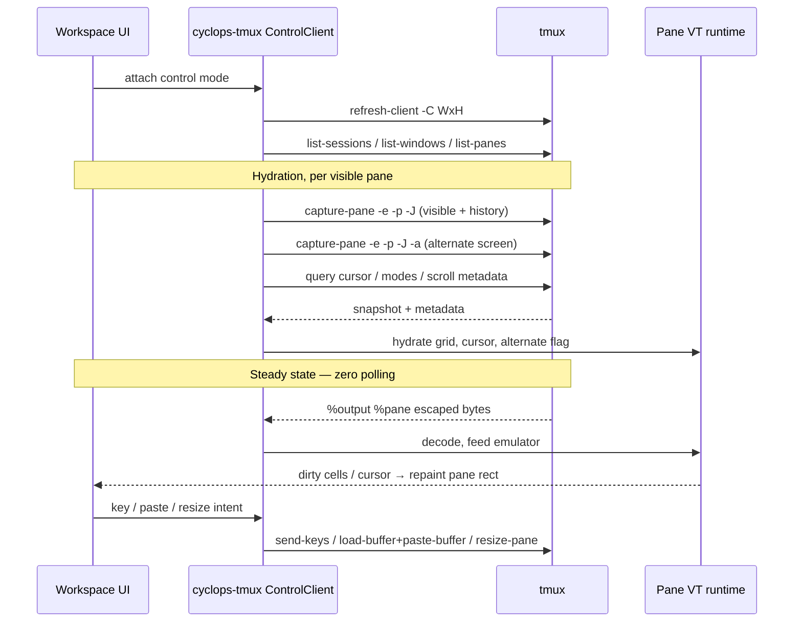
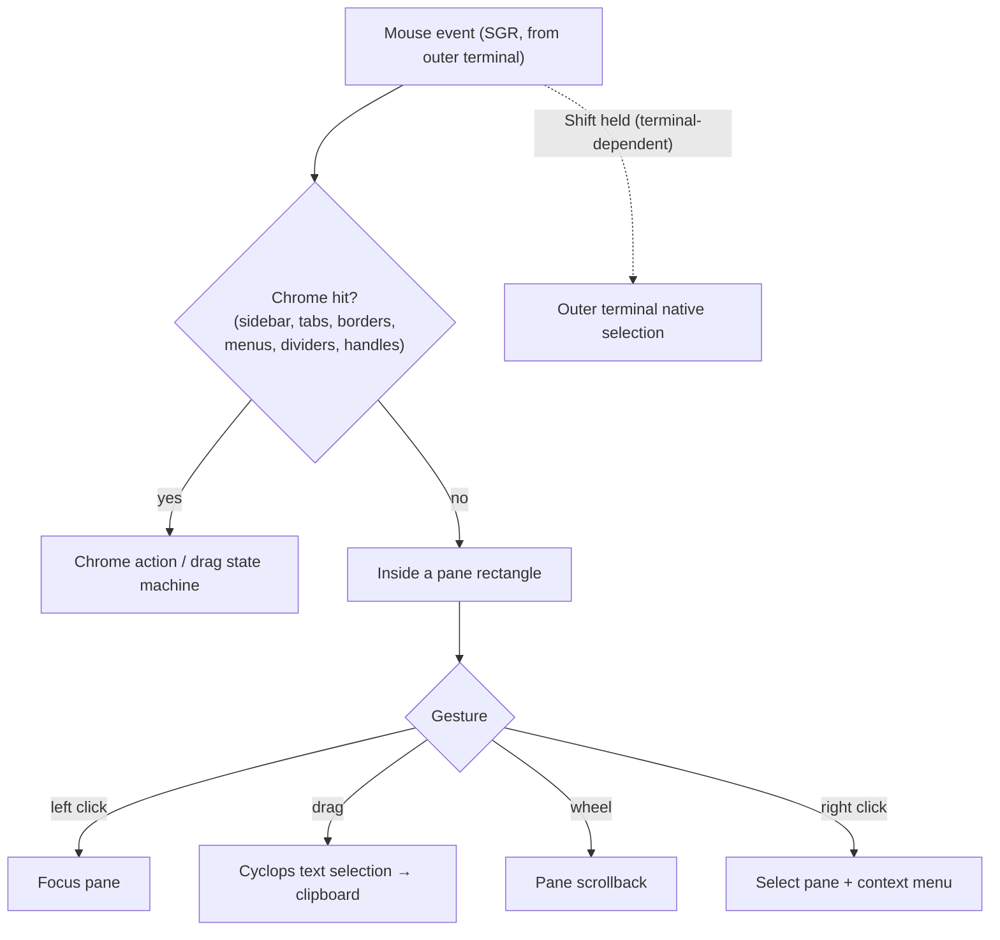

# Cyclops Terminal Workspace UI — Detailed Design

Status: draft for review · 2026-08-03

## Overview

Cyclops gains a flagship full-screen terminal workspace, launched by running
`cyclops` with no subcommand. The workspace looks and feels like Herdr — a
persistent project sidebar, a tab bar, a pane canvas with full mouse
manipulation — but tmux remains the multiplexer and `cyclopsd` remains the
brain. The UI is a client: it owns no processes, no PTYs, and no state that
tmux or the daemon cannot already express.

The central technical commitment is a **composite renderer**: Cyclops draws
everything on screen, including live terminal pane content. Pane bytes arrive
through tmux control mode, are interpreted by a per-pane VT (virtual
terminal) emulator, and are painted into the user's terminal alongside the
chrome. This is the same rendering architecture Herdr uses, fed by tmux
instead of by owned PTYs.

The first release ships with a deliberate feature floor: common ANSI/VT
fidelity (text, 16/256/truecolor, attributes, cursor, alternate screen),
keyboard forwarding, wheel scrollback, and mouse selection with clipboard
copy. Deferred beyond v1: image protocols (Sixel, Kitty graphics), mouse
forwarding *into* pane applications, and exotic escape sequences.

### What this feels like

```text
┌────────────────┬──────────────────────────────────────────────┐
│ Workspaces     │ main     review     tests                 +  │
│                ├─────────────────────┬────────────────────────┤
│ ▾ cyclops    1 │                     │                  ▯▯  ▤ │
│   reviewer     │                     │                        │
│   Claude Code  │      terminal       │       terminal         │
│                │                     │                        │
│ ▸ website      ├─────────────────────┴────────────────────────┤
│ ▸ bucky        │                                              │
│                │                  terminal                    │
│ ☰ Menu         │                                              │
└────────────────┴──────────────────────────────────────────────┘
```

Close the terminal, reopen, run `cyclops`: the same workspaces, tabs, panes,
and running agents are exactly where they were, because they were tmux
sessions all along.

## Detailed Requirements

Consolidated from requirements clarification. Each decision below is final
for v1 unless review reopens it.

### R1 — Pane rendering: composite with a feature floor

Cyclops owns all rendering. tmux control mode feeds a VT emulator per pane;
Cyclops paints pane cell grids and chrome into the user's terminal.

Ship floor: text, full color (16/256-color and truecolor), bold/italic/
underline/reverse attributes, cursor position and visibility, alternate
screen (vim, htop, and agent TUIs must work), keyboard forwarding, basic
scrollback.

Deferred: image protocols, mouse forwarding into pane programs (chrome mouse
still fully works), uncommon private modes and escape sequences.

### R2 — State is durable and shared

- Cyclops workspace → tmux session
- Cyclops tab → tmux window
- Cyclops pane → tmux pane

The organization lives in tmux and survives the UI closing or crashing;
plain `tmux attach` shows the same structure. Metadata tmux cannot express
(pane labels, agent identity, states, attention) already lives in the daemon
and ledger; new workspace metadata (last-active workspace/tab, sidebar
state) follows the same pattern so every client sees the same answers. There
is no UI-private layout file.

### R3 — Full mouse manipulation in v1

The first release includes the core chrome (sidebar, tab bar, pane
titles/borders with agent state and attention, click-to-focus, splits,
theming) plus the full mouse story: drag-to-rearrange tabs and panes, mouse
border resizing, and right-click context menus. Every mouse action has a
keyboard equivalent; keyboard operation is complete on terminals where mouse
reporting is absent or intercepted.

### R4 — Command surface

- Bare `cyclops` opens the workspace. TTY-gated: when stdout is not a
  terminal it prints help instead, so scripts and agents probing the CLI
  never hang inside a TUI.
- `cyclops watch` becomes the stream TUI (today's `cyclops ui`).
  `cyclops watch --json` keeps the existing machine-readable line-per-event
  stream byte-for-byte; `--plain` remains the human line-by-line form.
- `cyclops ui` is retired (optionally aliased to `watch` during transition
  with a deprecation note).

### R5 — Coexistence: last-active client wins

Plain tmux clients may stay attached to the same sessions. Sizing follows
tmux's `window-size latest` policy: whichever client is actively used sets
pane sizes, and the workspace re-flows when another client changes them.
The workspace declares its pane-canvas size through control mode
(`refresh-client -C`). This matches Herdr's foreground-client model.

### R6 — Keyboard model: prefix-first, rebindable, mouse-primary

Default bindings are prefix-first (`Ctrl+B`, matching tmux and Herdr): next/
previous tab, tab 1–9, new tab, workspace picker, pane swaps, detach. No
default direct chord can collide with what a pane application needs. Every
binding is user-configurable to a direct chord (e.g. `ctrl+alt+]`). All keys
outside the reserved set pass through to the focused pane untouched. The
mouse is the primary chrome interaction; the prefix exists for
keyboard-driven use.

### R7 — Workspaces are projects; every session shows

Every session on the tmux server appears in the sidebar. Sessions with
detected agents get state and attention decoration; plain sessions are
ordinary usable terminals.

"New workspace" means picking a project folder: the UI creates a tmux
session named after the folder with its default directory set there, so new
tabs and splits open in the project. This is convention layered on plain
tmux sessions — no new state, and `tmux attach` sees an ordinary session.
Foreign sessions keep whatever directory they have.

### R8 — Attention: indicators plus a toggleable panel

The eye and per-agent state badges appear on sidebar rows, tabs, and pane
borders, rolling up pane → tab → workspace. Clicking an indicator jumps to
the pane. Attention is computed only by the daemon (one owner: the attention
rule in `cyclops-proto`); the UI never recomputes it. A slide-out event
panel, hidden by default and toggled by key or click, shows recent activity
from the daemon's event stream. Routine working/idle transitions stay
visually quiet.

### R9 — Native-feel copy and scroll

Mouse wheel scrolls the focused pane's history. Click-drag selects text
within a pane; selection copies to the system clipboard. Because Cyclops
composites the screen, the outer terminal's own selection would grab chrome
and all — pane-local selection must be Cyclops's own. The outer terminal's
bypass modifier (Shift in Ghostty/WezTerm) remains available for native
selection where the terminal supports it.

### Cross-cutting requirements from the product idea

- Unnamed panes have no permanent chrome text; naming a pane (its Cyclops
  identity and message address) progressively reveals coordination chrome
  (`reviewer · ● working`).
- The pane title is a sensor and is never written; adoption decoration goes
  on borders only.
- State indicators always combine text, glyph, and color — never color
  alone.
- One semantic theme system across every surface; no component hardcodes
  colors. Theme switching stays `cyclops theme <name>`.
- Split controls: exactly two icon buttons (split right, split down) in the
  hovered/selected pane's upper-right corner; the same actions exist in the
  context menu and keyboard map.
- Application menu (Settings, Keybindings, Detach) anchored bottom-left; the
  application menu and pane context menu are mutually exclusive in app
  state.
- Detach returns to the shell without terminating tmux, agents, or the
  daemon.
- No polling anywhere: every update is driven by a control-mode
  notification, a daemon event, or user input. The only timers permitted
  follow the repo's existing sanctioned shapes: one event-armed render
  debounce (mirroring the watcher's `RECONCILE_DEBOUNCE` pattern — armed by
  an event, disarmed by running, never self-rescheduling) and bounded
  one-shot timers, each named and listed in one module header the way
  `crates/cyclopsd/src/delivery.rs` lists its own.
- Nothing the UI reads off a screen is ever persisted (Invariant 7): pane
  grids, scrollback, and selections live in memory only and never enter the
  ledger, logs, error reports, or saved state. Clipboard copy is the one
  deliberate export, performed only on the user's explicit selection.

## Architecture Overview



Responsibilities:

- **tmux** owns sessions, windows, panes, PTYs, processes, and layout truth.
- **cyclopsd** owns agent detection, labels, states, attention, messaging,
  and persistence of Cyclops metadata. Unchanged by this project except for
  small additive state (last-active workspace/tab, sidebar preferences).
- **cyclops-tmux** owns every tmux invocation, as today. It grows
  control-mode streaming: `%output`/`%extended-output` decoding, structural
  notification fan-out, escaped capture for hydration, client sizing, and
  flow control.
- **The workspace crate** (new, `cyclops-workspace`) owns app state, chrome
  rendering, pane VT runtimes, the mouse/keyboard router, and translation of
  UI intents into adapter calls and daemon requests.
- **cyclops (CLI)** stays a thin binary: bare invocation dispatches into the
  workspace crate the same way `cyclops watch` dispatches into the stream
  UI.

### The pane pipeline (the load-bearing new machinery)



Hydration is the hardest correctness boundary. An escaped capture is a good
visual snapshot but cannot perfectly reconstruct the emulator's internal
parser state (saved cursors, origin mode, partial escape sequences). The
design treats this honestly:

- capture output displays a pane immediately;
- format metadata initializes cursor, alternate-screen, and dimensions;
- subsequent `%output` bytes flow through the emulator;
- the runtime rehydrates after flow-control pause/resume, reconnect, or
  detected drift;
- a capture is never silently claimed to be exact terminal state.

Only panes in the visible tab hold live emulators with scrollback.
Background tabs accumulate nothing: on tab switch their panes hydrate fresh.
This bounds memory to the visible pane count and makes tab switching the
rehydration point (an accepted v1 trade-off; per-pane background history can
come later if switching feels lossy).

### Mouse ownership



Pane applications that request mouse reporting do not receive forwarded
events in v1 (R1 deferral). Control mode delivers no raw mouse events to the
frontend, so forwarding requires synthesizing encoded sequences per pane
mouse mode — deferred with a documented limitation.

## Components and Interfaces

New crate: `crates/cyclops-workspace` (library + entry function), following
the repo's library-plus-thin-binary pattern so tests drive it in-process.

### Module map

| Module | Responsibility |
|---|---|
| `app` | Top-level state: workspace list, active workspace/tab, focus, menus, drag state, event-panel visibility. One event loop merging input, adapter events, daemon events, and redraw requests. |
| `model` | Pure data: `Workspace`, `Tab`, `PaneSlot`, geometry tree, selection. No IO. |
| `runtime` | `PaneRuntime`: wraps the VT engine behind a trait; hydration, byte feeding, resize, scrollback, selection extraction. `RuntimeRegistry` keyed by tmux pane id. |
| `render` | Ratatui widgets for sidebar, tab bar, pane borders/gaps, split controls, menus, dialogs, event panel; cell blitting from runtime grids; hit-region bookkeeping recorded at render time. |
| `input` | Keyboard router (prefix state machine, binding table, pass-through encoder) and mouse router (explicit `DragTarget` variants: tab, pane, divider, sidebar edge, workspace row). |
| `intent` | Translation of UI intents to `cyclops-tmux` calls and daemon requests; reconciliation of replies and structural notifications back into `model`. |
| `theme` | Adapter producing Ratatui styles exclusively from `cyclops-theme` semantic tokens. New tokens land in `cyclops-theme` itself, and every added token must be painted by a renderer (the existing `vocabulary.rs` test extends to cover them). State cells always carry glyph AND word; color stays the redundant third encoding (Invariant 11). |
| `copy` | Every user-facing sentence in the workspace (menu items, confirmations, degraded-mode notes, error text), following the precedent of `crates/cyclops/src/copy.rs`: one module, no strings scattered through render code. |
| `persist` | Read/write of UI preferences and last-active state through the daemon (additive wire methods), never a private file. |

### VT engine boundary

`PaneRuntime` isolates the emulator behind a small trait:

```rust
trait PaneVt {
    fn feed(&mut self, bytes: &[u8]);
    fn resize(&mut self, cols: u16, rows: u16);
    fn hydrate(&mut self, snapshot: &HydrationSnapshot);
    fn grid(&self) -> CellGridView<'_>;      // visible cells + attrs
    fn cursor(&self) -> CursorState;
    fn scroll(&mut self, delta: i32);
    fn select(&mut self, from: CellPos, to: CellPos) -> Option<String>;
}
```

Primary candidate: `alacritty_terminal` (mature pure-Rust emulation core,
no FFI, explicit grid/scrollback/selection APIs). Fallback if the fidelity
prototype finds gaps against agent CLIs: `libghostty-vt` (Herdr-proven
behavior, but pre-1.0 with a Zig build dependency that would expand CI and
packaging). The trait is not speculative abstraction ("delete rather than
abstract" — `docs/STYLE.md`): it has two real implementors from day one,
because the fixture corpus runs against both candidate engines to make the
choice on evidence. If the evaluation ends with one engine and no prospect
of a second, the trait is deleted and the engine is called directly.

### cyclops-tmux additions (all tmux stays in this crate)

The adapter already provides `ControlClient::command`, escaped captures,
`send_keys`, `focus_pane`, `SessionWatcher`, and layout capture/apply. It
grows:

- a streaming control client: `%output`/`%extended-output` decode with
  per-pane subscription, structural notification fan-out
  (`%window-add`, `%unlinked-window-close`, `%layout-change`,
  `%session-changed`, ...), and flow control (`pause-after`,
  `refresh-client -A`);
- client sizing (`refresh-client -C WxH`) and `window-size latest` setup;
- hydration bundles: escaped visible + alternate capture plus cursor/mode
  metadata in one call;
- typed geometry operations from the action map below.

### UI action → tmux operation map

| UI action | tmux operation |
|---|---|
| Select workspace | `switch-client` / retarget control client |
| Create workspace (pick folder) | `new-session -d -c <folder> -s <name>` |
| Rename workspace | `rename-session` |
| Close workspace | `kill-session` (confirmation when agents live) |
| Select tab | `select-window` |
| Create tab | `new-window -d -P -c <cwd>` then `select-window` |
| Rename / close / reorder tab | `rename-window` / `kill-window` / `swap-window` |
| Move tab across workspaces | `move-window` |
| Focus pane | `select-window` + `select-pane` (existing `focus_pane`) |
| Split right / down | `split-window -h/-v -d -P -c <pane_current_path>` |
| Close / zoom pane | `kill-pane` / `resize-pane -Z` |
| Drag divider | `resize-pane -L/-R/-U/-D <cells>` |
| Drag pane within tab | `swap-pane` or `join-pane` sequence, then reconcile |
| Move pane to tab/workspace | `join-pane` / `move-pane`, then reconcile |
| Keys / text / paste | `send-keys` / `load-buffer` + `paste-buffer` |
| Rename pane identity | daemon `pane.label` — never a tmux title write |
| Reorder workspace list | Cyclops persistence only (no tmux analogue) |

Reconciliation rule: after any structural command the model updates from
tmux's replies and notifications, never from the UI's optimistic preview.
tmux's layout is a binary split tree; a drag preview may legally resolve to
slightly different geometry, and the render must follow tmux.

### Daemon interface (additive)

- Subscribe: agent states, attention set, label changes, event stream (the
  panel reuses the same subscription `cyclops watch` uses).
- Request: `pane.label` set/clear (existing), theme reload (existing).
- New, additive: get/set workspace UI state (last-active workspace and tab,
  sidebar visibility/width, workspace display order). Unknown fields are
  ignored both ways; older daemons simply return nothing and the UI falls
  back to first-workspace defaults.

### Degraded modes

| Condition | Behavior |
|---|---|
| Daemon unreachable | Workspace still fully works as a terminal workspace: panes render, splits/tabs/drags work. Agent badges, attention, labels, and the event panel show a quiet "cyclopsd offline" state. Reconnect restores decoration. |
| tmux server gone | The workspace offers to start a fresh server/session; nothing to render otherwise. |
| Not a TTY | Bare `cyclops` prints help and exits 0. |
| Mouse absent/intercepted | Keyboard map is complete; UI never requires the mouse. |

## Data Models

### Workspace model (UI-side, reconciled from tmux + daemon)

```rust
struct WorkspaceModel {
    session_id: SessionId,          // tmux $n
    name: String,                   // tmux session name
    project_dir: Option<PathBuf>,   // session default path
    tabs: Vec<TabModel>,
    active_tab: WindowId,
    attention: AttentionRollup,     // derived from daemon set, pane→tab→ws
    expanded: bool,                 // sidebar row state
}

struct TabModel {
    window_id: WindowId,            // tmux @n
    name: String,
    layout: LayoutNode,             // split tree mirroring tmux layout
    active_pane: PaneId,
    zoomed: Option<PaneId>,
}

enum LayoutNode {
    Leaf(PaneId),
    Split { dir: SplitDir, ratio: Vec<u16>, children: Vec<LayoutNode> },
}

struct PaneSlot {
    pane_id: PaneId,                // tmux %n — the join key everywhere
    label: Option<String>,          // Cyclops identity from daemon
    detected: Option<AgentKind>,    // from daemon detection
    state: Option<AgentState>,      // fusion output from daemon
    needs_attention: bool,          // daemon-computed, never derived here
    rect: Rect,                     // current render rectangle
}
```

The tmux pane id (`%n`) is the single join key between tmux geometry, daemon
state, and VT runtimes. `LayoutNode` mirrors tmux's own split tree (parsed
from the layout string) rather than inventing a row-grid abstraction — the
existing row-based saved-layout format remains for `cyclops start` templates
and is unchanged by this project.

### Pane runtime state

```rust
struct PaneRuntime {
    vt: Box<dyn PaneVt>,
    size: (u16, u16),
    hydrated: bool,
    scroll_offset: usize,           // 0 = live tail
    selection: Option<Selection>,
    last_output: Instant,           // debugging/diagnostics only, not polled
}
```

### Persisted UI state (daemon-side, additive)

Two kinds of durable state, stored where the repo already stores each kind:

- **User intent** goes in `$CYCLOPS_HOME/config.toml`, which is data-only
  and tolerates unknown keys, so an old daemon keeps booting against a
  newer file. `default_workspace` and `theme` are already recognized keys
  there; sidebar visibility/width and the workspace display order join them
  as keys the daemon recognizes but never reads (the UI reads them, exactly
  like `cyclops-theme` reads `theme`).
- **Volatile last-active state** (which workspace and tab were focused) is
  daemon state reached through additive wire methods. It is not a ledger
  fact: the ledger records coordination facts, and rewriting an "active
  tab" line on every click would either spam the record or tempt a rewrite,
  both wrong (Invariant 8). Losing it costs one extra click after a daemon
  restart, which is the right price.

```text
workspace_ui (daemon state, additive):
  last_active_session: $3
  last_active_window:  { $3: @7, $5: @2 }

config.toml (user intent, recognized keys):
  default_workspace, theme (existing)
  sidebar_visible, sidebar_width, workspace_order (new)
```

Reopen fallback order: last active workspace and tab → configured default
workspace → first available workspace → offer to create one.

### Sidebar row naming priority

1. User-assigned Cyclops label (`reviewer`)
2. Detected agent name (`Claude Code`, `Codex`)
3. Neutral fallback for a detected-but-unidentified agent (`agent`)

A named pane always appears in the sidebar (naming makes it an addressable
teammate). An unnamed detected agent appears too. An unnamed ordinary shell
pane does not clutter the expanded list.

## Error Handling

**Terminal restoration is unconditional.** A guard object owns raw mode, the
alternate screen, and mouse reporting; its `Drop` restores all three on
every exit path including panics (panic hook restores before printing). A
corrupted user terminal is the worst possible failure of a composite TUI.

**Control-mode disconnect.** Reconnection uses bounded one-shot timers
(each attempt arms the next, with a cap — never a free-running retry
interval), then re-lists structure and rehydrates visible panes. Panes
render their last grid dimmed with a "reconnecting" border note rather than
blanking.

**Flow control / firehose panes.** Control mode's `pause-after` bounds
buffering when a pane floods output; on `%continue` the runtime rehydrates
that pane rather than trusting resumed byte continuity. Rendering has no
frame timer: a render pass is armed by an event (pane output, input, a
notification) and coalesced through one short event-armed debounce, the
same shape as the watcher's `RECONCILE_DEBOUNCE` — no event, no timer.
Input handling always preempts rendering.

**Structural races.** Every mutation reconciles against tmux replies and
notifications. A drop-zone preview that tmux resolves differently is
corrected on the next notification — the UI treats tmux as the referee,
never assumes the preview became reality.

**Destructive actions.** Closing a workspace, tab, or pane with a live
agent (daemon says non-dead state) requires confirmation. A dead pane may
offer explicit respawn; nothing revives processes silently.

**Delivery invariants.** The workspace never submits agent input on its own
initiative. Typing in a focused pane is direct user input via `send-keys`;
message delivery stays entirely the daemon's gated, receipt-verified path.

**Version skew.** Wire additions are optional fields; unknown fields are
ignored in both directions; mismatch warns and degrades, never rejects.

## Testing Strategy

Everything runs under the existing gates (fmt, clippy `-D warnings`, full
workspace tests with `--no-fail-fast`, doc-path check, parity check).

**The testrig is the only door to tmux.** Every test that needs a live tmux
server constructs `cyclops_testrig::TmuxServer` and nothing else: it
reserves an isolated `-L` socket (`cyc-<tag>-<pid>`, `-f /dev/null`, `-u`,
`TMUX` unset) so tests never touch the user's server or config, and its
`Drop` kills the server and unlinks the socket even when the test panics.
The new tests lean on its existing surface directly:

- `tmux_available()` gates every tmux-backed test so suites skip cleanly on
  machines without tmux;
- `socket()` hands the `-L` name to code that must address the server
  itself — this is exactly how the new streaming `ControlClient` attaches
  in tests (`tmux -L <socket> -CC ...` assembled inside `cyclops-tmux`,
  pointed at the rig's server);
- `cmd()` / `run` / `run_ok` set up session shapes (splits, respawns,
  second clients) without re-stating isolation flags;
- `capture()` provides the reference screen that hydration and VT states
  are compared against;
- `wait_screen()` is the bounded wait for "the fixture finished drawing" —
  test-side only, since the product itself never polls.

Per the testrig's own contract it owns no fixtures or session-shape helpers
beyond the server; those build on top of `TmuxServer` inside each test
crate (an ANSI fixture runner in `cyclops-workspace`'s tests, control-mode
attach helpers in `cyclops-tmux`'s tests). A helper is promoted into the
testrig crate only if it concerns server lifecycle and multiple crates need
it. Scratch paths come from `cyclops_proto::scratch::scratch_dir`, and
`CYCLOPS_HOME` points at scratch — never the real home.

The test layers, in build order:

1. **VT fidelity fixtures** (first, before committing to an engine): a
   corpus of recorded byte streams — plain output, SGR/truecolor, alternate
   screen entry/exit, cursor motion, wrapping, wide characters, bracketed
   paste, and captures from real agent CLIs (Claude Code, Codex) — asserted
   against expected cell grids through the `PaneVt` trait. Pure tests, no
   tmux. The corpus runs against both candidate engines and picks the
   primary.
2. **Hydration correctness**: on a `TmuxServer`, run a deterministic ANSI
   fixture in a pane (`run_ok` + `wait_screen`), hydrate mid-stream through
   the control client, then assert the runtime's grid against `capture()`
   after resize, flow-control pause/resume, and pane respawn.
3. **Semantic frame tests**: Ratatui `TestBackend` renders chrome and pane
   composites for assertion without a real terminal — sidebar rows and
   naming priority, attention rollup badges, menu exclusivity, split
   control placement, selected-pane border, drag previews and drop zones.
4. **Input routing tests**: pure tests over the keyboard router (prefix
   state machine, pass-through encoding, rebinding) and mouse router (hit
   regions recorded at render time; every `DragTarget` life cycle:
   down→move→up, cancellation by Escape, menu dismissal rules).
5. **Intent/reconciliation integration**: `TmuxServer`-backed tests that
   each UI action produces the mapped tmux operation and that the model
   converges to tmux's actual geometry — including conflicting concurrent
   changes made through a second `cmd()` client on the same rig server,
   which is also how the last-active sizing policy (R5) is exercised.
6. **Guard tests**: extend the existing guards — no tmux invocation outside
   `cyclops-tmux`, no server start/kill outside the testrig, no scratch
   paths outside `scratch_dir`, no raw colors outside theme tokens, and a
   new one: no interval timers in the workspace crate (no-polling rule).
7. **CLI surface**: `cyclops` with a non-TTY stdout prints help;
   `cyclops watch --json` output is byte-identical to the pre-rename
   stream (parity gate); `cyclops ui` transition behavior. Daemon-facing
   tests boot `cyclopsd` in-process against the rig's server, as the
   existing suites do.
8. **Docs**: every command shape quoted in updated docs re-runs in
   `demos/parity-check.sh`; behavior and docs ship in the same commit.
   New doc pages must be reachable from `README.md` or `docs/HANDOFF.md`
   and every path they quote must exist (`scripts/check-doc-paths.py`
   gates both). Shell-side demos go through `demos/lib.sh`, the testrig
   contract's shell half.

Per repo rule, every behavior fix ships with a test that failed before it,
and tests never touch the user's tmux server or real home. Facts measured
along the way — control-mode quirks, VT engine behavior against real agent
CLIs, terminal-specific mouse findings — are recorded in `findings.md`
with the probe that proved each one, and docs cite the F-numbers.

## Appendices

### A. Technology choices

| Choice | Decision | Why | Rejected alternatives |
|---|---|---|---|
| Chrome rendering | Ratatui 0.30 + Crossterm (new dependencies, one consistent pair) | Immediate-mode cell rendering, `TestBackend` for deterministic UI tests, mature layout/widget vocabulary; Herdr proves the pattern at production scale. This deliberately amends the "one rendering vocabulary" rule: `cyclops-ui`'s `grid` module remains the vocabulary for the CLI and stream TUI, the workspace renders through Ratatui, and `cyclops-theme` tokens stay the single semantic layer both paint from. The rule's statement in `AGENTS.md` and `docs/HANDOFF.md` updates in the commit that lands the crate | Extending the hand-rolled `cyclops-ui` term/frame stack (would mean rebuilding layout, widgets, and testability that Ratatui provides); a GUI toolkit (violates terminal-native requirement) |
| Pane VT engine | `alacritty_terminal` primary, behind a `PaneVt` trait; `libghostty-vt` fallback if fixtures expose gaps | Pure Rust, mature emulation core, no FFI/Zig in CI; trait keeps the swap cheap and the fixture corpus decides on evidence | Hand-rolled parser (rejected outright: decades of compatibility work would become core product surface); `vt100`/`tui-term` (narrower feature surface than agent TUIs demand) |
| Pane data source | tmux control mode (`%output` + escaped `capture-pane` hydration + metadata queries) | Keeps tmux the source of truth and coexists with plain clients; iTerm2's tmux integration proves the model at scale | Owning PTYs like Herdr (abandons tmux persistence, Cyclops's founding premise); `capture-pane` snapshot polling (violates no-polling; cannot preserve cursor/alternate-screen/incremental semantics) |
| Sizing policy | `window-size latest` | Matches Herdr's foreground-client model with a single tmux option; no custom machinery | Pinning to workspace size (clips smaller plain clients); exclusive attach (fights coexistence) |
| Workspace metadata | Daemon + ledger, additive wire methods | One source of truth shared by every client | UI-private layout file (drift; invisible to other commands) |
| New crate | `cyclops-workspace`, library + thin dispatch from the CLI | Follows the repo's library-first pattern; keeps the CLI thin and business rules in proto/daemon | Growing `cyclops-ui` (different rendering stack and event model; the stream TUI stays small and stable) |

### B. Key research findings

**tmux control mode provides the ingredients but not a frame.** `%output`
and `%extended-output` carry the application's escaped PTY bytes — not a
rendered picture, and not tmux-generated output like copy-mode chrome.
`capture-pane -e` (plus `-a` for the alternate screen) hydrates a new
viewer; format variables expose cursor position, `alternate_on`, scroll
regions, and mode flags. Flow control (`pause-after`, `refresh-client -A`)
bounds buffering. A frontend must own a VT emulator; captures alone cannot
carry live semantics. ([tmux control mode](https://github.com/tmux/tmux/wiki/Control-Mode))

**Herdr is the architectural proof.** Herdr spawns PTYs directly, feeds
bytes to a vendored Ghostty VT, renders cells through Ratatui, and routes
mouse events through a central router with explicit drag targets and
render-time hit regions. Its server sizes the shared layout to the most
recently active client — the model R5 adopts via tmux's `window-size
latest`. Its default keymap is prefix-first (`ctrl+b`) with every binding
rebindable to direct chords — the model R6 adopts. What does not transfer:
its `TerminalRuntime` assumes an owned PTY; Cyclops's runtime must instead
hydrate from captures, consume `%output`, honor flow control, and
reconcile geometry with tmux. ([Herdr](https://github.com/ogulcancelik/herdr))

**Terminal compatibility has a reliable floor and a ragged edge.** Raw
mode, alternate screen (`?1049`), and SGR mouse (`?1000` + `?1006`) work
across Ghostty, iTerm2, Terminal.app, Kitty, WezTerm, VTE terminals,
Konsole, and Alacritty. Beyond the floor: Ghostty and WezTerm let Shift
bypass application mouse capture for native selection; Terminal.app has no
reliable bypass; the Linux console may lack mouse entirely. Hence the
compatibility contract: keyboard is complete and portable, SGR mouse is
best-effort, chrome gestures belong to Cyclops, and terminal-specific
enhancements are never core state.

**Mouse forwarding into panes is a genuinely separate problem.** A
control-mode client receives no raw mouse events for panes; forwarding a
click to a mouse-aware pane application means detecting the pane's mouse
mode and synthesizing encoded sequences. This motivated deferring pane
mouse forwarding out of v1 while keeping all chrome mouse behavior.

**tmux's layout is a binary split tree.** Grid-looking arrangements are
nested splits. Drag-to-rearrange must translate drops into
swap/join/split/resize sequences and then reconcile with what tmux actually
produced. The existing row-based saved-layout format cannot represent
arbitrary shapes; the UI therefore mirrors tmux's split tree directly and
leaves the saved-template format alone.

### C. Alternative approaches considered

**Native tmux rendering with limited chrome.** Let tmux draw panes; Cyclops
adds status/border decoration only. Rejected: cannot deliver the sidebar,
tab bar, drag-to-rearrange, context menus, or pane gaps that motivate the
project. It remains the implicit fallback if the composite renderer proved
unviable — the evidence (Herdr, iTerm2 tmux integration) says it will not.

**Full fidelity from day one.** Same architecture, but holding release
until images, every mouse mode, and the exotic escape tail work. Rejected:
most of the effort would precede any workspace feature existing; the
deferred items do not block daily agent workflows.

**Embedding or forking Herdr.** Herdr's rendering is the right prior art,
but its runtime owns PTYs and its persistence model is its own. Adopting it
wholesale would abandon tmux as the source of truth and adopt a large
vendored Zig/FFI surface. Rejected in favor of reimplementing the (well
understood) rendering boundary against tmux control mode.

**A separate desktop app.** Explicitly out of scope in the product idea:
`cyclops` must open in the current terminal.

### D. Repository rule alignment

How the design satisfies each standing rule (`AGENTS.md`,
`docs/INVARIANTS.md`, `docs/STYLE.md`):

| Rule | Where the design honors it |
|---|---|
| Every tmux invocation lives in `cyclops-tmux` | The workspace issues typed intents; the streaming control client, captures, and geometry commands are all adapter additions. Guard test extends to the new crate. |
| Shared rules live once in `cyclops-proto`, no IO | Attention is consumed from the daemon, never recomputed (R8). No delivery or state logic in the UI. |
| Delivery invariants (gate, verify, submit) | The UI never submits agent input on its own; typing is direct user keystrokes via `send-keys`, and messaging stays the daemon's gated path (Invariant 1, 3). |
| Ledger appends, never rewrites (Inv. 8) | No new ledger line kinds; high-churn UI state is deliberately kept out of the record. |
| Secrets never enter the ledger (Inv. 7) | Pane grids, scrollback, and selections are memory-only; nothing screen-read is persisted or logged. |
| Zero polling (Inv. 9) | One event-armed render debounce (the `RECONCILE_DEBOUNCE` shape) plus named, bounded one-shot timers listed in one module header; a guard test forbids interval timers in the crate. |
| Color never the only encoding (Inv. 11) | State cells carry glyph AND word; new tokens join the `cyclops-theme` vocabulary and its painted-by-a-renderer test. |
| Vendor quirks are data (Inv. 10) | Untouched: detection stays in manifests and the daemon; the UI only displays results. |
| Pane title is a sensor, never written | Rename goes to daemon `pane.label`; decoration is border-only. |
| Wire changes are additive | New daemon methods use optional fields, unknown-field tolerance both ways, warn-never-reject (R2, Error Handling). |
| Theme tokens, never raw colors | The `theme` module is the only style source; Ratatui styles are produced from tokens. |
| One rendering vocabulary | Consciously amended, not silently broken: `grid` stays the CLI/stream vocabulary, the workspace uses Ratatui, tokens remain the shared semantic layer, and `AGENTS.md`/`docs/HANDOFF.md` update in the landing commit. |
| User-facing sentences in one copy module | New `copy` module in the workspace crate, following `crates/cyclops/src/copy.rs`. |
| Tests never touch the user's tmux or home | All tmux tests through `cyclops_testrig::TmuxServer`; scratch via `cyclops_proto::scratch::scratch_dir`; `CYCLOPS_HOME` at scratch. |
| Docs CI-verified; paths checked | Parity transcript is the source for quoted output; new pages linked from the front doors; same-commit doc updates. |
| Measured facts get F-numbers | Prototype findings land in `findings.md` with their probes. |
| Delete rather than abstract | The `PaneVt` trait exists only while two engines are genuinely in play, and is deleted if one wins permanently. |
