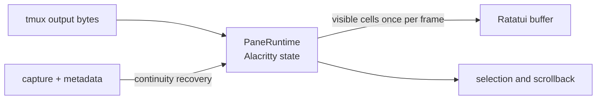
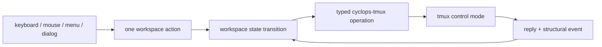
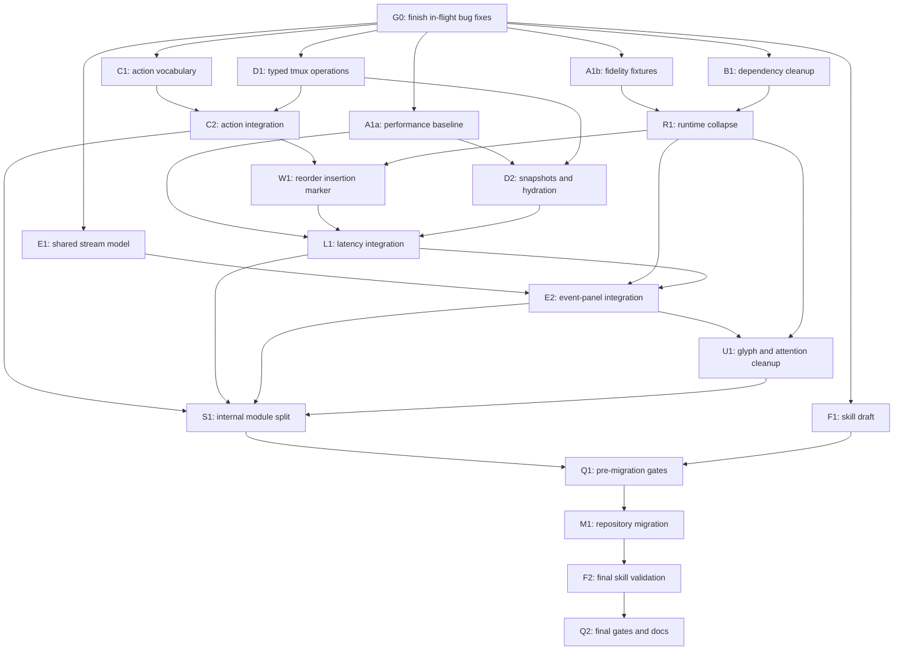

# How should Cyclops improve its workspace TUI?

Recommendation date: 2026-08-05

## Recommendation

Keep the current architecture and improve it by subtraction.

Cyclops should remain a tmux-backed composite frontend: tmux owns the
processes, PTYs, sessions, windows, and pane geometry; one Alacritty terminal
state per visible pane turns control-mode output into cells; Ratatui and
Crossterm paint the workspace and read input; `cyclopsd` remains the source
of agent state, using the attention rule owned by `cyclops-proto`. This is the
smallest architecture that can deliver live panes, modern chrome, and
low-latency interaction without turning Cyclops into a second terminal
multiplexer.

The next pass should not add another renderer, widget framework, terminal
engine, animation system, or UI state layer. It should:

1. remove settled experiments, dead APIs, duplicate dependencies, and
  redundant wrappers;
2. make one action path serve keyboard, menu, dialog, and mouse input;
3. move workspace tmux command construction behind `cyclops-tmux` and delete
  the workspace command-wrapper layer;
4. reduce synchronous reconciliation and hydration round trips on the input
  path;
5. close the fidelity gaps in the Alacritty-to-Ratatui bridge;
6. polish the chrome while preserving first-run discoverability;
7. reorganize the repository around source, tests, documentation, resources,
  and the website.

No source change is proposed by this document itself.

## What the research establishes

The five research notes point to one coherent design rather than five
independent options.


| Question                                    | Finding                                                                                                                                   | Recommendation                                                                                                                                |
| ------------------------------------------- | ----------------------------------------------------------------------------------------------------------------------------------------- | --------------------------------------------------------------------------------------------------------------------------------------------- |
| Should Cyclops copy Herdr's architecture?   | Herdr owns PTYs, terminal emulation, process lifecycle, scrollback, and persistence. That is a much larger product.                       | Reuse Herdr's interaction ideas—explicit rectangles, hit regions, drag states, and one event loop—not its PTY ownership.                      |
| Can `capture-pane` render a live terminal?  | No. It is a useful visual checkpoint but cannot reconstruct parser state, private modes, saved cursors, or all alternate-screen behavior. | Hydrate from captures, then continue from `%output` and `%extended-output` through a real VT engine. Rehydrate only after continuity is lost. |
| Is Ratatui the pane renderer?               | No. Ratatui composes cells and chrome; it does not interpret pane byte streams.                                                           | Keep Ratatui for layout, diffed frames, dialogs, menus, and tests. Keep pane emulation as a separate responsibility.                          |
| Should Cyclops own a terminal parser?       | No. A hand-rolled parser would make decades of terminal compatibility part of Cyclops's core.                                             | Keep `alacritty_terminal`, which already won the measured corpus in F35.                                                                      |
| Can mouse behavior be identical everywhere? | No. Cyclops, the child TUI, tmux, and the outer terminal can all compete for ownership.                                                   | Keep keyboard operation complete. Treat SGR mouse as an enhancement and forward child mouse input only after it can be translated faithfully. |
| Where should tmux behavior live?            | The adapter must contain tmux command vocabulary, quoting, flow control, and reconciliation.                                              | The workspace should issue typed intentions; `cyclops-tmux` should turn them into commands.                                                   |


This rules out three tempting detours:

- Do not replace tmux with Cyclops-owned PTYs.
- Do not downgrade live panes to continuously refreshed captures.
- Do not keep multiple VT engines or an engine trait in production.

The selected path is already largely implemented. The work now is to make it
smaller, faster, and more faithful.

## What is already right

Preserve these choices:

- The application is event-armed. It has no idle polling loop.
- Adjacent pane output is batched before reaching the app queue.
- The 8 ms render deadline is armed once and is not pushed back by later
events, so sustained output cannot starve a frame.
- Key forwarding uses the unconfirmed control-client path, avoiding a tmux
reply round trip for each keypress.
- Flow-control pause invalidates continuity and causes rehydration.
- Hit regions come from the frame that was actually painted.
- Drag targets carry stable pane, window, and session identities rather than
list positions.
- The production VT engine is one concrete implementation, not a speculative
trait.
- Theme meaning comes from `cyclops-theme`; renderers do not invent raw
semantic colors.
- The pane title remains a sensor and is never used for Cyclops decoration.
- The workspace reads the shared attention register rather than maintaining a
second register.

These choices directly match the research and the repository invariants.

## Priority 0: restore the simplest correct baseline


### Use one Crossterm version

The research explicitly warns against duplicate Crossterm versions because
their event and terminal types are not interchangeable. The current lockfile
contains Crossterm 0.28.1 for `cyclops-workspace` and Crossterm 0.29.0 through
`ratatui-crossterm`.

Align the direct dependency with Ratatui's backend and remove the older copy.
This reduces build surface and prevents two libraries from representing the
same global terminal state with different types.

### Delete the completed VT comparison

F35 made the engine decision: Alacritty passes 12/12 fixtures and `vt100`
passes 5/12. The current corpus still compiles `vt100`, runs a non-gating
comparison test, reruns both engines in a summary test, and retains a
`Fixture::category` field only to collect it into `_cats`.

Delete:

- the `vt100` dev-dependency;
- `feed_vt100`;
- `vt100_corpus_for_comparison`;
- `engine_comparison_summary`;
- the comparison-only `category` field.

Keep one golden corpus that asserts the production engine's behavior. A
historical engine score belongs in F35, where it is already recorded, not in
every future test run.

### Remove broad dead-code suppressions

`decoration.rs` and `persist.rs` suppress dead-code warnings for the whole
module; `render.rs` suppresses them alongside its argument-count lint. That
hides exactly the cleanup signals this codebase wants.

Current text references identify several candidates that have no production
caller:

- `DecorationSnapshot::state_badge`;
- `DecorationSnapshot::named_agent_rows`;
- `DecorationSnapshot::agent_rows_for_tabs`;
- `persist::order_workspaces`;
- `PaneRuntime::resize` and the delegated `AlacrittyVt::resize`;
- `CursorShape`, which is computed and stored but never rendered;
- `WorkspaceRow::active`, which is populated but never read;
- the unused `_tx` argument passed to `handle_app_msg`;
- `render::paint_pane`, which exists only for an inline test;
- `Router::prefix_armed`, exposed only to a test.

Confirm the list with the compiler, delete what has no product obligation,
and narrow any test helper to `#[cfg(test)]`. Then remove the module-wide
allowances. Do not retain unused diagnostic helpers for a hypothetical future
surface; add them when a real caller exists.

### Do not recompute attention in decoration

`DecorationSnapshot` already marks panes from the authoritative
`cyclops_proto::attention::Attention` result. `primary_status` nevertheless
uses `needs_attention || state.is_blocked()`.

Delete the `state.is_blocked()` fallback. It is a second implementation of
the attention rule and can only hide a disagreement between the daemon's
register and the UI. The display may map an authoritative attention item to
compact words, but it must not decide independently that the item exists.

### Keep the compact glyph vocabulary

The workspace's glyphs are a deliberate semantic vocabulary, not shorthand
for theme colors: `○` is idle, `●` is working, `⚠` needs attention, and `✕`
is dead. They remain meaningful with color disabled and are appropriate on
dense surfaces such as sidebar rows and inactive pane borders.

Keep glyph-only state in those compact surfaces. Show `glyph + word` where
space and focus make the fuller reading useful, but do not hide a state merely
because its word does not fit. Keep the glyph mapping stable across every
theme and document it in the workspace help and public UI reference.

The current rendering invariant says every state cell carries both a glyph
and a word. Update that invariant in the same future change so the contract
matches the intended UX:

- color is never the only encoding;
- compact workspace surfaces may use the documented glyph alone;
- detailed, plain-text, and diagnostic surfaces retain the state word;
- tests prove that glyph identity does not change with the theme or
`NO_COLOR`.


## Priority 1: collapse the pane runtime and improve fidelity


### Have one pane runtime, not a wrapper around a runtime

`PaneRuntime` holds only an `AlacrittyVt` and forwards every method. The
engine decision is settled, so the two names no longer represent two useful
layers.

Collapse them into one private `PaneRuntime`. It should own the Alacritty
`Term`, parser, hydration, scrollback, selection, cursor, and visible-cell
iteration. Tests may name Alacritty in fixture setup; the rest of the
workspace should name only a pane runtime.

Derive “at tail” from Alacritty's display offset instead of retaining a second
`scroll_offset` field with the same value.

This deletes a forwarding file, one set of methods, and broad public exports
without losing an abstraction that has a second implementation.

### Delete the lossy full-grid mirror if the corpus proves direct rendering

The current bridge copies every Alacritty cell into a custom `CellGrid`, then
walks the custom grid again to paint Ratatui. The mirror carries only one
`char`, basic colors, and five style flags. It drops or flattens information
Alacritty already has, including combining characters, hidden and strikeout
state, underline variants and colors, hyperlinks, and other cell metadata.

Prefer one translation at the render boundary:




Let production rendering visit Alacritty's visible cells directly. Keep a
small test-only snapshot representation if golden tests need owned values.
This should remove `cached_grid`, `grid_dirty`, `CellGridView`, the production
`row_texts` helpers, and one full-grid copy per changed frame.

Do this only behind fidelity and performance tests. Direct engine access is
acceptable here because F35 deliberately chose one engine and already
removed the speculative trait.

### Expand the corpus around the bridge, not the parser

The existing corpus proves the engine can parse twelve useful sequences. It
does not yet prove that Cyclops preserves everything while converting the
engine's cells into Ratatui cells.

Add recorded, deterministic fixtures for the behaviors users can see:

- combining marks and emoji sequences;
- wide characters at the right edge and after resize;
- hidden, strikeout, double/dotted underline, and reverse video;
- default, bright, dim, indexed, and truecolor foreground/background pairs;
- cursor visibility and shape;
- alternate-screen enter, redraw, and exit after hydration;
- synchronized output and partial escape sequences across chunks;
- scrollback that remains pinned while new output arrives;
- real captures from each shipped agent TUI.

The goal is not terminal-protocol completeness. It is an explicit, measured
fidelity floor for the programs Cyclops supports.

## Priority 1: make one action path own behavior

The same user action currently enters through several paths. For example,
split-right is handled by pane controls, context menus, and keyboard
dispatch. Close and rename actions have similar menu, dialog, and keyboard
branches. Each branch also decides separately whether to reconcile, persist,
close overlays, or redraw.

Use one target-bearing action value for all input sources, for example:

- `Split { pane_id, direction }`;
- `FocusPane { pane_id }`;
- `ClosePane { pane_id }`;
- `RenameTab { window_id, name }`;
- `MoveTab { window_id, destination }`;
- `ReorderWorkspace { session_id, insertion }`.

Keyboard, menus, dialogs, and mouse hit targets should only resolve an action.
One executor should validate the stable target, call the adapter or daemon,
and return a small outcome such as `redraw`, `reconcile`, `rehydrate`, or
`detach`.

This adds one small vocabulary but should delete `menu_action`, most direct
tmux calls from `handle_mouse`, repeated branches in `dispatch_action`, and
many scattered `needs_reconcile`, persistence, and overlay-cleanup writes.
It also makes tests independent of the device that triggered the action.

### Show the workspace reorder destination

Keep click-and-drag reordering for workspace rows, but make its destination
visible. Once pointer movement crosses the drag threshold, retain a visual
treatment on the grabbed row and render a horizontal insertion rule between
the two workspace positions where it would be dropped. The rule should span
the usable width of the sidebar and move immediately as the pointer crosses
each insertion boundary. It must support every slot, including before the
first workspace and after the last, and remain unambiguous when workspaces
are expanded and contain agent rows.

Dragging should update only transient preview state. On release, dispatch one
stable-ID `ReorderWorkspace` action and persist the new order; do not mutate
or reconcile the model on every mouse-move event. A release outside a valid
sidebar slot or a cancelled drag should leave the order unchanged. Use a
semantic theme token for the insertion rule rather than a raw color, and
retain keyboard workspace navigation so reordering does not become required
for operation.

Add focused hit-testing and rendering tests for the first, middle, and final
insertion slots; expanded workspace rows; sidebar scrolling; cancellation;
and a drop that does not change position. This feedback belongs to the same
action-routing and rendering work, not to a second reorder implementation.

## Priority 1: put tmux vocabulary back in the adapter

The research action map says the workspace issues typed adapter intentions.
The current `intent.rs` instead builds raw tmux command strings around a
generic `ControlClient::command`, and `app.rs` builds raw `swap-window` and
`move-window` commands during tab drag.

Add typed control-client operations in `cyclops-tmux` for the workspace
vocabulary—select, split, close, zoom, resize, create, rename, swap, move—and
delete `cyclops-workspace/src/intent.rs`. Session-name sanitization can remain
workspace policy, but quoting, exact targets, command spelling, replies, and
tmux-version quirks belong to the adapter.

The intended dependency is:




This is a net simplification even though the adapter gains methods: the
command knowledge and its tests stop being duplicated in the UI crate.

## Priority 1: remove avoidable latency from reconciliation


### Replace the multi-process workspace snapshot

`fetch_workspace_model` currently performs `list-sessions`, an all-window
membership query, `list-windows`, and one `list-panes` process per window.
For a session with `W` windows, a full reconcile therefore starts `W + 3`
one-shot tmux processes while the app awaits the result.

Build an adapter-owned workspace snapshot from the existing control client
using one or a small bounded number of formatted commands. An all-panes query
can carry session id, window id, pane id, active flags, dimensions, and the
window layout needed to construct the model. Delete the per-window list loop
once the new snapshot is proven against isolated tmux servers.

Do not add a reconcile interval. Structural notifications remain the trigger;
the snapshot remains authoritative.

### Hydrate panes concurrently without weakening ordering

One `hydrate_pane` performs visible capture, alternate capture, and metadata
queries in sequence. `hydrate_visible_tab` repeats that whole sequence
serially for each pane. Initial attach, tab switch, reconnect, and resize
latency therefore grow with the number of visible panes.

Keep each pane's capture/metadata order explicit, but issue independent pane
hydrations concurrently through the same correlated control client. If
measurement justifies it, add an adapter-owned multi-pane hydration command.
The UI must still treat every capture as a visual checkpoint, never exact
parser state.

### Coalesce decoration refreshes

The daemon subscription currently runs a fresh blocking `status` request for
every pushed event. A burst of label, state, and delivery events can therefore
produce several snapshots whose intermediate results are never painted.

Coalesce an event burst into one event-armed refresh on the existing worker.
Do not poll and do not postpone a refresh indefinitely. The same rule as the
render debounce applies: arm once, never push the deadline back.

### Measure before adding a background effect system

The app awaits several tmux operations inside the event handler. First remove
the process fan-out and serial hydration above. If input still misses the
budget, move only the measured slow operation to a task that returns a
generation-tagged result. Do not introduce a general effect framework in
anticipation of a problem.

## Priority 2: polish without removing discoverability


### Keep the event panel, but share the `cyclops watch` stream

The event panel is a useful in-context view and should remain available. Its
current implementation is the problem: it builds lines from attention items
using Rust debug formatting, so it is neither the ledger stream nor the
polished stream shown by `cyclops watch`.

Delete that private projection, not the panel. Make `cyclops-ui` expose a
backend-neutral stream model that owns:

- initial backfill and live `events.subscribe` ordering;
- entry normalization and resolution rows;
- the calm/firehose decision used by the default Watch view;
- semantic badges, state words, timestamps, and user-facing copy;
- stable row identity for incremental updates.

Both `cyclops watch` and the workspace panel should consume that same model.
Watch may continue to paint with its grid vocabulary and the workspace may
paint the rows with Ratatui, but the ordered entries, words, glyphs, and
filtering semantics must be identical. The workspace panel may clip or wrap
to its narrower viewport; it must not reinterpret the record.

Reuse the workspace's existing event subscription where practical so opening
the panel does not establish a second competing view of daemon state. Add a
parity test that feeds one backfill-plus-live transcript to both surfaces and
asserts the same plain row content and order.

### Keep the always-visible split buttons

Keep `[|][-]` in the top-right pane border. They provide immediate visual
discovery for a first-time user and complement, rather than replace, the
keyboard bindings and labeled context-menu actions.

Their implementation should still become smaller: both hit targets should
resolve the same target-bearing split actions used by keyboard and menus.
The buttons should never contain their own tmux calls or reconciliation
policy. Preserve their stable placement, keep the hit rectangles derived
from the painted frame, and test narrow panes so controls yield space without
covering terminal cells.

### Keep focus and attention visually dominant

The clean hierarchy should remain:

1. focused pane and active tab;
2. agent identity;
3. attention requiring a human;
4. ordinary working/idle state;
5. secondary workspace controls.

Do not add animations to create smoothness. Immediate state changes, stable
geometry, diffed frames, and no flicker are the appropriate terminal UX.
Every animation would also require a timer, which is contrary to the idle
cost goal unless it is armed by a short, named transition.

### Keep the mouse contract conservative

The current release explicitly owns mouse gestures for chrome, selection,
scrollback, and resizing and does not forward them to child TUIs. Keep that
contract until a compatibility matrix proves coordinate translation, Down /
Move / Up sequences, child mouse-mode detection, tmux mouse-on/off behavior,
and an outer-terminal selection bypass.

Keyboard equivalents remain mandatory. Document Shift as the common outer
terminal bypass where supported, but do not promise it in terminals that do
not provide it.

## File ownership after simplification

Do not split large files mechanically. First delete the duplicate paths above;
then move the remaining code to the module that owns the rule.


| Area                         | Should own                                                                | Should not own                                                     |
| ---------------------------- | ------------------------------------------------------------------------- | ------------------------------------------------------------------ |
| `app`                        | boot, the event queue, render scheduling, and top-level state             | tmux command strings, per-device action semantics, widget painting |
| `input`                      | conversion from device events and hit targets to workspace actions        | mutations and tmux IO                                              |
| `action`                     | one action executor and its outcome flags                                 | terminal parsing or rendering                                      |
| `render`                     | frame composition and render-derived hit geometry                         | persistence, daemon queries, attention predicates                  |
| `runtime`                    | Alacritty state, hydration, visible cells, cursor, selection, scrollback  | Ratatui chrome and tmux commands                                   |
| `cyclops-ui`                 | the backend-neutral Watch stream model plus the stream TUI renderer       | workspace layout and pane rendering                                |
| `cyclops-tmux`               | every command, target, reply, notification, snapshot, and hydration query | agent meaning or workspace presentation                            |
| `cyclopsd` / `cyclops-proto` | agent state, attention, label identity, and additive wire data            | workspace layout and input policy                                  |


`app.rs` currently has about 2,545 production lines and `render.rs` about
1,350 before inline tests. Once action duplication, private stream
projection, tmux vocabulary, and redundant runtime code are removed, the
natural module boundaries should be much clearer. Avoid introducing
manager/controller wrappers merely to reduce line counts.

One additional ownership cleanup is worthwhile: workspace decoration reads
manifest files and reimplements the daemon's manifest-directory precedence
only to recover display names. Prefer an optional additive display-name field
in daemon status, then delete the workspace manifest scan and precedence
logic. The UI should render daemon identity data, not rediscover it from
configuration.

## Priority 2: reorganize the repository around ownership

The top-level tree currently mixes Rust crates, runtime resources, tests,
demos, internal documentation, public documentation, and the website. A
newcomer has to learn historical names before they can tell product code from
supporting material.

Use this target shape:

```text
cyclops/
├── src/
│   ├── cyclops/
│   ├── cyclopsd/
│   ├── cyclops-proto/
│   ├── cyclops-tmux/
│   ├── cyclops-manifest/
│   ├── cyclops-ledger/
│   ├── cyclops-theme/
│   ├── cyclops-ui/
│   └── cyclops-workspace/
├── tests/
│   ├── testrig/
│   └── e2e/
│       ├── lib/
│       ├── parity-check.sh
│       ├── test_vocab.py
│       └── m1_soak.py
├── demos/
├── resources/
│   ├── manifests/
│   ├── themes/
│   ├── layouts/
│   └── hooks/
├── docs/
│   ├── public/
│   ├── guides/
│   ├── reference/
│   └── development/
├── website/
├── skills/
│   └── cyclops/
│       └── SKILL.md
├── scripts/
├── README.md
├── CONTRIBUTING.md
├── AGENTS.md
├── STATUS.md
├── findings.md
├── CHANGELOG.md
├── Cargo.toml
└── Cargo.lock
```


### Source

Rename the current `crates/` directory to top-level `src/`. Preserve the
crate names so Cargo packages, logs, and documentation keep one name per
concept. Each package remains a normal Rust crate with its own `Cargo.toml`
and inner `src/` directory; the repeated `src/cyclops/src` shape is ordinary
for a repository-level source container and a Cargo package.

Move the test-only `cyclops-testrig` package to
`tests/testrig/`. It is still a workspace member and keeps the package name
`cyclops-testrig`, but its location makes clear that nothing shipped may
depend on it.

Do not put runtime TOML and hook templates under source merely because they
are compiled with `include_str!`. They are user-editable data and belong in
`resources/`. Keep the existing rule that the binary seeds them without
overwriting user edits.

### Tests and demos

Use `tests/e2e/` for cross-crate, end-to-end, soak, compatibility, and parity
tests. Put their reusable Python and shell machinery in `tests/e2e/lib/` so
helpers remain beside their only consumers without looking like independent
tests. Move the current `test_vocab.py` and `m1_soak.py` there, and move the
parity CI gate out of `demos/` into `tests/e2e/parity-check.sh`; it is a test,
not a demo.

Keep crate-local Rust integration tests in each package's conventional
`tests/` directory, for example `src/cyclops-workspace/tests/`. Cargo
discovers those automatically and they sit beside the crate whose public
boundary they exercise. Keep small unit tests next to private Rust code under
`#[cfg(test)]`; moving every unit test to the repository root would work
against Rust's normal module privacy and make ownership less clear.

Keep runnable narrative demonstrations in `demos/`. A demo may keep
narration-specific helpers beside it, but it must not secretly be the only CI
assertion for a behavior; the corresponding verification belongs in
`tests/e2e/` or a crate-local `tests/` directory.

### Documentation and website

Keep `README.md`, `CONTRIBUTING.md`, `AGENTS.md`, `STATUS.md`, `findings.md`,
the changelog, licenses, Cargo manifests, and other project-level control
files in the root. Move the current `docs/CONTRIBUTING.md` to root as
`CONTRIBUTING.md`.

Use `docs/public/` only for published user documentation. Organize the
remaining documentation by reader question:

- `docs/guides/` for installation, quick starts, sending, waiting,
workspaces, panes, themes, and troubleshooting;
- `docs/reference/` for protocol, manifests, hooks, and exact configuration;
- `docs/development/` for architecture, delivery, invariants, style, history,
cutover notes, goals, and the human handoff.

Rename `frontend/` to `website/` and keep it as a sibling of `src/`. The name
describes the product rather than an implementation layer. The website may
consume or publish `docs/public/`, but its SvelteKit source, static assets,
and package metadata remain under `website/`; do not mix application source
into the Markdown documentation tree.

### Agent skill

Add `skills/cyclops/SKILL.md` as the canonical skill for agents operating
Cyclops. Its job is to teach an agent how to discover peers, inspect state,
send and receive messages, verify delivery, wait for work, and diagnose a
stuck delivery through the ledger.

Keep its boundary explicit:

- `AGENTS.md` tells contributors how to change this repository;
- `skills/cyclops/SKILL.md` tells an agent how to use the Cyclops product;
- `docs/public/` remains the complete human-facing product documentation.

The skill should be concise and procedural, link to authoritative product
documentation instead of copying it, use command output captured from real
runs, and state the delivery and identity safety rules an agent must not work
around. If it later needs helper scripts or references, keep them under
`skills/cyclops/` beside `SKILL.md` rather than adding skill-specific files to
the repository root.

### Migration rules

Treat this as one dedicated structural change after behavior work is stable,
not as drive-by moves during TUI refactoring. Use `git mv` so history remains
traceable, then update in the same change:

- Cargo workspace members and path dependencies;
- `include_str!` resource paths;
- CI workflows, scripts, installer paths, and test guards;
- documentation links and parity transcript paths;
- `.gitignore`, website deployment configuration, and local commands;
- skill packaging or installation paths and command-parity checks;
- `AGENTS.md`, `docs/development/HANDOFF.md`, and generated agent summaries.

Run the full gates from the new root layout, including relocated-temp and
installer variants. Do not leave compatibility symlinks or duplicate old/new
directories unless an external consumer is measured to require a short
deprecation window; otherwise the cleanup creates two maps instead of one.

## Proposed performance contract

These are targets to validate, not claims about current measurements.


| Scenario               | Target                                                                                                                                    |
| ---------------------- | ----------------------------------------------------------------------------------------------------------------------------------------- |
| Idle workspace         | No scheduled wakeups, redraws, captures, or reconciles; CPU near the terminal/runtime floor.                                              |
| Key passthrough        | The key is submitted without waiting for a frame or a tmux reply. Measure process-to-control-write p95.                                   |
| Pane output            | A visible change reaches a frame within one 8 ms debounce plus render time; no starvation under a permanently busy output queue.          |
| Sustained output       | Queue memory remains bounded in a soak; input and structural events continue to make progress.                                            |
| Tab switch / reconnect | Hydration time scales with the slowest visible pane rather than the sum of every pane's command sequence.                                 |
| Resize drag            | At most one coalesced tmux resize per render deadline; no full reconcile or hydration for an intermediate geometry that will never paint. |
| Terminal exit          | Raw mode, mouse capture, wrapping, cursor visibility, and alternate screen restore on every recoverable exit path.                        |


Add a workspace performance harness before tuning the 8 ms value. Exercise
one, four, and eight panes; mixed ASCII and wide output; resize storms;
flow-control pause/resume; daemon event bursts; and input during sustained
output. Report frame gaps, queue depth, render duration, hydration duration,
and command-submit latency. Keep it deterministic and use
`cyclops_testrig::TmuxServer`; never use the user's tmux server.

## Guardrails

Any implementation of this recommendation must preserve these rules:

- No polling. Every debounce and retry is one-shot and event-armed.
- Captures are hydration checkpoints, not a live renderer and not exact
parser state.
- `%output` and `%extended-output` remain raw-byte paths.
- Flow-control pause invalidates byte continuity.
- Tmux remains the geometry and process source of truth.
- The pane title remains untouched.
- The attention predicate remains in `cyclops-proto`.
- State meaning remains readable without color. Compact workspace surfaces
may use the stable documented glyph alone; detailed and plain surfaces keep
the word.
- Theme tokens remain semantic and shared.
- Vendor TUI quirks remain manifest data.
- Delivery input continues through the delivery gate. Workspace key
passthrough must never be reused as a shortcut around verified delivery.
- The delivery `Injector` seam is deliberate and is not part of this cleanup.


## Delegation and dependency map

Treat completion of the already in-flight `cyclops-workspace` bug fixes as
gate **G0**. That agent should finish only its current fixes and regression
tests, run the relevant gates, and leave a clean commit. Do not begin this
recommendation plan against a moving baseline, and do not ask that agent to
fold plan work into the bug-fix commit.

After G0, delegate by ownership boundary rather than by broad theme. In
particular, do not create a roaming “cleanup” task: each workstream should
delete the dead helpers, imports, allowances, and wrappers it exposes in the
files it already owns.

| ID | Delegable unit | May start after | Can run in parallel with | Primary ownership |
|---|---|---|---|---|
| **A1a** | Record render, input, resize, hydration, and reconciliation baselines. | G0 | A1b, B1, C1, D1, E1, F1 | Benchmarks, probes, and measurement notes only. |
| **A1b** | Add bridge-fidelity fixtures for wide cells, combining marks, styles, cursor state, scrollback, alternate screen, and resize. | G0 | A1a, B1, C1, D1, E1, F1 | Focused workspace runtime test fixtures. |
| **B1** | Align direct Crossterm usage with Ratatui's backend version, then remove `vt100` and its comparison-only tests. | G0 | A1a, A1b, C1, D1, E1, F1 | Cargo manifests and lockfile; give these files one owner. |
| **C1** | Define one target-bearing workspace action vocabulary, including stable-ID workspace reordering, and pure routing from keyboard, menu, mouse, and command palette. Do not integrate execution yet. | G0 | A1a, A1b, B1, D1, E1, F1 | Workspace input, bindings, and action types. |
| **D1** | Add typed workspace mutation operations to `cyclops-tmux`. | G0 | A1a, A1b, B1, C1, E1, F1 | `cyclops-tmux`; no workspace UI edits. |
| **E1** | Extract a backend-neutral event-stream model from `cyclops watch`. | G0 | A1a, A1b, B1, C1, D1, F1 | `cyclops-ui`; no workspace panel integration yet. |
| **F1** | Draft `skills/cyclops/SKILL.md` from the stable command contract. | G0 | All foundation and core work | New skill files only; defer final paths and captured output. |
| **R1** | Collapse `PaneRuntime` and `AlacrittyVt`, prove direct Alacritty-to-Ratatui cell rendering, and delete the custom full-grid mirror if the fixtures and measurements approve it. | A1b and B1 | C2, D2, E1, F1 | Workspace pane runtime and its focused rendering bridge. |
| **C2** | Integrate the single action executor; route keyboard, menu, mouse, and palette through it; delete duplicate execution branches. | C1 and D1 | R1, D2, E1, F1 | Workspace action execution. One owner for affected `app.rs` sections. |
| **W1** | Add the live horizontal insertion rule for workspace-row dragging and commit one stable-ID reorder action on a valid drop. | C2 and R1 | D2, E1, F1 | Workspace drag state, hit testing, sidebar rendering, and reorder persistence. Serialize `app.rs` and `render.rs` edits. |
| **D2** | Add adapter-owned workspace snapshots and independent-pane hydration primitives. | A1a and D1 | R1, C2, E1, F1 | `cyclops-tmux` and adapter tests. |
| **L1** | Integrate batched reconciliation, concurrent pane hydration, and coalesced decoration refreshes. | A1a, W1, and D2 | F1; E1 may continue if still isolated | Workspace orchestration. Serialize edits to `app.rs` with C2 and W1. |
| **E2** | Make the workspace event panel consume the shared `cyclops watch` stream model while retaining the event-panel option and always-visible split buttons. | E1, R1, and L1 | F1 | Workspace panel integration plus the shared model's public seam. |
| **U1** | Finalize compact glyph-only status rendering and remove the redundant local attention fallback. | R1 and E2 | F1 | Workspace rendering/decoration; use the same owner as nearby `render.rs` work. |
| **S1** | Split remaining large modules along the ownership boundaries revealed by the completed deletions. | C2, L1, E2, and U1 | F1 | Internal module moves only; no top-level repository migration. |
| **Q1** | Run the full pre-migration gates and fix integration regressions. | A1a, S1, and all other behavior work | Nothing that changes behavior | Integration owner. This establishes the safe structural-migration baseline. |
| **M1** | Perform the top-level repository layout migration, including `src/`, `tests/testrig`, `tests/e2e`, `demos/`, `docs/`, `website/`, resources, scripts, and root project files. | Q1 | Reference audits only | One migration owner controls moves and path updates. Freeze behavior changes. |
| **F2** | Validate the Cyclops skill against the final tree and real command output; update its paths and examples. | M1 | Documentation/reference audits | `skills/cyclops/` only. |
| **Q2** | Run all final compatibility, documentation-path, parity, relocated-temp, shim, and repository gates; update measured facts and public documentation from real output. | M1 and F2 | Nothing that changes files under test | Integration owner. |

The dependency graph is:



### Recommended execution waves

1. **Gate 0:** finish and land the in-flight bug fixes.
2. **Foundation wave:** run A1a, A1b, B1, C1, D1, E1, and F1 in parallel.
3. **Core wave:** run R1, C2, and D2 in parallel once their individual
   prerequisites are complete.
4. **Workspace integration wave:** run W1, L1, E2, then U1. These are
   logically separate but should be serialized, or assigned to one agent,
   because they converge on the same orchestration and rendering files.
5. **Clarity wave:** run S1 after behavior and deletions have stabilized.
6. **Pre-migration gate:** run Q1 with no concurrent behavior edits.
7. **Exclusive migration wave:** run M1 as a structural-only change. Other
   agents may audit distinct reference classes—Cargo paths, shell scripts,
   CI, or Markdown—but only the migration owner should move files or apply
   the resulting path edits.
8. **Finalization:** run F2, then Q2.

### Coordination rules for the implementer

- Give `app.rs`, `render.rs`, and `Cargo.lock` one active owner each. A task
  that needs one of those files waits for its owner or is handed to that
  owner as a small follow-up.
- Let the `cyclops-tmux`, `cyclops-ui`, workspace-runtime, and skill
  workstreams proceed independently while their edits remain inside those
  boundaries.
- Keep one focused commit per task ID. Record its prerequisite IDs and the
  targeted tests run in the commit or handoff note.
- Integrate completed commits in dependency order, even when their authors
  worked in parallel. Run targeted tests after each integration and the full
  gates only at Q1 and Q2.
- Do not combine behavior refactors with M1. Repository moves make review,
  blame, conflict resolution, and regression isolation materially harder.
- Do not schedule a separate final dead-code sweep across active files.
  Every task owner removes obsolete code in its area; after S1, use compiler
  and Clippy findings only for a narrowly scoped final cleanup.


## Sources

- [Herdr UI implementation](research/herdr-ui.md)
- [Live tmux pane renderer options](research/pane-renderer-options.md)
- [Ratatui and Crossterm](research/ratatui-crossterm.md)
- [Terminal rendering and mouse compatibility](research/terminal-compatibility.md)
- [UI actions to tmux operations](research/tmux-action-map.md)
- [Repository handoff](../../../docs/HANDOFF.md)
- [Rendering and system invariants](../../../docs/INVARIANTS.md)
- [Repository style](../../../docs/STYLE.md)
- [Current workspace UI](../../../docs/workspace-ui.md)
- [Measured findings](../../../findings.md)
