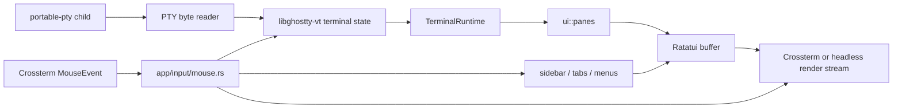

# Herdr UI Implementation

Research date: 2026-08-03

## Architectural summary

Herdr is a standalone multiplexer. It does not use tmux as its process or
layout backend. It creates and owns PTYs, parses each pane's terminal bytes
with a vendored `libghostty-vt` implementation, and renders terminal cells
through Ratatui.

## Key source locations

### Dependencies

`Cargo.toml` uses:

- `ratatui = 0.30`;
- `crossterm = 0.29`;
- a patched `portable-pty`;
- Tokio for asynchronous coordination;
- a vendored Ghostty VT implementation linked through `build.rs` and
  `src/ghostty/`.

This is a materially larger runtime surface than a tmux-backed client because
Herdr owns PTY lifecycle, process spawning, terminal emulation, scrollback,
cursor state, copy mode, and persistence.

### Terminal emulation and rendering

`src/pane/terminal.rs` contains `GhosttyPaneTerminal` and
`GhosttyPaneCore`. It:

- accepts PTY bytes and feeds them into Ghostty;
- handles terminal responses that must be written back to the PTY;
- tracks cursor, synchronized output, scrollback, text matches, hyperlinks,
  and terminal metadata;
- renders the Ghostty cell grid into a Ratatui `Frame` at
  `GhosttyPaneTerminal::render`;
- exposes terminal dimensions and cursor state to the surrounding layout.

`src/terminal/runtime.rs` and `src/terminal/runtime_registry.rs` manage the
per-pane runtime lifecycle and lookup.

`src/ui/panes.rs` calculates pane rectangles, resizes the terminal runtime to
the inner rectangle, renders terminal cells, adds scrollbars and selection
highlights, and draws pane borders and labels. The implementation explicitly
accounts for borders, one-cell gaps, cursor ownership, and scrollback gutters.

### Chrome and interaction

`src/ui/sidebar.rs` renders workspace rows, agent rows, state indicators,
scrollbars, active-row styling, and drag insertion indicators. It computes
hit rectangles rather than deriving click targets from text after rendering.

`src/ui/tabs.rs` renders the tab bar, overflow controls, new-tab target,
active-tab styling, and tab drag insertion indicators.

`src/app/input/mouse.rs` routes Crossterm `MouseEvent` values. It distinguishes:

- chrome clicks and hover;
- pane focus;
- pane and tab dragging;
- workspace and sidebar resizing;
- pane divider resizing;
- scrollbar dragging;
- context menus;
- terminal selection and copy mode;
- events that must be forwarded into the focused terminal runtime.

The router uses explicit `DragTarget` variants and maintains a mode/state
machine. This is a useful interaction model for Cyclops even if Cyclops does
not copy Herdr's PTY implementation.

### Rendering to clients

`src/server/render_stream.rs` renders the application to an in-memory Ratatui
`TestBackend`, then emits either:

- semantic frame data; or
- terminal ANSI diffs produced by a blit encoder.

This demonstrates that a Ratatui application can separate application-owned
rendering from the physical terminal client. It does not remove the need for a
terminal emulator for live pane cells.

## What Cyclops can reuse conceptually

- immediate-mode Ratatui rendering for chrome;
- explicit pane rectangles and inner rectangles;
- a pane runtime abstraction with render, resize, cursor, and scrollback
  responsibilities;
- hit-region bookkeeping derived from the rendered layout;
- a central mouse router with explicit drag targets;
- semantic frame testing with `TestBackend`;
- one event loop that merges input, pane output, daemon state, and redraw
  requests.

## What Cyclops should not assume it can reuse directly

Herdr's `TerminalRuntime` is backed by a PTY it owns. A Cyclops pane is backed
by a tmux pane that may already be running and may be attached to other tmux
clients. Replacing `GhosttyPaneTerminal` with `capture-pane` is not equivalent.

To use a Herdr-like renderer with Cyclops, the new client would need a
tmux-backed runtime that:

- consumes `%output` bytes;
- initializes and repairs state with `capture-pane`;
- models alternate screen and cursor behavior;
- forwards keyboard and mouse input to tmux;
- handles control-mode flow control and reconnects;
- resizes tmux panes from UI geometry.

## Recommendation

Treat Herdr as prior art for the UI state machine and terminal-cell rendering
boundary, not as a small dependency or a reference implementation that can be
embedded wholesale. The architecture choice is between building a
tmux-backed terminal runtime with a VT emulator or reducing the first release
to native tmux rendering plus Cyclops chrome.

## Sources

- Local Herdr `Cargo.toml`
- Local Herdr `src/pane/terminal.rs`
- Local Herdr `src/ui/panes.rs`
- Local Herdr `src/ui/sidebar.rs`
- Local Herdr `src/ui/tabs.rs`
- Local Herdr `src/app/input/mouse.rs`
- Local Herdr `src/server/render_stream.rs`
- [Herdr repository](https://github.com/ogulcancelik/herdr)
