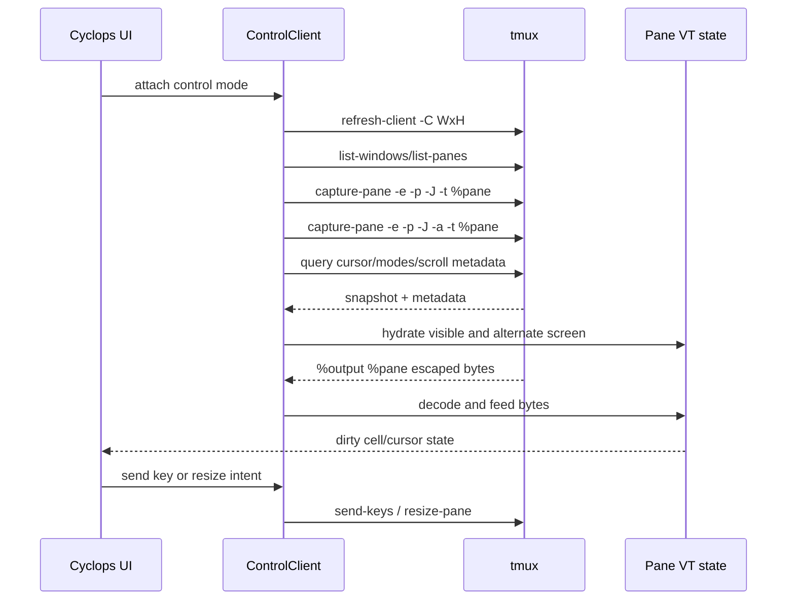

# Live tmux Pane Renderer Options

Research date: 2026-08-03

## What control mode provides

The official tmux control-mode protocol provides the ingredients for a
composite frontend:

- `%output` and `%extended-output` notifications carrying the application's
  escaped PTY bytes;
- control-mode replies and structural notifications;
- `capture-pane` for initial visible/history content;
- `capture-pane -a` for the alternate screen;
- `capture-pane -P` for pending output at the start of an incomplete escape
  sequence;
- `refresh-client -C` for the control client's size;
- `refresh-client -B` format subscriptions;
- flow control with `pause-after` and `refresh-client -A`.

The output stream is not a complete rendered frame. It contains bytes emitted
by the application, not all output generated by tmux itself. In particular,
tmux-generated copy/choose mode output is not sent as ordinary pane output.
The frontend must decide whether it owns copy mode or asks tmux to represent
it.

Tmux format variables expose useful state such as:

- `cursor_x`, `cursor_y`;
- `alternate_on`;
- scroll-region bounds;
- cursor, insert, keypad, wrap, and mouse flags;
- `pane_in_mode`;
- copy-mode cursor and selection fields.

These are metadata queries, not a replacement for a terminal emulator. The
frontend must still handle race windows between a query and incoming output.

## Hydration and live update sequence

Hydration is the hardest correctness boundary. A text/SGR capture gives a
good visual snapshot but cannot perfectly reconstruct the parser's internal
state: current escape-sequence context, origin mode, saved cursor state,
scroll regions, application cursor/keypad modes, and some terminal-private
protocol state. Metadata queries recover several of these values, but not all
of the original parser history.

The frontend should make this explicit in its design:

- use capture output to display a pane immediately;
- use format metadata to initialize cursor, alternate-screen, and dimensions;
- process subsequent `%output` bytes through the VT emulator;
- rehydrate after flow-control pause/resume or detected drift;
- never silently claim that a capture is an exact terminal state.

## Candidate VT engines

### `libghostty-vt`

Pros:

- modern VT behavior extracted from Ghostty;
- explicit terminal state, scrollback, reflow, cursor, render-state, input
  encoding, and mouse encoding APIs;
- Herdr demonstrates a production-scale integration;
- a C API can be wrapped without owning a GUI.

Cons:

- pre-1.0 and explicitly unstable;
- builds through Zig and may fetch or require pinned Ghostty sources unless
  vendored/configured;
- increases Cyclops's portability, packaging, and build-system surface;
- reusing Herdr's vendored implementation would create a large maintenance
  and licensing boundary rather than a small Rust dependency.

### `alacritty_terminal`

Pros:

- mature Rust terminal-emulation core;
- explicit grid, scrollback, cursor, selection, resize, and renderable-content
  APIs;
- avoids a C/Zig FFI boundary.

Cons:

- a relatively large and evolving API surface;
- designed as part of Alacritty's terminal stack, so integration requires
  understanding its event listener, config, grid, and synchronization model;
- terminal feature parity and input encoding must be validated against the
  agent CLIs Cyclops supports.

### `vt100` / `tui-term`

Pros:

- small Rust-oriented integration;
- `tui-term` already exposes a Ratatui pseudo-terminal widget;
- quick path to a visually useful proof of concept.

Cons:

- narrower feature surface than Ghostty or Alacritty;
- `tui-term` currently uses `vt100` as its parser backend;
- terminal protocols used by modern agent TUIs must be measured, not assumed;
- selection, hyperlinks, images, synchronized output, and private modes may
  require additional work.

### Hand-rolled parser

Reject. Cyclops already has a complex delivery and detection domain. Owning a
terminal emulator would duplicate decades of compatibility work and would
make terminal bugs part of the product's core correctness surface.

## Recommended experiment order

Before committing to a production renderer, build a throwaway adapter test
that runs against `cyclops_testrig::TmuxServer`:

1. Start a pane running a deterministic ANSI fixture.
2. Attach a control client and decode `%output`.
3. Hydrate visible and alternate screens with `capture-pane`.
4. Feed output into each candidate parser.
5. Compare rendered cells, cursor, dimensions, colors, line wrapping,
   alternate-screen transitions, bracketed paste, focus events, and mouse
   reporting.
6. Resize the pane while output is active.
7. Pause and continue flow control, then compare the parser state with a
   fresh capture.
8. Kill and respawn the pane and verify runtime replacement.

The experiment should be a separate research/prototype target until the
renderer contract is selected. It should not add tmux calls outside
`cyclops-tmux` or use the user's tmux server.

## Decision pressure

The rough idea promises live interaction, mouse-driven rearrangement, and a
visual workspace. Those promises point toward a composite tmux-control-mode
frontend with a VT runtime. The project should explicitly choose whether:

- the first release accepts a reduced terminal feature set while the renderer
  matures;
- the first release adopts libghostty-vt and accepts Zig/FFI build cost;
- the first release uses a simpler parser and defers advanced protocols;
- the first release uses native tmux rendering and defers composite panes.

The evidence rules out treating `capture-pane` as a complete live-pane
renderer.

## Sources

- [tmux control mode](https://github.com/tmux/tmux/wiki/Control-Mode)
- [tmux manual: capture-pane](https://linuxman7.org/linux/man-pages/man1/tmux.1.html)
- [tmux format variables](https://mintlify.wiki/tmux/tmux/commands/format-variables)
- [libghostty-vt Rust documentation](https://docs.rs/libghostty-vt/latest/libghostty_vt/)
- [libghostty-vt C API](https://github.com/ghostty-org/ghostty/blob/9e080c5a/include/ghostty/vt.h)
- [Ghostling embedding example](https://github.com/ghostty-org/ghostling)
- [alacritty_terminal](https://docs.rs/alacritty_terminal/latest/alacritty_terminal/)
- [tui-term](https://docs.rs/tui-term/latest/tui_term/)
- [Herdr terminal runtime](https://github.com/ogulcancelik/herdr)
