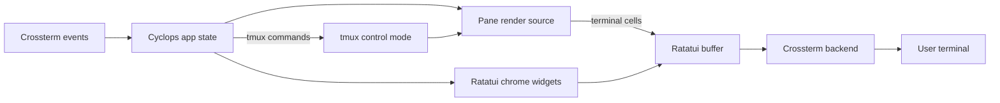

# Ratatui and Crossterm

Research date: 2026-08-03

## Findings

Ratatui is an immediate-mode terminal UI toolkit. An application owns state,
calculates a frame, and renders widgets into a terminal buffer on each redraw.
Ratatui does not own the application event loop or input policy.

Crossterm is the terminal backend and event source most commonly paired with
Ratatui. The application is responsible for:

- entering and leaving raw mode;
- entering and leaving the alternate screen;
- enabling and disabling mouse capture;
- reading keyboard, mouse, paste, focus, and resize events;
- deciding when to redraw.

Ratatui's `CrosstermBackend` is appropriate for Cyclops's chrome: sidebars,
tabs, menus, dialogs, borders, hit regions, and drag previews. Its
`TestBackend` also supports deterministic rendering tests without a real
terminal.

The existing Cyclops UI has equivalent responsibilities implemented with
`termios` and ANSI directly:

- `crates/cyclops-ui/src/term.rs` owns raw mode, alternate screen, SGR mouse
  mode, buffered frame writes, and restoration on drop.
- `crates/cyclops-ui/src/input.rs` decodes keys and SGR mouse reports.
- `crates/cyclops-ui/src/frame.rs` builds pure rows and hit targets.
- `crates/cyclops-ui/src/grid.rs` is the shared rendering vocabulary.

This means Ratatui would improve layout, widgets, and testability, but it does
not solve terminal-pane rendering. A Ratatui `Frame` is a grid of cells that
Cyclops must populate. A live tmux pane must first be represented by a terminal
emulator state or by a snapshot.

## Relevant architectural distinction

The missing component is the `Pane render source`. `capture-pane` supplies
text snapshots, but snapshots do not preserve cursor state, alternate-screen
state, colors, selection, hyperlinks, title responses, or incremental VT
semantics. A real embedded pane therefore requires:

1. a byte stream from tmux (`%output` plus an initial `capture-pane`);
2. a VT/terminal emulator per pane;
3. translation of UI input back into tmux;
4. resize reconciliation between the Ratatui rectangle and tmux pane size.

## API and dependency considerations

Ratatui 0.30 is modularized and supports a `ratatui-crossterm` backend. The
Ratatui and Crossterm versions must be selected consistently because duplicate
Crossterm versions create incompatible event and raw-mode types.

The current Cyclops workspace intentionally has no Ratatui or Crossterm
dependency. Adding them would be a deliberate build and dependency-policy
change, not a drop-in replacement for the hand-rolled stream UI.

## Recommendation

Use Ratatui + Crossterm for the new workspace chrome if the project accepts the
dependency and terminal-backend expansion. Keep Cyclops's existing semantic
theme layer and rendering vocabulary as the source of meaning; Ratatui styles
should be produced from theme tokens, never from component-local colors.

Do not choose Ratatui alone as the pane-rendering strategy. Decide separately
between:

- a VT emulator fed by tmux control-mode output;
- a native tmux-rendered layout with limited Cyclops chrome;
- a substantially larger PTY-owning architecture like Herdr.

## Sources

- [Ratatui API documentation](https://docs.rs/ratatui/latest/ratatui/)
- [Ratatui architecture](https://github.com/ratatui/ratatui/blob/main/ARCHITECTURE.md)
- [Ratatui backends](https://ratatui.rs/concepts/backends/)
- [Ratatui terminal and event-handler recipe](https://ratatui.rs/recipes/apps/terminal-and-event-handler/)
- [Ratatui Crossterm backend](https://docs.rs/ratatui-crossterm/latest/ratatui_crossterm/)
