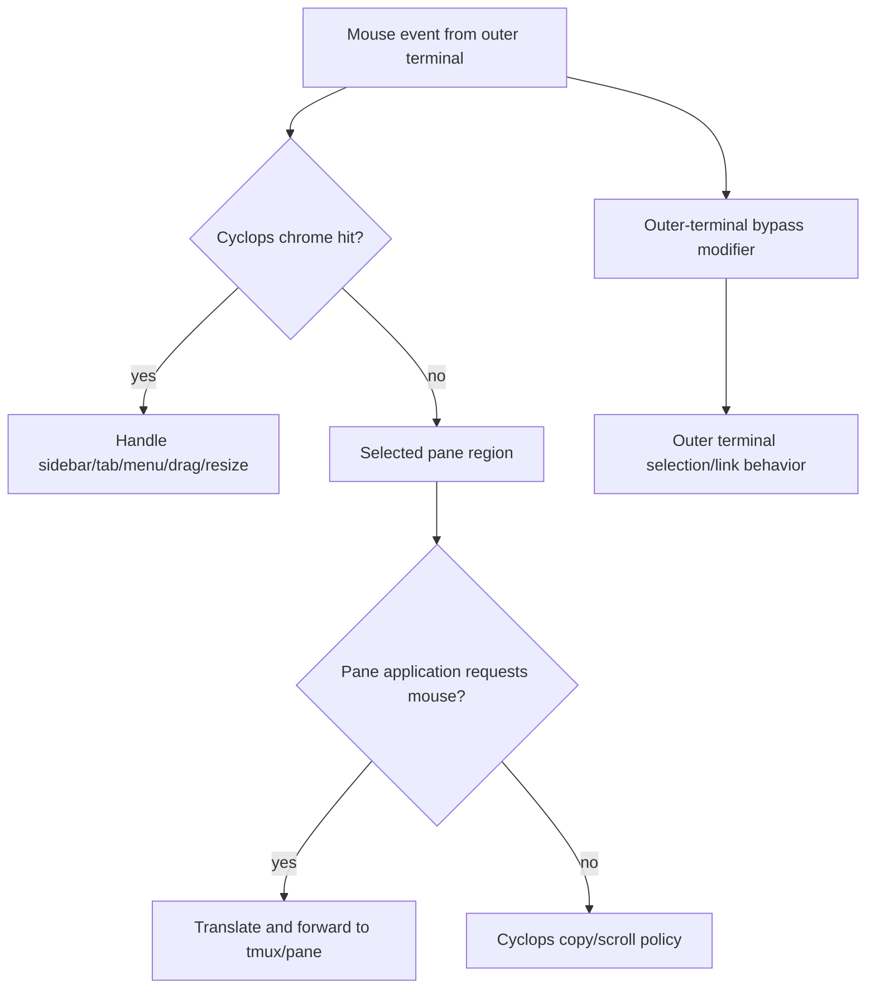

# Terminal Rendering and Mouse Compatibility

Research date: 2026-08-03

## Common protocol floor

The portable baseline for a full-screen terminal UI is:

- raw input mode;
- alternate screen (`DECSET ?1049`);
- SGR mouse reporting (`DECSET ?1000` plus `?1006`);
- cell-coordinate hit testing;
- a keyboard-only fallback;
- restoration of raw mode, mouse reporting, cursor, wrapping, and alternate
  screen on every exit path.

SGR mouse coordinates avoid the legacy X10 223-cell coordinate limit. Mouse
events are still not guaranteed to reach the application: an outer terminal
can intercept them, and tmux can consume them before forwarding selected
events to a pane application.

Cyclops's current `crates/cyclops-ui/src/term.rs` already uses the alternate
screen and SGR mouse mode. Its `input.rs` intentionally supports only left
click and wheel, dropping releases, drags, other buttons, and modified
gestures. The workspace UI cannot keep that narrow decoder if it promises
dragging, divider resizing, right-click menus, and terminal mouse passthrough.

## Terminal-by-terminal behavior

| Environment | Relevant behavior | Cyclops implication |
|---|---|---|
| Ghostty | Applications may capture mouse reporting. Holding Shift bypasses application capture so Ghostty can handle selection and links. Cmd-click is not a reliable bypass while mouse reporting is active. | Provide a documented Shift escape gesture for outer-terminal selection/link actions. Do not assume Cmd-click reaches Cyclops. |
| iTerm2 | `tmux -CC` is a native control-mode integration: tmux windows map to tabs and panes map to native split sessions. Ordinary tmux mouse mode can interact with iTerm2 behavior, and native terminal features may be unavailable when tmux captures the mouse. | iTerm2 proves the control-mode model is viable, but it is a terminal-specific integration with capabilities unavailable to a generic TUI. |
| Terminal.app | Supports mouse reporting but has no broadly reliable modifier bypass for terminal-native selection once an application captures the mouse. Alternate-screen and scrollback settings can change wheel behavior. | Keep Cyclops copy/selection controls explicit. Document that Terminal.app users may need to disable mouse reporting or use tmux copy mode for native selection. |
| Kitty | Supports SGR mouse reporting and generally forwards mouse events when tmux has `mouse on`. Terminal multiplexers can interfere with Kitty-specific protocols, images, extended keyboard modes, and scrollback. Kitty supports configuration of grabbed/ungrabbed mouse mappings. | Use the protocol floor; do not depend on Kitty-only graphics or keyboard extensions. |
| WezTerm | Applications with mouse reporting enabled receive events instead of WezTerm mouse bindings. Shift bypasses application capture by default; the bypass modifier is configurable. Mouse bindings must account for both Down and Up to avoid sending only half a gesture to the app. | Treat mouse capture as an ownership state. Ensure drag Down/Move/Up are handled as a complete sequence and expose a bypass note. |
| GNOME Terminal / VTE | Supports SGR mouse reporting and alternate screen. Behavior is generally standards-based, but terminal settings and VTE versions affect truecolor, scrollback, and key capabilities. | Use SGR/cell coordinates and degrade gracefully when optional features are absent. |
| Konsole | Supports SGR mouse reporting and alternate screen. Some keyboard protocol features vary by version. | Avoid terminal-specific keyboard encodings; use Crossterm's portable events and conservative fallbacks. |
| Alacritty | Supports SGR mouse reporting and alternate screen. It intentionally does not provide native tabs or splits, so tmux or Cyclops owns those concepts. | A good test target for pure terminal UI behavior; do not expect outer-terminal workspace affordances. |
| Linux virtual console / unusual terminals | Mouse reporting may be partial or unavailable; terminal size and Unicode rendering can also be limited. | Keyboard operation must remain complete. Mouse is an enhancement, not a correctness dependency. |

## Mouse ownership model

There are three possible owners for a mouse event:

1. **Cyclops chrome**: sidebar, tab bar, borders, menus, drag handles, and
   resize dividers.
2. **The terminal application in the selected pane**: an editor or agent TUI
   requesting mouse reporting.
3. **The outer terminal emulator**: native selection, links, search, or
   terminal-level actions.

When Cyclops composites panes itself, the outer terminal sees one Cyclops TUI.
Cyclops must therefore decide whether a mouse event belongs to chrome or to a
pane, and must explicitly forward pane events. The outer terminal cannot see
the original pane boundaries as separate native surfaces.

Control mode is text-based and does not deliver raw mouse events to the
frontend. A frontend must translate a gesture into tmux commands or encoded
input. `send-keys` handles key names and literal bytes, but the control-mode
client is not automatically a normal tmux client receiving the terminal's
mouse report. This makes pane-application mouse passthrough a separate design
problem.

## Practical compatibility requirements

- Support keyboard equivalents for every common action.
- Use SGR mouse, but treat missing or intercepted mouse input as normal.
- Make all drag operations require a deliberate target or handle so terminal
  text selection is not accidentally converted into pane movement.
- Make right-click behavior configurable or clearly documented because it can
  conflict with terminal text selection.
- Make the application menu and pane menu mutually exclusive in Cyclops state,
  not by relying on terminal behavior.
- Test at narrow widths, large coordinates, resize events, mouse capture
  enabled and disabled, and terminal restoration after interruption.
- Test with tmux `mouse on` and with it off; a pane application may request
  mouse reporting independently.
- Do not rely on outer-terminal native scrollback while using alternate screen.

## Recommendation

For the first design, define a strict compatibility contract rather than
promising identical mouse behavior everywhere:

- keyboard is complete and portable;
- SGR cell mouse is best-effort;
- Cyclops owns chrome gestures;
- pane applications receive only gestures Cyclops can faithfully translate;
- Shift or the configured outer-terminal bypass remains available for native
  selection where supported;
- terminal-specific enhancements are optional and never part of core state.

## Sources

- [Ghostty terminal behavior configuration](https://www.mintlify.com/ghostty-org/ghostty/config/terminal)
- [Ghostty mouse capture discussion](https://github.com/ghostty-org/ghostty/discussions/9514)
- [iTerm2 tmux integration](https://iterm2.com/documentation-tmux-integration.html)
- [iTerm2 tmux integration best practices](https://gitlab.com/gnachman/iterm2/-/wikis/tmux-Integration-Best-Practices)
- [Kitty FAQ: tmux and zellij](https://sw.kovidgoyal.net/kitty/faq/)
- [Kitty mouse and tmux discussion](https://github.com/kovidgoyal/kitty/issues/249)
- [WezTerm mouse bindings](https://wezterm.org/config/mouse.html)
- [WezTerm mouse-reporting bypass](https://wezterm.org/config/lua/config/bypass_mouse_reporting_modifiers.html)
- [tmux mouse support reference](https://mintlify.wiki/tmux/tmux/advanced/mouse-support)
- [tmux mouse behavior with alternate screen](https://github.com/tmux/tmux/issues/3705)
- [Terminal.app mouse-copy limitation](https://github.com/tmux/tmux/issues/2350)
- [SGR mouse tracking overview](https://ansicode.eversources.app/en/sequence/dec-mouse-tracking)
