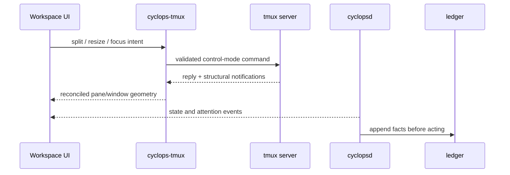

# UI Actions to tmux Operations

Research date: 2026-08-03

## Boundary

Every tmux operation belongs behind `crates/cyclops-tmux`. The workspace UI
should issue typed adapter intents or validated control-mode commands; it
should not spawn `tmux` itself.

The existing adapter provides:

- `ControlClient::command`;
- `capture_pane`, `capture_pane_escaped`, and `capture_pane_history`;
- `send_keys`, `load_buffer`, and `paste_buffer`;
- `focus_pane`;
- `SessionWatcher` pane and structural events;
- layout capture/apply for new sessions.

The action map below describes the tmux command vocabulary the adapter will
need to expose or wrap. Exact quoting, target validation, error handling, and
event reconciliation stay in the adapter.

## Workspace and session actions

| UI action | tmux operation | Notes |
|---|---|---|
| Select workspace | `switch-client -t <session>` or attach/switch the control client to the target session | A Cyclops workspace maps to a tmux session. If the frontend owns one control client per session, switching can instead change the active client connection. |
| Create workspace | `new-session -d -P -F '#{session_name}' -s <session>` | Prefer the existing layout/apply path for multi-pane creation. |
| Rename workspace | `rename-session -t <session> <name>` plus Cyclops persistence update | Decide whether the Cyclops display name and tmux session name are the same identity. |
| Reorder workspaces | No tmux operation | Store UI ordering in Cyclops configuration/persistence; session order is not a user-facing workspace order. |
| Close workspace | `kill-session -t <session>` | Destructive; require confirmation if agents or panes are live. |
| Detach Cyclops | `detach-client` for the control client, then close the frontend | Does not kill the session or its processes. |

## Tab/window actions

| UI action | tmux operation | Notes |
|---|---|---|
| Select tab | `select-window -t <session>:<window>` | Reconcile active window state after the command. |
| Create tab | `new-window -d -P -F '#{window_id}' -t <session> -n <name>` | Optionally pass `-c <cwd>`. Focus the new window with `select-window`. |
| Rename tab | `rename-window -t <window> <name>` | Window names are tmux-owned; persist the active tab separately. |
| Close tab | `kill-window -t <window>` | Tmux may select a neighboring window. Read back the active window. |
| Reorder tab | `swap-window -s <source> -t <destination>` | The UI must update tab indices/window ids after the swap. |
| Move tab to another workspace | `move-window -s <source-session>:<window> -t <destination-session>:` | Validate that moving the last window does not violate workspace/session policy. |

## Pane focus and lifecycle actions

| UI action | tmux operation | Notes |
|---|---|---|
| Focus pane | `select-window -t <pane>` then `select-pane -t <pane>` | Existing `focus_pane` intentionally performs both steps. |
| Split right | `split-window -h -d -P -F '#{pane_id}' -t <pane>` | `-c <pane_current_path>` when available; focus the returned pane. |
| Split down | `split-window -v -d -P -F '#{pane_id}' -t <pane>` | Same cwd and focus behavior as split right. |
| Close pane | `kill-pane -t <pane>` | Tmux may select another pane and may kill a window if it was the last pane. Reconcile. |
| Respawn dead pane | `respawn-pane -k -t <pane>` | Only if the UI explicitly offers a dead-pane action; do not silently revive processes. |
| Rename pane identity | No tmux title operation | Send `pane.label` to `cyclopsd`; the Cyclops label is the address/identity. Never write `pane_title`, because it is a detection sensor. |
| Zoom pane | `resize-pane -Z -t <pane>` | Read back zoom state and render the tab marker. |

## Pane geometry actions

| UI action | tmux operation | Notes |
|---|---|---|
| Resize divider toward a pane | `resize-pane -L/-R/-U/-D <amount> -t <pane>` | Map pointer delta to cell delta. Choose a stable target pane and clamp to minimum dimensions. |
| Set exact pane width | `resize-pane -x <columns> -t <pane>` | Use only when the UI's geometry model and tmux's border accounting agree. |
| Set exact pane height | `resize-pane -y <rows> -t <pane>` | Same caveat as width. |
| Move pane within a window | `swap-pane -s <source> -t <destination>` | Swapping preserves both pane processes but does not necessarily create arbitrary geometry. |
| Move pane to another tab | `join-pane -s <source> -t <destination-window> [-h|-v]` | This changes window membership and may alter the target layout. Reconcile all affected windows. |
| Move pane to another workspace | `move-pane -s <source-pane> -t <destination-session>:<window>` or equivalent `join-pane` form | Cross-session moves require explicit policy for labels, cwd, and active selection. |
| Apply a saved layout to a new workspace | Existing `cyclops_tmux::layout::apply` | Current implementation refuses to restructure an existing session and supports only row grids. |
| Capture a layout | Existing `cyclops_tmux::layout::capture` | Current implementation refuses zoomed or non-row-grid windows rather than saving an approximation. |

## Pane input and rendering actions

| UI action | tmux operation | Notes |
|---|---|---|
| Send a key | `send-keys -t <pane> <key>` | Use tmux key names for control keys and literal mode for text. |
| Send text | `send-keys -l -t <pane> -- <text>` or `load-buffer` + `paste-buffer` | `load-buffer`/`paste-buffer` is safer for arbitrary bytes and bracketed paste. |
| Submit Enter | `send-keys -t <pane> Enter` | Never submit a delivery merely because a pane is visible; preserve Cyclops's gate and verification invariant. |
| Initial pane view | `capture-pane -p -t <pane>` or `capture-pane -e -p -t <pane>` | This is a snapshot; a composite renderer needs a VT state bootstrap strategy. |
| Pane history | `capture-pane -p -S -<lines> -t <pane>` | Use for explicit scrollback/copy UI, not continuous polling. |
| Incremental pane output | Control-mode `%output` / `%extended-output` notifications | Decode escaped bytes and feed a per-pane VT emulator. Flow control must be honored. |
| Resize pane runtime | `resize-pane` and/or `refresh-client -C <width>x<height>` depending on the selected control-mode architecture | A control-mode client has a size; tmux sessions also have shared client-size constraints. |

## Cyclops-only UI actions

These actions update local app state, Cyclops daemon state, or persistence and
do not map directly to tmux:

- open/close application menu;
- open/close pane context menu;
- open settings;
- open keybinding reference;
- show/hide sidebar;
- change sidebar width;
- select a theme;
- expand/collapse workspace rows;
- reorder the workspace list;
- show attention indicators;
- select a fallback label for an unnamed detected agent;
- persist the last active workspace, tab, sidebar state, and layout metadata.

Theme changes should use the existing theme system and `theme.reload` daemon
method so adopted pane borders and all Cyclops renderers remain consistent.

## Attention and border chrome

Attention is computed by `cyclops-proto` and delivered through daemon state;
the workspace UI must not duplicate the predicate. If border chrome needs
updating, the daemon owns its existing border-writing path. The UI should not
write pane titles or independently set border formats.

## Hard limitations

1. Tmux's layout is a binary split tree even when Cyclops presents a grid.
   Arbitrary drag destinations may require a sequence of swaps, joins, splits,
   and layout commands; the UI must reconcile the result instead of assuming
   its preview became reality.
2. A control-mode frontend has no automatic raw mouse passthrough. Mouse
   gestures for an application inside a pane require explicit translation,
   likely through encoded input or tmux copy-mode commands.
3. Tmux clients share window sizing constraints. A frontend rendering several
   windows or sessions must decide whether inactive tabs retain their size,
   whether `aggressive-resize` matters, and how to handle a remote or second
   attached client.
4. Existing layout persistence is row-based and refuses arbitrary shapes.
   Drag-to-rearrange may require a split-tree model or a constrained set of
   operations that stays representable.

## Sources

- Local `crates/cyclops-tmux/src/control.rs`
- Local `crates/cyclops-tmux/src/focus.rs`
- Local `crates/cyclops-tmux/src/layout.rs`
- Local `crates/cyclops-tmux/src/watcher.rs`
- [tmux control mode](https://github.com/tmux/tmux/wiki/Control-Mode)
- [tmux manual](https://github.com/tmux/tmux/blob/master/tmux.1)
- [iTerm2 tmux integration](https://iterm2.com/documentation-tmux-integration.html)
