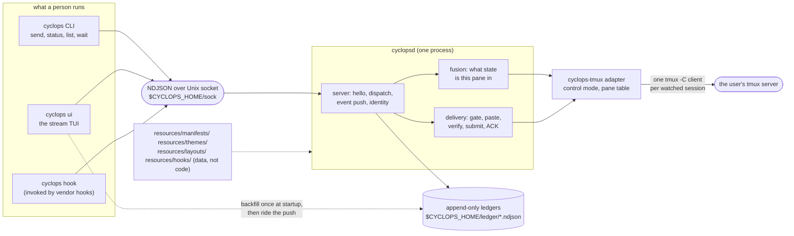
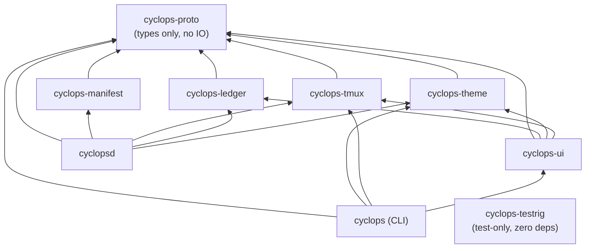

# Architecture

How the pieces of Cyclops fit together, and which decisions were deliberate.
The repo's own architecture page is `docs/development/ARCHITECTURE.md`; the newcomer map
is `docs/development/HANDOFF.md`. This file summarizes both plus what static analysis of
the crates shows.

## System overview

One daemon. One `tmux -C` control-mode client per watched session. Clients
never poll: they subscribe once and the daemon pushes. tmux keeps owning the
user's panes, layout, and attach — Cyclops is a guest, and a daemon crash
loses nothing because every fact is already on disk.

## Crate dependency graph

`cyclops-proto` is the root: wire types, ledger schema, the delivery state
machine, the agent state model, and the attention rule all live there and
nowhere else. The CLI does not depend on `cyclops-manifest` or
`cyclops-ledger` at runtime — it asks the daemon.

## Ownership rule

Most wrong changes on this codebase are a rule implemented in a crate that
should not have known about it. The boundaries (from `docs/development/HANDOFF.md`):

- `cyclops-proto` owns shared *rules* (delivery transitions, attention) but no
  IO; it has never heard of tmux and renders nothing.
- `cyclops-tmux` owns **every tmux invocation in the product** (the "blast
  wall"). One named exception: `cyclopsd::probe_tmux` runs `tmux -V` once at
  boot.
- `cyclops-ledger` owns append/fsync/seq mechanics; the *meaning* of a line is
  proto's.
- `cyclopsd` owns fusion, delivery, identity, adoption, chrome, and the socket
  server — but not the wire schema or the attention rule.
- `cyclops` (CLI) and `cyclops-ui` render; they never recompute business
  rules. The shared rendering vocabulary is `cyclops-ui`'s `grid` module.

## Deliberate decisions (and what was rejected)

Recorded in full in `docs/development/HANDOFF.md`; the formal ADR lives in a separate
design repo. Summary:

1. **tmux control mode, not hosting PTYs.** An own-PTY server was scored and
   rejected on implementation cost (comparable systems run 7k–200k lines for
   that alone). Cost accepted: every tmux quirk is Cyclops's to absorb, so all
   of it is confined to `src/cyclops-tmux` and an advisory CI job builds
   tmux from master as an early-warning canary.
2. **Manifests are data files.** Everything Cyclops knows about a vendor CLI
   is one TOML file in `resources/manifests/`; adding an agent must not require a
   compiler. Vendor behavior in Rust is a review-and-release cycle; in a
   manifest it is a text edit on the machine with the problem.
3. **The ledger is append-only NDJSON.** One file per session, fsynced,
   never rewritten; corrections are new lines. Readable with `jq` by a
   stranger months later. Measured: a 10,000-line scan takes ~7ms, so there is
   deliberately no index.
4. **Zero polling.** No interval timers anywhere. State arrives as
   control-mode notifications and subscription pushes; every timer is a
   one-shot tied to an event that already happened (debounce, backoff, verify
   re-reads, ACK windows). A poll would hide a broken event path.
5. **The pane title is a sensor, so Cyclops never writes it.** Adoption
   decoration goes on the tmux pane *border* (`role • state`), because two of
   three shipped manifests read the title as a detection sensor.
6. **One trait with one implementation is deliberate.** Delivery reaches a
   pane through an `Injector` seam; `TmuxInjector` is the only implementation.
   It is the designated escape lane to per-vendor headless protocols if TUI
   injection ever becomes untenable. Do not inline it.

## Concurrency architecture

- Multi-threaded tokio in `cyclopsd`; current-thread tokio in `cyclops-ui`;
  the CLI is fully synchronous (`std::os::unix::net::UnixStream`).
- Daemon task inventory: one `session_task` per watched session, one accept
  loop, one task per client connection, reader/writer tasks per control
  client, a debounced reconcile task per watcher, a per-pane output-settle
  debounce task, and one FIFO `worker_loop` per delivery target pane.
- Channels: `broadcast` for daemon events (capacity 8192) and pane events;
  `mpsc` for debounce kicks and the UI intake; `watch` for stop signals and
  per-delivery state; `oneshot` for control-mode reply correlation; `Notify`
  for worker wake and ACK arrival.
- Locking: `std::sync::Mutex` for shared maps on the daemon's `Inner`; the
  delivery engine is free functions taking daemon state so nothing holds a
  lock across an await by construction.

## Error handling

- One `thiserror` enum per library crate (`TmuxError`, `ManifestError`,
  `LedgerError`, `ThemeError`, `ClientError`) plus wire-level `WireError`
  with stable machine codes.
- `anyhow` only at application edges (daemon boot, config load).
- Degrade-don't-die: tolerant parsers everywhere (config, themes, manifests,
  ledger replay, unknown tmux notifications become `Notification::Other`).
- Fail-closed where it matters: socket peer identity, occupant re-checks
  before paste and submit, escaped-rule matchers without an escaped capture.
- CLI exit codes are API: 0 success, 1 parked/attention, 2 usage or wait
  timeout, 3 occupant changed or died.

## The frontend is not part of this architecture

`website/` is a static SvelteKit 2 / Svelte 5 marketing site for
usecyclops.dev. It is excluded from the Cargo workspace, ignored by Rust CI,
never embedded or served by any crate, and its only network call is a GitHub
star-count fetch. The relationship to `resources/themes/` is reversed from what you
might expect: `resources/themes/dark.toml` and `resources/themes/light.toml` are *derived from*
the site's CSS design tokens, not the other way around.
