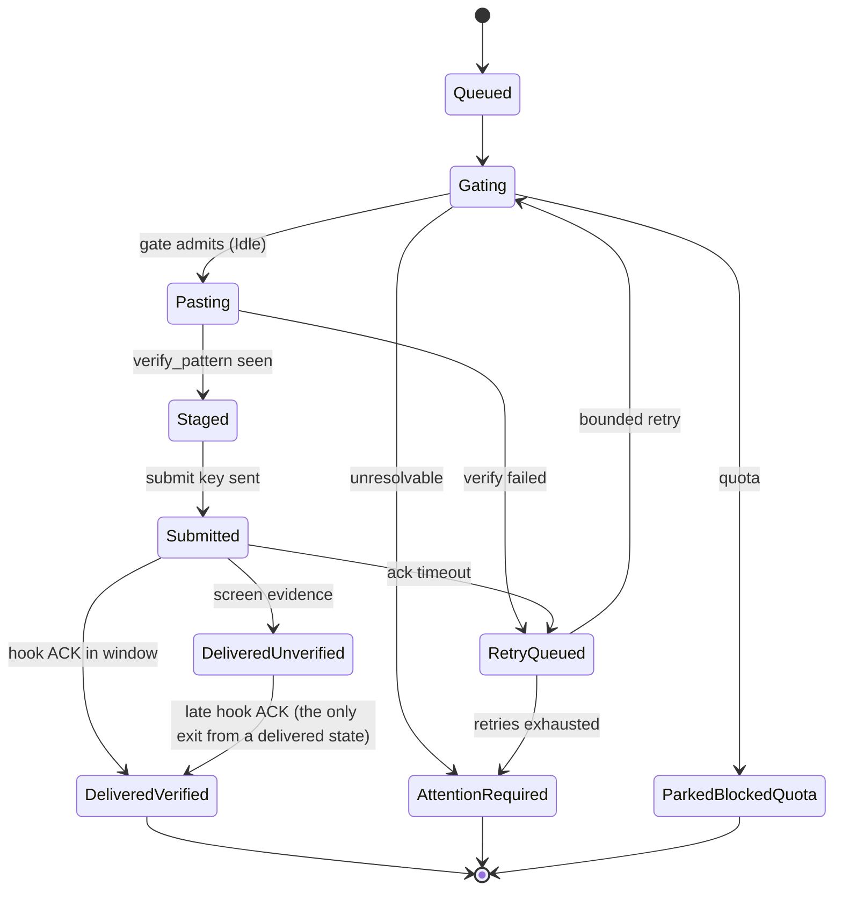

# Data Models

The types that flow between components. Everything here is defined once, in
`src/cyclops-proto`, unless noted otherwise.

## Agent state

`AgentState` (`src/cyclops-proto/src/state.rs`) is what fusion decides per
pane:

| State | Glyph | Meaning |
|---|---|---|
| `Unknown` | `?` | No manifest bound, or no rule matched |
| `Idle` | `○` | The only state safe to inject into |
| `IdleWithInput` | `◐` | Composer has residue; the gate holds |
| `Working` | `●` | Mid-turn; the gate holds |
| `BlockedModal` | `⚠` | A modal is up (may be auto-dismissable per manifest) |
| `BlockedPermission` | `⚠` | Trust/permission prompt: held, admin pinged, never dismissed |
| `BlockedQuota` | `⊘` | Rate limited; deliveries park (terminal) until a human re-sends |
| `Dead` | `✗` | Pane process exited |

A `Detection` carries the fused verdict plus every `SensorReading`
(`Hook, Title, Output, Screen`), the deciding rule id, and whether sensors
disagreed — disagreement is exposed, not treated as an error.

## The delivery state machine

`DeliveryState` (`src/cyclops-proto/src/ledger.rs`); every legal move is
encoded in `can_transition_to()` and illegal moves are loud errors. Nothing
is ever in limbo: every delivery ends in a named state.

`delivered_verified` (verified_by: hook) means the agent's own hook confirmed
this exact message; `delivered_unverified` (verified_by: screen) is
inference from screen evidence, and the badge says so with a hollow check.
Quota parks are terminal by design — there is no re-queue verb.

## The ledger schema

`LedgerLine { seq, boot_id, id, ts, kind, from, to, subject, body, reply_to,
deliveries, data }` with `Kind` one of `msg`, `fyi`, `system`, `state`,
`gate`. Files are one per session at `$CYCLOPS_HOME/ledger/<session>.ndjson`,
append-only and fsynced. `seq` is monotonic per file across restarts;
`boot_id` marks which daemon run wrote a line. Delivery transitions are
`state` lines carrying cause words — raw screen captures never land on the
record (secrets rule). The read side
(`src/cyclopsd/src/history.rs`) folds each message's delivery-chain lines
back into the msg line at read time; disk is never rewritten.

## The wire envelope

`src/cyclops-proto/src/wire.rs`:

- `Hello { cyclops, proto, boot_id }` — first line of every connection.
- `Request { id, method, params }` / `Response { id, result | error }` with
  `WireError { code, message, data }`.
- `Event { event, data, seq }` — pushed after `events.subscribe`.
- `StatusResult → SessionStatus → PaneStatus` (pane_id, window, label,
  manifest, title, state, state_ms, hooks_verified) plus `OpenDelivery` —
  the snapshot that seeds every client's attention register.
- `MsgSendParams { to, subject, body, fyi, reply_to, wait }` →
  `MsgSendResult { msg_id, seq, deliveries: Vec<DeliveryReceipt> }`.
- `WaitSpec { until: Idle|Done|Blocked, timeout }`.
- Cursors: single-session numeric `cursor`, multi-session opaque composite
  `cursor2`.

## The attention register

`src/cyclops-proto/src/attention.rs` — the single owner of "what needs a
human". `Attention` is seeded whole from one `status` answer
(`from_status()`) and then moved one observation at a time (`observe_agent`,
`observe_delivery`, `forget_agent`). Items are agents in a blocked state or
deliveries in `AttentionRequired` / `ParkedBlockedQuota`. Because the record
appends and never retracts, a resolved alarm gets a second entry
(`Resolved`/`Clearance`) rather than deletion. `Eye::for_count()` maps 0/1/2+
items to `‿ / ◑ / ◉`, and `EyeHeader` is the one phrasing every surface
prints.

## Configuration models

- `Config` (`src/cyclopsd/src/config.rs`): `home`, `sessions`,
  `tmux_socket`, `tmux_config`, `manifest_dir`, `ack_timeout_ms` (1500),
  `delivery_retry_max` (1), `receipt_block_ms` (2500),
  `gate_hold_notify_ms` (120000), `theme`, `chrome` (on by default),
  `default_workspace`.
- `Manifest` (`src/cyclops-manifest/src/lib.rs`): see interfaces.md.
- `Layout → Window → Row → Pane` (`src/cyclops-tmux/src/layout.rs`):
  grid-of-rows with normalized ratios measured against pane cells.
- `Theme` (`src/cyclops-theme/src/lib.rs`): 25 tokens, total resolution
  (every token always resolves through the compiled default table).
- `Adoption` / `WindowChrome` (`src/cyclopsd/src/registry.rs`): the
  durable roster in `registry.json`, pruned on restore when a pane id or
  root pid no longer matches.

## Identifier conventions

- Message ids `m-` + 6 hex chars; event ids `e-` + 6 hex chars; `boot_id` a
  UUID per daemon run.
- Pane ids are tmux's (`%0`, `%1`, …) and restart at `%0` with a new tmux
  server — which is why registry restore validates pid as well as id.
- Reserved labels: `admin` (the human), `*` (everyone); refusals name why
  and a way out (`src/cyclops-proto/src/label.rs`).
