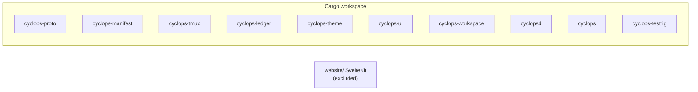

# Dependencies

External dependencies and what each is for. The Rust set is small and
deliberate; versions are pinned once in the workspace root `Cargo.toml`
(`[workspace.dependencies]`), with a few crate-local pins
(`ratatui` / `crossterm` / `alacritty_terminal` / `unicode-width` on
`cyclops-workspace`, and `tempfile` as a common dev-dep). Refreshed
2026-08-09 against the current workspace members and `Cargo.lock`.

## Workspace members (where crates live)

Product crates live under `src/` (not `crates/`). Test-only
`cyclops-testrig` lives under `tests/testrig/`. `website/` is excluded
from the Cargo workspace.

## Rust workspace dependencies

Major versions from `[workspace.dependencies]` / crate pins; exact patch
versions float with `Cargo.lock`.

| Dependency | Used by | For |
|---|---|---|
| `tokio` 1 (`full` at workspace; workspace crate also asks `rt-multi-thread` / `macros` / `sync` / `time`) | cyclops-tmux, cyclops-ui, cyclops-workspace, cyclopsd | Async runtime: control-mode child processes, Unix socket server, tasks, channels, one-shot timers, signals. `test-util` is enabled in cyclopsd **dev-deps** for paused-time delivery tests |
| `serde` 1 (derive) / `serde_json` 1 | nearly all crates (`serde` on proto/manifest/tmux/cyclopsd; `serde_json` more widely) | Wire, ledger, registry, and layout (de)serialization — NDJSON everywhere |
| `toml` 0.8 | cyclops-manifest, cyclops-theme, cyclopsd, cyclops, cyclops-workspace; cyclops-tmux **dev-deps** for layout fixtures | Manifests, themes, daemon config, workspace layouts / UI prefs |
| `thiserror` 2 | library crates (proto, manifest, tmux, ledger, theme, workspace) + cyclopsd | One typed error enum per library surface |
| `anyhow` 1 | cyclopsd, cyclops | Error context at application edges only |
| `tracing` 0.1 / `tracing-subscriber` 0.3 (`env-filter`) | tracing: manifest, tmux, ledger, cyclopsd; subscriber: cyclopsd only | Structured logging; daemon stderr honors `CYCLOPS_LOG` |
| `regex` 1 | cyclops-manifest | Compiled detection-rule matchers |
| `clap` 4 (derive) | cyclopsd, cyclops | CLI parsing |
| `uuid` 1 (v4) | cyclopsd; cyclops-tmux **dev-deps** | `boot_id` and message/event ids |
| `libc` 0.2 | cyclops-ui, cyclopsd; cyclops **dev-deps** | termios raw mode, window-size ioctl, socket peer credentials; CLI silence tests that need a real tty |
| `ratatui` 0.30 / `crossterm` 0.29 | cyclops-workspace only | Full-screen workspace layout, buffered rendering, terminal input, and terminal lifecycle |
| `alacritty_terminal` 0.26 | cyclops-workspace only | Embedded pane VT state and escape-sequence processing |
| `unicode-width` 0.2 | cyclops-workspace only | Terminal-cell width calculations |
| `tempfile` 3 | **dev-deps only** (ledger, theme, ui, cyclops, …) | Scratch dirs in tests |

Path dependencies between workspace crates are declared once at the root
(`cyclops-proto`, `cyclops-manifest`, `cyclops-tmux`, `cyclops-ledger`,
`cyclops-theme`, `cyclops-ui`, `cyclops-workspace`, `cyclops-testrig`) and
consumed via `{ workspace = true }` (or an explicit `path` in ledger).
`cyclops-testrig` has **zero** crate dependencies (`publish = false`).

### Per-crate external surface (quick map)

| Crate | External runtime deps (beyond other cyclops crates) |
|---|---|
| `cyclops-proto` | serde, serde_json, thiserror |
| `cyclops-manifest` | serde, toml, regex, thiserror, tracing |
| `cyclops-tmux` | serde, tokio, thiserror, tracing |
| `cyclops-ledger` | serde_json, thiserror, tracing |
| `cyclops-theme` | thiserror, toml |
| `cyclops-ui` | tokio, serde_json, libc |
| `cyclops-workspace` | alacritty_terminal, crossterm, ratatui, serde_json, thiserror, tokio, toml, unicode-width |
| `cyclopsd` | tokio, serde, serde_json, toml, thiserror, tracing, tracing-subscriber, anyhow, uuid, clap, libc |
| `cyclops` | serde_json, toml, anyhow, clap |
| `cyclops-testrig` | *(none)* |

## Deliberately absent

- **No filesystem-watcher crate** (`notify`, `hotwatch`, etc.). Theme hot
  reload is a *stat* (mtime+len) checked when a repaint is already due
  (`cyclops-theme::ThemeWatch`); see architecture.md zero-polling decision.
- **No interval-timer / polling machinery** and no dedicated poller crates.
  Every timer is a one-shot tied to an event that already happened.
- **No database** (SQLite, sled, …). The ledger is append-only NDJSON; a
  10k-line scan is single-digit milliseconds, so there is deliberately no
  index.
- **No TUI framework in the stream UI.** `cyclops-ui` hand-rolls termios via
  `libc`; Ratatui/Crossterm are confined to `cyclops-workspace`.
- **No HTTP client / RPC framework in the Rust product.** Clients speak
  NDJSON over a Unix socket; the website's GitHub star fetch is separate.

## System dependencies

| Tool | Needed for |
|---|---|
| tmux ≥ 3.2 | The product itself and most tests (developed on 3.6a; CI also builds tmux master as an advisory canary) |
| Rust stable toolchain | Building; CI uses `dtolnay/rust-toolchain@stable` with rustfmt + clippy. Cloud VMs may need ≥1.85 for lockfile/`edition2024` dependency crates — see `AGENTS.md` Custom Instructions |
| Python 3 | `scripts/check-doc-paths.py`, `tests/e2e/m1_soak.py`, `tests/e2e/test_vocab.py`, and demos that probe the ledger |
| jq | Demos that read the ledger back (`demos/m1-send.sh`, `demos/m2-conversation.sh`, `demos/m3-stream.sh`, `tests/e2e/parity-check.sh`) |
| POSIX shell | `demos/`, `scripts/install.sh` (`bash -n` must always pass on demos), `resources/hooks/` templates, `tests/e2e/lib/lib.sh` |
| Node.js / npm | Website CI only (`npm run check`, `npm run build`) — not required to build or run the Rust product |

## Website dependencies (`website/`, outside the workspace)

Dev-dependencies only — zero runtime dependencies, no UI library, no
Tailwind:

| Package | For |
|---|---|
| `@sveltejs/kit` 2 / `svelte` 5 | The framework |
| `vite` 8 + `@sveltejs/vite-plugin-svelte` | Build |
| `@sveltejs/adapter-auto` | Deploy adapter; the host is configured outside the repo |
| `typescript` + `svelte-check` | Static checking (`npm run check`) |

External services the site touches: the GitHub API (star count, short
timeout, graceful fallback) and Google Fonts (JetBrains Mono, Silkscreen).
The hosted installer at `website/static/install.sh` must stay
byte-for-byte identical to `scripts/install.sh`.

## Version-compatibility posture

- tmux: version-specific behavior is a named predicate in
  `src/cyclops-tmux/src/version.rs` (e.g. bracket-paste flag ≥3.8,
  pause-after ≥3.2), never a call-site comparison. Unknown control-mode
  notification lines are data, not errors, for forward compatibility with
  tmux HEAD.
- Wire protocol: additive-only. New fields optional, unknown fields ignored
  in both directions, version mismatch warns (`PROTOCOL_VERSION = 1`).
- Vendor CLIs: all knowledge lives in `resources/manifests/` data files, so a
  vendor change is a manifest edit, not a release.
- Themes / layouts / hooks: shipped as data under `resources/`, compiled into
  the CLI with `include_str!` where seeding needs them, never as Rust match
  arms on vendor names.
