# Workflows

The runtime flows that matter, plus the development and CI loops.

## Daemon boot

`cyclopsd::boot` (`src/cyclopsd/src/lib.rs`): mint `boot_id` → probe
`tmux -V` → load manifests once (immutable for the run) → open one
`LedgerWriter` per configured session (open failure fails boot: a daemon that
cannot record must not deliver) → replay ledgers to preload message ids and
find limbo → load the adoption registry → build shared state → append a
`boot` system line per ledger → give every delivery the previous run left
unresolved a named ending (`close_limbo`) → bind the socket (a live daemon on
a stale socket fails loudly; a refused connect removes and rebinds) → spawn
one session task per session plus the accept loop.

## Session watching (zero polling)

Each session task connects a `tmux -C` control client, bootstraps the pane
table from `list-panes`, installs per-pane subscriptions plus one
session-wide death subscription, then loops on pushed events: title/dead/
mode/command changes recompute fusion; window moves relocate chrome; output
activity arms a 300ms settle debounce; a removed pane drops its cached state
and emits the event that lets clients drop it from the eye count. Broadcast
lag triggers a full reconcile — level-triggered, so missed events cost
freshness, never correctness. Disconnects freeze the pane table, log a
`detach` line, and reconnect with 200ms→5s backoff. Session renames are
matched by stable tmux session id so the watcher and adoption records move
in place (ledger file path for that run stays on the old name; see
`STATUS.md`).

Clients can also call `session.watch` to attach a session the daemon was
not booted with.

## Sensor fusion

`src/cyclopsd/src/fusion.rs` — the one path a fused state changes on:

1. Bind a manifest (registry pin → foreground command → argv basename).
2. Dead / in-copy-mode short-circuit.
3. Title-tier rules decide when they can; the screen is captured only when
   forced or the title is undecided (escaped capture only when the manifest
   has escaped rules).
4. Hook readings merge in with a 300s TTL and a 3-contradiction limit.
5. Capture failure keeps the prior verdict — sensor failure is doubt, not
   evidence.

On change: one `state` ledger line + one pushed event + a border repaint.
Rule ids and causes go on the record; raw screen contents never do.

Known detection gap (not a delivery bug): some CLIs still report wrong
activity (Codex idle↔working confirmed; Cursor Agent seen as `working`
while typing). Tracked in GitHub issue #7 / `STATUS.md`.

## Message delivery (send → receipt)

```mermaid
sequenceDiagram
    participant S as sender (CLI/workspace/agent)
    participant D as cyclopsd
    participant W as per-pane worker
    participant T as tmux pane
    participant L as ledger
    S->>D: msg.send {to, subject, body}
    D->>D: resolve sender identity (process ancestry)
    D->>L: msg line (every involved session)
    D->>W: enqueue per recipient (FIFO)
    W->>W: gate: attached? alive? not in copy-mode? manifest? fused Idle?
    Note over W: quota → park (terminal); modal → decline keys ≤3;<br/>permission prompt → hold + one admin ping;<br/>working → hold on events, never a clock
    W->>T: re-check occupant pid, paste via load-buffer + paste-buffer
    W->>T: verify composer holds the message id (re-reads 0/120/240/480ms)
    W->>T: re-check occupant pid, send submit key
    T-->>D: hook ACK (agent.state.report with msg id)
    D->>L: delivered_verified (hook) or delivered_unverified (screen)
    D-->>S: receipt (state at the instant asked)
```

Every transition is a ledger line, so **the ledger is the debugger**: read
the last state line for a message, then the gate lines above it — each
carries a cause word. A hold is waiting on an event, never on a clock, so
"stuck" always means "which event never arrived". A hold longer than
`gate_hold_notify_ms` pings the admin once. Spec:
`docs/development/DELIVERY.md`. Call order in
`src/cyclopsd/src/delivery.rs`: `msg_send` → `worker_loop` → `process` →
`gate` → `attempt_delivery`.

## The hook path

Vendor hook config → invokes `cyclops hook <event>` with the payload on
stdin → posts `agent.state.report` within a 3s budget, silent, exit 0 always
→ the daemon dedupes, records liveness edges keyed to the occupant pid (a
restart invalidates its predecessor's edges), matches delivery ACK markers,
and feeds fusion. A late hook ACK upgrades `delivered_unverified` to
`delivered_verified` — the only legal exit from a delivered state.

Fresh installs that opt into `--wire-hooks` merge configs into the paths
each vendor CLI actually reads so turn edges arrive without fifteen manual
steps. `cyclops update` refreshes absolute binary paths in artifacts it
already installed. Details: `docs/reference/hooks.md`.

## The UI stream

`cyclops watch` connects once, sends one `status` (which seeds — replaces — the
attention register), subscribes to events, and reads one ledger backfill
(which feeds the register nothing, so the eye count can never depend on
`--backfill`). The event loop batches up to 256 messages per frame; the
theme hot-reload stat rides each wake; the eye animates one 120ms one-shot
step at a time. Enter on a row jumps tmux focus to that pane.

## Workspace (bare `cyclops`) and composer

Bare `cyclops` on a TTY opens the full-screen workspace: project sidebar
(Sessions + Stream tabs), tab bar, live pane canvas via tmux control mode.
It seeds shipped themes/manifests, starts cyclopsd when none answers, and
can create a fresh `main` session when no tmux server exists. UX:
`docs/guides/workspace-ui.md`.

**Composer (v5):** `Ctrl+B s` or the tab-strip `@` chat button opens a
one-line dialog. Grammar is `@name` then free text; Enter sends through
`msg.send` off the draw loop (the daemon holds the reply for the ACK
window). Receipt wording matches `cyclops send`. Motion fades (focus border,
status ink, eye, notice) use one-shot deadlines only while a fade runs —
still zero polling when idle (`CYCLOPS_MOTION=0` / `NO_COLOR` / no truecolor
force off).

## Workspace start (`cyclops start`)

Seed config, manifests, and themes into `$CYCLOPS_HOME` (never overwriting
existing files) → optional `--wire-hooks` via setup → ensure the daemon is
running (spawn detached, wait ≤10s for the socket) → restore the saved
workspace or build a preset (`--preset`, optional `--agents` to launch CLIs
and set `CYCLOPS_AGENT` per pane) → name panes via `pane.label` → print next
steps. Safe to run twice: the first run rebuilds panes, the second applies
names once the daemon has the session. Known limit: cannot tell two
same-shaped live layouts apart until a pane is named.

## Theme switch

`cyclops theme <name>` writes the config key and calls `theme.reload`; the
daemon re-stats, repaints every adopted border, and emits a `theme` event; a
running UI/workspace wakes and re-reads the selection itself — no palette
crosses the wire. Workspace pane bodies repaint ground + ANSI-16 from the
active theme without restart.

## Update

`cyclops update` clones `CYCLOPS_REPO`@`CYCLOPS_REF`, runs the installer path,
reports old vs new build, refreshes already-installed hooks, and prints the
restart steps. Nothing is restarted automatically.

## The development loop

From `CONTRIBUTING.md` — five core checks:

```bash
cargo fmt --all
cargo clippy --workspace --all-targets -- -D warnings
cargo nextest run --workspace -E 'not package(cyclopsd)' --no-fail-fast
cargo test -p cyclopsd --all-targets --no-fail-fast
cargo test --workspace --doc                   # nextest does not run doctests
python3 scripts/check-doc-paths.py
./tests/e2e/parity-check.sh
```

Touching either installer requires `scripts/install.sh` and
`website/static/install.sh` to remain identical, plus
`./tests/e2e/parity-check.sh --with-installer` (does a release build).
Testing rules that bite: every
tmux-touching test goes through `cyclops-testrig` (never the default tmux
server), and every scratch path comes from `cyclops_proto::scratch` (never
`/tmp` literals or `std::env::temp_dir()`). Run the Rust test gate (nextest
and the doctests) from a plain shell, not inside tmux (see `AGENTS.md`
Custom Instructions).

## CI (`.github/workflows/ci.yml`)

```mermaid
flowchart TB
    subgraph test["test (ubuntu + macos, fail-fast: false)"]
        a["cargo fmt --check"] --> b["cargo clippy -D warnings"]
        b --> c["nextest parallel-safe suites, cargo test cyclopsd, then workspace doctests"]
        c --> e["check-doc-paths.py --selftest, then run"]
        e --> f["tests/e2e/parity-check.sh (docs and binaries agree)"]
        f --> g["whole suite again with CYCLOPS_TEST_TMP relocated (F24)"]
    end
    subgraph installer["installer (ubuntu + macos)"]
        h["cargo build --workspace"] --> i["parity-check.sh --with-installer"]
    end
    subgraph canary["tmux-head (advisory, continue-on-error)"]
        j["build tmux from master"] --> k["nextest parallel-safe suites, cargo test cyclopsd, then workspace doctests"]
    end
    subgraph website["website"]
        l["cmp hosted and tested installers"] --> m["npm run check"]
        m --> n["npm run build"]
    end
```



Triggers: pushes to `v2` or `main`, and pull requests. Steps after a test
failure still run (`if: !cancelled()`) so one run reports every failure. The
tmux-head job is early warning, not a merge blocker — but it has caught a
real issue before (F25), so read it when it goes red.

There is no release automation; installation is build-from-source via
`scripts/install.sh` (or `cyclops update` thereafter).
