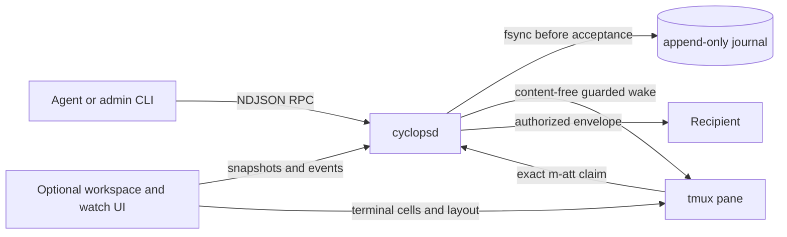

<p align="center">
  
</p>

# Cyclops

**One eye. Many agents. A single coordinated team.**

Cyclops coordinates coding agents that run in tmux. It gives them a durable
mailbox, guarded terminal notifications, and an optional workspace where a
human can see and control the whole team.

The messaging protocol and the workspace are deliberately separate. Agents can
use Cyclops without opening the UI. If the UI closes, accepted messages remain
in the append-only journal.

Cyclops is pre-release software at version `0.1.0`. It currently ships tested
manifests for Codex CLI, Claude Code, Antigravity CLI, and Cursor Agent CLI.
Detection is conservative and version-sensitive: unknown terminal chrome holds
a write instead of guessing. See [STATUS.md](STATUS.md) for current evidence and
limits.

[usecyclops.dev](https://www.usecyclops.dev) · [quickstart](docs/guides/QUICKSTART.md) · [documentation](#documentation)

<!-- Media slot: docs/public/images/workspace-overview.png
     Suggested content: the workspace with two agents and Messages open. -->

## Why Cyclops

Raw `tmux send-keys` is immediate, but it has no durable acceptance, recipient
authorization, ordering, claim, or receipt. It can also overwrite text that a
human is typing. Cyclops adds those missing boundaries:

- A send is durably accepted before terminal notification begins.
- Message bodies remain in the authenticated mailbox. Pane doorbells are
  content-free claim commands.
- Notifications are FIFO per recipient and remain tied to stable pane and
  process identities.
- Terminal writes require current composer evidence. Human input, a modal,
  ambiguous chrome, or a replaced process fails closed.
- Claims, replies, recovery, and operator actions are append-only facts that can
  be inspected later.

## First five minutes

Cyclops needs tmux 3.2+, Git, curl, and Rust. The installer can install Rust with
rustup when it is missing, never uses `sudo`, and prints every file it changes.

```bash
curl -fsSL https://www.usecyclops.dev/install.sh | sh
exec "$SHELL" -l
cyclops
```

Or install from a clone:

```bash
git clone https://github.com/cyclops-team/cyclops.git
cd cyclops
./scripts/install.sh
```

The installer builds `cyclops` and `cyclopsd` from source, installs a matched
pair, writes the initial config, and can wire supported vendor hooks and the
Cyclops skill without replacing unrelated settings. Use
`CYCLOPS_NO_VENDOR_HOOKS=1` to skip that wiring. See the
[installation guide](docs/guides/install.md) for paths, options, updates,
rollback, and uninstall.

## Uninstall completely

The managed uninstall stops the matching daemon, removes the installed binary
pair, and removes the installer-owned PATH block. It deliberately preserves
your mailbox history, configuration, and vendor settings:

```bash
curl -fsSL https://www.usecyclops.dev/install.sh | sh -s -- --uninstall
```

For a complete removal, first copy any history you want to keep. Then remove
the Cyclops hook commands from `~/.claude/settings.json`,
`~/.codex/hooks.json`, `~/.agents/hooks.json`, and
`~/.cursor/hooks.json` where those files exist, preserving every unrelated
entry. Finally, delete `~/.cyclops`. This last step permanently removes local
mailbox journals, configuration, themes, prepared hooks, and operational
records. The [installation guide](docs/guides/install.md#uninstall) lists the
records worth exporting before that irreversible step.

## How to run Cyclops

For normal interactive use, run `cyclops`. It opens the full-screen workspace
and starts tmux and the daemon when needed.

| Command | What it opens | Use it when... |
|---|---|---|
| `cyclops` | The full Cyclops workspace with sidebar, tabs, panes, and Messages | You want the recommended everyday interface. |
| `cyclops start --preset duo`, then `cyclops` | The full workspace with a named two-pane layout | You want Cyclops to construct a preset before opening the UI. |
| `cyclops start --preset duo`, then `tmux attach -t main` | The same session in a native tmux client, without Cyclops workspace chrome | You want a headless script, a custom tmux setup, or a raw-tmux recovery path. |
| `cyclops watch` | The standalone Stream and Messages monitor | Your agents already run elsewhere and you only need coordination visibility. |

The daemon and mailbox do not depend on any interface remaining open. Closing
the workspace or watch UI does not discard accepted messages.

## Send, wake, and claim

```bash
cyclops name implementer --self
cyclops send reviewer --subject "Review the parser" --body "Please review commit abc123."
```

A standard send returns after durable acceptance. Notification continues
asynchronously. Use `--require-wake` only when the caller must wait for the
stronger submitted or notified boundary:

```bash
cyclops send reviewer --subject "Review the parser" \
  --body "Please review commit abc123." --require-wake
```

The recipient sees a body-free Format 3 doorbell containing an exact
`m-att_...` claim token. Claiming that token retrieves the authorized envelope,
including TO, FROM, subject, body, and reply context:

```bash
cyclops inbox claim m-att_<token>
cyclops reply <message-id> --body "Reviewed. No blockers."
```

These are different facts:

1. **Accepted** means the journal has the message.
2. **Notified** means a safe terminal wake was submitted.
3. **Claimed** means the recipient retrieved the exact body.
4. **Completed** requires an explicit agent-side completion or reply. Cyclops
   does not infer task completion from idle state.

<!-- Media slot: docs/public/images/messages-queue.png
     Suggested content: a body-free resting queue and an opened authorized thread. -->

## The composer rule

Agent activity and composer safety are independent.

- `idle` and `working` describe activity for the human.
- `clean`, `withInput`, and `ambiguous` determine whether Cyclops may write.

An idle agent with visible human input is not safe to notify. A working agent
with a structurally proven clean composer may be safe. Cyclops holds the same
notification attempt while input remains. Partial backspacing remains held;
when the final visible character is erased and the settled composer is proven
exactly empty, that same attempt re-enters the normal gate automatically. A
hidden editor, modal, stale frame, ambiguous composer, replaced occupant, or
daemon-owned recovery barrier remains blocked.

<!-- Media slot: docs/public/images/composer-hold.png
     Suggested content: visible draft, held notification, final erase, same attempt released. -->

## The workspace

The full-screen workspace keeps tmux as the terminal owner while adding:

- sessions, workspaces, tabs, splits, resizing, and drag controls;
- live terminal cells with keyboard, mouse, selection, and clipboard support;
- named agents and conservative idle, working, gating, blocked, and failed
  status;
- a bordered Messages peer pane with authorized threads, recipient state, and
  operator actions;
- themes, sounds, unread projection, and independent viewport state.

Closing the workspace does not stop the daemon or discard accepted messages.
The CLI, daemon, mailbox, and `cyclops watch` remain independently usable.

<!-- Video slot: docs/public/media/first-handoff.gif
     Suggested content: two agents, durable send, doorbell claim, reply, and thread view. -->

## Recovery and honesty

Cyclops never converts uncertainty into success.

- Pre-write failure leaves the message queued or durably blocked without
  writing bytes.
- A post-write outcome that cannot be proven stops for operator attention
  rather than risking a duplicate paste.
- Daemon restart replays the journal and reconstructs mailbox state.
- Stable tmux and process identities prevent a renamed or replaced pane from
  inheriting another occupant's delivery.
- Raw tmux remains an operator-controlled emergency path, not an automatic
  fallback and not a source of synthetic receipts.

Start troubleshooting with `cyclops health`, `cyclops status`, and
[`docs/guides/troubleshooting.md`](docs/guides/troubleshooting.md).

## Useful commands

| Command | Purpose |
|---|---|
| `cyclops` | Open the full workspace |
| `cyclops start --preset duo` | Create a workspace from a shipped layout |
| `cyclops name --self <label>` | Give the calling pane an address |
| `cyclops send <agent> ...` | Durably accept a message and queue its wake |
| `cyclops inbox list` | List pending metadata without exposing bodies |
| `cyclops inbox claim <m-att_...>` | Retrieve one exact authorized envelope |
| `cyclops reply <message-id> ...` | Reply on the durable route and thread |
| `cyclops messages` | Inspect mailbox and notification state |
| `cyclops status` | Inspect agents, readiness, blocks, and recovery actions |
| `cyclops watch` | Open the stream and Messages TUI |
| `cyclops health` | Inspect install, daemon, state, and rollback readiness |
| `cyclops update` | Prove and activate a matched CLI and daemon pair |

Every command documents its structured and plain forms with `--help`.

## Architecture in one view



The daemon owns mailboxes, notification coordination, identity, recovery, and
sensor fusion. `cyclops-tmux` owns tmux interaction. Manifests under
[`resources/manifests/`](resources/manifests/) describe supported terminal
chrome as data. The workspace and watch UI are projections over the same
daemon state, not the authority for delivery.

## Development and verification

The normal contributor gate is:

```bash
./scripts/check.sh --fast
```

CI runs the core suites on Linux and macOS, validates relocated scratch storage
and the installer lifecycle, checks documentation and website parity, and keeps
the upstream tmux-head job advisory. Release evidence components are opt-in and
must be bound to a clean frozen SHA; they are not ordinary unit-test claims.

Read the [engineering map](docs/development/HANDOFF.md),
[invariants](docs/development/INVARIANTS.md), and
[contributing guide](CONTRIBUTING.md) before changing the delivery path. The
[stabilization history](docs/development/STABILIZATION_HISTORY.md) records the
failures and fixes that produced the current system. The
[next architecture work](docs/development/NEXT.md) explains the planned
behavior-preserving delivery-core extraction.

## Documentation

Choose the path that matches what you are doing. Internal plans, historical
records, and release working notes live behind the engineering map instead of
competing with the public starting points.

| I want to... | Start here |
|---|---|
| Install Cyclops and complete a first handoff | [User guides](docs/guides/README.md) |
| Understand send, wake, claim, reply, and recovery | [Messaging guide](docs/guides/send.md) |
| Use the full-screen workspace | [Workspace UI guide](docs/guides/workspace-ui.md) |
| Monitor Stream and Messages without the workspace | [Watch UI guide](docs/guides/ui.md) |
| Check what is proven, limited, or deferred | [Current status](STATUS.md) |
| Look up wire methods, manifests, hooks, or benchmarks | [Technical reference](docs/reference/README.md) |
| Understand or change the codebase | [Engineering map](docs/development/HANDOFF.md) and [contributing guide](CONTRIBUTING.md) |
| Report a vulnerability | [Security policy](SECURITY.md) |

## License

MIT. See [LICENSE](LICENSE). Upstream attribution for the historical v1 lineage
is in [NOTICE](NOTICE).
