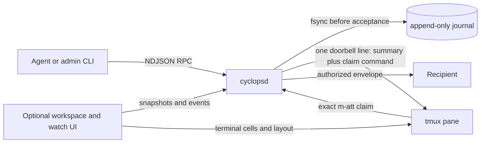

<p align="center">
  
</p>

# Cyclops

**One eye. Many agents. A single coordinated team.**

Cyclops coordinates coding agents that run in tmux. It gives them a durable
mailbox, a one-line doorbell into the recipient's pane, and an optional
workspace where a human can see and control the whole team.

The messaging protocol and the workspace are deliberately separate. Agents can
use Cyclops without opening the UI. If the UI closes, accepted messages remain
in the append-only journal.

Cyclops is at version `1.1.0`. It ships twelve detection manifests. Five are
measured against a live CLI: Claude Code, Codex CLI, Antigravity CLI, Cursor
Agent CLI, and Kimi Code CLI. Seven are written from vendor documentation and
say so with `version_tested = "unverified"`: Gemini CLI, Qwen Code, goose,
OpenCode, Amp, Crush, and aider. See [STATUS.md](STATUS.md) for the evidence
behind each and the limits that follow from it.

[usecyclops.dev](https://www.usecyclops.dev) · [quickstart](docs/guides/QUICKSTART.md) · [documentation](#documentation)

<!-- Media slot: docs/public/images/workspace-overview.png
     Suggested content: the workspace with two agents and Messages open. -->

## Why Cyclops

Raw `tmux send-keys` is immediate, but it has no durable acceptance, sender
identity, ordering, claim, or receipt, and it types over whatever a human has
half-written in the composer. Cyclops adds the missing boundaries:

- A send is durably accepted, fsynced, before any terminal write begins.
- The sender is whoever connected to the socket. Nothing in a request can
  name a sender.
- Message bodies stay in the authenticated mailbox. The pane gets one line:
  a summary beside the exact claim command.
- Doorbells are FIFO per recipient and bound to a stable pane and process
  identity.
- A doorbell is written and submitted for a bound, live agent process unless
  a human draft is positively observed or a named block is on screen (a
  modal, a permission prompt, a quota screen, a dead pane, copy-mode, or a
  doorbell the recipient has not consumed). An ambiguous or unreadable
  composer does not hold it.
- Every outcome is recorded, including the uncertain ones. A line that could
  not be read back is `submitted_unverified`; a physical write failure is
  `attention_required`. Nothing is retried on a timer.

The human-draft guard is strong, not absolute. It depends on the manifest
recognizing typed text, and the seven unverified manifests carry no such
rule, so a doorbell to one of those panes is effectively a raw write with a
receipt.

### How fast

A `cyclops send` from the CLI is about 10 ms at the median on the measured
machine. Most of that is process start and one fsync. Raw `tmux send-keys`
is cheaper because it proves nothing: no durable record, no sender identity,
no ordering, no claim, no receipt. The numbers, the harnesses in this
repository that produce them, and what each lane does and does not include
are in [docs/reference/BENCHMARKS.md](docs/reference/BENCHMARKS.md).

## First five minutes

Cyclops needs tmux 3.2+, Git, and curl. The installer downloads a published
release pair for your platform when one exists and otherwise builds from
source, installing Rust with rustup when it is missing. It never uses
`sudo` and prints every file it changes.

```bash
curl -fsSL https://www.usecyclops.dev/install.sh | sh
exec "$SHELL" -l
cyclops
```

Or install from a clone:

```bash
git clone https://github.com/cyclops-team/cyclops.git
cd cyclops
./scripts/install.sh
```

The installer puts a matched `cyclops` and `cyclopsd` pair in place, writes
the initial config, and can wire supported vendor hooks and the Cyclops
skill without replacing unrelated settings. Use `CYCLOPS_NO_VENDOR_HOOKS=1`
to skip that wiring. See the [installation guide](docs/guides/install.md)
for paths, options, updates, rollback, and uninstall.

## Uninstall completely

The managed uninstall stops the matching daemon, removes the complete current
Cyclops state home, installed binary pair, Cyclops hook entries, unedited
seeded skills, and installer-owned PATH block:

```bash
curl -fsSL https://www.usecyclops.dev/install.sh | sh -s -- --uninstall
```

Export anything you want to retain before running it. `cyclops remove --all`
remains available when you want its explicit preview and confirmation without
removing the installed binary pair.

It removes only exact Cyclops hook commands from vendor configuration and
only byte-for-byte known Cyclops skill seeds. Unrelated hooks, settings, and
edited skills stay untouched. If a file cannot be safely proved, uninstall
stops before state or binaries are removed. The
[installation guide](docs/guides/install.md#uninstall) lists the full boundary.

## How to run Cyclops

For normal interactive use, run `cyclops`. It opens the full-screen workspace
and starts tmux and the daemon when needed.

| Command | What it opens | Use it when... |
|---|---|---|
| `cyclops` | The full Cyclops workspace with sidebar, tabs, panes, and Messages | You want the recommended everyday interface. |
| `cyclops start --preset duo`, then `cyclops` | The full workspace with a named two-pane layout | You want Cyclops to construct a preset before opening the UI. |
| `cyclops start --preset duo`, then `tmux attach -t main` | The same session in a native tmux client, without Cyclops workspace chrome | You want a headless script, a custom tmux setup, or a raw-tmux recovery path. |
| `cyclops watch` | The standalone Stream and Messages monitor | Your agents already run elsewhere and you only need coordination visibility. |

The daemon and mailbox do not depend on any interface remaining open. Closing
the workspace or watch UI does not discard accepted messages.

## Send, wake, and claim

```bash
cyclops name implementer --self
cyclops send reviewer --subject "Review the parser" \
  --body "Please review commit abc123."
```

A send returns after durable acceptance. The doorbell follows asynchronously.
`--summary` is optional: when you omit it the daemon derives the one-line
preview from the subject. Use `--require-wake` only when the caller must wait
for the doorbell to reach `submitted` or `notified`:

```bash
cyclops send reviewer --subject "Review the parser" \
  --summary "The parser change is ready for review." \
  --body "Please review commit abc123." --require-wake
```

The recipient sees the preview plus an exact `m-att_...` claim token on one
line. A narrow pane may soft-wrap it; the bytes are unchanged. Claiming
through the socket does not cancel the queued doorbell. Claiming the token
retrieves the authorized envelope, including TO, FROM, subject, summary, the
full body, and reply context:

```bash
cyclops inbox claim m-att_<token>
cyclops reply <message-id> --body "Reviewed. No blockers."
```

`cyclops reply --last` answers the most recently claimed message.

These are different facts:

1. **Accepted** means the journal has the message.
2. **Notified** means the doorbell was written and submitted.
3. **Claimed** means the recipient retrieved the exact body.
4. **Completed** requires an explicit agent-side reply. Cyclops does not infer
   task completion from idle state.

### The raw transport

`cyclops send --raw` (and `cyclops reply --raw`) pastes the whole message,
header, body, reply hint, and end marker, into the recipient pane and presses
Enter with no composer check. It exists for exactly two cases: Cyclops's own
composer reading is wrong for that pane, or the recipient is an unverified
vendor. The journal records it as an unverified raw write, so nobody mistakes
it for a gated delivery, and Cyclops never selects it on its own.

<!-- Media slot: docs/public/images/messages-queue.png
     Suggested content: a body-free resting queue and an opened authorized thread. -->

## The composer rule

Agent activity and the composer are separate questions.

- `idle` and `working` describe agent activity for the human.
- The composer check asks one thing: is a human draft positively visible, or
  does a delivery already own the composer? Only then does a doorbell wait.

A working agent gets its doorbell during the turn; the vendor queues the line.
An idle agent with an unreadable composer gets it too, and the journal marks
the attempt `submitted_unverified` if the line could not be read back. A
positively observed draft holds the same attempt until the draft is seen
erased or the turn ends, never on a clock. A modal, a permission prompt, a
quota screen, a dead pane, or copy-mode holds on its name and pings the admin
once after `gate_hold_notify_ms`.

<!-- Media slot: docs/public/images/composer-hold.png
     Suggested content: visible draft, held notification, final erase, same attempt released. -->

## The workspace

The full-screen workspace keeps tmux as the terminal owner while adding:

- sessions, workspaces, tabs, splits, resizing, and drag controls;
- live terminal cells with keyboard, mouse, selection, and clipboard support;
- named agents and conservative idle, working, gating, blocked, and failed
  status;
- a bordered Messages peer pane with authorized threads, recipient state, and
  operator actions;
- themes, sounds, unread projection, and independent viewport state.

Closing the workspace does not stop the daemon or discard accepted messages.
The CLI, daemon, mailbox, and `cyclops watch` remain independently usable.

<!-- Video slot: docs/public/media/first-handoff.gif
     Suggested content: two agents, durable send, doorbell claim, reply, and thread view. -->

## Recovery and honesty

Cyclops never converts uncertainty into success.

- A failure proven before the paste leaves the message queued or durably
  blocked, with nothing written and the cause named.
- A paste that could not be read back is still submitted once and recorded
  as `submitted_unverified`; a missing receipt ends as `notified` with no
  verifier. Neither is retried.
- A physical write failure (a paste or submit command that failed, or a pane
  whose occupant changed after the paste) stops as `attention_required` for
  a human to inspect. `cyclops requeue <message-id>` starts a fresh attempt
  after the cause is understood.
- A daemon restart replays the journal, closes every attempt caught between
  the paste and its receipt to `attention_required`, and reconstructs
  mailbox state.
- Stable tmux and process identities prevent a renamed or replaced pane from
  inheriting another occupant's delivery.

Start troubleshooting with `cyclops health`, `cyclops status`, and
[`docs/guides/troubleshooting.md`](docs/guides/troubleshooting.md).

## Useful commands

| Command | Purpose |
|---|---|
| `cyclops` | Open the full workspace |
| `cyclops start --preset duo` | Create a workspace from a shipped layout |
| `cyclops name --self <label>` | Give the calling pane an address |
| `cyclops send <agent> ...` | Durably accept a message and queue its doorbell |
| `cyclops send <agent> --raw ...` | Paste the whole message and press Enter with no composer check; recorded as an unverified raw write |
| `cyclops inbox list` | List pending metadata without exposing bodies |
| `cyclops inbox claim <m-att_...>` | Retrieve one exact authorized envelope |
| `cyclops reply <message-id> ...` | Reply on the durable route and thread; `--last` answers the last claimed message |
| `cyclops messages` | Inspect mailbox and notification state |
| `cyclops status` | Inspect agents, blocks, and what needs you |
| `cyclops clear <agent>` | Withdraw every doorbell to one agent that has not written to its pane; messages stay claimable |
| `cyclops flush` | Flush message ledgers, cleanse state, and reset sessions to start clean |
| `cyclops stop` | Stop the daemon; tmux panes and durable messages stay intact |
| `cyclops watch` | Open the stream and Messages TUI |
| `cyclops health` | Inspect install, daemon, state, and rollback readiness |
| `cyclops update` | Prove and activate a matched CLI and daemon pair |

Every command documents its structured and plain forms with `--help`.

## Architecture in one view



The daemon owns mailboxes, the doorbell pipeline, identity, restart recovery,
and sensor fusion. `cyclops-tmux` owns tmux interaction. Manifests under
[`resources/manifests/`](resources/manifests/) describe supported terminal
chrome as data. The workspace and watch UI are projections over the same
daemon state, not the authority for delivery.

## Development and verification

The normal contributor gate is:

```bash
./scripts/check.sh --fast
```

CI runs the core suites on Linux and macOS, validates relocated scratch storage
and the installer lifecycle, checks documentation and website parity, and keeps
the upstream tmux-head job advisory. Release evidence components are opt-in and
must be bound to a clean frozen SHA; they are not ordinary unit-test claims.

Read the [engineering map](docs/development/HANDOFF.md),
[invariants](docs/development/INVARIANTS.md), and
[contributing guide](CONTRIBUTING.md) before changing the delivery path. The
[stabilization history](docs/development/archive/STABILIZATION_HISTORY.md) records the
failures and fixes that produced the current system. [NEXT.md](docs/development/NEXT.md)
is the short queue of what is worth doing next.

## Documentation

Choose the path that matches what you are doing. Internal plans, historical
records, and release working notes live behind the engineering map instead of
competing with the public starting points.

| I want to... | Start here |
|---|---|
| Install Cyclops and complete a first handoff | [User guides](docs/guides/README.md) |
| Understand send, wake, claim, reply, and recovery | [Messaging guide](docs/guides/send.md) |
| Use the full-screen workspace | [Workspace UI guide](docs/guides/workspace-ui.md) |
| Monitor Stream and Messages without the workspace | [Watch UI guide](docs/guides/ui.md) |
| Check what is proven, limited, or deferred | [Current status](STATUS.md) |
| Look up wire methods, manifests, hooks, or benchmarks | [Technical reference](docs/reference/README.md) |
| Understand or change the codebase | [Engineering map](docs/development/HANDOFF.md) and [contributing guide](CONTRIBUTING.md) |
| Report a vulnerability | [Security policy](SECURITY.md) |

## License

MIT. See [LICENSE](LICENSE). Upstream attribution for the historical v1 lineage
is in [NOTICE](NOTICE).
