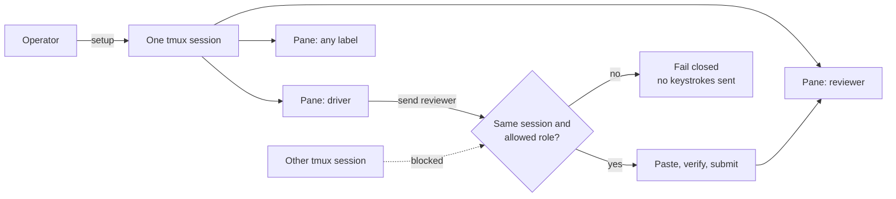

# cyclops

**One team, any agent.** Structured, safe communication for coding agents (and shells, REPLs, or any long-running process) working across tmux panes.

`cyclops` gives each pane an identity, delivers structured messages, and keeps communication inside an explicit same-session permission boundary. It's built on the commPact toolkit, whose individual commands remain available for advanced use.

## Quick start

~~~sh
curl -fsSL https://usecyclops.dev/install.sh | sh
cyclops
~~~

The install script fetches the release from GitHub, installs it into <code>~/.commPact</code>, and links the <code>cyclops</code> command onto your <code>PATH</code> (it prints the one line to add if your shell doesn't already pick it up). Running <code>cyclops</code> with no arguments then bootstraps — or, if a workspace is already running, attaches to — a tmux session in the current directory with generic defaults: <code>operator</code>, <code>lead</code>, <code>worker</code>, and <code>reviewer</code>.

> **Path guide:** <code>~/.commPact</code> is the managed local installation and contains your generated team config.

Requirements: macOS or Linux, Bash, and tmux 3.2 or newer recommended. Everything past the initial GitHub fetch stays local: the installer never installs packages, edits shell startup files, or changes <code>tmux.conf</code>.

### Install from a local clone

Prefer to review the source first, need <code>--install-only</code>, or want to build from a branch? Clone the repository and bootstrap from the project directory where the panes should open:

~~~sh
git clone https://github.com/notyahir/cyclops.git ~/cyclops
cd /path/to/your/project
~/cyclops/install.sh
tmux attach -t commpact
~~~

This runs the same underlying installer as the curl script. It installs <code>cyclops</code> and every commPact command under <code>~/.commPact/bin/</code>, but — unlike the curl script — does not link <code>cyclops</code> onto your <code>PATH</code>. Add the directory yourself (see [Command reference](#command-reference)), or call <code>~/.commPact/bin/cyclops</code> directly.

## How it works

| What it adds | Why it matters |
| --- | --- |
| Pane labels | Target stable names instead of volatile pane IDs. |
| Structured delivery | <code>send</code> frames, pastes, verifies, and submits one message. |
| Config-driven ACL | The allowed roles come from your configuration, never a fixed roster. |

The labels are yours. <code>driver</code>, <code>implementer</code>, <code>reviewer</code>, <code>operator</code>, or any valid lowercase label works. The names above are examples, not a required team shape.

## Start with your own team shape

Pass only the values you want to change. This example starts every pane with the same command, which is useful when each pane runs the same CLI agent.

~~~sh
cyclops start \
  --session project \
  --roles driver,implementer,reviewer \
  --command codex
~~~

<code>cyclops start</code> already attaches once the session is ready. From a local clone, the equivalent is:

~~~sh
~/cyclops/install.sh \
  --session project \
  --roles driver,implementer,reviewer \
  --command codex

tmux attach -t project
~~~

Use <code>--workdir PATH</code> if panes should open somewhere other than the current directory. Run <code>~/cyclops/install.sh --install-only</code> when you want the tools without starting a session yet.

<code>commPact-setup</code> can also be run directly after installation:

~~~sh
~/.commPact/bin/commPact-setup \
  --session project \
  --workdir "$PWD" \
  --operator facilitator \
  --roles builder,checker,writer \
  --default-target builder \
  --command sh
~~~

| Useful setup mode | Result |
| --- | --- |
| <code>--dry-run</code> | Print the generated config without writing or starting tmux. |
| <code>--config-only</code> | Write a validated config for adopting an existing session. |
| <code>--replace-config</code> | Back up and replace an existing generated config. |
| <code>--attach</code> | Attach to the new tmux session after setup. |

## Send messages between panes

<code>send</code> is the normal agent-to-agent primitive. It generates the visible <code>SUBJECT:</code> and <code>FROM:</code> envelope, verifies the paste reached the target, submits it, and returns compact JSON.

~~~sh
printf 'Please review the auth change.' \
  | ~/.commPact/bin/commPact send reviewer \
      --json --subject 'Review request' --body-file -
~~~

Pass only the message body through <code>--body-file -</code>. The receiver replies to the pane ID in the generated <code>FROM:</code> header. Use pane IDs for replies during a live role rename because labels may be changing.

~~~sh
# Discover and inspect panes.
~/.commPact/bin/commPact list
~/.commPact/bin/commPact resolve reviewer
~/.commPact/bin/commPact read reviewer 100

# Send a short request or query the configured default target.
~/.commPact/bin/commPact-msg @reviewer "Please take a look"
~/.commPact/bin/commPact-msg @status
~~~

## Adopt an existing session

Adoption labels panes that already exist. It never restarts panes or changes their commands. The explicit role-to-pane map is intentional because existing panes cannot be identified safely by inference.

~~~sh
# 1. Generate a config. This writes no tmux state.
~/.commPact/bin/commPact-setup --config-only \
  --session your-session \
  --roles lead,worker,reviewer \
  --command sh

# 2. Read pane IDs immediately before adoption. IDs can change on restart.
~/.commPact/bin/commPact list

# 3. Stamp labels and session metadata.
~/.commPact/bin/commPact-adopt \
  --config ~/.commPact/config/team.conf \
  --session your-session \
  --map operator=%1 \
  --map lead=%2 \
  --map worker=%3 \
  --map reviewer=%4
~~~

The per-role command is required by the config format but is ignored by adoption. It is used only when <code>commPact-init</code> starts fresh panes.

When renaming a live team, notify every pane first. Pause sends during the brief re-adoption window, then reply by pane ID until the new labels are confirmed.

## Safety model

| Boundary | Behavior |
| --- | --- |
| Session | A sender can target only panes in its own tmux session. |
| Role | Allowed targets come from <code>agent_roles</code> in session metadata. |
| Missing metadata | <code>send</code> returns <code>ACL_UNCONFIGURED</code>; it never guesses a roster. |
| Operator | The operator is excluded from ordinary agent message targets. |
| Setup | Inside an existing commPact session, only its operator pane may bootstrap another team. |
| Manual input | <code>type</code> and <code>keys</code> require a prior <code>read</code> of the target pane. |

<code>commPact name</code> can relabel a pane directly. Treat it as an operator recovery tool, not as a routine way to assign identities.

## Command reference

<code>cyclops</code> is a thin front end over the commPact toolkit below — <code>cyclops send ...</code> is <code>commPact send ...</code>, <code>cyclops start</code> is <code>commPact-setup --attach</code>, and so on. Reach for the commPact commands directly for options <code>cyclops</code> doesn't expose (adoption maps, config-only generation, etc.).

| Command | Purpose |
| --- | --- |
| <code>cyclops</code> | Start (or attach to) a workspace in the current directory. |
| <code>commPact list</code> | Show panes, processes, sizes, and labels. |
| <code>commPact send TARGET --json --subject TEXT --body-file -</code> | Send one structured message. |
| <code>commPact read TARGET [LINES]</code> | Inspect pane output for status or debugging. |
| <code>commPact type</code> and <code>commPact keys</code> | Manually drive a pane after reading it. |
| <code>commPact-setup</code> | Generate config and start a new session. |
| <code>commPact-init --config PATH</code> | Start a new session from existing config. |
| <code>commPact-adopt --config PATH --session NAME --map ROLE=%PANE</code> | Label an existing session. |
| <code>commPact-layout --config PATH</code> | Apply the configured layout and theme. |
| <code>commPact-install update</code> | Update a local installation while preserving valid config. |

Every command is available under <code>~/.commPact/bin/</code> after installation. The curl installer already links <code>cyclops</code> onto your <code>PATH</code>; add the whole directory if you want the rest of the commands too, or installed from a local clone:

~~~sh
echo 'export PATH="$HOME/.commPact/bin:$PATH"' >> ~/.zshrc
source ~/.zshrc
~~~

## Update and uninstall

~~~sh
cyclops update
cyclops uninstall
~/.commPact/bin/commPact-install uninstall --restore PATH
~~~

These forward to <code>commPact-install</code>, which can also be called directly:

~~~sh
~/.commPact/bin/commPact-install update
~/.commPact/bin/commPact-install uninstall
~~~

<code>update</code> preserves a valid generated config and creates a timestamped backup. A replace-install also creates a backup. <code>uninstall</code> does not create a backup; it removes the install home and reports any existing backups, which are never auto-deleted.

## Advanced configuration

Most teams should use <code>commPact-setup</code>. For advanced layouts or per-role commands, <code>team.conf</code> remains small and data only:

~~~conf
version=1
session=project
workdir=/absolute/path
layout=tiled
operator=operator
default_target=lead
agent_roles=lead,worker,reviewer
role=operator|sh
role=lead|sh
role=worker|sh
role=reviewer|sh
~~~

The parser rejects malformed labels, duplicate roles, missing references, an operator in <code>agent_roles</code>, and invalid layout settings before touching tmux. See [Configuration and runtime metadata](docs/CONFIG.md) for the full schema, including columns and weighted splits.

## Develop and release

Run the complete local check from the repository root:

~~~sh
bash tests/regression.sh
~~~

GitHub Actions runs the same suite on Ubuntu and macOS. Generated local config, Finder files, editor state, and Git metadata are excluded from packaged installs.

> **Release status:** version, project copyright, and project license remain owner decisions. See [Releasing commPact](docs/RELEASING.md) for the final publication checklist.

commPact retains the required [smux attribution](docs/VENDOR.md) and upstream MIT text in [LICENSE](LICENSE).
