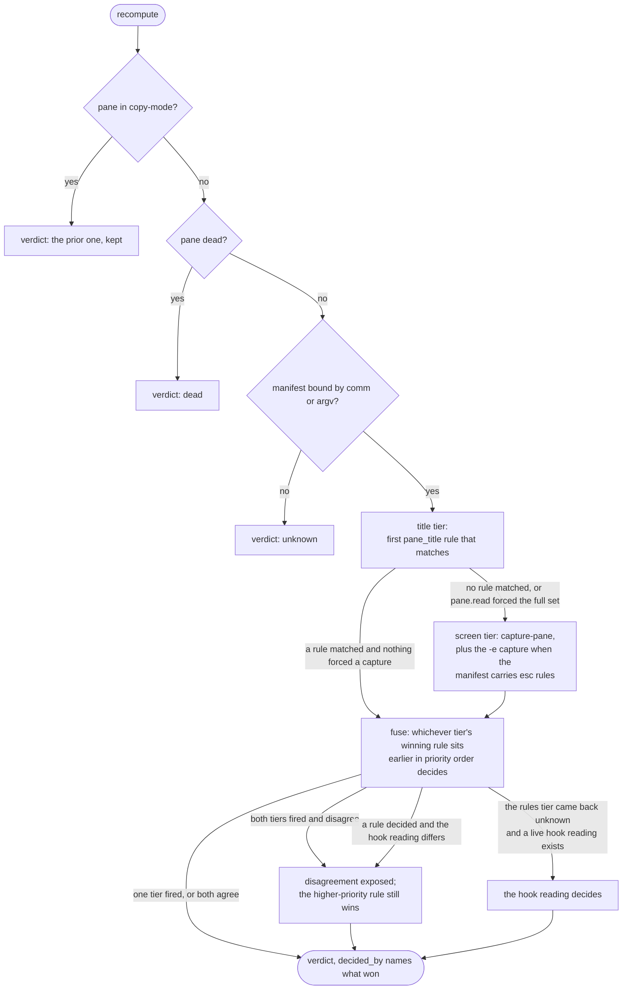
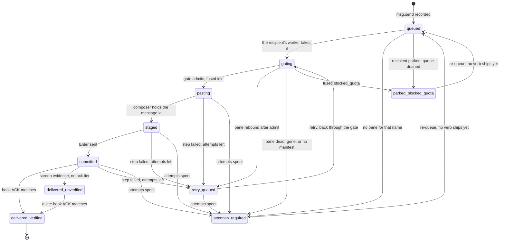
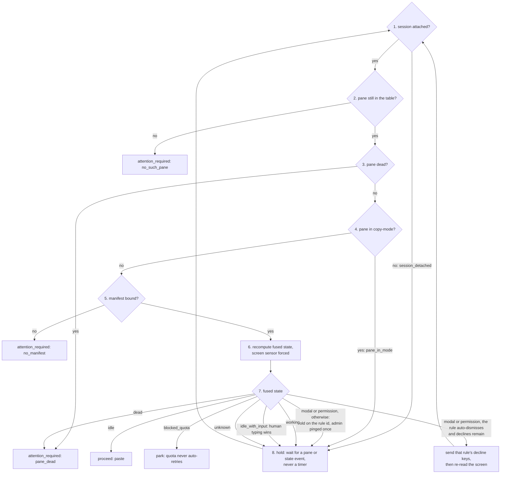
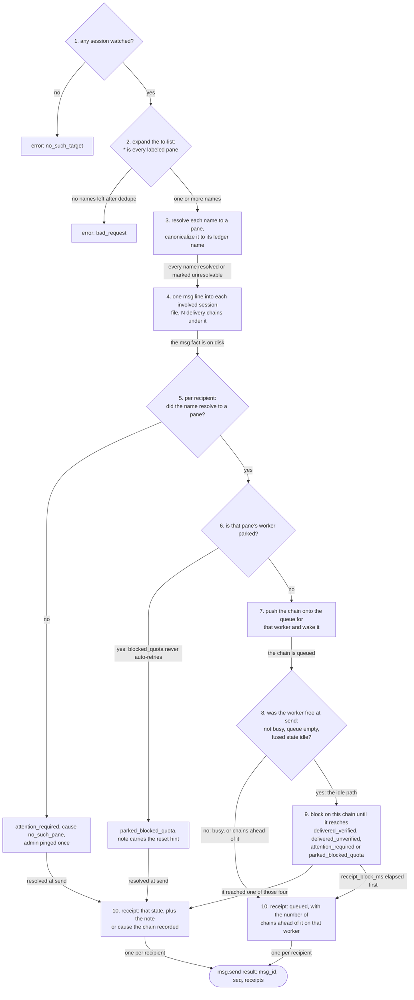
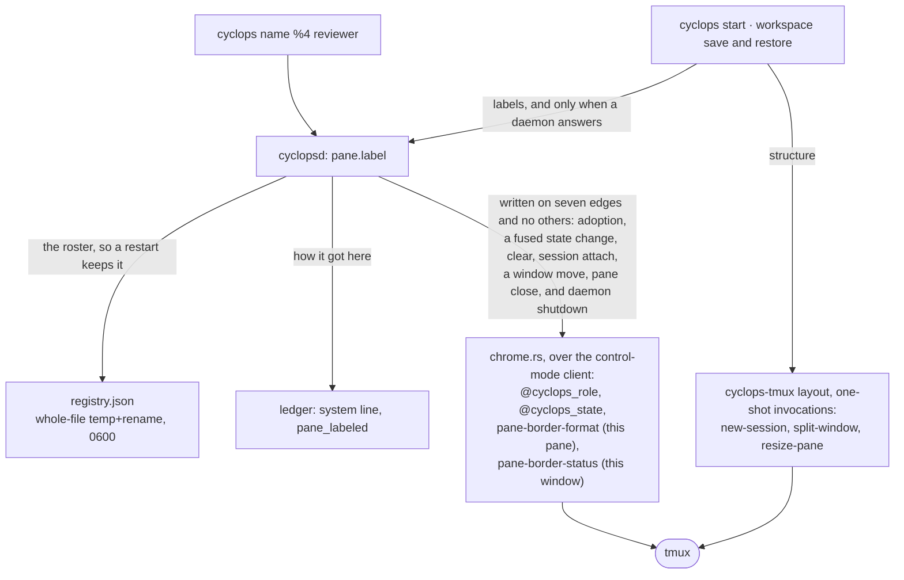

# Architecture

Cyclops v2 is a tmux-backed coordination daemon for terminal coding agents.
The architecture is frozen by ADR-001 (`cyclops-arch/deliverables/`) plus the
validation campaign's amendments (`cyclops-arch/validation-report.md`,
section 8). This document maps those decisions to code. Everything here is
in the tree today; anything still to come is marked M5 or later.

## Crate map

| Crate | Role | Status |
|---|---|---|
| `crates/cyclops-proto` | Wire protocol v1, ledger schema, delivery state machine, agent state model. Data types only, no IO. Daemon and every client compile against it. | Done |
| `crates/cyclops-manifest` | Per-CLI detection manifests: TOML schema, compiled rules, region parsing, priority evaluation, modal decline actions. Loads `manifests/*.toml`. | Done |
| `crates/cyclops-tmux` | The tmux adapter. Every tmux-specific behavior lives here: version probe with feature gates, control-mode client (FIFO reply correlation, pause-after flow control), zero-polling reconciling pane table on `refresh-client -B` subscriptions. Pane rows carry `pane_pid` for sender identity. M3 adds `focus_pane`, a one-shot `select-window` plus `select-pane` outside control mode, so the stream UI's jump-to-pane makes no tmux call outside this crate. M4 adds `layout`: the declarative workspace tree (windows, rows of panes, ratios) with `capture` off a live session and `apply` onto a new one, on the same one-shot invocation path. It writes no tmux option and no pane title, and refuses a session that already exists. | Done (M4 scope) |
| `crates/cyclopsd` | The daemon: control-mode watcher, sensor fusion (title + screen + hook reports), socket server, per-session ledger writer, delivery pipeline with per-recipient FIFO workers, fail-closed sender identity, pane adoption registry. M2 adds the ledger read side (`msg.history`, `msg.thread`), server-owned `agent.wait` with occupant pinning, and hook liveness plus the startup self-test (`hooks.verify`, `hooks.selftest`). M4 makes the adoption registry durable (`registry.rs`: `$CYCLOPS_HOME/registry.json`, restored per session against the live pane table and the pane's root pid) and adds the border chrome writer (`chrome.rs`: per-pane `pane-border-format` and `@cyclops_*` options, window-scoped `pane-border-status`, snapshotted at adoption and restored on clear, on pane close, on a window move, and at shutdown; it also owns the `chrome = "off"` switch, so no caller tests it). The chrome is the only thing the daemon renders, and it paints from cyclops-theme like every other surface. | Done (M4 scope) |
| `crates/cyclops` | The CLI: thin NDJSON client over the daemon socket. `ping`, `status`, `read`, `watch`, `send`, the `hook` receiver, the M2 verbs (`history`, `thread`, `wait`, `send --wait`, `hooks install\|verify\|selftest`), and M3's `ui` (dispatch only; the stream lives in `cyclops-ui`). M4 adds `name` and `list` (pane adoption and the roster, rendered on the same grid as `status`) plus the workspace verbs: `start` (restore or build the default workspace, idempotent) and `workspace save|restore`, in `src/workspace.rs`, which owns the files, the `default_workspace` config key, the label round trips through `pane.label`, and the copy. | Done (M4 scope) |
| `crates/cyclops-ui` | The stream UI behind `cyclops ui`: admin view and firehose over `events.subscribe` plus a ledger-tail backfill, the eye, filters, jump-to-pane through the tmux adapter, `--plain` follow mode. Windowed rendering over a 10k ring; the terminal layer is a hand-rolled termios/ANSI backend behind a pure frame builder. | Done (M3 scope) |
| `crates/cyclops-ledger` | Crash-safe append-only NDJSON ledger writer and cursor reader. Workspace member; `cyclopsd` writes one ledger per watched session through it; `cyclops-ui` replays session tails through it for backfill. | Done |
| `crates/cyclops-theme` | The theme engine: semantic token vocabulary (role.1-8, surface.dim/accent, eye.calm/alert, state.\* and badge.\* in four groups, plus surface.fg as the engine's own out-of-vocabulary fallback), the state-to-group mapping both renderers resolve through, data-only theme TOML with 256-color fallback derivation, selection (`theme` config key, `CYCLOPS_THEME` override), event-driven hot reload. The CLI's style module and cyclops-ui resolve every color through it. The vocabulary is exactly what the renderers paint: stream and background tokens stay out because nothing resolves them (docs/themes.md). | Done (M3 scope) |
| `crates/cyclops-testrig` | Test-only, `publish = false`, no dependencies. The isolated tmux server every test runs against, and the one statement of its teardown rule: kill the server, unlink the socket file it leaves behind, from `Drop` so a panicking test tears down too. A dev-dependency of `cyclops-tmux` and `cyclopsd`, which is what a `#[cfg(test)]` module could not be: the sites needing it span two crates plus a unit test inside the `cyclopsd` library. Its `one_place` test fails if any other Rust file kills a tmux server, or any demo script does it outside `demos/lib.sh`. | Done (M3 scope) |

Non-crate directories: `manifests/` (shipped detection data for claude,
codex, agy, seeded from the campaign), `hooks/` (vendor hook config
templates `cyclops hooks install` renders; measured schemas, data not
code), `scripts/commpact-shim/` (the prepared commPact v1 shim and its
guarded installer; nothing installs it, see `docs/CUTOVER.md`),
`tests/harness/` (Python probe harness, the regression seed), `demos/`
(runnable end-to-end scripts; `demos/lib.sh` holds the two rules the
scripts must not copy, the scratch root and the tmux teardown), `themes/`
(the shipped semantic token
files dark, light, high-contrast, loaded by `cyclops-theme`; dark is the
default and maps the landing page palette), `layouts/` (the four shipped
workspace presets solo, duo, quad, ops; data, compiled into the `cyclops`
binary with `include_str!` so a fresh install has them before it has a
config file), `frontend/` (the production
landing page for usecyclops.dev;
read-only branding reference, outside the Cargo workspace, ignored by Rust
CI, never modified without an explicit admin request).

## Data flow

M0 core (the reconciling read side):

```
tmux control mode (one tmux -C client per watched session)
      |  %output, %pane-title-changed, refresh-client -B subscriptions
      v
change hints ---> reconcile on doubt (list-panes, display-message,
      |           capture-pane; authoritative queries, event-triggered)
      v
pane state table (pane_id keyed; dead, in_mode, title, command, size, pid)
      |
      v
fusion (manifest rules over title + screen; unmatched hook reports join
      |            as the hook sensor via agent.state.report)
      |            per-sensor readings kept, disagreement observable
      v
AgentState per pane ---> socket: status, pane.read, events.subscribe
```

Notifications are hints, not truth. The daemon reconciles derived state
against authoritative queries whenever a hint arrives or a doubt exists.
Missed events degrade freshness, never correctness (ADR revision 1,
level-triggered core).

The fusion tiers, in the order one recompute consults them
(`cyclopsd/src/fusion.rs`, `recompute_pane`):



Screen capture is evidence of last resort (amendment h): a pane_title rule
that decides alone skips `capture-pane` entirely. A hook reading counts as
live for 300s and is dropped after three consecutive recomputes where the
rules tier decided against it, so a stale edge cannot pin fused state.
Blocked states always come from rules; no tested CLI hooks its modals or
its quota.

The M1 delivery pipeline rides the same state, one FIFO worker per
recipient pane:

```
msg.send -> ledger (queued) -> gate (fused idle, pane_dead, pane_in_mode,
no modal) -> load-buffer + paste-buffer -p -d (unique buffer name) -> verify
composer staged it -> Enter -> ACK (per-agent tier: hook payload match, or
screen evidence) -> delivered_verified | delivered_unverified
```

Every transition is a ledger line. Failures retry once, then queue or park;
they never drop and never loop. Receipts on the idle path block up to
`receipt_block_ms` (default 2500); busy targets answer queued with a
position immediately, parked targets answer parked with the reset hint.

The state machine those lines record (`cyclops-proto/src/ledger.rs`,
`DeliveryState::can_transition_to`; the pipeline that drives it is
`cyclopsd/src/delivery.rs`):



Two edges are allowed by the machine and driven by nothing today: an
operator resends the message instead, which starts a new chain. One
transition is missing from the diagram because it has no single source: a
daemon restart closes every chain still in flight to `attention_required`
with cause `daemon_restart`, whatever state it was in
(`delivery.rs`, `close_limbo`).

The gate is the pipeline's first step and the guard that stands between a
delivery and the wrong pane. It decides in this order, and only in this
order (`delivery.rs`, `gate`):



Steps 1 to 5 read the pane table and the manifest binding; step 6 is the
only one that touches the screen, and it runs immediately before pasting
so the snapshot is fresher than any human keystroke round trip.

Holds wake on events, never on a clock. Two timers live in this loop and
neither of them polls: a one-shot settle after a decline, so the dismissal
renders before the screen is re-read, and a one-shot admin ping after
`gate_hold_notify_ms`, which reports a wedged hold without ending it.

How a message becomes a receipt, which is what the sender actually gets
back from the call (`cyclopsd/src/delivery.rs`, `msg_send` and
`receipt_of`; the semantics are docs/DELIVERY.md):



Steps 5 to 9 run per recipient, so one broadcast returns mixed receipts:
delivered_verified for the idle pane, queued with a position for the busy
one, parked for the one out of quota. `receipt_block_ms` (default 2500) is
one deadline for the whole receipt phase, not one per recipient, so a
broadcast with several idle recipients shares the cap.

A queued receipt is honest, not a failure. The chain keeps moving after the
call returns and every transition still lands in the ledger; the sender is
told where it stood when the daemon answered, which is the only thing the
daemon knew.

The four states step 9 waits for are not the attention rule's two. A
receipt is settled once the pipeline will not move the chain on its own,
and that includes both delivered states. Which of them still need a human
is a separate question with its own owner
(`cyclops-proto/src/attention.rs`).

`send --wait` composes `agent.wait` onto the same call after step 10: it
appends a `wait` array and never changes the receipts.

The M2 read side rides the ledger, not new state: `msg.history` and
`msg.thread` scan the session files at query time and fold each message's
delivery chain into its `deliveries` array (one broadcast fact, N current
badges); reading never writes. `agent.wait` subscribes server-side to the
fusion broadcast and the watcher stream, pinned to the pane occupant
recorded at wait start; the deadline is its only timer. Hook liveness
(per-pane last-seen edges from `agent.state.report`) backs `hooks.verify`,
the `hooks_verified` status bit, and `hooks.selftest`'s one-marker round
trip through the normal delivery pipeline.

The M3 stream UI (`cyclops ui`) adds no daemon surface: it rides the
existing `events.subscribe` push for live entries, reads the session
ledger tails once at startup for backfill, asks `status` once for the
label-to-pane map and current states, and jumps focus through the tmux
adapter's one-shot `focus_pane` helper. Colors resolve through
`cyclops-theme`; the eye, classification, and windowed rendering live in
`cyclops-ui` (docs/ui.md).

M4 is the first milestone that writes INTO tmux, and it writes on two
paths that never touch each other. Keeping them apart is the whole design:
one is the daemon's, on a control-mode connection it already owns, and one
is a client's, on one-shot invocations against a server no daemon need be
watching.



The two paths reach tmux from different processes and never write the same
thing. Chrome sets options and takes them back: the pane's prior
`pane-border-format` and the window's prior `pane-border-status` are
snapshotted at adoption and restored on `--clear`, on pane close, on a
window move (the window the pane left), and at shutdown (F27 for why the
window scope is unavoidable, F26 for why the pane title is not written at
all). The `chrome = "off"` switch that turns every one of those writes off
lives in `chrome.rs` and nowhere else; the snapshot is taken either way, so
a restore never unsets an option cyclops did not read. The layout path sets
no option at all, writes no pane title, and sends no keys, so nothing it
does needs undoing and it cannot collide with the chrome the daemon owns.

They meet at exactly one call, `pane.label`. A workspace file holds the
names when the panes are gone; the registry holds them while the panes are
alive. `cyclops start` and `workspace restore` carry names from the file to
the registry, and `workspace save` reads them back out of `status`. Neither
verb can name a pane in a session the daemon has not attached to, and both
say which of the four daemon states they found rather than half-doing it
(docs/workspaces.md). `demos/m4-workspace.sh` runs that loop end to end and
diffs what came back against what was there.

## Where each frozen decision lives

| ADR-001 decision | Lives at | Status |
|---|---|---|
| Single daemon, one `tmux -C` client per session (T3 scoping) | `crates/cyclops-tmux/src/control.rs`, owned by `cyclopsd` | Done |
| Level-triggered reconciling core, not an event mirror (revision 1, C2) | `crates/cyclops-tmux/src/watcher.rs` | Done |
| Sensor fusion with per-sensor readings and observable disagreement (revision 2) | Types: `cyclops-proto/src/state.rs` (`Sensor`, `SensorReading`, `Detection`). Engine: `cyclopsd/src/fusion.rs`; hook sensor fed from `cyclopsd/src/ack.rs` | Done |
| Detection rules are per-CLI data, not code (herdr manifest style, H2) | `crates/cyclops-manifest`, `manifests/{claude,codex,agy}.toml` | Done |
| NDJSON Unix socket, hello line first, version mismatch warns never rejects (S2) | `cyclops-proto/src/wire.rs` (`Hello`, `PROTOCOL_VERSION`); server in `cyclopsd/src/server.rs` | Done |
| Append-only NDJSON ledger, monotonic seq plus boot_id, replayable by cursor (C6) | Schema: `cyclops-proto/src/ledger.rs`. Writer: `crates/cyclops-ledger`; `cyclopsd` writes `$CYCLOPS_HOME/ledger/<session>.ndjson` per watched session | Done (the M3 stream client backfills by reading the session files directly; server-side cursor replay on `events.subscribe` stays unimplemented) |
| Delivery pipeline: queue, gate, paste, verify, submit, ACK; failures are queued states | State machine: `cyclops-proto/src/ledger.rs` (`DeliveryState::can_transition_to`). Pipeline: `cyclopsd/src/delivery.rs` | Done |
| Turn detection from hooks via a `cyclops hook` receiver | `wire.rs` (`agent.state.report` params); receiver in `crates/cyclops/src/hook.rs`, matcher and fusion input in `cyclopsd/src/ack.rs` | Done |
| Agent surface: thin CLI speaking NDJSON to the socket | `crates/cyclops` | Done (M2: history, thread, wait, hooks verbs; M3: ui) |
| MCP front-door on the same daemon (option D absorbed) | Planned addition, not a dependency | M5+ |
| v1 keepers: fail-closed ACL, data-only config, explicit pane adoption, identity from socket peer | `cyclopsd/src/identity.rs` (peer creds + pid ancestry walk to a watched pane), `pane.label` adoption registry | Done |
| tmux specifics confined to one adapter, version-gated, CI against tmux HEAD | `crates/cyclops-tmux`; advisory tmux-HEAD CI job | Done (probe), ongoing |
| Rollout: shadow mode first, cutover gated on soak | M0 was the shadow daemon; M1 added the write path (delivery); M2 prepared the v1 shim and runbook (`scripts/commpact-shim/`, `docs/CUTOVER.md`), install is admin's call | In progress |

## Validation amendments (a)-(i)

Letters follow the admin's build brief, the authoritative list. The related
change number from `validation-report.md` section 8 is in parentheses. The
report's change 1 (per-agent ACK capability tiers) is frozen decision 6 in
the brief rather than a lettered amendment; it lives in `cyclops-manifest`
`Hooks.ack: Option` (None = screen tier), `ledger.rs` `DeliveredUnverified`
plus `VerifiedBy`, and the manifests (`agy.toml` declares no ack); the
pipeline honors it from M1.

| | Amendment | Lives at | Status |
|---|---|---|---|
| a | `pause-after` set on the control connection at attach (2) | `cyclops-tmux/src/control.rs` attach handshake; findings F15 covers the %extended-output consequence | Done |
| b | `bracket_paste_flag` unavailable through tmux 3.6a; post-paste composer verification is the gate (3) | `cyclops-tmux/src/version.rs` `has_bracket_paste_flag`; verification with `<message_id>` substitution in `cyclopsd/src/delivery.rs` | Done |
| c | Daemon startup self-test proving hooks actually fire, F1: Codex loads zero hooks in untrusted dirs, silently (4) | `cyclopsd/src/selftest.rs`: per-pane hook edge liveness, `hooks.verify` / `hooks.selftest` verbs, the `hooks_verified` status bit, one F1 admin ping per zero-edge pane; the self-test result is a `system` ledger line | Done |
| d | Dedupe hook events on (session_id, turn_id, event), F2: Codex double-fires across config layers (5) | `cyclopsd/src/ack.rs` (plus reporter seq) | Done |
| e | Unique tmux buffer name per delivery, F4: named buffers are global, concurrent senders race (6) | `cyclopsd/src/delivery.rs`: `cyc-<pid>-<seq>` buffers loaded from a 0600 spool file in a 0700 spool directory, `paste-buffer -p -d` | Done |
| f | Terminal `blocked_quota` state: park and alert, never auto-retry, F11: quota exhaustion passes every liveness check (9) | `state.rs` `AgentState::BlockedQuota`, `ledger.rs` `ParkedBlockedQuota` (terminal in the record; a dedicated operator re-queue verb has not shipped, the operator resends after the reset), parking + urgent notify with reset hint in `cyclopsd/src/delivery.rs` | Done |
| g | Modal vocabulary is per-CLI manifest data with explicit decline options, never generic Enter/Escape, F3, F12 (8) | `cyclops-manifest` `decline_keys` + `auto_dismiss`; `manifests/*.toml` (codex update dialog declines "3" Enter, agy survey "0", trust prompts never auto-dismiss) | Done |
| h | Fusion documented as rare-blocked-state coverage, not steady-state accuracy (7) | `cyclops-proto/src/state.rs` module doc; fusion engine ordering in `cyclopsd` | Done |
| i | Delivery behind a trait so per-agent backends can swap to headless protocol drive without touching layers above | `cyclopsd/src/delivery.rs`: the `Injector` trait (paste / submit / capture) with `TmuxInjector` (load-buffer + paste-buffer + send-keys) as the M1 backend; gate, verify, and ACK layers call through the seam only | Done |

## The zero-polling contract

Idle CPU near zero is a hard goal (GOALS.md). Concretely:

- No interval timers re-querying tmux, panes, or files. State changes arrive
  as control-mode notifications and `refresh-client -B` subscription
  reports; hook reports arrive as socket requests.
- Reconciliation is event-triggered: a notification, a socket request, or a
  delivery gate check may trigger authoritative queries. A clock may not.
- Screen capture (the heuristic sensor) runs only at gate time or when a
  hint puts fused state in doubt, never on a schedule.
- Daemon stalls are in-band, not watchdog-polled: `pause-after` converts
  falling behind into `%pause` / `%continue` notifications (amendment a).
- Clients never poll the daemon: `events.subscribe` pushes. The stream
  UI backfills by reading the session ledger tails once at startup and
  rides the push from there; the subscribe cursor for server-side replay
  is still accepted but ignored, with no client that needs it.

Sanctioned exceptions, none in the product: the Python probe harness
(`tests/harness/`) polls because it is a measuring instrument, the test
rigs wait in bounded loops for things a test has no edge to await (a shell
finishing its draw, `cyclops-testrig`'s `wait_screen`), and demo scripts
may wait in a bounded loop for process startup or for the record to settle
between narration steps.
