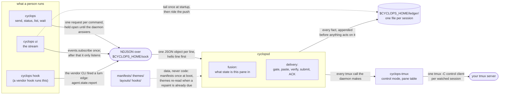

# I have to work on this Monday

A map, not a summary. Where things live, where to start reading for the
job you have been handed, and which decisions were deliberate so you do not
spend a day undoing one.

Cyclops coordinates terminal coding agents that are already running in your
tmux session. It watches panes, works out whether each agent is idle,
working or blocked, delivers messages between them by typing into the right
pane at the right moment, and writes every fact to an append-only file you
can read months later.

## The shape



One daemon. One `tmux -C` control client per watched session. Clients never
poll: they subscribe and the daemon pushes.

## Who owns what

The second column is the useful one. Most wrong changes on this codebase
are a rule implemented in a crate that should not have known about it.

| Crate | Owns | Does NOT own |
|---|---|---|
| `cyclops-proto` | Wire types, ledger schema, the delivery state machine, the agent state model, the attention rule (what needs a human), scratch paths | Any IO. It does not know tmux exists, and it renders nothing |
| `cyclops-manifest` | Manifest TOML schema, compiled rules, region parsing, priority evaluation | Deciding a pane's state (that is fusion), reading panes, hot reload (the daemon's job) |
| `cyclops-tmux` | **Every tmux invocation in the product.** Control mode, reply correlation, flow control, the zero-polling pane table, layout capture and apply, focus | What an agent is. It has never heard of manifests, deliveries, or the ledger |
| `cyclops-ledger` | Append, fsync, monotonic seq, torn-tail sealing, the cursor reader | What a line MEANS. The schema is `cyclops-proto`'s |
| `cyclops-theme` | The semantic token vocabulary, the state-to-group mapping, theme files, selection, the reload rule | Painting. It resolves a token to a color; renderers turn colors into escape sequences |
| `cyclopsd` | The daemon: fusion, the delivery pipeline, the socket server, sender identity, the adoption registry, pane border chrome, the hooks self-test, the ledger read side | tmux specifics (adapter), the wire schema (proto), the attention rule (proto). It renders exactly one string: the border format |
| `cyclops` | The CLI: a thin NDJSON client plus rendering on the shared grid | Business logic. `cyclops list` asks `status` for the roster rather than holding a second one |
| `cyclops-ui` | The stream: two views, filters, backfill, the terminal backend | The attention rule (reads proto), tmux (one focus helper in the adapter) |
| `cyclops-testrig` | The isolated tmux server and its teardown rule, in one place | Anything shipped. `publish = false`, test-only |

One honest exception to "every tmux invocation": `cyclopsd::probe_tmux`
spawns `tmux -V` once at boot to read the version. The parsing is
`cyclops_tmux::TmuxVersion`.

Data directories, none of them code paths: `manifests/` (per-CLI
detection), `hooks/` (vendor hook templates), `layouts/` (workspace
presets), `themes/` (palettes), `demos/` (runnable scenarios), `frontend/`
(the landing page, read-only branding reference, outside the Cargo
workspace).

`manifests/` and `layouts/` are also compiled into the `cyclops` binary
with `include_str!`, so a fresh install works before it has any files.
`cyclops start` writes them into the home and never overwrites what is
there, because an edited manifest is worth more than the shipped guess.

## Where to start reading

### Build and run it

[install.md](install.md), then `cargo build`. To see the whole system work
without wiring up a real agent, run a demo: it builds its own tmux server,
its own home, and cleans both up.

```bash
./demos/m1-send.sh
```

Then [QUICKSTART.md](QUICKSTART.md) for the two-agent walk with your own
CLIs. Development loop and gates: [CONTRIBUTING.md](CONTRIBUTING.md).

### Explain how a message becomes a verified receipt

The most valuable thing to understand, and the thing every other question
leads back to. Read in this order:

1. [DELIVERY.md](DELIVERY.md). The spec, and short.
2. `crates/cyclops-proto/src/ledger.rs`, `DeliveryState::can_transition_to`. The
   legal moves are a table you can read in a minute; everything below is a
   drive through it.
3. `crates/cyclopsd/src/delivery.rs`, in call order: `msg_send` -> `worker_for` ->
   `worker_loop` -> `process` -> `gate` -> `attempt_delivery` -> `inject`
   -> `await_ack` -> `receipt_of`.
4. The two diagrams in [ARCHITECTURE.md](ARCHITECTURE.md): the gate's eight
   ordered checks, and send-to-receipt.

The one idea to take away is that **verified** and **delivered** are not
the same claim, and the receipt never blurs them:

- **Tier 1, verified.** The agent's own vendor hook fires and runs
  `cyclops hook`, which posts `agent.state.report` carrying the message id.
  Match inside the ACK window: `delivered_verified`, `verified_by: hook`.
  The agent itself said it received this.
- **Tier 2, unverified.** No hook, or the hook was late: Cyclops looks at
  the screen instead. The marker left the composer and the turn started, so
  the message went in: `delivered_unverified`, `verified_by: screen`. That
  is inference, and the badge says so with a hollow check.
- A late hook ACK **upgrades** tier 2 to tier 1. It is the only legal
  transition out of a delivered state, and it exists so a receipt is never
  more confident than the evidence and never less.

Then run the demo and read what it actually wrote:

```
$ ./demos/m1-send.sh
== cyclops send implementer (watch the paste land)
✓ delivered · unverified (screen)

== ledger state lines (every delivery transition, causes never screens)
{"seq":8,"id":"m-b90b2a","to":"implementer","from":"queued","to_state":"gating","cause":null}
{"seq":10,"id":"m-b90b2a","to":"implementer","from":"gating","to_state":"pasting","cause":null}
{"seq":11,"id":"m-b90b2a","to":"implementer","from":"pasting","to_state":"staged","cause":null}
{"seq":12,"id":"m-b90b2a","to":"implementer","from":"staged","to_state":"submitted","cause":null}
{"seq":13,"id":"m-b90b2a","to":"implementer","from":"submitted","to_state":"delivered_unverified","cause":"screen_evidence"}
```

Those panes run `cat`, not an agent, so there is no hook and the demo lands
on tier 2 every time. That is the honest floor, not a failure.

### Add support for a new agent CLI

It is one TOML file and no code. [MANIFESTS.md](MANIFESTS.md) is the page;
`manifests/codex.toml` is the closest thing to a template.

Know which copy of the file your daemon is actually reading. With no
`manifest_dir` in the config it takes `$CYCLOPS_HOME/manifests` if that
directory exists, and only otherwise `./manifests` relative to where
`cyclopsd` was started. The home copy is seeded from the binary on the
first `cyclops start` and never overwritten after that, so once you have a
home, editing the repo's `manifests/` changes what a fresh install gets and
nothing you are running.

What you have to fill in, and where each part is used:

- `[agent] process_names` binds the file to a pane by its foreground
  command. If the CLI installs as a versioned symlink, add
  `argv_basenames` too, because the kernel reports the resolved name and
  the match silently never fires (F21).
- `[[rule]]` blocks read state off the pane title or the screen, by
  priority. Titles are cheap and screens are evidence of last resort, so a
  title rule that decides means the screen is never captured.
- `[injection] verify_pattern` must contain `<message_id>`. That
  substitution is what proves the composer staged **this** message rather
  than residue from an earlier one.
- `[hooks] ack` if the CLI can run hooks. Declare nothing and the agent is
  a tier-2 agent, which works.

Prove it with fixtures, not by eye: put real captures in
`crates/cyclops-manifest/tests/fixtures/` and add them to
`crates/cyclops-manifest/tests/shipped_rules.rs`. Then check it live with
`cyclops list` and pin it
if binding is ambiguous: `cyclops name %3 reviewer --manifest <id>`.

Do not add Rust. The schema has grown twice in its life and both times a
measurement forced it (F19, F21). If you are convinced it needs to grow a
third time, that is a finding first and a schema change second.

### Debug a delivery that is stuck

[troubleshooting.md](troubleshooting.md) covers the symptoms a user sees.
When you need to go deeper, **the ledger is the debugger.** Every gate
decision is a line, and every line carries the cause.

```bash
jq -c 'select(.id == "m-b90b2a")' ~/.cyclops/ledger/main.ndjson
```

Read the last state line first, then the gate lines above it. The cause
tells you where to look:

| Cause | It means | Look at |
|---|---|---|
| `no_such_pane`, `pane_dead`, `session_detached` | The target is not there | The pane table: `cyclops status` |
| `pane_in_mode`, `working`, `idle_with_input`, `blocked:<rule id>`, `blocked_quota` | The gate is holding on purpose | Fusion: is the state right? `cyclops read <pane>` |
| `no_manifest` | Nothing bound to the pane | The manifest's `process_names` versus what the pane is actually running |
| `verify_failed` | The paste did not stage | The manifest's `verify_pattern`, and whether the composer is where you think |
| `pane_rebound` | The occupant changed between admit and inject | Something restarted in that pane. Working as intended |

The thing to internalize: **a hold is waiting on an event, never on a
clock.** So "it is stuck" is always the question "which event never
arrived", and the answer is upstream of delivery, in fusion or the watcher.
A delivery that holds for longer than `gate_hold_notify_ms` pings the admin
once, so a wedged hold is at least visible in the stream.

Two floors to know before you chase a ghost. tmux evaluates format
subscriptions on a 1Hz tick, so a state that appeared and vanished inside
one second was never visible to Cyclops at all (F23). And on tier-2 agents
there is no hook edge, so timing evidence is screen evidence.

### Know which invariants not to break

[INVARIANTS.md](INVARIANTS.md). Eleven rules, each with the real-world
damage and the line of code that stops it. If you are touching delivery,
read rules 1 to 5 before you write anything.

## Decisions, and what was rejected

ADR-001 is the formal record. It lives in the separate `cyclops-arch`
design repo, not in this clone, and you do not need it: this section is the
part a newcomer does need, which is what was deliberately NOT done, so you
do not "fix" it.

### tmux control mode, not hosting PTYs

**Chosen:** one `tmux -C` control-mode client per watched session. Cyclops
is a guest in a tmux server it does not own.

**Rejected:** an own-PTY server (ADR-001 option B). Cyclops forks and owns
every agent PTY, embeds a terminal emulator, and ships its own attach
clients. tmux is eliminated and you control everything.

**Why:** the cost was bounded with real numbers rather than argued. zmx
does PTY persistence ALONE in 7.4k lines of Zig; herdr does the full job in
around 206k lines of Rust, with a vendored VT engine, a patched pty crate,
and a funded full-time maintainer. That option scored 3.40 against the
tmux-backed design's 4.15, and it was killed by implementation cost and by
having to rebuild observability tmux already provides. The agents are also
already running in the user's tmux, with their config, keybindings,
scrollback and detach habits, so option B asks people to move house first.
GOALS lists PTY hosting as an anti-goal.

**What it costs, honestly:** everything tmux does oddly is now yours to
work around, and a lot of `findings.md` is that tax. Control-mode lines are
not UTF-8 (F22). tmux sanitizes replies for non-UTF-8 clients (F14). Format
subscriptions tick at 1Hz (F23). A per-pane subscription can never report
that pane's death (F25). The mitigation is that all of it is confined to
one adapter crate, and an advisory CI job builds tmux master so the next
surprise arrives as a warning rather than a bug report.

### Manifests are data files

**Chosen:** everything Cyclops knows about a vendor TUI is TOML, and
unknown keys are tolerated so authors can keep their evidence next to the
rule.

**Rejected:** a Rust module or a trait implementation per CLI.

**Why:** vendor CLIs change without notice, and a quirk in code means a
review, a build and a release before anyone can send a message again. A
quirk in a manifest is a text edit on the machine that has the problem.
Adding an agent is also the most common thing a user will ever do to this
system, and it should not require a compiler.

**What it costs:** the schema has to be expressive enough, which it was not
twice (F19, F21). Both times the fix was one more declarative field, not an
escape hatch into code.

### The ledger is append-only NDJSON

**Chosen:** one file per session, one JSON object per line, appended and
fsynced, never rewritten. Corrections are new lines.

**Rejected:** any store that updates a record in place. The pattern was
taken from cmux's `events.jsonl` rather than invented.

**Why:** the record is the product. It has to be readable with `less` and
queryable with `jq` by a person who has never heard of Cyclops, months
after the fact, possibly out of a bug report attachment. It has to survive
a crash mid-write, which append-only gets nearly for free: a torn final
line is sealed with a newline on the next open and skipped by readers, and
nothing acknowledged is ever lost. And an audit you can edit is not an
audit.

**Measured, so it is not a guess:** no index is needed. A 10,000-line scan
takes 7.3ms, which is why `msg.history` is a scan and not a database.

**What it costs:** no queries beyond a scan, and paging across several
session files needs an opaque composite cursor rather than an offset.

### Zero polling

**Chosen:** state changes arrive as control-mode notifications and
subscription pushes; reconciliation is triggered by an event or a request.
One 30ms debounce, and one-shot timers inside a live delivery.

**Rejected:** a 1Hz reconcile loop, which is the obvious design and would
have been simpler.

**Why:** idle CPU near zero is a hard goal, and this runs on laptops beside
agents that are already expensive. The deeper reason is that a poll hides a
broken event path: if a loop eventually notices what a subscription should
have pushed, the mechanism carrying every sub-second guarantee can be dead
and everything still looks fine.

**What it costs:** every new state source needs an edge, and sometimes tmux
does not have one, in which case you find another (F25: a per-pane
subscription cannot report a pane's death, so Cyclops arms an all-panes one
instead). You also inherit tmux's own 1Hz resolution ceiling and cannot
poll around it (F23).

### The pane title is a sensor, so Cyclops never writes it

**Chosen:** an adopted pane's name and state go on its tmux **border**.

**Rejected:** writing `role • state` into the pane title, which the brief
originally asked for.

**Why:** two of the three shipped manifests read `#{pane_title}` as a
sensor, and Claude's spinner rules ARE the title tier. Writing the title
would blind detection to paint decoration, feed Cyclops's own decoration
back into its own sensor (F13), and lose the race to any agent that
publishes its own title anyway (F23, F26). The border already displays the
title by default, so replacing the border FORMAT replaces the view without
touching the value underneath.

If you are about to add title writing because the brief mentions it: this
is why it is not there.

### The one trait with one implementation is deliberate

**Chosen:** delivery reaches a pane through an `Injector` seam (paste,
submit, capture). `TmuxInjector` is the only implementation.

**Rejected:** inlining it, which STYLE would otherwise ask for. Two call
sites do not need a trait.

**Why:** it is the escape lane. ADR-001 scored a sixth option, driving each
agent headless behind its vendor protocol (Claude stream-json, Codex
app-server JSON-RPC, Gemini ACP), and it was the only candidate with
contract-grade delivery semantics and no screen scraping at all. It lost
because it discards the native TUIs the operator watches and one of the
three protocols did not exist yet, and it was kept as the designated route
if TUI injection ever becomes untenable. The seam is what makes that a
per-agent backend swap rather than a rewrite: the gate, the verification
and the ACK tiers call through it and nothing else.

So this is the one place where a single implementation earns an
abstraction, and it is the one place a tidying pass would remove it.

## Corrections this build made

Three things were got wrong first and fixed afterwards. They are here
because each one is a mistake that is easy to make again, and because
"why is it like this" is answered better by the wrong version than by the
right one.

### State color was deleted on a misreading

GOALS says: *exactly two encodings carry meaning, role color and state
glyph; never color alone, states pair glyph + word.* That asks for color to
be **redundant** with the glyph and the word. It was read as "states are
never colored", and all six `state.*` and five `badge.*` tokens were
deleted from the vocabulary. A whole milestone signed that off.

They are back, grouped by what a reader needs to know (healthy, needs-you,
terminal, quiet) rather than one hue per state, with role hues on the agent
name alone so the two encodings never share a cell. The test is unchanged
in spirit: with color off, nothing is lost, and that is asserted rather
than assumed.

The general shape of the mistake: **"never X alone" means X plus something
else, not no X.** It is worth a second read whenever a rule is phrased as a
prohibition.

### The attention rule lived in four files

"What needs a human right now" was implemented in the daemon, in the
status renderer, in the stream's calm view, and in the eye. Every copy was
correct on its own and every test was green. Only two surfaces read side by
side disagreed, which is how a closed eye came to sit over a row saying
action was required.

It now has one owner, `crates/cyclops-proto/src/attention.rs`, and no
surface recomputes it. That file is also where the rule's third clause
lives: because the record appends and does not retract, an alarm that ends
gets a second line under it rather than having the first one removed.

The lesson is the general one: a rule with two implementations is a rule
with two answers, and behavior tests cannot find that, because each answer
is self-consistent.

### A guard was asked to prove something undecidable

The obvious follow-up to the previous correction was a static test that
catches ANY second implementation of the attention rule. Two review rounds
were spent demanding it. It cannot exist: deciding whether two pieces of
code compute the same predicate is semantic equivalence, and no scan over
source text decides that. A verifier eventually defeated the guard with a
duplicate that named no state at all, with every gate green.

What shipped instead is a **tripwire** that says in its own header what it
cannot see. `crates/cyclops-proto/tests/one_place.rs` catches the four
common shapes of a copied predicate, and states plainly that a green run
means "no file matched a shape below" and never "no second
implementation". Review is named as the real defence.

Keep that honesty if you touch it. A guard that claims more than it can do
is worse than no guard, because people stop looking.

The related process note, worth one line: the reviewers who caught real
defects on this codebase were the ones who wrote probes and ran them. The
one who read code signed off on a lying attention indicator twice.
STATUS.md has the longer version under "Lessons from M3".

## What is deliberately not built

`STATUS.md` keeps the current backlog, risks, and known floors, and it is
maintained. Two worth knowing on day one because they look like bugs:

- **A quota park has no re-queue verb.** It is terminal in the record and
  an operator sends again after the reset. That is rule 4, not an
  oversight.
- **`cyclops start` cannot tell two same-shaped arrangements apart** when
  the daemon holds no names for the session. Naming one pane closes it.
  Grid topology alone genuinely cannot answer it.
