# Cyclops ideal messaging architecture and implementation audit

> Supporting design record. The approved
> [Messaging Refactor Charter](development/MESSAGING_REFACTOR_CHARTER.md)
> controls implementation when the documents differ.

Review date: 2026-08-29. The process for this review is found
[here](development/ARCHITECTURE_REVIEW_PROCESS.md).

This review asks what the correct system should be, then audits Cyclops against
that standard. The current implementation is evidence, not authority. Existing
modules, state machines, and documentation do not become desirable merely
because they already exist.

The optimal architecture below is derived independently from the user
journey, required guarantees, expected faults, local-machine operating model,
and cost of complexity. Only after defining that target does the review compare
the current code with it.

## Review method

The audit follows this order:

1. Define the outcome for agents and people without referring to the current implementation.
2. Derive the minimum guarantees needed to produce that outcome.
3. Compare plausible architectures, including simpler alternatives.
4. Define the ideal ownership, state, actions, traces, and failure semantics.
5. Inspect the current code and documentation against that independent model.
6. Preserve current machinery only when it earns its complexity through a required guarantee or demonstrated fault.

The second pass also used two independent reviews. Both were
asked to challenge this report rather than agree with it. Their agreement is review evidence, not proof.

This prevents two common review errors:

- assuming the present architecture is optimal because it is implemented, and
- assuming a theoretically powerful architecture is better even when its solution friction exceeds the problem it solves.

For a short reading path, read:

1. **Executive decision**
2. **Domain design without architecture theater**
3. **Deep code review through the domain model**
4. **Findings and recommendations**
5. **Sequenced change plan**.

The intervening sections make the independent standard and its reasoning inspectable.

## Executive decision

The ideal Cyclops is a single-host message coordinator with optional human
notification, optional agent activation through replaceable host adapters, and
various human interfaces.

The clearest system rule is:

> One semantic messaging contract, one authoritative local coordinator, one
> native daemon protocol, and replaceable access and activation adapters.

CLI, a future MCP server, and human UIs may provide different interaction
styles. Agent-host adapters may start or resume a model turn. None may become a
second message system or source of truth.

Messaging must work when every UI and agent runner is absent. Activation may
consume a durable, body-free request, but acceptance must never wait for an
agent host to be running or reachable.

That conclusion is not based on the current code. It follows from the required outcomes:

- several independent processes must exchange messages safely,
- one user must be able to understand and recover the system,
- accepted work must survive process failure,
- terminal mutation is useful but unsafe as the authoritative record,
- the system normally operates on one machine and one tmux environment, and
- UI use must be optional.

A durable local coordinator is the smallest architecture that gives one owner for ordering, identity, persistence, subscriptions, and terminal-write coordination. Raw tmux alone cannot provide those guarantees.

**Why?** Direct multi-writer journal access would move coordination and recovery complexity into every client. A distributed broker would add deployment and operating cost without a current multi-host requirement.

The messaging system must stand on its own in four senses:

1. **Operationally:** agents can send, claim, wait, and reply without opening a Cyclops UI. This is true today.
2. **Architecturally:** messaging rules do not depend on rendering, layout, or workspace interaction. This needs work, and the client and UI seams need work.
3. **Build and release:** the daemon and headless client can build and be tested
   without either full-screen interface. This is not true today for the sole
   `cyclops` executable.
4. **Runtime:** an optional runner can start or resume an agent turn without
   making the mailbox depend on a pane, vendor CLI, or resident model process.
   This is not a current Cyclops contract.

The five highest-value changes to the current implementation are:

1. Enforce one shared message-frame size contract at every ingress and egress.
2. Correct the absolute human-input-safety claim to match what tmux can prove.
3. Consolidate daemon-client transport and separate pure presentation models from terminal, journal, and tmux IO.
4. Deepen one workspace-messaging module and make runtime observation report immutable facts, without splitting one atomic invariant across public interfaces.
5. Quarantine legacy delivery, clarify operator-only emergency authority,
   refresh equal-outcome measurements, and run bounded MCP identity and
   agent-host activation pilots before choosing either product surface.

These changes improve safety and understanding while reducing repeated code. They fit the repository's own rule: guards should answer a concrete failure, and an interface should hide enough implementation detail to earn its cost.

## Independent design standard

### 1. Reliability means useful progress with honest outcomes

A reliable system does not merely reject uncertain work. It helps the user make progress, preserves the facts it can prove, and says exactly what remains unknown.

- `accepted` means the durable mailbox record exists.
- `submitted` means a guarded terminal wake was submitted.
- `claimed` means the recipient retrieved the authoritative content.
- An ambiguous post-write outcome remains ambiguous.
- A raw-tmux emergency send is visible delivery only. It is not a Cyclops receipt, claim, replay fact, or completion proof.

### 2. Human experience is a correctness property

Wrong-pane delivery, overwriting a person's input, unexplained waiting, stale state presented as live state, and a message accepted by one official interface but unreadable by another are correctness defects. They are not cosmetic defects.

Tmux injection cannot prove that nobody begins typing between the final composer observation and the paste command. The correct contract is that Cyclops writes only after fresh positive evidence and makes the irreducible race small and observable. Absolute non-interference would require a cooperative endpoint protocol that owns the composer interaction.

### 3. Complexity must be earned by a real failure

Complexity is justified only when it protects a required guarantee from a credible fault. Persistence cuts, stable identity, recipient ordering, resource bounds, and honest write uncertainty have such faults. A distributed event broker, automatic retry after ambiguous writes, generic transactions, fleet-wide mesh routing, or an unmeasured index do not currently have them.

### 4. Modularity is about knowledge, not file count

A good module lets an engineer answer a product question in one place. A bad extraction moves lines without reducing what callers must understand.

The desired test for every refactor is:

> What knowledge can the caller delete after this module exists?

### 5. The UI is optional, but the product can still feel integrated

One clear front door is good user experience. Operational independence does not require immediately shipping many executables. First establish a deep headless client module and clean build seams. Split packaging only where it improves failure isolation, installation, or testing.

### 6. A normal feature should have one obvious home

Adding a feature should not feel like editing a machine while it is running. A well-shaped change has one domain home, crosses deliberate seams, and gains a regression test at a stable interface. It should not require an engineer to understand the daemon state bag, journal projection, runtime observer, delivery worker, socket protocol, and UI at once.

The architecture therefore has a practical change test:

1. Can an engineer name the domain that owns the behavior?
2. Can the rule be tested without booting tmux or a full-screen UI?
3. Do callers depend on the result rather than the implementation's maps, locks, and state sequence?
4. Does the change touch only the owning module and explicit syncs?
5. Can a newcomer predict the files involved before searching the repository?

If ordinary feature work repeatedly fails this test, the system is not modular even if its files and types have architectural names.

### 7. Messaging, notification, activation, and execution are different facts

A durable message can exist while its recipient process is absent. A human
notification can be visible without starting a model turn. An activation can
be accepted by an agent host before the agent claims the message.

Execution belongs to the vendor runtime. Observation reports what Cyclops can
prove about that runtime. None of these facts may silently stand in for claim,
reply, completion, or durable acceptance.

This distinction matters because a background process can receive mail after a
model turn ends, but cannot re-enter that turn without a host-supported queue,
resume, streaming-input, or control interface.

### 8. Hiding a view must not hide the system

A person may want only the agent CLI panes. Closing the sidebar or Messages
pane must not stop messaging, force a different transport, or erase the path
back to unread work.

The full message view is optional. A bounded sender-authored preview, compact
state cue, attachable host transcript, or explicit inbox command can preserve
orientation without making the full message body another UI's state.

No view should open itself merely because mail arrived. If a chosen host and
visibility mode cannot show a message without also starting a model turn, the
product must state that limitation instead of coupling the two silently.

## Required outcomes and non-goals

### Required outcomes

An ideal implementation must provide these outcomes regardless of its internal
shape:

| Outcome | Required behavior |
|---|---|
| Understandable send | The sender knows whether content was durably accepted, rejected before acceptance, or may have an uncertain external effect |
| Correct recipient | Stable identity prevents a recycled or renamed pane from silently receiving another agent's work |
| No invisible loss | Accepted content survives daemon and client restart and remains claimable |
| No silent duplication | A client can safely retry durable submission with an idempotency key |
| Recipient autonomy | A recipient may claim and reply without a full-screen UI |
| Human input safety | Automated notification does not casually overwrite a person or another agent composing text |
| Honest wake status | A terminal notification is never presented as proof that content was claimed or understood |
| Recoverable observation | A missed event cannot make durable truth permanently invisible |
| Bounded operation | Frames, queues, history reads, and retained state have defined overload behavior |
| Inspectable failure | An operator can distinguish unavailable, slow, blocked, stale, ambiguous, and corrupt states and see a recovery action |
| UI independence | Messaging continues when every interactive Cyclops UI is closed or broken |
| Pane-only comprehension | A user who hides messaging chrome can still tell that relevant work arrived, who sent it, and how to inspect it without the UI reopening itself |
| Activation independence | Messaging remains correct with no runner; an enabled runner may start one bounded turn through a host adapter without reading the message body as another agent |
| Controllable background work | Automatic activation is opt-in, visible, bounded per recipient, pausable, and honest about host acceptance, approval waits, cancellation, and unknown outcomes |
| Changeability | UI, terminal integration, storage representation, and notification policy can change without rewriting mailbox semantics |

### Non-goals until evidence changes them

- Cross-machine delivery
- Internet-facing messaging
- Arbitrary event topics
- Exactly-once terminal mutation
- Fully automated recovery from every uncertain external side effect
- Global ordering across unrelated recipients
- Infinite retained history at constant cost
- Replacing tmux as a terminal multiplexer
- A model that consumes tokens while waiting for work
- Automatic activation for every message or a generic workflow engine

These are not claims that the capabilities are never useful. They are explicit
limits on present complexity.

## Architecture alternatives considered from first principles

### Alternative A: raw tmux as the messaging system

**Advantages:** minimal setup, very low command latency, no daemon dependency,
and a direct escape hatch familiar to terminal users.

**Fails the target:** no durable acceptance, authenticated sender, stable
recipient ownership, claim, reply, replay, mailbox order, or honest distinction
between text submission and retrieval. It can overwrite active input and its
success signal only means tmux accepted a command.

**Decision:** retain as an explicit emergency mechanism, not the normal message
system.

### Alternative B: every client appends directly to a journal

**Advantages:** no persistent coordinator process and a potentially small
implementation.

**Fails the target at realistic concurrency:** every client must learn file
locking, identity, ordering, notification scheduling, subscriber wakeup,
schema migration, crash cuts, and retry semantics. The apparent simplicity
moves the hardest implementation into all clients and creates a shallow
storage interface with low locality.

**Decision:** reject for normal messaging.

### Alternative C: one local durable coordinator

**Advantages:** one authoritative writer, one place for identity and ordering,
simple client interfaces, cheap local IPC, event-driven observation, and clean
replay after a crash.

**Costs:** the coordinator is a local availability dependency and must have
clear health, restart, bounded input, and emergency behavior.

**Decision:** preferred. The persistent process is justified by ownership and
recovery, not by a claim that it beats raw tmux command latency.

### Alternative D: embedded database or external broker

An embedded transactional database could eventually improve indexing,
retention, and concurrent queries. An external broker could eventually support
multiple hosts and independent consumers. Neither is justified by current
requirements. Both add migration, administration, failure, and debugging modes.

**Decision:** do not adopt without measurements showing that the append-only
journal or single-host coordinator cannot meet a real workload.

## Domain design without architecture theater

DDD is useful here as a discipline for language and responsibility. It is not
a reason to add factories, generic repositories, command buses, an event bus,
one crate per noun, or a database per domain. Cyclops should remain a modular
monolith unless measurements or deployment needs prove otherwise.

The software-design notes referenced by `UNIFIED-CONTEXT.md` sharpen the DDD
idea into a practical concept test. A concept should have:

- a name people actually use,
- a user-facing purpose,
- one representative operational story,
- state it owns,
- actions that preserve its invariants, and
- an interface that does not expose its internal representation.

Two concepts should not call into each other's internal behavior, read each
other's maps, or share mutable composite objects. Their relationship should be
written as an explicit sync: when one fact occurs under stated conditions,
invoke one action in another concept. This keeps domain behavior local and
cause-and-effect visible.

### The house or room test

The simplest useful mental model is a house. This is an explanation aid, not a
rule that every concept must become a separate module.

- Each room has a recognizable purpose. The kitchen prepares food; the
  bathroom supports personal hygiene; the living room supports shared rest and
  entertainment.
- Some responsibilities overlap deliberately. A coffee table may hold food,
  but the living room does not store the toilet paper or own the plumbing.
- A doorway connects rooms without merging them. Crossing it is visible.
- The house plan knows where every room is. A room does not contain a mutable
  copy of the whole house.

Applied to code, a domain room owns its purpose, state, actions, and invariants.
An explicit sync is the doorway. Stable identifiers and immutable facts can
cross the doorway. Internal maps, locks, worker registries, and mutable state
machines should not.

The test for every field and method is:

> Which room owns this fact, and why would an engineer looking for this
> behavior expect to find it here?

If the honest answer is "because this type already had access to everything,"
the responsibility is misplaced. Some overlap is healthy; reach-through is
not.

### Proposed ubiquitous language

The following terms should be the small, canonical vocabulary for new code,
tests, protocol documentation, UI copy, and architecture discussion.

| Term | Canonical meaning | Common confusion to reject |
|---|---|---|
| Endpoint | An addressable participant known to Cyclops | A tmux pane number by itself |
| Recipient key | Durable identity of one exact recipient generation | Display label, pane title, or current route |
| Route | Current terminal location for a recipient | Durable identity |
| Message | Immutable accepted content and sender intent | Terminal text or delivery attempt |
| Mailbox entry | One recipient's ordered ownership and claim state for a message | A duplicate message body |
| Claim | Authoritative retrieval of a mailbox entry by its recipient | Notification, terminal visibility, or comprehension |
| Thread | Message ancestry rooted in durable message IDs | A UI-only grouping |
| Message preview | Bounded sender-authored orientation shown outside the authenticated body | The authoritative body, a receipt, or proof that the agent saw it |
| Notification attempt | Optional effort to attract human attention to pending work | Agent activation, message delivery, or claim |
| Activation attempt | Optional effort to start or resume one agent turn for a pending mailbox entry | Message acceptance, claim, reply, or completion |
| Agent host | The vendor CLI process, session supervisor, or protocol endpoint that can run a model turn | Cyclops identity or mailbox ownership |
| Agent-host adapter | One implementation of the activation interface for a real host control path | A second messaging protocol |
| Terminal effect | A write submitted to tmux or another terminal mechanism | Durable acceptance |
| Observation | Time-scoped evidence about a live runtime or pane | Durable truth |
| Attention item | A durable or derived condition requiring human judgment | Every unread message |
| Projection | A reconstructable view of durable facts | A second source of truth |
| Sync | An explicit rule connecting a fact in one domain to an action in another | An open-ended event bus |
| Emergency send | Direct operator-chosen terminal text outside Cyclops guarantees | A successful Cyclops message |

Naming is architecture. If the same word means durable acceptance in one file,
terminal submission in another, and UI visibility in a third, engineers cannot
reason about correctness even when every individual function is sound.

### Proposed domain rooms

These domains are conceptual ownership. They do not require separate
processes, databases, crates, or locks.

They also do not require separate public interfaces. Messaging, Notification,
Activation, and Attention may share atomic transitions and one durable
projection. The default target keeps their durable policy inside one deep
workspace-messaging module.

Host execution is different. It belongs behind an optional runner and an
agent-host adapter seam because Codex, Claude, Gemini, and terminal input expose
real, different control paths.

#### Directory and identity

**Purpose:** let a sender address the intended participant despite display-name
changes, pane reuse, process restart, and workspace movement.

**Operational story:** an endpoint is adopted, receives a durable recipient
key, acquires a current route, and can later be resolved from a user-facing
label without treating that label as identity.

**Owned state:** recipient keys, endpoint names, live routes, route generation,
adoption state, and observation freshness needed for resolution.

**Actions:** adopt, register route, rename, retire, resolve, and report current
directory facts.

**Invariant:** a reused or stale route cannot silently become the durable
recipient named by an older message.

**Does not own:** message content, claims, notification attempts, terminal
writes, or rendering.

#### Messaging

**Purpose:** provide durable, ordered, retry-safe exchange among participants.

**Operational story:** a sender submits content with an idempotency key;
Cyclops durably accepts one immutable message, creates ordered mailbox entries,
and later lets each exact recipient claim and reply.

**Owned state:** messages, mailbox entries, recipient order, idempotency,
claims, supersession, and thread ancestry.

**Actions:** accept, claim, reply, supersede, read mailbox, and read thread.

**Invariant:** accepted content remains reconstructable and one recipient's
claim cannot consume another recipient's entry.

**Does not own:** whether a pane is writable, how attention is rendered, tmux
submission, or runtime detection.

#### Notification

**Purpose:** attract human attention to pending or blocked work without
redefining message truth or silently starting model work.

**Operational story:** an accepted message or blocked activation may create one
attention request. A pane preview, compact cue, sound, or full view may present
it. Dismissal or recovery settles the request without changing mailbox truth.

**Owned state:** notification intent, bounded preview, visibility state,
dismissal, and the durable link to the message or condition that caused it.

**Actions:** request, present, dismiss, withdraw, and resolve.

**Invariant:** notification visibility never proves that an agent started,
claimed, understood, replied, or completed work.

**Does not own:** message bodies, mailbox order, agent-host control, model
execution, pane detection, or UI layout.

Current Cyclops calls its guarded terminal prompt a notification even though
submitting that prompt may start a model turn. The current name describes the
implementation. The target architecture classifies that submitted effect as
agent activation.

#### Agent activation

**Purpose:** optionally turn pending durable work into one bounded model turn
without making messaging depend on a vendor CLI, pane, or resident model.

**Operational story:** a recipient opts into automatic activation. After
acceptance, a sleeping runner receives a body-free request and asks the exact
agent host to start or resume one turn with the message ID and claim path.

The agent claims the body through Cyclops under its own authenticated identity.
The runner never reads private content as the recipient and never treats host
acceptance as claim or completion.

**Owned state:** recipient activation policy, durable requests, attempts,
target host generation, requested effect, and explicit host outcomes.

**Actions:** request, acquire, start, mark accepted, mark unknown, pause,
cancel, settle, and expose a need for human input.

**Invariant:** a message remains accepted and claimable when activation is
disabled or fails. An unknown host effect is never automatically repeated.

**Does not own:** message content, mailbox order, thread law, vendor execution
internals, task completion, or presentation.

Activation remains smaller than workflow management. It schedules one turn; it
does not own task graphs, artifacts, dependencies, or a self-sustaining agent
conversation.

#### Runtime observation

**Purpose:** report what Cyclops currently knows about agents, panes, routes,
composer safety, and terminal readiness.

**Operational story:** tmux, hooks, manifests, and screen evidence change; the
observer fuses them into one time-scoped fact with provenance and freshness,
then publishes that fact without deciding downstream messaging behavior.

**Owned state:** evidence, fused runtime state, confidence, freshness, route
binding, and disagreement.

**Actions:** ingest evidence, recompute observation, publish change, mark
stale, and retire runtime state.

**Invariant:** an observation never claims more certainty or a longer lifetime
than its evidence supports.

**Does not own:** durable notification transitions, mailbox mutations,
acknowledgement settlement, attention resolution, or chrome repaint policy.

#### Attention and recovery

**Purpose:** make ambiguous or blocked work understandable and resolvable by a
human without inventing certainty.

**Operational story:** a notification cannot be settled automatically; an
attention item explains the exact attempt, evidence, safe actions, and expected
result; a chosen action records a durable resolution fact.

**Owned state:** operator resolution intent, accepted action, causally matched
consumption evidence, and clearance.

**Actions:** list, explain, resolve, confirm consumption, and clear.

**Invariant:** clearing presentation does not erase or rewrite the attempt it
acknowledges.

**Does not own:** the notification state machine, message truth, terminal
observation, or rendering.

This may remain a closely associated module beside Notification if splitting
it would weaken transaction locality. The important separation is conceptual:
operator judgment is not another notification transport state.

### Mechanisms are not domains

The following are implementation mechanisms and adapters, not domain rooms:

- append-only journal and replay,
- Unix socket and NDJSON framing,
- tmux control mode and command execution,
- broadcast invalidations,
- blocking and async client adapters,
- vendor session supervisors, queue interfaces, streaming input, and ACP,
- terminal rendering,
- workspace layout, and
- benchmark harnesses.

They should support domain interfaces without naming policy. For example, the
journal can atomically persist Messaging and Notification facts while neither
domain knows NDJSON paths or file handles.

### Explicit syncs between the rooms

Cyclops does need cross-domain behavior. It should be stated once as visible
cause and effect instead of being distributed across route handlers and
recompute functions.

| When | Where | Then |
|---|---|---|
| A send command carries user-facing recipients | Directory resolves every recipient to an exact durable key | Messaging accepts one message and its mailbox entries |
| Messaging commits an accepted message with human notification requested | Notification has no current request for that recipient entry | Notification creates one attention request |
| Messaging commits an accepted message with automatic activation enabled | No activation exists for that recipient entry | Activation creates one durable, body-free request |
| An activation runner acquires a request | The exact recipient and host generation still match and no turn is already active | The matching agent-host adapter requests one bounded turn |
| An agent host accepts or ambiguously applies a request | The result belongs to the exact activation attempt | Activation records accepted or unknown and never silently equates either with claim |
| The exact agent claims the message | An activation attempt exists for the same mailbox entry | Activation records retrieval while Messaging remains the owner of claim truth |
| Runtime observation reports an approval or human-input wait | The evidence matches the exact activated host generation | Attention exposes one explainable item without auto-approving it |
| Messaging commits a claim | Its activation has not crossed the host-effect cut | Activation withdraws the request in the same store transaction |
| Messaging commits a claim | Its activation has crossed the host-effect cut | Activation records retrieval without inventing execution completion |
| Runtime observation changes after a staged terminal effect | Evidence matches the exact activation and route generation | Activation settles or Attention records an unresolved condition |
| Activation becomes ambiguous or blocked | The condition requires judgment | Attention exposes one explainable item |
| An operator chooses a recovery action | The action is still valid for the exact attempt | Attention records intent before the terminal effect and later records its result |
| Any durable messaging fact commits | A UI or client subscriber may have a cached view | Publish a body-free invalidation hint |

This table is intentionally small. A generic event system would obscure these
rules and permit accidental fan-out. Plain Rust coordinator functions or typed
domain facts are enough.

### Independence does not forbid one transaction

Domain separation must not break atomic correctness. These decisions should
remain in one durable transaction where the invariant requires it:

- accepting a message and creating its mailbox entries,
- accepting a requested activation intent while keeping runner success outside
  the acceptance transaction,
- claiming an entry and withdrawing an activation that has not crossed the
  host-effect cut,
- recording terminal-write intent before executing the external effect, and
- accepting a recovery action before attempting its external effect.

One `WorkspaceMessagingStore` may hold the journal writer, replay projection,
and transaction lock. The domain modules supply decisions and apply facts
through a narrow interface. They do not each need a store, process, or lock.
This preserves correctness and locality while preventing the store from
becoming the place where all domain policy lives.

## Ideal architecture

The ideal conceptual model has six domain concepts and supporting mechanisms or
adapters. The diagram describes responsibility and information flow, not a
required crate or process graph.

The revised target groups transactionally coupled concepts behind one deep
`WorkspaceMessaging` interface. The `Explicit syncs` box represents the table
above, not a generic coordinator. Durable syncs remain local methods and
observation arrives as immutable input.

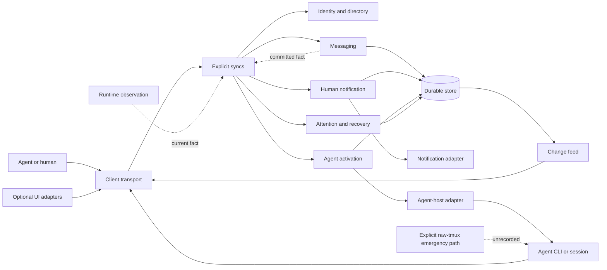

### 1. Identity and directory

**Purpose:** distinguish a stable agent endpoint from its display name,
current process, pane location, and presence.

**Interface:** discover addressable recipients, resolve a human-facing name to
an unambiguous stable identity, authenticate the caller, and expose freshness
without making presence a delivery guarantee.

**Required properties:**

- Display names may change without changing durable message ownership.
- Reused panes and restarted processes do not inherit another endpoint's work
  silently.
- Ambiguous names fail before acceptance.
- Presence, runtime activity, and write readiness are separate observations.
- A message records the stable identities resolved at acceptance.

Identity should remain smaller than a general presence platform. It exists to
make messaging safe and understandable.

### 2. Messaging

**Purpose:** own message identity, immutable content, recipients, per-recipient
order, claims, replies, and idempotent acceptance.

**Interface:** accept, inspect, claim, reply, and follow durable mailbox
progress. The caller should not know journal record variants, notification
states, tmux state, or UI projection rules.

**State owner:** Messaging is the only domain writer of message and mailbox
facts.

**Required properties:**

- Acceptance is atomic with durable storage.
- A repeated idempotency key with identical content returns the same result.
- A repeated key with different content fails visibly.
- Claim is authenticated, recipient-scoped, and idempotent.
- Per-recipient ordering is explicit; unrelated recipients need no global
  execution order.
- Message content is immutable after acceptance. Corrections are new messages
  or supersession facts.

### 3. Durable store

**Purpose:** preserve committed facts and reconstruct mailbox state.

**Interface:** append committed facts, replay valid facts, and read from a
durable cursor. Storage representation, sealing, compaction, and migration stay
inside the implementation.

**Required properties:**

- A success response is impossible before the commit point.
- A torn final write is recoverable without discarding prior valid facts.
- Mid-history corruption is visible rather than silently skipped.
- Schema evolution has an explicit compatibility rule.
- Retention, export, restore, and deletion have defined ownership before the
  product claims long-term durability.

An append-only journal is a good implementation while replay and memory remain
within measured budgets. It is not a permanent architectural requirement.

### 4. Notification coordinator

**Purpose:** decide whether and how to attract human attention without changing
durable acceptance or starting model work implicitly.

**Interface:** consume a durable attention request and current presentation
facts; produce a small request for a UI, sound, or other notification adapter.

**Required properties:**

- Notification is optional unless the sender explicitly requires it.
- It contains orientation and an exact path to relevant state, not private
  message content by default.
- A preview remains one bounded projection rather than a second body.
- Visibility is never claim, activation, comprehension, reply, or completion.
- A dismissed item remains reconstructable from its durable cause.
- Closing every UI does not delay acceptance, claim, reply, or activation.

Current guarded terminal submission belongs under Agent activation in the
target model because it can start a model turn. Existing implementation names
may remain during migration, but the semantic distinction must be explicit.

### 5. Agent activation

**Purpose:** optionally start or resume one bounded agent turn for a pending
mailbox entry without making acceptance depend on the agent host.

**Interface:** acquire a body-free request, target one exact host generation,
request one turn, and report rejected, not sent, accepted by host, or unknown
after send.

**Required properties:**

- Manual, notify-only, and automatic modes are explicit per recipient.
- The runner sleeps on an event-driven wait rather than polling.
- One active turn per recipient is the safe default; later work remains FIFO.
- The request carries a message ID and claim path, not the private body.
- The exact agent claims through normal process-derived authorization.
- Host acceptance is not claim, reply, or completion.
- Approval waits, cancellation, failure, and unknown outcomes are visible.
- An unknown external effect is never automatically repeated.
- Disabling or stopping the runner cannot damage mailbox truth.

The model is event-driven, not continuously thinking. No model consumes tokens
while the runner waits. A new turn begins only when policy and durable work
justify it.

### 6. Runtime observation

**Purpose:** fuse tmux, hook, manifest, process, and screen evidence into an
honest current fact about the exact endpoint and route generation.

**Interface:** ingest evidence and return a time-scoped observation with
provenance, freshness, and disagreement. It reports what is known; explicit
syncs decide what Messaging, Notification, Attention, or presentation should
do because of it.

Runtime observation must not persist notification transitions or directly run
recovery. This is the key separation that keeps new detection work from
becoming new messaging behavior accidentally.

### 7. Attention and recovery

**Purpose:** explain ambiguous or blocked work and record deliberate human
resolution without pretending the uncertainty disappeared.

**Interface:** list exact attention items, explain evidence and safe actions,
record action intent, and correlate resulting consumption evidence.

Attention is not the notification state machine and not the UI. It is the
domain meaning of a situation that requires judgment; any UI is one adapter
for inspecting and acting on it.

### 8. Agent-host adapter

**Purpose:** translate one activation request into the smallest control path a
real agent host supports.

**Interface:** resolve an exact host session, request one start or resume,
optionally observe explicit host state, request cancellation, and classify the
external effect without inventing certainty.

The tmux implementation must still inspect write readiness, perform one guarded
write, and distinguish pre-write failure from an uncertain post-write outcome.
Native queue, streaming-input, and ACP implementations avoid composer mutation
but introduce session, approval, cancellation, and reconnect rules.

The adapter must not own message acceptance, claims, retries, conversation
law, or activation policy. Multiple current host control paths make this a real
seam, but each implementation still needs a bounded contract probe before it
becomes production behavior.

### 9. Change feed

**Purpose:** let clients learn that state changed and recover authoritative
state without polling.

**Interface:** ephemeral invalidation subscription, bounded durable follow, and
authoritative snapshots.

**Required properties:**

- Durable messages never depend on subscribers being connected.
- Slow subscribers cannot block acceptance or delivery.
- A dropped subscriber can detect the gap and resynchronize.
- Events carry enough version information to reject stale projections.
- Cursor promises are either implemented or absent.

This is local pub-sub, but the event stream is not the message broker. The
durable mailbox remains authoritative.

### 10. Client transport

**Purpose:** give headless CLI and UI adapters one consistent way to invoke the
coordinator.

**Interface:** connect, authenticate the local peer, exchange bounded frames,
correlate requests, subscribe, and classify outcomes as rejected, not sent, or
unknown after send.

Blocking and async execution justify two adapters at this seam. Framing,
handshake, protocol versioning, and uncertainty semantics belong to the shared
implementation. UI policy and command-specific timeouts do not.

## Ideal success and failure traces

### Normal send, optional activation, and claim

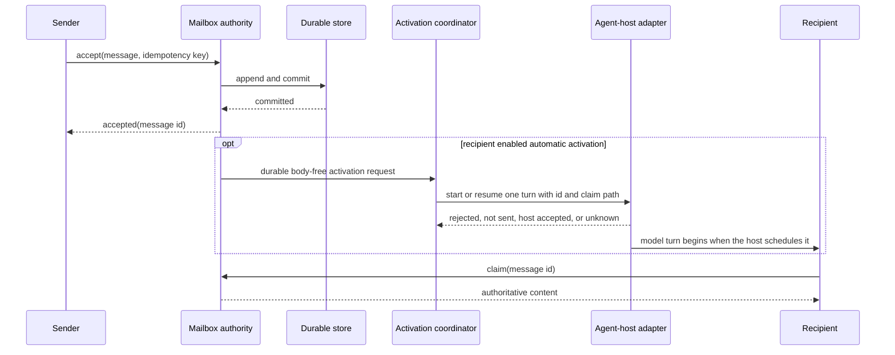

The sender may continue after durable acceptance. Activation and claim are
later milestones, not hidden parts of one overloaded success result. A manual
recipient can claim the same message with no runner or UI.

### Crash before commit

No acceptance is returned. The client may retry with the same idempotency key.
Replay finds no committed message.

### Crash after commit but before response

The client sees an unknown acceptance outcome and retries with the same key.
The mailbox returns the original accepted message rather than inserting a
duplicate.

### Agent-host effect outcome unknown

The durable message remains claimable. The activation is marked ambiguous. The
runner does not repeat a terminal write or native queue request automatically.
Status identifies the consequence and safe operator choices.

### Event subscriber falls behind

The subscriber disconnects or receives an explicit gap. It keeps its last
snapshot visibly stale, reconnects once, and loads a snapshot or durable follow
page. Durable messaging continues throughout.

### Coordinator unavailable

Normal clients report that durable messaging is unavailable and provide a
repair action. An operator may explicitly use raw tmux for urgent unrecorded
delivery. The emergency mechanism never creates synthetic mailbox facts.

## Ideal user experience contract

The default agent journey should require only five concepts and commands:

1. Discover a recipient.
2. Send and receive a durable acceptance result.
3. Wait without polling.
4. Claim exact content.
5. Reply in the same conversation.

Advanced terms such as notification attempts, barriers, composer recovery,
replay sealing, and adoption routes should appear only when they explain a
failure or recovery action.

Every user-visible result should answer:

- What happened?
- What is proven?
- What remains unknown?
- Does the user need to act?
- What exact action is safe?

The UI should add comprehension, not semantics. Closing it must not alter
message acceptance, delivery policy, claim state, recovery, or ordering.

Automatic activation should be an explicit recipient mode beside manual and
notify-only operation. The user must be able to pause it, inspect queued work,
attach to a host session, answer an approval, cancel a turn, or stop the runner.

The pane is one possible live view, not the transport or source of truth. A UI
may project accepted, activation requested, host accepted, waiting for user,
claimed, and replied, while preserving the distinction among them.

### Visibility without a messaging sidebar

The sidebar and Messages pane are lenses over one mailbox. They are not
required infrastructure, and new mail must never force either one open.

Cyclops should support a visibility ladder derived from the same durable facts:

| Layer | Purpose | Behavior when messaging chrome is hidden |
|---|---|---|
| Inline pane trace | Orient a person watching agent transcripts | Show sender, bounded preview, and exact claim path when the chosen activation adapter has a visible transcript |
| Compact cue | Show that something changed without consuming the canvas | Optional unread or attention mark and sound; selecting it opens an authorized snapshot |
| Full message view | Explore inboxes, threads, details, and recovery | Remains closed until the user opens it |
| Host session view | Inspect detached or background execution | Attach, peek, or read host events without making that host the mailbox |

These layers must not become separate queues. Body-free invalidation remains a
privacy-preserving hint. A client that wants a preview fetches an authorized
snapshot instead of receiving message content in a broadcast event.

Current host designs support this separation. Claude Code documents background
sessions that keep running without an attached terminal, with agent view and
attach as optional inspection paths. The
[Agent Client Protocol](https://github.com/agentclientprotocol/agent-client-protocol/blob/main/docs/protocol/v2/overview.mdx)
streams session updates to a client instead of prescribing one permanent UI.

MCP also leaves presentation to the client. Its
[logging contract](https://modelcontextprotocol.io/specification/2025-06-18/server/utilities/logging)
defines structured notifications but explicitly does not mandate a user
interaction model. A protocol event can enable visibility; it cannot prove
that a particular host actually displayed it.

Workspace chrome, human visibility, and agent activation are independent user
choices. The architecture should permit full, compact, and pane-only use;
notify-only or quiet attention; and manual or automatic activation.

That does not require a configuration matrix immediately. It requires code
not to assume that a hidden Messages pane means hidden messaging, that an
inline preview proves activation, or that a notification may start a model.

Some combinations depend on host capability. A terminal prompt can be both a
visible trace and an activation. It cannot implement notify-only mode without
starting the model. Native tmux with all Cyclops chrome hidden has no separate
place for a rich cue unless the user enables an external notification or a
host exposes a visible transcript.

The product should say this plainly. It should not reopen the sidebar, write
into a model prompt under a manual policy, or claim invisible background work
is human-visible.

## Ideal operability and performance contract

The coordinator should expose a small set of outcome-oriented measurements:

- acceptance latency and rate,
- oldest unclaimed message age,
- pending and ambiguous notification age,
- acceptance-to-activation-request and activation-request-to-host-acceptance
  latency,
- acceptance-to-claim and acceptance-to-useful-reply latency by host adapter,
- runner idle CPU, memory, wakeups, reconnects, and queued work,
- hidden-view notification-to-user-observation latency and missed-cue rate,
- subscriber gaps and resynchronization duration,
- replay duration and retained memory,
- wrong-target, duplicate, loss, and uncertain-outcome counts, and
- manual recovery actions.

Raw tmux and Cyclops must be compared at named milestones, not one headline
number. The system is optimal when it meets required correctness and user
journeys with the least mechanism and acceptable resource cost. Lowest command
latency alone is not the objective.

Operating values such as frame size, queue capacity, timeout, and retained
history must trace to a protocol constraint, measured workload, or explicit
provisional assumption. They must be observable and revisable.

## Ideal local security contract

Reliability does not substitute for authorization. A local socket is not
automatically trustworthy.

- The coordinator authenticates the kernel peer and rejects callers whose
  identity cannot be established for protected actions.
- Message bodies are visible only to the sender, intended recipient, or an
  explicitly authorized workspace administrator.
- Display names and caller-supplied pane IDs never authorize an action.
- Socket, journal, and configuration permissions follow least privilege.
- Body-free events do not leak message content.
- Administrative actions are distinct from ordinary agent messaging.
- Logs and status expose enough identifiers to diagnose delivery without
  copying full message bodies unnecessarily.

The current implementation has substantial same-user peer-credential and
recipient-scoped authorization machinery. The remaining audit question is not
whether checks exist, but whether the full installation path preserves socket
and journal permissions and whether the administrator scope matches the user's
privacy expectations. That deserves a focused security review rather than a
casual reliability claim.

## Current implementation model

Four durable or user-visible concepts explain most of Cyclops messaging:

| Concept | Meaning | What it does not prove |
|---|---|---|
| Message | Immutable durable content and sender intent | That a terminal wake occurred or a recipient read it |
| Mailbox entry | One recipient's ownership, order, and claim state | That text was safely written into a pane |
| Wake attempt | Current guarded terminal prompt that may start a recipient turn | That the body was claimed, understood, or acted on |
| Attention | An ambiguous or blocked wake requiring operator judgment | That the underlying message is lost |

The implementation is best understood as five cooperating modules and one
explicit emergency lane:

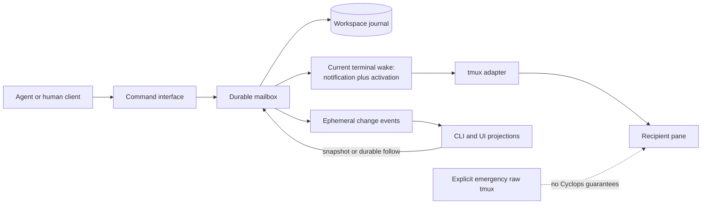

### Command interface

`msg.send`, `inbox.claim`, `msg.reply`, snapshots, status, and subscription are
request-response operations over local NDJSON. The socket is a transport, not
the source of truth.

### Durable mailbox

The append-only workspace journal owns acceptance, recipient order,
idempotency, claims, replies, notification intent, and recovery facts. Fsync
before acceptance, torn-tail handling, and strict replay are core guarantees.

### Notification decision and delivery

The daemon may wake a recipient when the pane is safely writable. Notification
is deliberately separate from mailbox acceptance. Its state distinctions
encode real crash cuts and should remain hidden behind a deep module.

This current path performs two target-domain jobs at once. It makes pending
work visible and submits a prompt that may start a model turn. That coupling is
why the target separates human notification from agent activation.

### Observation and pub-sub

The daemon publishes body-free `messages.changed` invalidations after a
committed change. A subscriber that falls behind is disconnected, then
recovers from a snapshot or durable `messages.follow` cursor. This is a good
local pub-sub design: the journal is truth and the event is a hint.

### Presentation

The CLI, stream UI, and workspace UI render projections and accept actions.
They should not own mailbox policy or storage topology.

The workspace defaults the Messages pane to hidden and supports collapsing the
left sidebar. Cyclops also documents native `tmux attach` as a supported path
with no Cyclops sidebar, tabs, Messages pane, or workspace controls.

The hidden state is not yet a complete visibility contract. A body-free
`messages.changed` event marks the Messages projection dirty, but refresh is
deferred while the pane is closed. The event does not produce a message cue,
the collapsed rail shows only its reopen control, and sounds report background
agent state changes rather than incoming mail.

The staged Format 4 line currently supplies the missing narrative:

```text
[cyclops from <sender>] <preview> | cyclops inbox claim <attempt>
```

That preview has a real user-experience purpose. It lets someone supervising
only agent panes see who sent work and how the recipient can retrieve it. The
design problem is that staging the line may also start a model turn, so the
same terminal effect currently acts as visibility and activation.

### Emergency lane

Raw tmux remains possible because Cyclops is a guest in tmux rather than the
owner of agent PTYs. It should be an explicit operator-controlled recovery
mechanism, never an automatic retry after an uncertain Cyclops outcome.

## User journeys the architecture must support

### Agent-only communication

1. An agent checks live Cyclops status.
2. It sends through the durable mailbox.
3. It receives durable acceptance.
4. It waits on the inbox without polling.
5. It claims the exact message and replies by canonical ID.

No full-screen UI is required. This is the primary proof that messaging stands
on its own.

### Opt-in background activation

1. An agent or user enables automatic activation for one exact recipient.
2. A runner blocks on a Cyclops event with no polling or model activity.
3. An accepted message creates one durable, body-free activation request.
4. The runner asks the matching host adapter to start or resume one turn.
5. The agent claims the body as itself, works, and replies through Cyclops.
6. The runner returns to its event wait after a terminal outcome.

The same mailbox remains usable when the runner is stopped. The user can attach
to the native session or inspect an optional projection, but neither is needed
for durable messaging.

### Human-supervised workspace

The same mailbox and daemon state feed the stream or workspace UI. Closing the
UI must not stop acceptance, ordering, notification, claiming, replying, or
recovery. The UI is a projection and control surface, not the messaging
runtime.

### Pane-only human supervision

1. The user closes the sidebar and Messages pane, or attaches with native tmux.
2. Messaging, ordering, activation policy, and recovery continue unchanged.
3. An enabled visibility path shows a bounded preview or compact cue without
   forcing the hidden view open.
4. The user can inspect the exact inbox entry or attach to the host session on
   demand.
5. The full Messages view opens only through an explicit user action.

With automatic terminal activation, the prompt transcript may provide the
inline trace. With manual activation, Cyclops must use a non-activating cue or
honestly require the user to inspect the inbox. It must not write a prompt just
to satisfy visibility.

### Daemon crash and restart

The journal replays committed facts. Ephemeral subscriptions reconnect and
resynchronize. No event must be needed to reconstruct truth.

### Confirmed daemon failure

The operator may choose an explicitly labeled raw-tmux emergency send to an
exact pane. Cyclops must not manufacture a receipt for it. Once Cyclops is
healthy, normal messaging resumes through the mailbox.

### Larger agent group

The human should not need to read every pane. The durable mailbox, ownership,
threading, body-free summaries, status, and attention views should show who
needs action and why. Scale should deepen these projections before it adds a
new transport topology.

## Current implementation audit against the ideal

Ratings are based on observed code and documented behavior at the reviewed
revision. **Unverified** means the architecture may be sound but lacks current
evidence for the claimed operating range.

| Ideal requirement | Rating | Audit judgment |
|---|---|---|
| Durable acceptance before success | Meets | Workspace facts are appended and synced before acceptance returns |
| Idempotent submission | Meets | Request digests distinguish a safe repeat from key reuse with changed content |
| Stable recipient identity | Meets | Workspace, pane, and process identity are explicit rather than inferred from display names alone |
| Mailbox independent of notification | Meets | Standard send acceptance does not require terminal wake unless explicitly requested |
| Absolute protection from concurrent typing | Fails as stated | The final composer observation and tmux paste cannot be atomic; current bookends reduce risk but cannot prove that no typing starts in the irreducible gap |
| Headless operation | Partial | CLI workflows operate without opening a UI, but the sole client executable still builds with UI dependencies |
| Bounded official message path | Fails | UI frames are capped, while daemon ingress, daemon egress, and CLI body reads are not consistently bounded |
| One client transport contract | Fails | CLI, stream UI, and workspace repeat handshake, framing, timeout, and uncertainty knowledge |
| Honest observation interfaces | Partial | Snapshot and follow recovery exist, but subscribe cursor replay is promised and ignored |
| UI as replaceable projection | Partial | UI code reads journal files and invokes tmux focus directly |
| Pane-only message visibility | Partial | The sender-authored terminal preview preserves orientation, but hidden message events produce no cue, the collapsed rail carries no unread state, and the preview is coupled to activation |
| Preview contract | Partial | A bounded sender-authored preview has a clear pane-only purpose; the exact two-sentence grammar has no measured usability justification |
| Notification versus activation separation | Fails conceptually | Current terminal wake both attracts attention and may start a model turn; the public model does not name those as separate outcomes |
| Host-independent agent activation | Unverified | Tmux can submit a prompt, but Cyclops has no proven native Codex, Claude, or Gemini activation adapter or runner contract |
| Clear emergency recovery | Partial | The pieces support an operator-only emergency path, but agent versus operator authority and confirmation steps are not stated once and consistently |
| Current-versus-legacy locality | Partial | Current mailbox notification and legacy direct delivery share substantial implementation and test vocabulary |
| Bounded overload and history cost | Unverified | UI work is bounded, but daemon request allocation, replay growth, follow scans, and concurrency limits lack complete evidence |
| Understandable default journey | Partial | The core send, wait, claim, and reply flow is coherent, but the command surface and 381-line skill expose substantial operating detail |
| Honest end-to-end performance evidence | Partial | Useful historical data and a current serial benchmark exist, but no current equal-outcome raw-tmux comparison or concurrency study exists |
| Recoverable coordinator failure | Partial | Durable replay exists; agent versus operator emergency authority is not consistently distinguished and operational restart evidence is incomplete |
| Local authentication and recipient authorization | Partial | Same-user peer credentials and recipient-scoped reads are substantial; installation permissions and administrator privacy scope were not fully audited here |
| Replaceable agent integration | Unverified | The native CLI works from agent processes; an MCP or shared SDK process may not preserve the process ancestry used for mailbox identity |
| Data lifecycle | Fails as a complete contract | Append and replay are strong; retention, compaction, export, restore, and deletion are not yet a complete product contract |

### Current choices that remain justified after independent review

The deeper audit found substantial architecture worth preserving:

- The daemon is operationally independent of either UI.
- Mailbox acceptance is distinct from notification and claim.
- Durable facts are appended and synced before success is returned.
- Per-recipient ownership and FIFO are explicit.
- Stable workspace, pane, and process identity reduce wrong-target errors.
- Fresh composer and occupant bookends materially reduce terminal interference,
  even though they cannot provide mutual exclusion with human typing.
- Durable intent is recorded before irreversible terminal action.
- Pre-write failure and post-write uncertainty are not collapsed.
- Lagging event subscribers cannot block the daemon.
- Clients can recover from authoritative snapshots or durable follow pages.
- UI work lanes are bounded and fairly rotated.
- One tmux adapter owns production tmux interaction.
- Cyclops does not own agent PTYs, so the underlying terminal remains
  independently recoverable.
- `STYLE.md` explicitly rejects a technically correct but practically
  untouchable system.

This foundation argues for refinement, not replacement.

### Current choices that should not be treated as permanent truths

#### Append-only NDJSON

It is a strong present implementation because it is inspectable and supports a
clear commit point and replay. It is not inherently more correct than an
embedded transactional store. Retain it while measured replay, query, memory,
retention, and migration costs satisfy the user journeys. Revisit it if they do
not.

#### A persistent daemon

The daemon is justified as the single owner of ordering, identity,
subscriptions, and terminal-write coordination. It is not justified merely by
socket microbenchmarks. If the daemon repeatedly requires manual repair, its
supervision and recovery design is failing even when its internal invariants
are correct.

#### Zero polling

No steady-state polling is a good efficiency goal. It should not be an article
of faith. If fault injection or operational evidence shows that a missed edge
can leave pending work stuck indefinitely, a low-frequency, bounded health
reconciliation may be simpler and more reliable than adding more event states.
It must remain observable and must not become a second scheduler.

#### The current notification state count

Distinct pre-write, writing, staged, submitting, submitted, and ambiguous cuts
can encode real external-effect uncertainty. Keep each state only if it changes
recovery, allowed actions, or user-visible truth. Collapse any state that exists
only because of implementation history. Ordinary users and client callers
should see a smaller milestone model even if the internal implementation needs
more detail.

#### One integrated `cyclops` command

One front door reduces learning cost. That does not require one inseparable
build graph. Preserve the command experience while making headless messaging
independently buildable and testable.

#### Tmux control mode

A persistent control connection is appropriate while it provides low-cost
events, exact response correlation, and fewer subprocesses than shelling out.
Its value must be demonstrated through reliability, idle resource use, and
reconnect behavior, not assumed from architectural elegance. Raw tmux command
execution remains a simpler recovery mechanism when the coordinator is
confirmed unavailable.

## Second-pass system challenge

The second pass asked whether Cyclops still makes sense if the current code is
ignored, and whether the first target architecture introduced too many public
concepts. The answer is yes to both questions:

- Cyclops has a coherent reason to exist as a durable local coordinator.
- The earlier target risked turning every domain concept into an externally
  visible module even where one atomic invariant should remain together.

### Does the system make sense?

| Desired quality | Judgment | Reason |
|---|---|---|
| Reliable | Yes, with gaps | One writer, sync-before-acceptance, idempotency, claim, and replay are the right foundation; lifecycle and scale still need proof |
| Correct | Mostly | Durable semantics are strong; frame mismatch and the absolute terminal-safety claim are concrete correctness problems |
| Understandable | Not yet enough | The user milestone model is good, but implementation and recovery vocabulary expose too much internal state |
| Decouplable | Yes | Message truth already survives without a UI; build dependencies, repeated clients, shared daemon state, and UI IO knowledge remain |
| Ready for change | Partial | Many regression tests exist, but ordinary changes cross `Inner`, mailbox, fusion, delivery, transport, and presentation knowledge |
| Efficient | Plausible, not proved | The local coordinator is cheap and avoids polling, but concurrency, long history, and current equal-outcome comparisons are incomplete |
| Good for agent coordination | Yes within scope | Durable handoff, exact claim, reply, wait, threading, and human attention are useful; task completion is not yet a protocol fact |
| Good for people | Directionally | Optional UIs and honest outcomes help; default status and recovery need progressive disclosure and clearer residual-risk language |

The architecture is therefore worth simplifying and stabilizing. A rewrite to
raw tmux, a generic broker, or distributed messaging would remove guarantees or
add operating modes without fixing the observed problems.

### Correction: concepts are not automatically modules

DDD and concept design help name state and invariants. They do not determine
the crate graph or public interfaces.

Messaging, Notification, Activation, and Attention are distinct meanings, but
their durable facts can participate in one atomic transition:

- accept one message and create all mailbox entries,
- accept its requested activation intent without waiting for a host,
- claim an entry and withdraw its pre-effect activation,
- record host-effect intent before the external effect, and
- record a recovery action before attempting its effect.

Splitting those transitions across independently callable public modules would
make a coordinator reconstruct the very invariant the split was meant to
clarify. It could also create an anemic domain and a new state bag at the sync
site.

**Revised target:** one deep `WorkspaceMessaging` module owns the durable
transaction, replay projection, message and mailbox law, notification state,
activation intent, and attention resolution. These remain internal concepts
with local implementations and tests. The external interface stays small and
speaks product operations and immutable observations.

Separate modules remain justified where reasons to change and failure modes
are genuinely independent:

- `ParticipantDirectory` owns adopted identities, labels, and exact live route
  bindings.
- `PaneObserver` fuses tmux, process, hook, manifest, and screen evidence into
  immutable observations.
- `AgentRunner` waits for durable activation requests and executes requested
  effects but does not invent durable policy or read private message bodies.
- `AgentHostAdapter` performs tmux or native host effects and reports rejected,
  not sent, accepted by host, or uncertain outcome.
- `DaemonClient` owns the native transport contract for all official clients.
- Pure presentation models transform snapshots into user-facing views without
  knowing sockets, journals, or tmux.

This is a smaller modular monolith than the earlier diagram suggested.

### One system does not mean one interaction style

"One protocol" needs three separate meanings:

1. **Semantic contract:** what accepted, claimed, notified, attention, and
   replied mean. Cyclops should have exactly one.
2. **Native daemon protocol:** how trusted local clients reach the coordinator.
   Cyclops should keep one bounded Unix-socket protocol.
3. **Access adapter:** how a person or agent invokes the semantic contract.
   CLI, MCP, and UIs may differ here.

Multiple access adapters improve adoption when they all call the same deep
client and preserve the same authenticated outcomes. Multiple semantic
contracts or independent writers would fragment correctness.

| Surface | Best purpose | Decision |
|---|---|---|
| Headless CLI | Universal shell and in-pane agent operation | Primary and required |
| Internal Rust client | Reuse framing and outcome semantics across official clients | Build now; do not promise a public stable SDK yet |
| Stdio MCP adapter | Native tool calls from an agent host that launches the adapter | Worth a bounded identity and timeout experiment |
| Shared HTTP MCP adapter | Central workspace observation or administration | Defer until authorization and identity delegation are explicit |
| Stream UI | Human supervision and attention | Optional projection |
| Workspace UI | Human tmux layout and direct manipulation | Optional operator product mode |
| Raw tmux | Explicit unrecorded recovery after confirmed daemon failure | Operator-only emergency lane |
| Generic broker | Multi-host routing and arbitrary consumers | Reject without a measured requirement |

Access adapters and activation adapters are different lists. CLI and MCP let
an already-running agent use Cyclops. Agent-host adapters cause a vendor runtime
to start or resume a model turn.

### A mailbox wait does not wake an idle model

An agent CLI can be absent, idle at its prompt, executing a turn, or waiting for
approval. Cyclops can durably accept a message in every state. Moving the host
from absent or idle into an executing turn is Agent activation.

`cyclops inbox next --timeout ...` is an event-driven wait. It can unblock a
tool call while a model turn is still alive. After the host has ended that turn,
the completed model cannot observe a background child's result.

A child process can keep listening, but it needs a supported queue, resume,
streaming-input, or control interface to create the next turn. Otherwise it can
only mutate the terminal, which preserves the current typing race.

The review-date host scan found real control paths rather than one hypothetical
adapter:

| Host | Current control path | What still needs a contract probe |
|---|---|---|
| Codex CLI 0.150.1 on the review machine | `codex queue --thread <id> --message <text>`, app-server connections, and noninteractive session resume | Idle-session wake, queue ordering, cancellation, approval waits, reconnect, and unknown-after-send behavior |
| Claude Code | A per-user supervisor hosts background sessions; users can attach, inspect, stop, respawn, and reply. Print mode accepts streaming JSON input | A stable machine-driven input path for an inactive session, permission waits, detachment, cancellation, and restart behavior |
| Gemini CLI | ACP mode exposes the CLI as a JSON-RPC server; headless execution and session resume also exist | Session identity, concurrent requests, approval flow, cancellation, reconnect, and durable request correlation |
| Interactive-only host | Guarded tmux input can reach the visible CLI | Composer races, wrong mode, uncertain submission, and no structured session outcome |

The Claude behavior is documented in
[agent view](https://code.claude.com/docs/en/agent-view) and the
[CLI reference](https://code.claude.com/docs/en/cli-usage). Gemini documents
[ACP mode](https://geminicli.com/docs/cli/acp-mode/) as a programmatic JSON-RPC
client-server relationship.

These are capability observations, not proof that Cyclops can depend on their
semantics. Each path needs the same fault probe before production use.

### The useful always-on shape is a sleeping runner

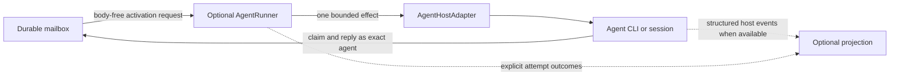

The runner blocks on an event and consumes no model tokens while idle. When
policy allows, it requests one turn, records the host outcome, and returns to
the wait only after the attempt reaches a named terminal state.

The activation request carries orientation, the canonical message ID, and an
exact claim path. The recipient process claims the body under its own identity.
A central runner never supplies `sender: reviewer` or reads the private inbox as
that agent.

Visibility is a projection of durable messaging facts, activation outcomes,
and explicit host events. A pane can remain an attachable live view without
being the transport that keeps the agent alive.

Every host-adapter probe must verify the human trace as well as the control
effect: whether the queued prompt appears in an attachable transcript, how
approval waits surface, and what remains visible after detach and reconnect.
If the host hides those facts, Cyclops needs an optional projection from the
same durable attempt. It must not create a second execution log and guess.

Work assignment remains a durable recipient queue. Pub-sub remains appropriate
for observation and UI invalidation. Treating activation as a generic event
topic would weaken ownership, order, backpressure, and recovery.

### Activation has its own uncertainty

An agent-host request can be rejected before send, accepted by the host, or
unknown after send. Host acceptance proves only that the host accepted control
input. It does not prove a model turn started or the message was claimed.

Cyclops should not retry an unknown activation automatically. A later exact
claim proves retrieval. A reply proves a response. Explicit host events may
show running, waiting for approval, cancelled, or failed without inventing
message completion.

### MCP is a useful adapter candidate, not the messaging system

At this review date, MCP revision `2026-07-28` has a stateless protocol core.
Its standard transports are stdio and Streamable HTTP, and it models agent
actions as tool calls with structured inputs and results. The revision removed
server-initiated requests; subscriptions carry change notifications and do not
provide durable mailbox replay. See the official
[2026-07-28 release](https://blog.modelcontextprotocol.io/posts/2026-07-28/),
[transport specification](https://github.com/modelcontextprotocol/modelcontextprotocol/blob/main/docs/specification/2026-07-28/basic/transports/index.mdx),
and [subscription client contract](https://py.sdk.modelcontextprotocol.io/v2/api/mcp/client/subscriptions/).

Those properties lead to four conclusions:

1. MCP does not replace durable acceptance, recipient FIFO, claim, replay,
   identity, or terminal-effect recovery. Cyclops still owns those semantics.
2. MCP should not become a second protocol implemented inside `cyclopsd`.
   A separate `cyclops-mcp` adapter can use the shared native client, isolating
   MCP version and host behavior from the coordinator.
3. MCP is not a general wake transport. A resource-change notification does not
   guarantee that a host will schedule a model turn, and it contains no Cyclops
   claim or replay semantics.
4. MCP can reduce agent friction by replacing command construction and output
   parsing with typed tools, if caller identity and retry uncertainty remain
   honest.

Current repository notes mention two different MCP ideas. `ARCHITECTURE.md:507`
says an MCP front door on the daemon was considered but is not built, while
`RELIABILITY_ROADMAP.md:460` defers MCP as a wake transport. Do not combine
them. This review recommends neither a second front door inside the daemon nor
an MCP wake mechanism. It recommends evaluating a separate client adapter.

An initial tool set should be deliberately small:

- `cyclops_send`
- `cyclops_inbox_next`
- `cyclops_claim`
- `cyclops_reply`
- `cyclops_thread`
- `cyclops_status`

Do not expose every daemon method. Operator attention recovery, pane capture,
shutdown, raw terminal effects, and adoption actions have different authority
and should not appear merely because a protocol can describe them.

### Caller identity is the MCP gate

Cyclops does not trust a sender field supplied in a request. The daemon reads
Unix-socket peer credentials and walks the current process ancestry to one
watched, adopted agent generation. `src/cyclopsd/src/identity.rs` documents the
model, and `src/cyclopsd/src/server.rs:1392-1455` applies it for mailbox calls.

This is good current security and creates the main integration constraint:

- A per-agent stdio MCP server launched as a descendant of the vendor process
  may preserve the ancestry Cyclops already authenticates.
- A central MCP process, desktop supervisor, or HTTP server outside that
  ancestry will authenticate as the process it actually is, often
  administrator or denied. It cannot safely claim or reply as arbitrary agents.
- MCP `clientInfo` is self-reported metadata and must not grant Cyclops
  identity. The official TypeScript SDK explicitly describes it as display and
  debugging information, not a security input. See its
  [2026-07-28 migration guidance](https://ts.sdk.modelcontextprotocol.io/v2/migration/support-2026-07-28).

No adapter should accept `sender: "reviewer"` and bypass this model. If future
shared-host use truly needs delegated agent authority, that is a new capability
and threat-model decision, not transport glue.

### Cheapest meaningful MCP experiment

Before designing delegated credentials or adding an HTTP server, build a
throwaway stdio adapter against the shared client module and test the riskiest
assumptions with each supported agent host:

1. Launch the adapter through the host in an adopted pane.
2. Confirm that a read-only `whoami` or snapshot result resolves to the same
   exact recipient key as the native CLI.
3. Send, claim, and reply without accepting a sender argument.
4. Restart or replace the host and confirm that the stale adapter loses
   authority rather than inheriting the new agent generation.
5. Force a response timeout after durable acceptance and prove that retrying
   with the same client key returns the same message.
6. Test a bounded `inbox next` call against each host's tool timeout and
   cancellation behavior.
7. Launch the adapter from a central shell and confirm that it cannot read or
   claim a pane agent's private inbox.

**Go condition:** all supported hosts preserve exact process-derived identity,
structured outcomes map without loss, and bounded waits behave predictably.

**Fallback if identity fails:** keep MCP administrator-scoped for status and
explicit send-as-admin, or stop. Do not build delegated tokens until a real
user journey justifies their lifecycle, revocation, storage, and recovery cost.

### Agent coordination should stay smaller than workflow management

Cyclops already provides the coordination facts that current agent handoffs
need:

- stable participants and routes,
- durable messages and recipient order,
- exact claim as retrieval proof,
- reply threads,
- bounded waits,
- current runtime observations,
- optional terminal attention, and
- human-visible recovery.

It does not currently own task assignment, progress, cancellation, completion,
dependencies, or artifacts. Do not infer completion from idle state or a
claimed message. Add a completion fact only after a concrete workflow defines
who may assert it, how it relates to messages, and what cancellation and
recovery mean. Cyclops should not become a project manager merely because
agents communicate through it.

### Public outcomes should be smaller than internal states

The internal notification machine may need exact `Writing`, `Staged`,
`Submitting`, ambiguous-effect, barrier, and reconciliation states. Ordinary
agents and people should first see a smaller milestone model:

| Public milestone | Meaning | Safe next action |
|---|---|---|
| Accepted | The durable message exists | Do not resend without the same client key |
| Notification shown | An optional human cue was presented | Inspect the message when useful; this says nothing about the agent |
| Activation pending | An optional bounded turn was requested | The message is still claimable; wait or inspect if needed |
| Host accepted | The host accepted control input | Do not interpret this as claim or completed work |
| Needs attention | Cyclops cannot settle an external effect automatically | Read the evidence and choose one named recovery action |
| Claimed | The exact recipient retrieved the authoritative content | Await a reply or an explicit workflow fact |
| Replied | A durable response was accepted in the thread | Continue from the canonical thread |

`Completed` must appear only if a later workflow explicitly defines and records
it. Pane idleness, terminal visibility, wake submission, and claim are not
completion.

Every access adapter should use these words first and keep attempt IDs,
terminal cuts, and compatibility states in JSON, verbose status, or recovery
views. An error should say the failed condition, what did or did not happen,
and one safe next action.

### Threat model must be stated plainly

Current authorization trusts same-user administrator processes and isolates
mailbox reads by exact process-derived recipient identity. That is appropriate
for a personal single-host tool. It is not isolation from a malicious process
running as the same operating-system user.

Do not add tokens, OAuth, or per-tool scopes to look more complete. First state
the same-user trust model. Revisit it only if Cyclops becomes remote, shared by
mutually distrusting users, or exposed through a long-lived central MCP server.

### What would falsify this target

The recommended architecture should be reopened if evidence shows any of the
following:

- one workspace writer cannot meet measured send and replay workloads,
- single-host operation is no longer the real product scope,
- append-only replay or retention cannot meet the data lifecycle contract,
- supported agent hosts cannot use the native CLI or a process-attributed MCP
  adapter,
- terminal wake risk remains unacceptable despite fresh-evidence guards, or
- the UI needs facts that cannot be expressed through snapshots, durable
  follow, and invalidation events.

Until one of these is true, a broker, remote mesh, generic event bus, public SDK
promise, or delegated identity system is solution friction rather than useful
depth.

## Deep code review through the domain model

This pass traced ownership through the daemon, protocol types, client paths,
stream UI, and workspace UI. The central problem is not that the repository has
too few abstractions. It is that several important modules know too much about
other domains and can mutate them through shared state.

### Verified structural evidence

The following figures describe the reviewed revision. They are indicators, not
automatic defects.

| Code area | Verified shape | Architectural signal |
|---|---|---|
| `src/cyclopsd/src/lib.rs` | `Inner` starts at line 160 and contains 46 fields across configuration, identity, mailbox, observation, delivery, UI, lifecycle, and test control | The daemon composition root is also a shared mutable state bag |
| `src/cyclopsd/src/mailbox.rs` | 18,050 lines; production code reaches line 8,054 before the main test module | Large behavior surface even after accounting for extensive tests |
| `MailboxProjection` | 19 indexes or state collections spanning messages, claims, notification attempts, barriers, attention resolutions, and consumption evidence | The name "mailbox" hides several domains |
| `MailboxError` | 82 variants spanning messaging, directory, notification, attention, replay, and persistence failures | Callers receive one broad error vocabulary instead of domain-local failures |
| `MailboxService` | Holds the directory, store, change publisher, attention resolution, reconciliation, and consumption candidates | One implementation owns unrelated decisions because they share storage |
| `src/cyclopsd/src/delivery.rs` | 15,838 lines; production code reaches line 9,703 before its main test module | Current notification and legacy direct delivery share one engine and recovery vocabulary |
| `src/cyclopsd/src/fusion.rs` | 11,111 lines; main production flow reaches line 4,780 | Observation recompute also performs recovery, acknowledgement, quota, attention, and chrome consequences |
| `src/cyclops-workspace/src/app.rs` | 12,636 lines and one `App` owns workspace interaction plus message projection, composer, refresh, detail, and transport worker state | Product composition and messaging presentation have low locality |
| Hidden Messages behavior | `WorkspacePrefs` defaults `messages_visible` to false; `pump_messages_refresh` returns while hidden; `MessagesChanged` only dirties that deferred projection | The optional view is real, but hidden arrival has no compact user-facing projection |
| Change and sound cues | `MessagesChangedData` carries only workspace sequence and changed areas; workspace sounds react to background runtime-state changes, not mail arrival | Body-free invalidation is a good seam, but another authorized presentation step is required for message visibility |
| Format 4 preview | `render_doorbell_v4` stages sender, summary, and exact claim locator; `DELIVERY.md` says the summary is for the human watching the pane | The preview earns its place, while its terminal implementation couples visibility to activation |
| Client paths | CLI, stream UI, and workspace each implement connection, greeting, frame, timeout, and uncertainty behavior | One transport contract has three implementations |

The large files contain strong regression coverage, so line count alone is not
the finding. The finding is the number of different product questions that an
engineer must answer inside each production portion.

### The shared `Inner` is the whole house in one room

`src/cyclopsd/src/lib.rs` explicitly describes `Inner` as everything the socket
server and fusion engine need behind one `Arc`. Its fields include:

- configuration and workspace identity,
- session identities and watched sessions,
- the mailbox store and publication locks,
- composer recovery and unread projection,
- manifests and runtime detections,
- delivery workers and acknowledgement state,
- event publication,
- workspace UI control,
- shutdown and task lifecycle, and
- production-visible test pauses and fault switches.

Passing `Arc<Inner>` is convenient, but the convenience is precisely the
coupling. Any function that receives it can reach into multiple rooms, acquire
their locks, and create a new causal path without declaring a dependency in its
interface.

**Proposed simplification: Strong.** Keep a small `Daemon` composition root that
constructs and owns `WorkspaceMessaging`, `ParticipantDirectory`,
`PaneObserver`, optional `AgentRunner`, workspace presentation, and lifecycle
modules. Pass only the module or capability a function needs. Do not merely
group the same 46 fields into nested structs; move behavior and invariants with
the fields.

The deletion test is concrete:

- observation code no longer knows the mailbox store or delivery engine,
- socket code no longer knows session caches or worker registries,
- messaging code no longer knows workspace rendering, and
- test fault controls live beside the exact effect they perturb, under test
  configuration where practical.

### `mailbox.rs` is a store plus four domains

The module currently owns or coordinates:

- message acceptance, mailbox FIFO, claim, reply, thread, and idempotency,
- directory replacement and recipient lookup,
- notification attempt state and terminal-write barriers,
- attention resolution and consumption evidence,
- journal persistence and replay,
- event publication, snapshots, follow reads, and failure injection.

The broad `MailboxProjection`, `PreparedMutation`, `MailboxError`, and
`MailboxService` shapes are direct evidence of those responsibilities sharing
one implementation. Storage locality is valuable, but policy locality is
missing.

**Proposed simplification: Strong.** Keep one journal transaction and replay
projection initially, but separate the decisions inside it:

```text
workspace_messaging_store/
  journal.rs          persistence, replay, transaction commit
  projection.rs       reconstructable durable indexes
messaging/
  decisions.rs        accept, claim, reply, supersede
  model.rs            message, mailbox entry, thread, domain errors
notification/
  decisions.rs        attempt transitions and external-effect cuts
  model.rs            attempt, barrier, notification errors
attention/
  decisions.rs        resolution intent and causal consumption
directory/
  decisions.rs        recipient and route resolution
```

This is an internal responsibility map, not a required final file tree or a set
of public interfaces. Start by extracting pure decisions and domain error types
inside one deep `WorkspaceMessaging` implementation. Keep the one lock and one
append transaction until evidence shows they are the constraint.

`MessageStore::accept` already accepts stable recipient keys and presentation
data, which is a useful seam: user-facing directory resolution can move out of
the durable messaging decision without weakening acceptance.

The likely rename from `MailboxProjection` to `MessagingProjection` is also
worthwhile. The current name leads engineers to expect only recipient queues,
while the representation is the durable workspace messaging truth.

### `NotificationContext` is deep but misnamed

`src/cyclopsd/src/notification_adapter.rs` is not primarily an adapter to an
external mechanism. `NotificationContext` is a durable handle for one exact
attempt. It holds the store, message, recipient, attempt generation, and change
publisher and exposes the legal transition operations.

That depth is useful: the delivery worker does not need to understand the
projection's indexes and lock protocol. The simplification is to move and name
it according to its responsibility, such as `NotificationAttempt`, while
keeping its narrow transition interface. It belongs with the internal
Notification implementation inside `WorkspaceMessaging`; the tmux
implementation is the actual adapter.

**Proposed simplification: Worth exploring.** Rename after the domain split, not
before. A naming-only move would create churn without deleting knowledge.

### `fusion.rs` observes facts and executes their consequences

The production recompute path in `src/cyclopsd/src/fusion.rs` does more than
fuse runtime evidence. It also reads composer recovery records, prepares and
confirms delivery acknowledgements, persists recovery transitions, invokes
attention resolution, observes quota reset, updates chrome, and emits state.

This makes a runtime-observation change risky because its code is also part of
Messaging and Notification behavior. It also hides the system trace: an
engineer sees the evidence change and downstream mutation in one long function
rather than one explicit rule connecting them.

**Proposed simplification: Strong.** Make observation recompute return a
committed `ObservationChanged` fact containing the exact recipient and route
generation. Pass that immutable fact to a narrow
`WorkspaceMessaging::apply_observation` operation, which applies required
durable transitions atomically and returns requested effects and invalidations:

1. reconsider a queued notification,
2. evaluate exact acknowledgement or recovery evidence,
3. derive attention changes,
4. update presentation projections, and
5. publish the observable state change.

Do not introduce a generic event bus or let a new coordinator read several
internal projections. A typed observation, one deep messaging operation, and a
plain effect runner provide a visible call graph, compile-time coverage, and
easier debugging. Preserve causal identifiers and ordering so the extraction
does not turn exact evidence into eventually guessed evidence.

### `delivery.rs` contains the current and retired houses

The `Engine` owns legacy direct-delivery workers and current mailbox
notification workers together, plus acknowledgement registries, open handles,
task supervision, pause state, and quiesce behavior. The file's own commentary
acknowledges that several responsibilities look as if they belong elsewhere.

The danger is not only size. A fix for current notification recovery can
silently affect a compatibility path, while a legacy test can prevent deletion
of current complexity without identifying a live caller.

**Proposed simplification: Strong after a caller census.** Give current
notification execution and legacy direct delivery separate worker types,
recovery tests, and entrypoints. Put legacy behavior behind one compatibility
adapter with an inventory of callers, journal facts, commands, and removal
criteria. Do not delete a compatibility path until its readers and durable
history needs are proven absent.

The `Injector` trait can remain as a private effect and test seam if it is what
enables deterministic fault tests and keeps tmux out of domain logic. A
hypothetical future terminal backend is not enough by itself to justify a
public abstraction.

### `server.rs` is transport plus application coordination

The socket module currently handles framing and dispatch, but also performs
authenticated identity work, mailbox commands, attention commands,
administrator authorization, history aggregation, runtime refresh, and status
assembly.

**Proposed simplification: Strong after `WorkspaceMessaging` exists.** The
socket adapter should own greeting, authentication evidence, frame limits,
request decode, dispatch, response encode, and connection lifecycle.
Application commands should call narrow participant, messaging, or observation
interfaces. This produces one place to test transport failure and another to
test business behavior without sockets.

### `cyclops-proto` mixes data transfer with domain law

The crate describes itself as data types with no IO, yet it also defines legal
notification and delivery transitions and the Attention rule. Those are domain
laws, not merely wire shapes. Glob re-exports from every module further hide
where a type or rule is owned.

**Proposed simplification: Worth exploring.** First establish internal
`domain` and `wire` modules and replace broad glob re-exports with intentional
exports. Do not create another crate until the internal separation proves
stable and a build or ownership need earns the move.

This keeps the useful no-IO depth while making a critical distinction:
serialization shape may evolve for compatibility, while domain law changes
only when the product meaning changes.

### The UI crate combines presentation models with terminal and backend IO

`cyclops-ui` contains valuable pure models such as `Record`, `Intake`, message
queue, detail, composer, and grid semantics. The same crate also owns terminal
rendering, socket connections, journal backfill, and tmux focus. The CLI and
workspace then depend on this broad crate to reuse the pure pieces.

`cyclops-workspace::App` compounds the issue by holding workspace interaction
state beside `cyclops_ui::Record`, `HumanQueue`, `Detail`, `ComposerState`,
refresh state, and several message transport workers. This does not make the
workspace incorrect, but it makes messaging feature work require knowledge of
the whole interactive application.

**Proposed simplification: Strong.** Extract a pure presentation module that
owns reconstructable view models and user-action descriptions only. Then:

- the headless CLI depends on the shared client and optional presentation
  helpers,
- the stream UI depends on the pure presentation module plus terminal IO,
- the workspace UI depends on the same presentation module plus workspace
  interaction,
- journal replay and snapshot production remain daemon responsibilities, and
- pane focus goes through the workspace or terminal adapter rather than a pure
  model.

This is view separation by purpose. The stream, message queue, and workspace
can show different projections of the same durable facts without sharing one
large application type or reading each other's mutable state.

### One client transport should own uncertainty semantics

The CLI client, stream UI, and workspace daemon client independently implement
Unix socket connection, greeting, framing, timeouts, reconnect, and the
difference between known-not-sent and uncertain-after-write. Repetition here is
dangerous because these are user-visible correctness semantics, not formatting
details.

**Proposed simplification: Strong.** One deep client module should own:

- socket path and peer expectations,
- greeting and version compatibility,
- maximum frame size,
- request IDs and response correlation,
- connect, write, and response deadlines,
- known-not-sent versus uncertain outcomes,
- subscription resume and gap signaling, and
- blocking and async adapters over the same contract tests.

Callers should choose an operation and handle a small outcome vocabulary. They
should not each reconstruct transport truth.

## Genuine simplification versus rearrangement

The following changes delete knowledge and are therefore genuine:

| Change | Knowledge deleted from callers |
|---|---|
| Replace `Arc<Inner>` parameters with narrow modules | Unrelated locks, caches, workers, and lifecycle state |
| Deepen `WorkspaceMessaging` while retaining one transaction | Journal variants, internal maps, notification cuts, and attention rules from callers |
| Return an observation fact before applying syncs | Delivery and recovery policy from runtime fusion |
| Share one client transport | Greeting, frames, deadlines, retry uncertainty, and gap recovery from three clients |
| Extract pure presentation models | tmux, journal paths, terminal state, and socket lifecycle from reusable UI state |
| Quarantine legacy delivery | Historical branches from current notification reasoning |
| Split domain error vocabularies | Unrelated failure cases from ordinary callers and tests |

The following changes would mostly rearrange complexity and should not lead the
work:

- moving giant test modules into new files without first stabilizing domain
  interfaces,
- grouping `Inner` fields into nested structs while every module still reaches
  through them,
- adding a trait for every type,
- introducing repository, manager, factory, command-bus, or event-bus
  abstractions before two real implementations need them,
- creating a crate for every domain noun,
- assigning each domain its own database or process, or
- replacing explicit Rust calls with stringly typed event routing.

Less is more means fewer facts a caller must know, fewer ways to express the
same operation, and fewer places where one rule can hide. It does not mean the
fewest files or the shortest state machine regardless of correctness.

## Regression strategy that makes change routine

Cyclops already has extensive tests, including many important crash-cut and
state-transition cases. The next improvement is not simply more tests. It is a
test shape aligned with stable domain behavior so implementation movement does
not destroy confidence.

### 1. Domain trace tests

Test user-visible behavior as short traces against pure domain interfaces:

```text
given accepted message M for recipient R
when R claims M
then R's entry is claimed
and a pre-effect activation is withdrawn
and another recipient's entry is unchanged
```

These tests should not boot tmux, open a socket, render a frame, or know internal
map names. They cover idempotency, claim ownership, reply ancestry,
notification transitions, activation intent, and attention rules quickly and
deterministically.

### 2. Store and replay tests

Run the same domain traces through append, sync, crash cut, replay, and torn-tail
recovery. Assert semantic state, not serialized line order unless line order is
the contract. Every durable transition should have at least:

- commit then replay,
- failure before commit,
- duplicate request where allowed,
- incompatible duplicate where rejected, and
- schema or version compatibility where applicable.

### 3. Adapter contract tests

Use one reusable suite per interface:

- all client adapters enforce the same frame and uncertainty contract,
- the tmux adapter proves exact command construction and ambiguous-write
  handling with a fake effect implementation,
- every agent-host implementation proves activation outcomes, transcript
  visibility, cancellation, approval, detach, and reconnect behavior,
- presentation adapters render the same pure view facts consistently, and
- hidden-view presentation proves that body-free invalidation fetches an
  authorized snapshot without forcing a view open, and
- subscription clients prove replay, live ordering, lag, reconnect, and gap
  recovery.

### 4. A small end-to-end reliability suite

Keep a focused set of real daemon, socket, journal, and tmux-fixture tests for
the seams pure tests cannot prove:

- accept through exact claim,
- claim racing a pre-effect activation,
- crash after durable intent and before terminal submission,
- uncertain terminal submission without automatic duplicate,
- daemon restart and replay convergence,
- subscriber lag followed by authoritative recovery, and
- UI closed while headless messaging continues,
- hidden sidebar and Messages pane remain closed after message arrival, and
- manual activation never writes a prompt to create a human cue.

End-to-end tests should be few, explicit, and high leverage. Making every
behavior test boot the entire product would be slow and brittle; having none
would leave the most important joins unproved.

### 5. Feature-change acceptance test

For each proposed feature, the review should record:

| Question | Healthy answer |
|---|---|
| Which domain owns it? | One clear domain |
| Which invariant changes? | Named explicitly, or none |
| Which syncs change? | A short enumerable list |
| Which stable interface changes? | Ideally one; compatibility stated |
| Which regression trace proves it? | One readable scenario plus needed fault cuts |
| Must storage, transport, tmux, and UI all change? | Only when the feature genuinely spans them |

A feature that spans several rooms is allowed. The syncs should make that span
obvious, and each room should still change only for the responsibility it owns.
That is how adding a feature becomes understandable instead of scary.

## Findings and recommendations

Recommendation levels:

- **Strong:** evidence shows a current correctness, clarity, or maintenance
  problem.
- **Worth exploring:** likely useful, but measurement or a compatibility census
  should precede implementation.
- **Speculative:** retain as a question, not planned work.

### 1. Correct the terminal-safety contract

**Finding: P1 contract correctness. Recommendation: Strong.**

`docs/development/INVARIANTS.md` says "Human typing always wins." The actual
implementation is careful but cannot prove that absolute claim. In
`src/cyclopsd/src/delivery.rs:4200-4214`, the code intentionally performs
spooling before the final composer proof so the proof is as late as possible,
then states that the remaining command interval is irreducible. The final
binding bookend and durable write intent still precede an asynchronous tmux
`paste-buffer` command.

A person or agent can begin typing after the last capture and before tmux
applies the paste. The pane and process identity remain unchanged, so occupant
checks do not detect the new draft. More screen heuristics cannot create mutual
exclusion.

Keep the existing escaped captures, positive readiness stamp, binding
bookends, composer hold, exact-payload verification, and conservative
post-write recovery. They materially reduce real risk. Change the guarantee to:

> Cyclops never writes without fresh positive composer and occupant evidence.
> Tmux injection minimizes but cannot eliminate concurrent-input risk.

Add a characterization test using the existing `post_final_prewrite` pause to
show the residual race explicitly. If the product later requires absolute
non-interference, the target agent must participate through a cooperative
queue, lease, or native command protocol that can atomically own its input.

Do not add more guards while continuing to claim an impossible guarantee.

### 2. Enforce one message-frame size contract

**Finding: P1 correctness and interoperability. Recommendation: Strong.**

The UI documentation says every daemon frame and ledger line is limited to
1 MiB. At the reviewed revision the UI enforced that limit in its `wire.rs`
module, later moved into `src/cyclops-client/src/lib.rs`, and when
reading the ledger. The daemon reads requests with unbounded
`BufReader::lines()`, the CLI reads an entire body file or stdin into memory,
and the daemon writes responses without a corresponding size check. No
server-side body or complete request-frame limit was found.

An oversized message can therefore be accepted, journaled, and retained by the
daemon, then rejected by an official UI. This is a direct product failure and
a local resource-exhaustion risk.

Current shape:

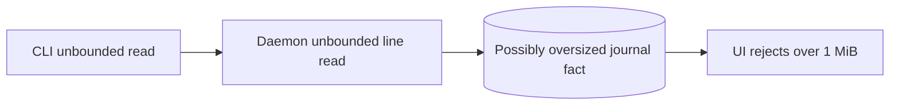

Proposed shape:

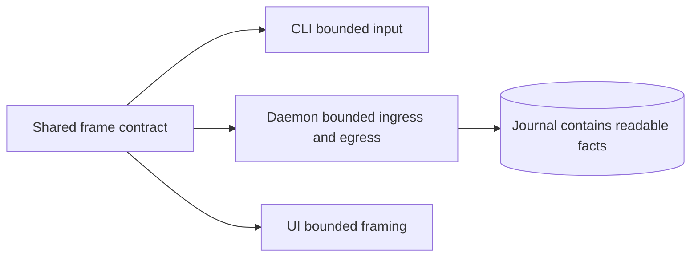

Put one public limit and framing reader in the protocol or client-transport
module. Enforce it before unbounded allocation, before durable acceptance, on
daemon responses, and in every client adapter. Return one clear usage error
that names the limit. Test just below, exactly at, and just above it through
CLI, socket, replay, and UI paths.

This is defensive code that earns its cost because it resolves a demonstrated
cross-interface mismatch.

### 3. Define one raw-tmux emergency doctrine

**Finding: P1 authority and recovery contract. Recommendation: Strong.**

`README.md` and `DELIVERY.md` describe raw tmux as a valid manual emergency
path. The active Cyclops skill says not to route around an unavailable daemon
and forbids `tmux send-keys`. These positions can be compatible if the first is
operator authority and the second is normal autonomous-agent behavior. That
role distinction and the confirmation procedure are not stated once, so the
current material reads as a contradiction.

The intended policy should be:

1. Normal communication always uses Cyclops.
2. Slow response, a hold, or an ambiguous post-write outcome is not permission
   to bypass it.
3. A human operator may authorize an explicit smux or raw-tmux emergency send
   to an exact pane after confirming that the daemon is unavailable or broken.
   An agent does not grant itself that authority.
4. The sender labels it as unrecorded emergency delivery.
5. It creates no Cyclops receipt, claim, replay fact, ordering fact, or
   completion proof.
6. It never happens automatically.

Current shape:

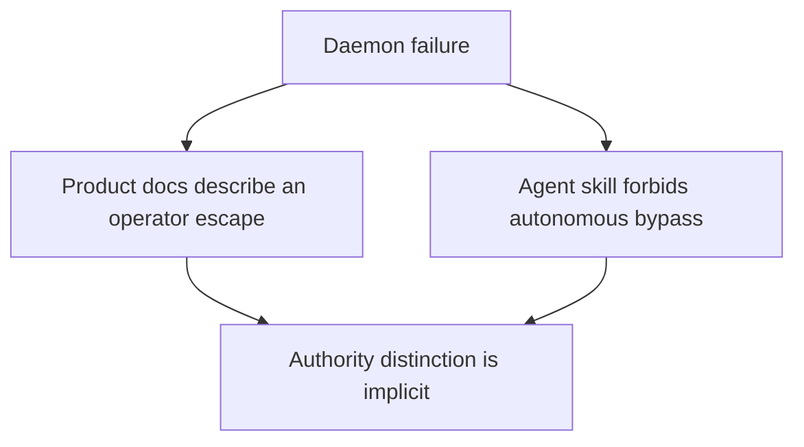

Proposed shape:

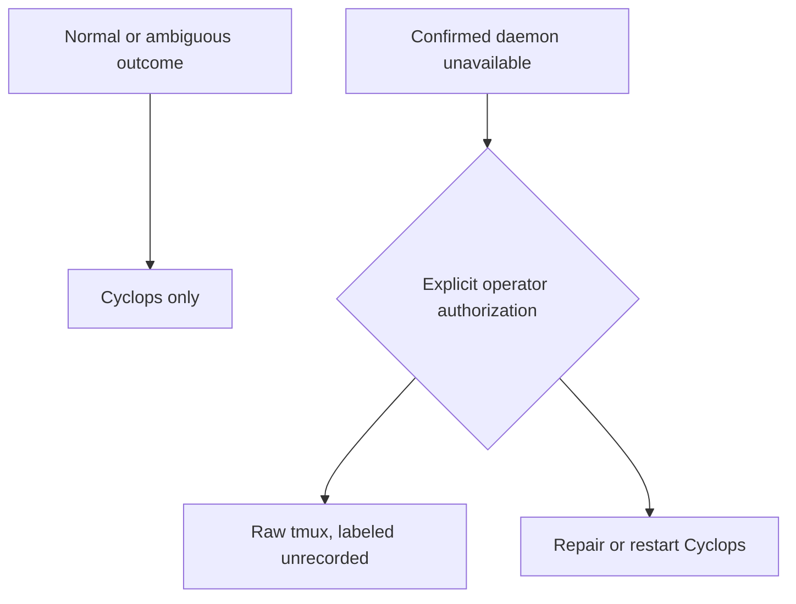

Do not implement automatic fallback. After an uncertain send, automatic raw
tmux could duplicate content, violate ordering, overwrite input, and make the
visible path appear authoritative over the durable record.

### 4. Consolidate daemon-client transport

**Finding: repeated transport knowledge. Recommendation: Strong.**

Hello ordering, request IDs, line framing, response decoding, timeouts, and
unknown-after-write behavior are implemented separately in the blocking CLI,
the async UI, and the workspace. Repetition makes protocol changes easy to
apply inconsistently. The frame-limit mismatch is evidence that this is not
theoretical.

Current shape:

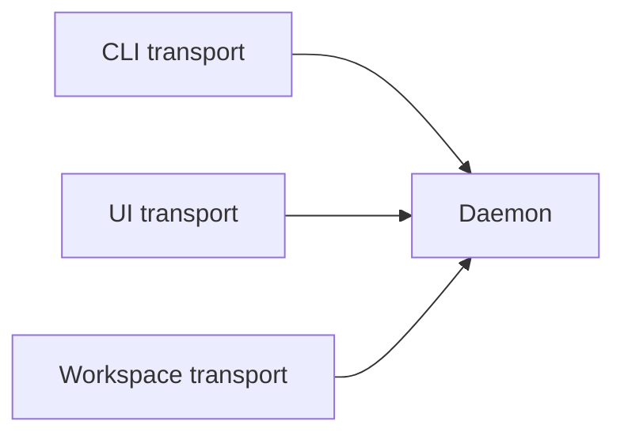

Proposed shape:

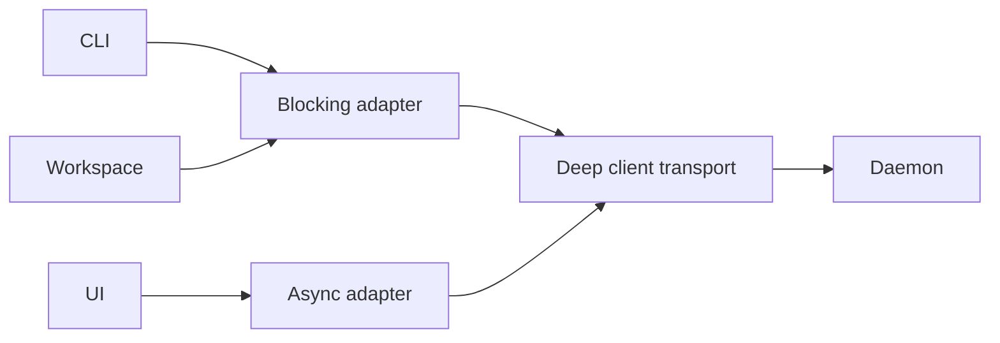

Create one deep client transport module with blocking and async adapters. It
should own handshake order, frame limits, correlation, malformed responses,
and the distinction among refused, not sent, and outcome unknown. Callers may
retain their own timeout and retry policy.

Do this before packaging separation so a fourth transport implementation is
not created accidentally.

### 5. Make headless messaging build-independent

**Finding: operational independence exists, build independence does not.
Recommendation: Strong, after transport consolidation.**

`cyclopsd` has no production UI dependency. The sole user-facing `cyclops`
binary depends on both UI implementations, so a UI dependency or build failure
can still break the headless messaging client.

The first move should be an independently testable headless client module. A
separate executable or Cargo feature is justified if it produces a smaller
installation, isolates build failures, or makes release proof materially
clearer. Do not split the public command surface merely to make the crate graph
look pure. One integrated front door remains a good user experience.

### 6. Census and quarantine legacy direct delivery

**Finding: current and legacy paths share too much implementation knowledge.
Recommendation: Strong.**

The standard socket endpoint uses the mailbox coordinator, but hook self-test
still invokes the legacy direct pipeline. The large delivery implementation
owns both legacy workers and current notification behavior. Summaryless and
direct-payload compatibility also remain in the delivery contract.

Before extraction, answer with evidence:

- Which installed clients still send summaryless messages?
- What invokes direct delivery besides hook self-test and historical replay?
- Can hook verification exercise a current mailbox notification?
- Which old states must remain readable but no longer writable?

Then isolate legacy reading and any proven callers in a compatibility module.
Historical replay support does not require every historical write path to
remain active.

Do not delete this code because it is large. Quarantine or retire it only after
the census proves the safe seam.

### 7. Deepen workspace messaging one decision family at a time

**Finding: daemon state has low locality, but much notification complexity is
earned. Recommendation: Strong with restraint.**

The daemon's `Inner` state owns mailbox publication, delivery, composer
recovery, unread projection, sessions, event publication, fusion, lifecycle,
registry, hooks, workspace state, shutdown, and test-fault controls. The
largest messaging modules are approximately 18,000 and 15,800 lines. Size
alone is not the problem. The problem is how many independently locked facts an
engineer must understand to change one delivery rule.

Establish one narrow `WorkspaceMessaging` interface, then proceed with the
already approved sans-IO decision shape inside its implementation:

```text
(state, input) -> (state, effects)
```

Start with one coherent decision family, preserve behavior, and keep terminal
writing in an adapter. Keep message, notification, and attention decisions in
one transaction-owning module rather than exposing an interface for each noun.
Keep explicit `Writing`, `Staged`, `Submitting`, and `Submitted` distinctions
because they encode real crash and uncertainty cuts. Hide them from ordinary
callers behind the deep interface.

Every extraction should pass the deletion test: if the caller still knows all
the states, locks, and ordering rules, the new interface is too shallow.

### 8. Complete the UI protocol seam

**Finding: the UI is not a pure daemon projection. Recommendation: Strong.**

The stream UI reads ledger files directly during startup and can call tmux
focus directly. Its wire type also promises `events.subscribe.cursor` replay,
while the daemon ignores that cursor.

The simplest honest protocol is:

- `events.subscribe`: ephemeral invalidation only.
- `messages.follow`: durable, lossless mailbox progress.
- snapshot methods: complete current projections.

Deprecate or remove the unsupported subscribe cursor unless a real user
journey needs heterogeneous event replay. Let the UI consume daemon snapshots
and durable follow pages. Keep terminal focus in a deliberate terminal adapter
or launcher. Renderer-neutral UI code should not know journal paths.

### 9. Keep the current pub-sub architecture

**Finding: the existing hybrid is appropriate. Recommendation: Strong.**

Cyclops already separates:

- request-response commands,
- a durable append-only journal,
- best-effort body-free invalidation events,
- a domain-specific durable follow cursor, and
- a guarded terminal wake adapter.

This is the useful part of pub-sub without turning an ephemeral event bus into
the message broker. Slow subscribers are dropped instead of blocking the
daemon, and they recover from truth.

Do not add Kafka, Redis, generic topics, multi-host mesh routing, or a generic
event replay log without a measured multi-host requirement. Deepen the current
interfaces first.

### 10. Measure history growth before indexing it

**Finding: `messages.follow` rebuilds the complete visible projection before
filtering, and the daemon retains complete replayed state in memory.
Recommendation: Worth exploring after measurement.**

This is simple and likely correct at today's scale. It is not evidence of
fleet-scale efficiency. Measure cold replay, resident memory, snapshots, and
follow pages over long histories and concurrent followers. Add an index or
checkpoint only if the measurements expose a user-visible limit.

### 11. Make onboarding progressively disclosed

**Finding: comprehensive documentation is not yet newcomer-efficient.
Recommendation: Strong.**

The active engineering, protocol, benchmark, send, and skill documents total
thousands of lines. The active Cyclops skill alone is 381 lines and about 2,600
words. That thoroughness preserves reasoning, but it is expensive context for
an agent and a difficult entrypoint for an outside engineer.

Use this four-concept model and the user journeys above as the newcomer entry
point. Keep the long contracts as reference. Restructure the skill into a
short golden path for status, send, wait, claim, and reply, followed by
progressively disclosed troubleshooting and recovery.

### 12. Make pane-only visibility a first-class journey

**Finding: hiding messaging chrome currently hides its live projection but not
its terminal activation. Recommendation: Strong.**

The Messages pane is hidden by default. When hidden, its refresh gate defers
snapshot work, `messages.changed` produces no notice or incoming-message sound,
and the collapsed rail carries no unread or attention state. Native tmux
intentionally removes all Cyclops chrome.

The Format 4 preview prevents this from becoming completely opaque, but only
because the terminal path also submits a prompt. That is appropriate when the
user selected automatic terminal activation. It is not a general notify-only
solution.

Define the pane-only journey before changing UI code:

1. Never force the sidebar or Messages pane open.
2. Preserve sender, bounded preview, and exact inspection path in any visible
   activation transcript.
3. Offer one compact non-activating cue in workspace mode.
4. Keep native tmux genuinely chrome-free; use only visibility paths the user
   explicitly enables.
5. Verify attach, detach, transcript, approval, and reconnect visibility in
   every native host-adapter probe.

The compact cue should derive from an authorized snapshot after a body-free
invalidation. Do not put previews into broadcast events or create a second
unread queue in the UI.

### 13. Keep the preview and measure its grammar

**Finding: exactly two sentences and 240 characters may be unnecessary
solution friction. Recommendation: Worth exploring after instrumentation.**

The sender-authored preview is valuable and should remain a first-class field.
It supports pane-only supervision without leaking the authoritative body into
generic events or asking another model to summarize private content.

The exact two-sentence grammar may create avoidable failures for short agent
messages. No rejection or quality evidence was found. Record validation
failures and edits, then compare the current rule with one concise single-line
preview under the same character bound.

Do not remove the preview while measuring its grammar. That would solve minor
input friction by breaking an important user journey.

### 14. Treat MCP as a gated access-adapter experiment

**Finding: typed tools may reduce agent friction, but caller identity is
unproved across hosts. Recommendation: Worth exploring through a throwaway
prototype.**

Do not make MCP the daemon protocol or a terminal wake transport. After the
shared client exists, test a separate stdio adapter that exposes only the
golden messaging journey. It must inherit the correct process ancestry, accept
no sender field, preserve client keys across uncertain retries, and respect
host timeouts for bounded inbox waits.

If those tests pass for supported hosts, MCP becomes a useful optional adapter.
If they fail, keep it administrator-scoped or deferred. A shared HTTP server
and delegated agent credentials require separate product and threat-model
evidence.

## Complexity budget

| Keep | Deepen now | Measure first | Avoid now |
|---|---|---|---|
| Fsync before acceptance | Shared bounded framing | Long-history indexing | Distributed broker |
| Strict replay and torn-tail recovery | Client transport module | Resident agent connection | Automatic raw-tmux fallback |
| Stable identity, FIFO, and bounded previews | Deep `WorkspaceMessaging` locality | Preview grammar changes | Generic transactions |
| Explicit write uncertainty | Honest snapshot, follow, and event interfaces | Low-frequency reconcile timer | Retry after ambiguous write |
| Durable intent before terminal action | Legacy compatibility quarantine | Separate public binaries | Multi-host mesh |
| Fresh composer and occupant evidence | Honest terminal-safety wording | Stdio MCP identity and timeouts | Forced-open messaging chrome |
| Bounded and fair UI work | Explicit emergency authority | Concurrency tuning | MCP as the core or wake protocol |

## Performance audit

### What the historical benchmark proves

The committed raw-tmux comparison was measured on frozen candidate `c108dea`
on 2026-08-22. It is useful historical evidence, not a current release claim.

| Historical lane | p50 | p95 | Proven milestone |
|---|---:|---:|---|
| Persistent socket ping | 0.012 ms | not reported here | Live daemon round trip |
| Open-socket `msg.send` | 5.063 ms | 17.999 ms | Durable mailbox acceptance |
| `cyclops send` CLI | 10.991 ms | 12.966 ms | Process startup plus durable acceptance |
| Peer send through exact claim | 27.033 ms | not reported here | Recipient retrieved authoritative content |
| Raw `tmux send-keys` | 3.945 ms | not reported here | tmux accepted a command |
| Raw write plus capture | 8.014 ms | not reported here | Text became visible in a pane capture |

Raw tmux should be faster at the first visible write because it does much less.
It does not provide durable acceptance, authenticated sender identity,
recipient ownership, FIFO, claim, reply, crash replay, or explicit uncertainty.
The closest complete communication comparison is raw visible write versus
Cyclops send-through-claim, and even those outcomes are not identical.

### Fresh measurement at reviewed HEAD

The retained frozen-candidate transport benchmark was rebuilt and run against
the exact reviewed revision with release binaries and 30 serial samples. It
does not contain current raw-tmux lanes, and its fixture notification path is
not the complete current mailbox notification path.

Environment: Apple M5 Pro, macOS 26.5.2, tmux 3.6a, rustc 1.97.1. Results are
local measurements, not universal performance guarantees.

| Current HEAD lane | p50 | p95 | Notes |
|---|---:|---:|---|
| CLI `--version` startup | 1.514 ms | 1.754 ms | Process startup floor |
| Persistent socket ping | 0.008 ms | 0.018 ms | Socket transport is negligible |
| Durable acceptance RPC | 8.087 ms | 9.032 ms | Current durable acceptance fixture |
| Exact claim RPC | 8.041 ms | 9.159 ms | Current exact claim fixture |
| Fixture notification pipeline | 545.036 ms | 552.014 ms | Legacy fixture path; do not compare directly to raw write |

The production contract checks in the benchmark also passed: idempotent claim,
daemon identity match, default acceptance without requiring wake, required-wake
failure on a blocked recipient, and required-wake success on an idle recipient.

### Interpretation

The persistent daemon is not justified by beating raw `send-keys` at one small
command. It is justified by durable coordination semantics and recovery. The
socket itself is extremely cheap. Durable append and process startup dominate
the measured command path.

A resident per-agent client would save only a few milliseconds against agent
turns that normally take much longer. Do not add one until a high-rate workload
shows that CLI startup is material.

The current benchmark record still leaves important questions unanswered:

- message and claim throughput,
- concurrent writers and recipients,
- cold replay and resident memory growth,
- durable follow cost over long histories,
- reconnect convergence,
- idle wakeups over long runs,
- current raw-tmux comparison at the same revision, and
- Linux behavior.

## Fair Cyclops versus raw-tmux benchmark

Do not publish one headline latency number. Report a ladder of outcomes and let
the reader see the guarantees added at each step.

| Lane | Stop the timer when | Guarantees obtained |
|---|---|---|
| Raw command | tmux accepts `send-keys` | Command accepted by tmux |
| Raw visible | exact text appears in pane capture | Visible terminal mutation |
| Cyclops accepted | durable acceptance returns | Journaled message, identity, recipients, order |
| Cyclops submitted | guarded notification submission completes | Durable message plus terminal wake attempt |
| Cyclops claimed | recipient claims exact ID | Authoritative content retrieved |
| Cyclops replied | sender receives canonical reply | Useful coordination round trip |

Exercise serial, burst, broadcast, and many-to-one patterns across
representative small, medium, and stress fleet sizes. Test idle, working,
human-typing, modal, and detached recipients. Include small, medium, near-limit,
and over-limit payloads. Run empty and long histories plus daemon restart, tmux
reconnect, stalled subscriber, and killed-client faults.

Record:

- p50, p95, and p99 latency,
- accepted messages, claims, and replies per second,
- lost, duplicated, wrong-pane, and uncertain outcomes,
- CPU time, resident memory, wakeups, and subprocess count,
- journal bytes per message,
- cold replay and reconnect convergence,
- queue depth and oldest-item age, and
- recovery actions required from the user.

Correctness metrics matter more than raw latency. A 4 ms command that
overwrites human input or cannot be recovered is not equivalent to a 27 ms
durable claim.

The benchmark harness should be committed, print the exact revision and tool
versions, isolate its tmux server and Cyclops home, retain raw samples, and fail
when run against binaries from a different revision.

## Proposed target architecture

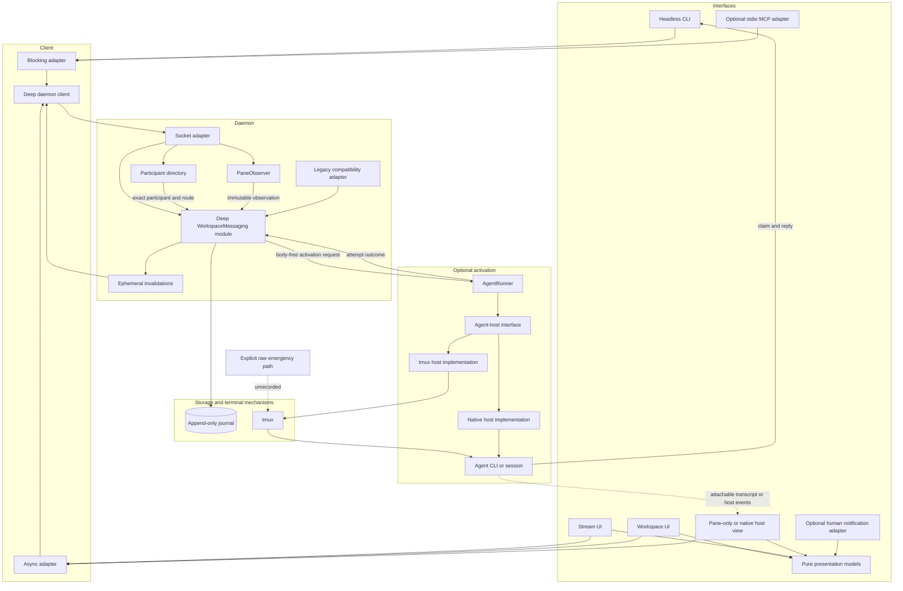

Properties of this target:

- Headless messaging has no rendering dependency.
- All official clients share framing and uncertainty semantics.
- CLI, MCP, and UIs are adapters over one semantic contract rather than
  independent messaging protocols.
- Full, compact, and pane-only views derive from the same snapshots and
  invalidations. Hiding one never changes messaging policy.
- `WorkspaceMessaging` owns one durable transaction and hides message,
  mailbox, notification, activation-intent, and attention representation
  behind a small interface.
- Mailbox truth remains independent of notification success.
- `PaneObserver` publishes immutable facts and cannot reach into durable
  messaging state.
- `AgentRunner` sleeps on durable activation work and does not decide mailbox
  or activation policy.
- The agent-host interface hides tmux and vendor-native control differences;
  each implementation reports explicit outcomes and visibility capability.
- Terminal writes remain external effects with explicit uncertainty.
- Events are hints, follow pages are durable, and snapshots are authoritative.
- Pure presentation models know neither journal paths nor tmux commands.
- A visible activation transcript may reuse the durable preview, but it is not
  the notification record or the authoritative body.
- Compatibility is visible and removable rather than spread through the main
  implementation.
- MCP remains optional and process-attributed; it cannot accept a claimed
  sender identity.
- Raw tmux remains available without pretending to be Cyclops delivery.

## Sequenced change plan

### Phase 1: close current correctness gaps

1. Correct the terminal-safety contract and add the residual-race
   characterization test.
2. Add the shared frame contract and cross-interface tests.
3. Align README, delivery guidance, the Cyclops skill, and recovery tests on the
   explicit emergency policy.
4. Mark historical benchmark tables with their revision and add the current
   equal-outcome harness.
5. Commit the ubiquitous language, domain ownership, sync table, and current
   behavior traces as the refactor contract.

### Phase 2: create safe change seams without changing behavior

6. Consolidate client transport with blocking and async adapters.
7. Make headless messaging independently buildable behind that client.
8. Run the throwaway stdio MCP identity, retry, timeout, and cancellation
   experiment. Do not add a production MCP surface yet.
9. Probe one tmux and one native agent-host implementation for activation,
   transcript visibility, approval waits, cancellation, reconnect, and unknown
   outcomes. Do not add a production runner until both the control and human
   trace are understood.

### Phase 3: give each domain one home

10. Establish the narrow `WorkspaceMessaging` interface around current behavior
   while retaining one append transaction.
11. Move message, notification, activation-intent, and attention decisions
    behind that interface one behavior family at a time.
12. Make runtime fusion return immutable observation facts and remove direct
    durable messaging effects from it.
13. Separate optional activation execution into `AgentRunner` and the
    agent-host interface, with durable policy remaining in
    `WorkspaceMessaging`.
14. Replace `Arc<Inner>` reach-through one call path at a time and move fault
    controls beside the effect they perturb.
15. Perform the legacy compatibility census and quarantine proven legacy
    readers and callers.

### Phase 4: complete UI and build independence

16. Extract pure presentation models from terminal and backend IO.
17. Make subscribe, follow, and snapshot contracts honest.
18. Define one compact incoming-work cue from authorized snapshots, preserve
    the pane preview, and keep hidden message chrome closed on arrival.
19. Add regression journeys for full, compact, pane-only, and native-tmux use.
20. Remove journal-path and tmux knowledge from reusable presentation code.
21. Use the domain model as the newcomer entrypoint and shorten the agent
    golden path through progressive disclosure.
22. If and only if the MCP experiment passes, ship the small stdio tool adapter
    with the same client contract tests. Otherwise keep MCP deferred or
    explicitly administrator-scoped.

### Phase 5: optimize only where evidence asks for it

23. Measure concurrency, history growth, reconnect convergence, activation,
    hidden-view observation, and real notification latency.
24. Add an index, checkpoint, resident agent connection, or health reconcile
    only when a measured user journey needs one.

## Acceptance criteria for the architecture work

The work is successful when:

- daemon and headless messaging tests run without UI crates,
- documentation says exactly what terminal-input risk the tmux adapter can and
  cannot prevent,
- a normal feature has one named conceptual home and a short list of explicit
  syncs without requiring a new public module by default,
- domain trace tests run without a socket, tmux, or a renderer,
- production observation and socket code do not receive the whole daemon
  `Inner`,
- runtime observation cannot directly persist notification, attention, or
  message transitions,
- callers use a deep `WorkspaceMessaging` interface without learning journal
  variants, projection maps, notification cuts, or attention internals,
- acceptance plus mailbox creation and claim plus pre-effect activation
  withdrawal remain atomic through extraction,
- every official client and the daemon enforce one frame contract,
- an accepted official message is readable by every official interface,
- emergency raw-tmux behavior is documented once and cannot be mistaken for a
  Cyclops receipt,
- current and legacy delivery callers are enumerated,
- client transport behavior is tested once across blocking and async adapters,
- any MCP adapter uses that client, accepts no claimed sender identity, and
  proves exact caller attribution for each supported host,
- a central or stale MCP process cannot claim a pane agent's mailbox,
- hiding the sidebar and Messages pane does not stop messaging, change
  activation policy, or force either view open on arrival,
- pane-only workspace use exposes one compact path back to authorized message
  state without putting previews or bodies in broadcast invalidations,
- a visible activation trace preserves sender, bounded preview, and exact
  claim path without treating the trace as claim or completion,
- manual activation never writes into an agent prompt merely to create human
  visibility,
- each production agent-host implementation proves whether prompt, progress,
  approval, cancellation, and reconnect state are visible in an attachable
  transcript or an optional projection,
- messaging remains fully usable when every UI and `AgentRunner` is stopped,
- the UI can reconstruct messaging state through honest protocol interfaces,
- reusable presentation models have no journal-path, socket, tmux, or terminal
  knowledge,
- a newcomer can explain endpoint, message, mailbox entry, claim, message
  preview, notification attempt, activation attempt, observation, sync, and
  attention after reading one short entrypoint,
- performance reports compare explicit outcome milestones at the exact tested
  revision,
- added architecture deletes knowledge from callers instead of spreading it,
  and
- adding an ordinary behavior requires a domain regression trace rather than a
  full-product test for confidence.

## Bottom line

Cyclops should not become a more elaborate system in order to become more
reliable. It should become a clearer system.

The independent design analysis selects a durable local coordinator, separate
mailbox, human-notification, and agent-activation semantics, guarded external
effects, and recoverable observation as the smallest architecture that
satisfies the required outcomes.
The current implementation resembles that target in important ways, but does
not receive credit merely for resemblance. It still fails or lacks evidence at
the terminal-safety contract, frame-size contract, emergency authority, current
performance comparison, shared client transport, domain ownership,
compatibility locality, UI independence, data lifecycle, and long-history
cost. Its main changeability risk is the combination of `Arc<Inner>`
reach-through, several domain concepts exposed through `mailbox.rs`, and
downstream effects embedded in runtime fusion.

The right response is not more framework. Keep the modular monolith, one local
coordinator, one durable transaction where correctness needs it, direct Rust
calls, and a small domain vocabulary. Concepts clarify the implementation but
do not each demand a public module. One deep workspace-messaging interface is
simpler and safer than an exposed web of domain runtimes.

Cyclops should support several ways of being used, but only one meaning of a
message. The native CLI remains the universal interface. Human UIs remain
optional projections. A stdio MCP adapter is a worthwhile experiment because
typed tools may reduce agent friction, but MCP should not replace the durable
coordinator, become a wake protocol, or weaken process-derived identity.

The same is true of visibility. A user may keep the full Messages view open,
use a compact cue, supervise only agent panes, or attach through native tmux.
Those choices must not create different mailboxes or force hidden chrome open.

Keep the bounded preview because it gives pane-only work a human-readable
trace. Decouple it from activation semantics, measure whether its exact grammar
helps, and require each host implementation to prove what a person can see.

That target makes Cyclops safer from bugs, easier to understand, easier to
change, and more efficient for agent communication without turning it into the
brittle, hyper-engineered system this project explicitly rejects.
