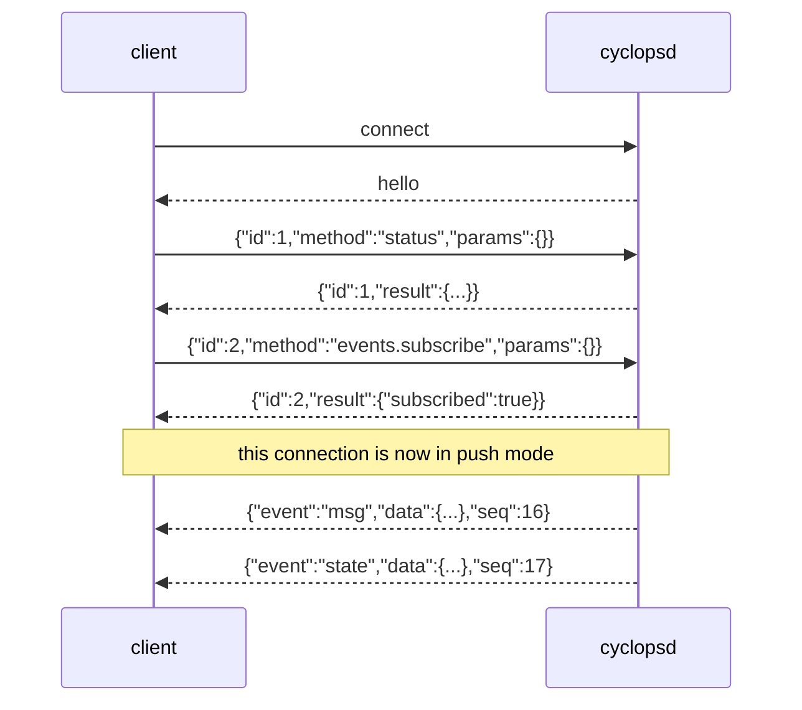

# The socket

Anything the UI does, a script can do. The CLI is a thin client over one
Unix socket at `$CYCLOPS_HOME/sock`, and the wire is NDJSON: one JSON object
per line, in both directions.

Every example below is a real exchange, captured from a running daemon.

## Talk to it

```bash
printf '{"id":1,"method":"ping","params":{}}\n' | nc -U ~/.cyclops/sock
```

The daemon writes one hello line as soon as you connect, then one response
line per request.

```
{"cyclops":"0.1.0","proto":1,"boot_id":"95064d4e-dda7-4b4c-8f25-0b7812e77c46"}
```

`boot_id` changes on every daemon restart, so a client can tell that ledger
`seq` numbering restarted. `proto` mismatching yours is a warning, never a
disconnect: unknown fields are ignored in both directions, so a newer client
and an older daemon keep working.



## Requests and responses

A request is `{"id": <anything>, "method": "<name>", "params": {...}}`. The
`id` is echoed back verbatim; use numbers or strings. Omitted `params` reads
as null, and methods whose params all default accept that.

A response carries exactly one of `result` or `error`:

```
-> {"id":1,"method":"ping","params":{}}
<- {"id":1,"result":{"pong":true,"ts":1785734886782}}
```

```
-> {"id":12,"method":"nope.nope","params":{}}
<- {"id":12,"error":{"code":"unknown_method","message":"unknown method \"nope.nope\""}}
```

Error codes are stable; messages are for humans. The ones you will meet:
`unknown_method`, `bad_request`, `no_such_target`, `denied`, `timeout`,
`occupant_changed`.

Object keys come out in alphabetical order, not struct order. Match on one
field or use `jq`; a pattern spanning two keys is a pattern about the
alphabet.

## Methods

| Method | What it does |
|---|---|
| `ping` | Liveness and round trip |
| `status` | Every watched session and pane, with fused state |
| `pane.read` | A pane's screen, its recent output, or the detection view |
| `pane.label` | Give a pane a name, or take it back |
| `msg.send` | Deliver a message; returns a receipt per recipient |
| `msg.history` | Messages from the record, filtered and paged |
| `msg.thread` | One message, its replies, and its full delivery chain |
| `agent.wait` | Block until an agent is idle, done, or blocked |
| `agent.state.report` | A hook reporting a turn edge. Only from inside the pane |
| `hooks.verify` | Hook liveness for a pane: tier and last-seen edges |
| `hooks.selftest` | One no-op delivery that proves the ack hook fires |
| `events.subscribe` | Switch this connection to push mode |
| `admin.notify` | Raise something for the human |
| `theme.reload` | Re-read the theme selection and repaint every named pane's border |

### status

```
-> {"id":2,"method":"status","params":{"open_deliveries":true}}
<- {"id":2,"result":{"boot_id":"95064d4e-...","daemon_version":"0.1.0","proto":1,
    "sessions":[{"attached":true,"name":"main","panes":[
      {"agent":"implementer","current_command":"bash","dead":false,"height":23,
       "hooks_verified":false,"in_mode":false,"manifest":"demo","pane_id":"%0",
       "state":"idle","title":"","width":40,"window_id":"@0","window_name":"duo"},
      {"agent":"reviewer","current_command":"bash","dead":false,"height":23,
       "hooks_verified":false,"in_mode":false,"manifest":"demo","pane_id":"%1",
       "state":"idle","title":"","width":39,"window_id":"@0","window_name":"duo"}]}],
    "tmux_version":"3.6a","uptime_ms":5272}}
```

(Wrapped here for reading; the wire is one line.)

`agent` is present only on named panes, `manifest` only on panes a manifest
bound. `state` is one of `unknown`, `idle`, `idle_with_input`, `working`,
`blocked_modal`, `blocked_permission`, `blocked_quota`, `dead`.

`open_deliveries: true` adds an `open_deliveries` array: every delivery
whose latest recorded state still needs a human, folded from the whole
record. Anything that shows the attention indicator must ask for it, because
that is half the rule; a caller that only wants pane state leaves it off and
pays nothing.

### pane.read

`source` is `visible`, `recent`, or `detection`. The first two return
`text`; the third returns the reasoning behind a state.

```
-> {"id":3,"method":"pane.read","params":{"target":"reviewer","source":"detection"}}
<- {"id":3,"result":{"detection":{"decided_by":"title_idle","disagreement":false,
    "readings":[{"rule":"title_idle","sensor":"title","state":"idle","ts":1785734886782}],
    "state":"idle"},"pane_id":"%1","target":"reviewer"}}
```

`decided_by` names the manifest rule that won. `readings` is what each
sensor saw. `disagreement` is true when sensors contradicted each other.

### msg.send

```
-> {"id":4,"method":"msg.send","params":{"to":["reviewer"],
    "subject":"Review the rate limiter","body":"gateway.rs:120 drops the burst path"}}
<- {"id":4,"result":{"deliveries":[{"note":"hook_ack","state":"delivered_verified",
    "to":"reviewer"}],"msg_id":"m-914b34","seq":7}}
```

`to` takes several labels, or `"*"` for every named pane. Optional params:
`fyi` (an announcement, drops the reply hint), `reply_to` (a message id),
and `wait` (`{"until":"done","timeout_ms":300000}`) to compose send-and-wait.

The sender is never in the request. The daemon resolves it from the calling
process, walking it up to a watched pane; unresolvable callers are `admin`.
Nothing in a body can forge the header the recipient reads.

One `deliveries` entry per recipient. States, in order:
`queued`, `gating`, `pasting`, `staged`, `submitted`, then
`delivered_verified` or `delivered_unverified`; failures go to
`retry_queued` and then `attention_required`, and quota goes to
`parked_blocked_quota`, which is terminal and never retried.

The daemon answers as soon as the delivery settles, capped by
`receipt_block_ms`. Keep that under the five seconds the CLI allows itself
for a socket read, or the CLI gives up on a delivery that is going fine.

### msg.history and msg.thread

```
-> {"id":5,"method":"msg.history","params":{"with":"reviewer","limit":2}}
<- {"id":5,"result":{"lines":[{"body":"gateway.rs:120 drops the burst path",
    "boot_id":"95064d4e-...","deliveries":[{"attempts":1,"cause":"hook_ack",
    "state":"delivered_verified","to":"reviewer","ts":1785734886805,
    "verified_by":"hook"}],"from":"admin","id":"m-914b34","kind":"msg","seq":7,
    "subject":"Review the rate limiter","to":["reviewer"],"ts":1785734886782}],
    "next_cursor":7}}
```

Filters: `with` (both directions plus broadcasts), or `from` and `to`. Pick
one shape. Lines come back oldest first, so the newest is last. Each line's
`deliveries` are folded to the current state per recipient at read time; the
files themselves are never rewritten.

Page with `next_cursor` fed back as `cursor`. With more than one watched
session the daemon issues `next_cursor2` instead and takes it back as
`cursor2`, because a per-file seq would skip lines hiding behind another
file's numbering.

`msg.thread` returns the message plus every reply chaining to it plus its
whole delivery chain, oldest first. The chain is one line per transition,
all sharing the message id:

```
-> {"id":6,"method":"msg.thread","params":{"id":"m-914b34"}}
<- {"id":6,"result":{"lines":[
    {"kind":"msg","seq":7,"from":"admin","to":["reviewer"],"subject":"Review the rate limiter",...},
    {"kind":"state","seq":8,"data":{"from":"queued","to_state":"gating",...},...},
    {"kind":"gate","seq":9,"data":{"action":"proceed","rule":"title_idle","to":"reviewer"},...},
    {"kind":"state","seq":10,"data":{"from":"gating","to_state":"pasting",...},...},
    {"kind":"state","seq":11,"data":{"from":"pasting","to_state":"staged",...},...},
    {"kind":"state","seq":12,"data":{"from":"staged","to_state":"submitted",...},...},
    {"kind":"state","seq":13,"data":{"cause":"hook_ack","from":"submitted",
                                     "to_state":"delivered_verified",...},...}]}}
```

(Fields elided at the `...` are the ones already shown above: `boot_id`,
`id`, `ts`, `from`, `to`, `deliveries`. The full lines are in the ledger
file.)

### agent.wait

```
-> {"id":7,"method":"agent.wait","params":{"target":"reviewer","until":"idle","timeout_ms":5000}}
<- {"id":7,"result":{"outcome":"reached","pane_id":"%1","state":"idle",
    "target":"reviewer","until":"idle","waited_ms":0}}
```

`until` is `idle`, `done`, or `blocked`. The daemon watches its own state
stream and holds the response; nothing polls, on either side. Set your read
deadline above `timeout_ms`.

Two failures have their own codes rather than an outcome: `timeout` (its
`data` carries the state the target was last in) and `occupant_changed`, the
pinning rule. The wait records the pane and its process at the start, and if
either changes it refuses to answer for whoever lives there now.

### pane.label

```
-> {"id":10,"method":"pane.label","params":{"target":"%1","label":"reviewer"}}
<- {"id":10,"result":{"label":"reviewer","manifest":null,"pane_id":"%1","target":"%1"}}
```

`"label": null` takes the name back. `"manifest": "claude"` pins which CLI
is in the pane instead of working it out from the process.

### agent.state.report

This is the one method a script should not call. It is how a vendor hook
reports a turn edge, and it is accepted only from a process running inside
the pane it speaks for, checked against the connection's kernel peer
credentials:

```
-> {"id":11,"method":"agent.state.report","params":{"agent":"reviewer","event":"Stop","payload":{}}}
<- {"id":11,"error":{"code":"denied","message":"hook reports for \"reviewer\" are only
    accepted from a process inside that pane; this peer is not (admin cannot post hook
    reports)"}}
```

Real hooks pass by construction: `cyclops hook` runs as a child of the agent
CLI inside the pane. So neither a verified receipt nor the `hooks verified`
bit can be forged by something that merely shares your user id.

### hooks.verify

```
-> {"id":8,"method":"hooks.verify","params":{"target":"reviewer"}}
<- {"id":8,"result":{"events":[{"event":"UserPromptSubmit","last_seen_ms_ago":2010},
    {"event":"Stop"}],"hooks_verified":true,"manifest":"demo","pane_id":"%1",
    "target":"reviewer","tier":1}}
```

`tier` 1 means this CLI has a hook whose payload can prove a delivery
arrived; tier 2 means screen evidence is the best available. An event with
no `last_seen_ms_ago` has never fired this daemon run. Liveness belongs to
the pane's current occupant: restart the CLI and it starts over.

### events.subscribe

Sending it switches the connection to push mode. Responses to earlier
requests still arrive; unsolicited event lines now arrive too.

```
-> {"id":1,"method":"events.subscribe","params":{"kinds":["msg","state"]}}
<- {"id":1,"result":{"subscribed":true}}
<= {"event":"msg","data":{"body":"x","from":"admin","fyi":false,"id":"m-9302fb",
    "reply_to":null,"subject":"ping the stream","to":["reviewer"]},"seq":16}
```

`kinds` filters by event-name prefix; leave it empty for everything. An
event line has no `id` and never answers a request, so tell the two apart by
the presence of `event`. `seq` is the ledger seq when the event corresponds
to a ledger line.

Use a second connection for the stream if you also want to make requests.
`cyclops watch --json` is exactly this.

### theme.reload

```
-> {"id":2,"method":"theme.reload","params":{}}
<- {"id":2,"result":{"theme":"dark"}}
<= {"event":"theme","data":{"name":"dark"}}
```

No params. The daemon reads the `theme` key out of `$CYCLOPS_HOME/config.toml`
itself, so a client and the config can never disagree about what is on.
Write the key, then call this; `cyclops theme <name>` is those two steps.

It repaints every adopted pane's tmux border and returns the name now
active. That name is what is ON SCREEN, which is not always what you just
asked for: a theme file that will not load, or one caught mid-save, is
refused and the borders keep the palette they had (docs/themes.md).

The `theme` event carries the name and no colors. Every surface resolves
its own from the same selection; one that took a palette off the wire could
show a theme no file on the machine holds.

## Events

Every event the daemon emits. `kinds` on `events.subscribe` filters by
name prefix, so these are the strings to filter on.

| Event | What happened | `seq` |
|---|---|---|
| `msg` | a message was sent | yes |
| `delivery-state` | one delivery moved to a new state | yes |
| `gate` | the delivery gate decided about a recipient | yes |
| `state` | a pane's fused state changed | yes |
| `session` | a watched session attached or detached, or a pane was named | yes |
| `admin-notify` | something was raised for the human | yes |
| `pane-removed` | a watched pane closed | no |
| `theme` | the active theme was re-read | no |

`seq` is the ledger seq of the line the event corresponds to, so a client
can go from an event to the record and back. Two events have no line
behind them. A pane closing appends nothing to the ledger, so `pane-removed`
is the only notice a subscriber gets that a pane is gone; it is still a
fact about a pane and the UI shows it in the stream. `theme` is the one
event that is not a fact about the record at all: nothing happened to any
message or pane, only to how they are drawn. `cyclops-ui` special-cases it
(`crates/cyclops-ui/src/data.rs`) into a wake-up rather than a stream entry.

Real lines, one send and one pane close, off an isolated rig:

```
{"event":"msg","data":{"body":"x","from":"admin","fyi":false,"id":"m-9edeeb","reply_to":null,"subject":"ping the stream","to":["reviewer"]},"seq":5}
{"event":"gate","data":{"action":"proceed","cause":null,"id":"m-9edeeb","rule":"always_idle","to":"reviewer"},"seq":7}
{"event":"delivery-state","data":{"attempts":1,"cause":"screen_evidence","from":"submitted","id":"m-9edeeb","note":null,"to":"reviewer","to_state":"delivered_unverified","verified_by":"screen"},"seq":11}
{"event":"state","data":{"decided_by":"always_idle","disagreement":false,"pane_id":"%1","prior":null,"state":"idle","target":"%1"},"seq":6}
{"event":"session","data":{"label":"reviewer","name":"main","pane_labeled":"%0"},"seq":4}
{"event":"session","data":{"attached":false,"name":"main"},"seq":7}
{"event":"admin-notify","data":{"body":"92% on /","id":"e-c264b4","level":"action_required","subject":"disk is filling"},"seq":5}
{"event":"pane-removed","data":{"pane_id":"%1","session":"main","ts":1785740535657}}
```

New event names are additive: an unknown one is a line with an `event` your
client does not know, and ignoring it is correct.

## The record underneath

The socket is a live view of files you can read directly:
`~/.cyclops/ledger/<session>.ndjson`, one line per fact, append-only, never
rewritten. Line shape matches what `msg.history` returns, minus the read-time
folding. No daemon needs to be running.

```bash
jq -c 'select(.kind == "msg")' ~/.cyclops/ledger/main.ndjson
jq -c 'select(.id == "m-914b34")' ~/.cyclops/ledger/main.ndjson   # one message, everything that happened to it
```

`kind` is `msg`, `fyi`, `state`, `gate`, or `system`. Secrets never enter
these files.

## Or just use the CLI

Every command takes `--json` and prints exactly what came off the socket:

```bash
cyclops --json status | jq '.sessions[].panes[] | {agent, state}'
cyclops --json history --with reviewer --limit 20
cyclops watch --json | jq -c 'select(.event == "state")'
```

Exit codes are documented per command, and scripts branch on them: `0` fine,
`1` needs a human or the daemon is unreachable, `2` a usage error, and `3`
from `cyclops wait` for the occupant change.
