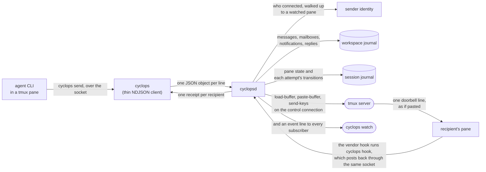
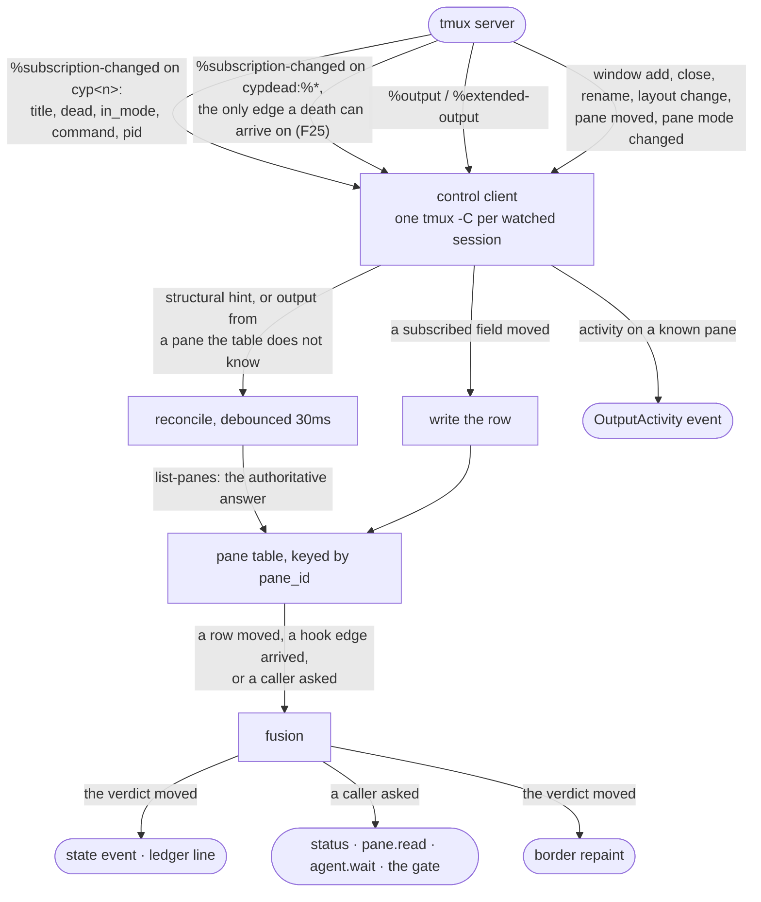
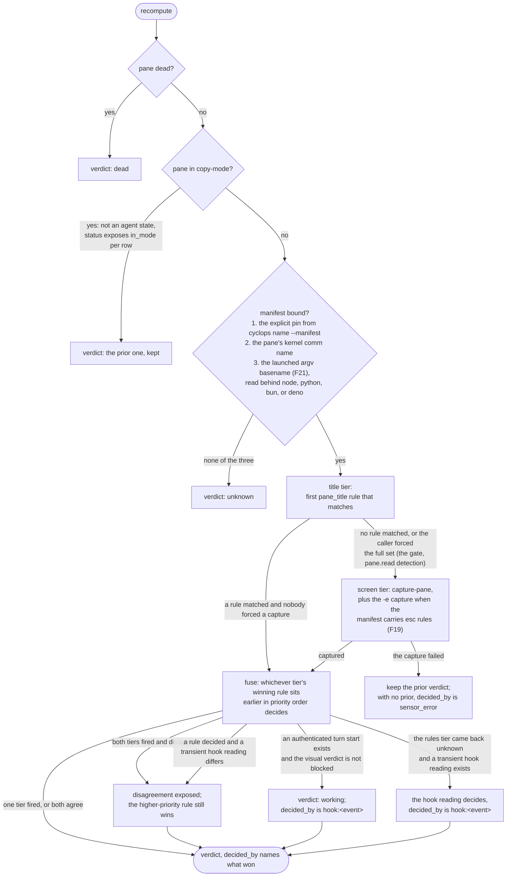
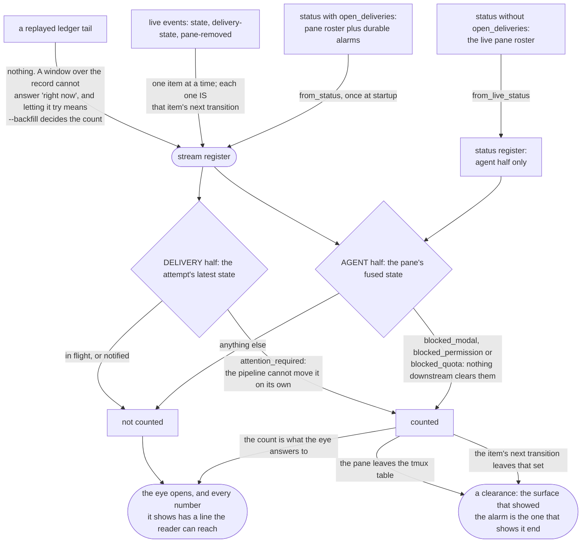
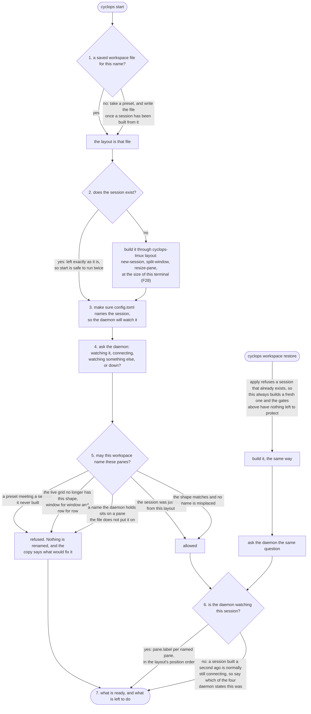

# How a message gets from one pane to another

**Status:** Current behavior contract

Cyclops is a tmux-backed coordination daemon for terminal coding agents.
This page follows one message end to end and names, at every fork, the file
that decides. Read it once and you can put your finger on where any
behavior comes from.

The shape is frozen by ADR-001 and by the validation campaign's amendments.
Neither document is in this repository. Both live in the separate
`cyclops-arch` design repo, which this clone does not carry, and you do not
need either to read this page: every frozen decision and every lettered
amendment is tabled at the end of it against the file that implements it,
and the measurements they rest on are [findings.md](../../findings.md).
Everything described here is in the tree and under test. There is one
delivery path: the durable mailbox plus one doorbell line, specified in
[DELIVERY.md](DELIVERY.md).

## The shape of it

Four rules hold the whole design up.

- **tmux owns the terminal.** Cyclops never hosts a pty. It asks tmux and
  tmux answers, over the interface tmux calls control mode.
- **The journals are the record.** Append-only NDJSON, one workspace journal
  for mailbox facts and one session journal for pane state and each
  attempt's transitions, written before anything downstream believes a fact.
- **Nothing polls.** Every recompute rides an event that already happened.
- **Every tmux specific lives in `src/cyclops-tmux`.** Control mode is
  unversioned and moves between releases, so one crate absorbs that.

The sender is never in the request. The daemon resolves it from the peer
credentials on the socket and walks that pid up to a watched pane, so
nothing in a body can forge the header a recipient reads.

## The daemon's rooms

`cyclopsd` is one process with a few rooms, each a module or a directory:

- **Observation:** `src/cyclopsd/src/fusion.rs` turns pane rows, captures,
  and hook edges into one verdict per pane and owns the composer hold.
- **Mailbox:** `src/cyclopsd/src/mailbox/` is the durable record. `store.rs`
  appends and replays the workspace journal, `projection.rs` folds it, and
  `directory.rs` maps recipients to panes. `src/cyclopsd/src/messaging.rs`
  is the operation boundary the socket handlers call: send, reply, claim,
  snapshot, requeue, withdraw.
- **Delivery:** `src/cyclopsd/src/delivery/`, one worker per recipient and
  the gate ([DELIVERY.md](DELIVERY.md)); `src/cyclopsd/src/notification_adapter.rs`
  is how it appends notification facts.
- **Identity:** `src/cyclopsd/src/identity.rs`, who a socket peer is, from
  kernel credentials and a walk up the process tree.
- **Sessions:** `src/cyclopsd/src/livesession.rs`, `src/cyclopsd/src/sessionstore.rs`,
  and `src/cyclopsd/src/session_history.rs`: which tmux session a name is,
  and how a session journal replays across a rename. `src/cyclopsd/src/registry.rs`
  holds the adopted-pane roster.
- **Chrome:** `src/cyclopsd/src/chrome.rs`, the one string the daemon paints
  onto a pane border.
- **Socket:** `src/cyclopsd/src/server.rs`, one handler per wire method, and
  `src/cyclopsd/src/lib.rs`, the composition root that wires the rooms
  together.

The append and sync inside `src/cyclopsd/src/mailbox/store.rs` are the
acceptance boundary. Notification and pane chrome are effects of that durable
fact, never a condition for whether the message exists.

## Watching: how the daemon knows what a pane is doing

Notifications are hints, not truth. Truth comes from `list-panes`, and the
daemon re-asks whenever a hint arrives or a doubt exists, so a missed event
costs freshness and never correctness (ADR revision 1, level-triggered
core). `src/cyclops-tmux/src/watcher.rs` owns this loop.

### Fusion: which sensor decides

`src/cyclopsd/src/fusion.rs`, `observe_pane`. Manifest rules are sorted by
priority once at load; every tier below picks the first rule that matches,
and the fused verdict is whichever tier's winner sits earlier in that one
order.

Screen capture is evidence of last resort (amendment h): a pane_title rule
that decides alone skips `capture-pane` entirely. A sensor that fails is
doubt, not evidence, which is why a failed capture keeps the prior verdict
instead of flipping the pane.

A transient hook reading counts as live for 300s and is dropped after three
consecutive recomputes where the rules tier decided against it. A confirmed,
keyed turn start reports `working` immediately and stays active until
process-binding retirement or the authenticated end for that exact key.
An unkeyed confirmed vendor contract may pair runtime start and end events
from the same process binding, but it does not create message-level turn
correlation.

Claude exposes no key shared by `UserPromptSubmit` and `Stop`. Its prompt hook
therefore publishes provisional `working` immediately but remains only a
dispatch candidate. A later lifecycle-capable visual Working frame confirms
acceptance of the exact pending notification. Fresh visual state then owns the
return to idle. Cyclops does not pair Claude's next `Stop` with that prompt by
arrival order or elapsed time. Blocked states always come from rules because
no tested CLI hook identifies its modals or quota screens.

The composer is a separate question from the runtime state, and the gate
asks it separately: `fusion::composer_is_held` answers whether a positively
observed human draft or a hold a delivery owns is in the composer. An
ambiguous or unreadable composer is not a hold. [DELIVERY.md](DELIVERY.md)
has the rest.

## What needs a human, and who owns it

The eye is the signature device, and its vocabulary appears on the stream
header, the `--plain` eye line, and `cyclops status`. All three read
`src/cyclops-proto/src/attention.rs`; none reimplements the state predicates.
The stream and plain follow include durable delivery alarms. Normal
`cyclops status` is intentionally narrower and reports the live pane fleet,
not every durable mailbox alarm. When a live pane holds a doorbell that has
not been consumed, status reports the separate runtime, composer, notification,
message, and next-action facts. Durable recovery and historical alarms remain
on the mailbox, alarm, and stream surfaces.

Two failures shaped that picture. Deriving the count from the displayed
stream made `--backfill 200` and `--backfill 400` disagree about whether
anything was wrong. And a blocked pane that later closed stayed counted
forever, because the snapshot is taken once and re-taking it on a timer
would be polling: `pane-removed` is that pane's last transition and the
only thing that can drop it.

A receipt settles once the pipeline will not move the attempt on its own,
which includes `notified` with no verifier. Whether one still needs a human
is this separate question with this separate owner.

`src/cyclops-proto/tests/one_place.rs` is a tripwire against a second
implementation. Read its header before trusting a green run: it catches
the copies people write without meaning to, and it says plainly that it
cannot catch a determined one.

## Workspaces: how a session comes back

A name lives in exactly two places. The daemon's registry holds it while
the pane is alive; a workspace file holds it when the panes are gone.
`cyclops start` and `cyclops workspace restore` carry names from the file
to the registry, `cyclops workspace save` reads them back out of `status`,
and `pane.label` is the one call where the two paths meet.

The gates exist because a workspace file holds no pane ids and cannot: the
panes it describes are usually gone by the time it is read, and tmux hands
a freed id to the next pane it makes. All the file has to point at a pane
with is WHERE the pane sits, and that points at something only while the
grid still matches and every name already on a pane is where the file puts
it. Pane count is not that check: `ops` and `quad` both hold four panes,
and mapping either onto the other renames every agent onto a pane it does
not own. Never type into the wrong pane (GOALS).

Restore rebuilds panes, sizes, directories and labels. It starts no
process unless you pass `--launch`, and even then tmux runs the command as
the pane's own; no keys are sent anywhere. Details:
`docs/guides/workspaces.md`.

## Writing into tmux

The daemon writes INTO tmux on two paths that never touch each other.
Keeping them apart is the whole design: one is the daemon's, on a
control-mode connection it already owns, and one is a client's, on one-shot
invocations against a server no daemon need be watching.

Each of those eight edges is fired by one function, and no function fires
two:

| Edge | Fired by |
|---|---|
| adoption | `adopt_pane` |
| a fused state change | `apply_pane_observation` |
| a clear | `unadopt_pane` |
| a session attach | `reconcile_adoptions` |
| a window move | `move_chrome` |
| a pane close | `handle_pane_event` |
| daemon shutdown | `restore_all_chrome` |
| a theme switch | `reload_theme` |

The four that paint a set of panes (adoption, session attach, window move,
theme switch) all paint through one function, `paint_adoptions`.
`src/cyclopsd/src/chrome.rs` holds the same table and a test reads this
page against it, so a ninth caller cannot leave these three pages
describing the old set.

Chrome sets options and takes them back. The pane's prior
`pane-border-format` and the window's prior `pane-border-status` are
snapshotted at adoption and put back on `--clear`, on pane close, on a
window move (the window the pane left), and at shutdown. F27 says why the
window scope is unavoidable, F26 why the pane title is never written. The
`chrome = "off"` switch lives in `chrome.rs` and nowhere else, and the
snapshot is taken even when it is off, so a restore never unsets an option
cyclops did not read.

The layout path sets no option, writes no pane title, and sends no keys.
Nothing it does needs undoing, and it cannot collide with the chrome the
daemon owns.

## Where each decision lives

One line per crate. Each crate's own `//!` header states what it owns and
what it deliberately does not; read that before changing one.

| Crate | Owns |
|---|---|
| `cyclops-proto` | Wire types, journal schemas, the notification state machine, the attention rule. Data only, no IO. Everything compiles against it (docs/reference/PROTOCOL.md). |
| `cyclops-manifest` | Per-CLI detection rules as TOML data: regions, priorities, modal decline keys, the submit key (docs/reference/MANIFESTS.md). |
| `cyclops-tmux` | The tmux adapter and the blast wall: nothing outside it speaks to tmux. Control mode, the reconciling pane table, version parsing, one-shot focus and layout. |
| `cyclopsd` | The daemon: watcher, fusion, mailbox, delivery pipeline, journal writers, socket server, adoption registry, pane chrome. |
| `cyclops` | The CLI: a thin NDJSON client plus the human-facing renderers, `cyclops hook`, and the workspace verbs. |
| `cyclops-ui` | The stream behind `cyclops watch`: admin view, firehose, the eye, jump-to-pane, windowed rendering over a 10k ring (docs/guides/ui.md). |
| `cyclops-workspace` | The full-screen workspace behind bare `cyclops`: Ratatui/Crossterm chrome, embedded pane VT runtimes, direct manipulation, dialogs, and persistence. |
| `cyclops-state` | Owner-only state paths beneath one validated root descriptor. Refuses links, unexpected file types, foreign owners, and paths that escape the root. |
| `cyclops-ledger` | Crash-safe append-only NDJSON writer and cursor reader. Fsync before acknowledging; newline-terminated records are immutable, while strict replay removes only an unterminated unacknowledged final tail. |
| `cyclops-theme` | The semantic token vocabulary, theme files, 256-color fallback, selection and hot reload (docs/guides/themes.md). |
| `cyclops-testrig` | Test-only. The isolated tmux server and the one statement of its teardown rule. |

Non-crate directories: `resources/manifests/` (the twelve shipped detection
files, five measured and seven unverified), `resources/hooks/` (vendor hook
config templates `cyclops hooks install` renders), `resources/layouts/` (the
four workspace presets, compiled in with `include_str!` so a fresh install
has them before it has a config file), `resources/themes/` (the seventeen
shipped token files, and the source of truth two SHIPPED lists are held to),
`demos/` (runnable end-to-end scripts; `tests/e2e/lib/lib.sh` holds the two
rules the scripts must not copy, the scratch root and the tmux teardown),
`tests/e2e/lib/` (the Python probe harness), `website/` (the landing page for
usecyclops.dev, outside the Cargo workspace and checked by its own CI job).

### The frozen decisions

| ADR-001 decision | Lives at |
|---|---|
| Single daemon, one `tmux -C` client per session (T3) | `src/cyclops-tmux/src/control.rs`, owned by `cyclopsd` |
| Level-triggered reconciling core, not an event mirror (revision 1, C2) | `src/cyclops-tmux/src/watcher.rs` |
| Sensor fusion with per-sensor readings and observable disagreement (revision 2) | Types in `src/cyclops-proto/src/state.rs`; engine in `src/cyclopsd/src/fusion.rs`; hook sensor fed from `src/cyclopsd/src/ack.rs` |
| Detection rules are per-CLI data, not code (H2) | `cyclops-manifest`, the twelve files in `resources/manifests/` |
| NDJSON Unix socket, hello line first, version mismatch warns never rejects (S2) | `src/cyclops-proto/src/wire.rs`; server in `src/cyclopsd/src/server.rs` |
| Append-only NDJSON ledger, monotonic seq plus boot_id, replayable by cursor (C6) | Schema in `src/cyclops-proto/src/ledger.rs`; writer in `cyclops-ledger`. The daemon owns retained history traversal and serves the stream a bounded body-free `events.backfill` projection. `events.subscribe` is explicitly ephemeral; durable mailbox recovery uses `messages.follow` |
| Delivery pipeline: queue, gate, paste, one readback, Enter, receipt; only proven pre-write failures retry, and only a physical write failure needs attention | `src/cyclops-proto/src/notification.rs` for the machine, `src/cyclopsd/src/delivery/` for the pipeline |
| Turn detection from hooks via a `cyclops hook` receiver | `wire.rs` (`agent.state.report`), `src/cyclops/src/hook.rs`, `src/cyclopsd/src/ack.rs` |
| Agent surface: thin CLI speaking NDJSON to the socket | `src/cyclops` |
| v1 keepers: fail-closed ACL, data-only config, explicit pane adoption, identity from socket peer | `src/cyclopsd/src/identity.rs` (peer creds plus a pid-ancestry walk to a watched pane), `src/cyclopsd/src/registry.rs` |
| tmux specifics confined to one adapter, CI against tmux HEAD | `src/cyclops-tmux`; advisory tmux-HEAD CI job. One invocation is outside it: `cyclopsd::probe_tmux` runs `tmux -V` and parses through the adapter, which the adapter's own header names as the exception |

The MCP front-door on the same daemon (option D absorbed) is not built and
is not a dependency of anything shipped.

### The validation amendments

Letters follow the admin's build brief. The related change number from the
validation report's section 8 is in parentheses; that report is in
`cyclops-arch` and not in this tree, so the table below is the whole of it
you need. The report's change 1 (per-agent ACK capability tiers) is a frozen
decision in the brief rather than a lettered amendment; it lives in
`cyclops-manifest` `Hooks.ack` (None means the screen tier), `notification.rs`
`VerifiedBy`, and the manifests (`agy.toml` declares no ack).

| | Amendment | Lives at |
|---|---|---|
| a | `pause-after` set on the control connection at attach (2) | `src/cyclops-tmux/src/control.rs` attach handshake; F15 covers the `%extended-output` consequence |
| b | `bracket_paste_flag` unavailable through tmux 3.6a, so the paste is read back once after it lands (3) | `src/cyclops-tmux/src/version.rs`; the readback in `src/cyclopsd/src/delivery/gate.rs`, `attempt_delivery` |
| c | Daemon self-test proving hooks actually fire, F1: Codex loads zero hooks in untrusted dirs, silently (4) | `src/cyclopsd/src/selftest.rs`: per-pane edge liveness, `hooks.verify`, `hooks.selftest` (one real fyi through the mailbox path), the `hooks_verified` bit, one F1 ping per zero-edge pane |
| d | Dedupe hook events on (session_id, turn_id, event), F2: Codex double-fires across config layers (5) | `src/cyclopsd/src/ack.rs`, plus the reporter's own seq |
| e | Unique tmux buffer name per delivery, F4: named buffers are global and concurrent senders race (6) | `src/cyclopsd/src/delivery/inject.rs`: `cyc-<pid>-<seq>` loaded from a 0600 spool file in a 0700 directory |
| f | Terminal `blocked_quota`: hold and alert, never auto-retry, F11 (9) | `state.rs` `BlockedQuota`; the gate holds on `blocked_quota` and waits for the pane to change, `src/cyclopsd/src/delivery/gate.rs`, `admit` |
| g | Modal vocabulary is per-CLI data with explicit decline options, never a generic Enter or Escape, F3, F12, F20 (8) | `cyclops-manifest` `decline_keys` plus `auto_dismiss`; `resources/manifests/*.toml` |
| h | Fusion is rare-blocked-state coverage, not steady-state accuracy (7) | `src/cyclops-proto/src/state.rs` module header; the tier order in `src/cyclopsd/src/fusion.rs` |
| i | Delivery behind a trait so per-agent backends can swap without touching the layers above | `src/cyclopsd/src/delivery/inject.rs`: the `Injector` trait (spool, commit, submit, capture) with `TmuxInjector` as the only backend; the gate and the receipt wait call through the seam only |

## The zero-polling contract

Idle CPU near zero is a hard goal (GOALS.md). Concretely:

- No interval timers re-querying tmux, panes, or files. State changes
  arrive as control-mode notifications and `refresh-client -B` subscription
  reports; hook reports arrive as socket requests.
- Reconciliation is event-triggered: a notification, a socket request, or a
  delivery gate check may trigger authoritative queries. A clock may not.
- Screen capture runs only at gate time or when a hint puts fused state in
  doubt, never on a schedule.
- Daemon stalls are in-band, not watchdog-polled: `pause-after` converts
  falling behind into `%pause` and `%continue` notifications (amendment a).
- Clients never poll the daemon: `events.subscribe` pushes. After each
  acknowledged connection, the stream UI installs one daemon-owned
  `events.backfill` plus current-status replacement before it resumes live
  events. A later replacement is caused only by an observed gap and explicit
  reconnect.

Timers do exist; none of them is an interval. Each is a one-shot tied to
one thing that already happened: the post-paste readback re-reads, the
tier-1 ACK window, the screen-evidence checkpoints, the decline spacing, the
two bounded re-observations of a hold that announces no event, the gate's
single wedged-hold ping, the watcher's reconnect backoff, the deadlines a
caller asked for, and a candidate lifecycle settle deadline armed by an
authenticated hook edge. The lifecycle worker coalesces by pane, attempts
each generation once per observation, and parks until another event.

Sanctioned exceptions, none in the product: the Python probe harness
(`tests/e2e/lib/`) polls because it is a measuring instrument, the test
rigs wait in bounded loops for things a test has no edge to await
(`cyclops-testrig`'s `wait_screen`), and demo scripts may wait in a bounded
loop for process startup or for the record to settle between narration
steps.
