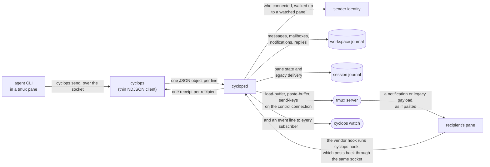
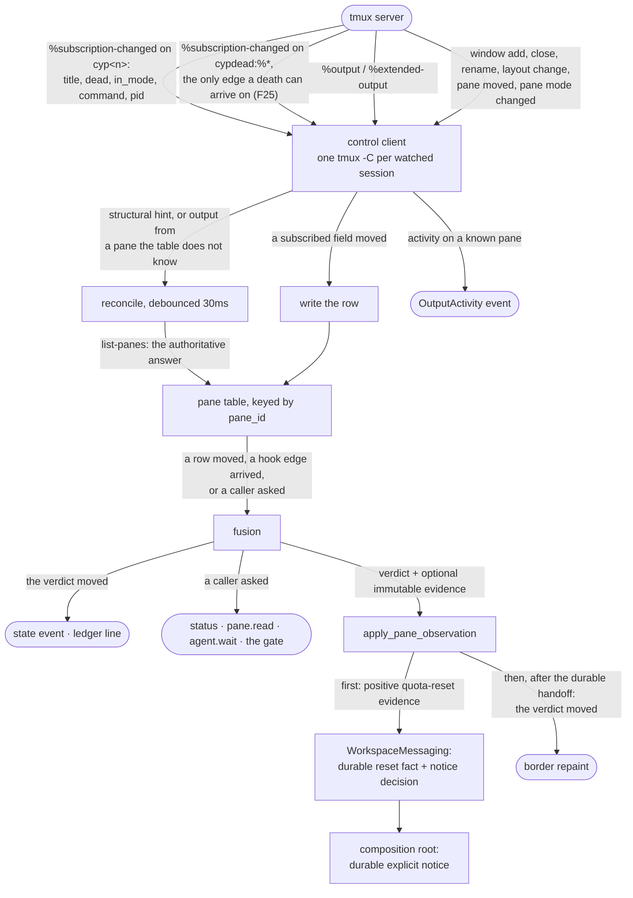
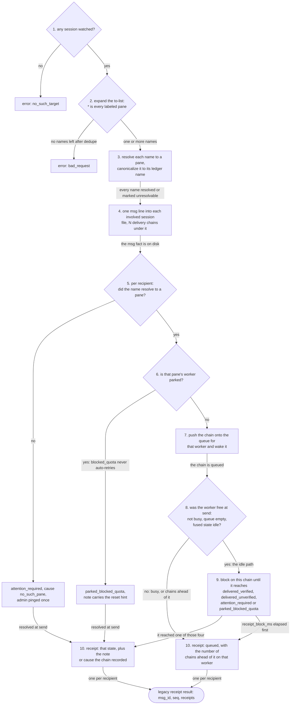
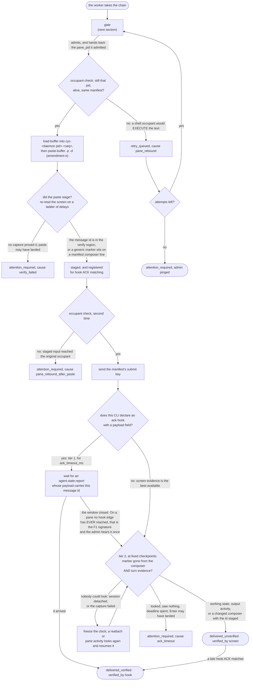
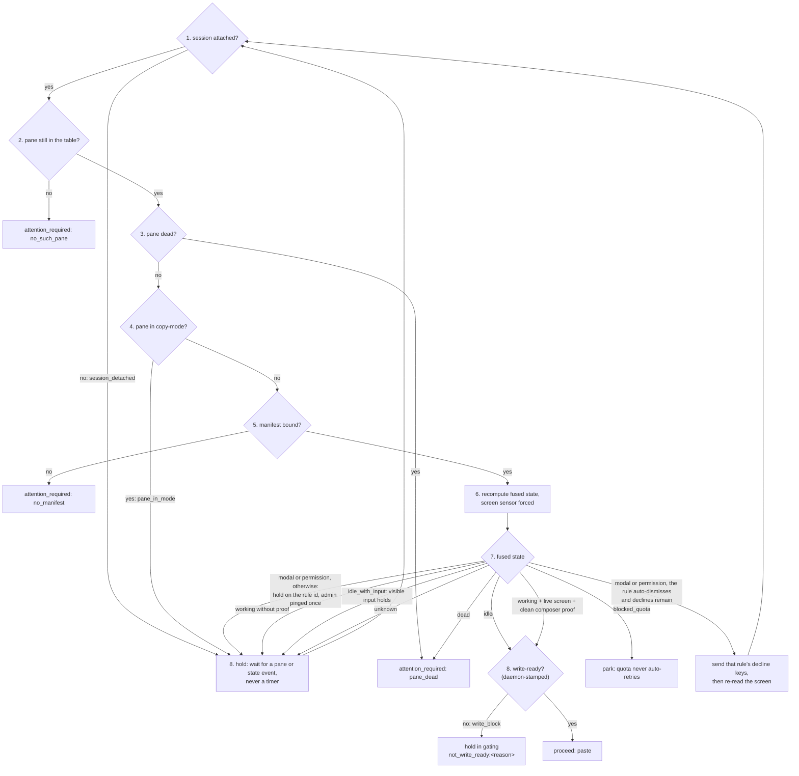
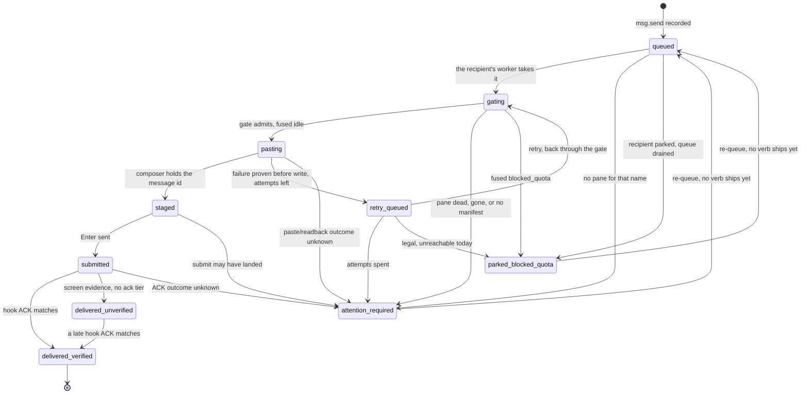
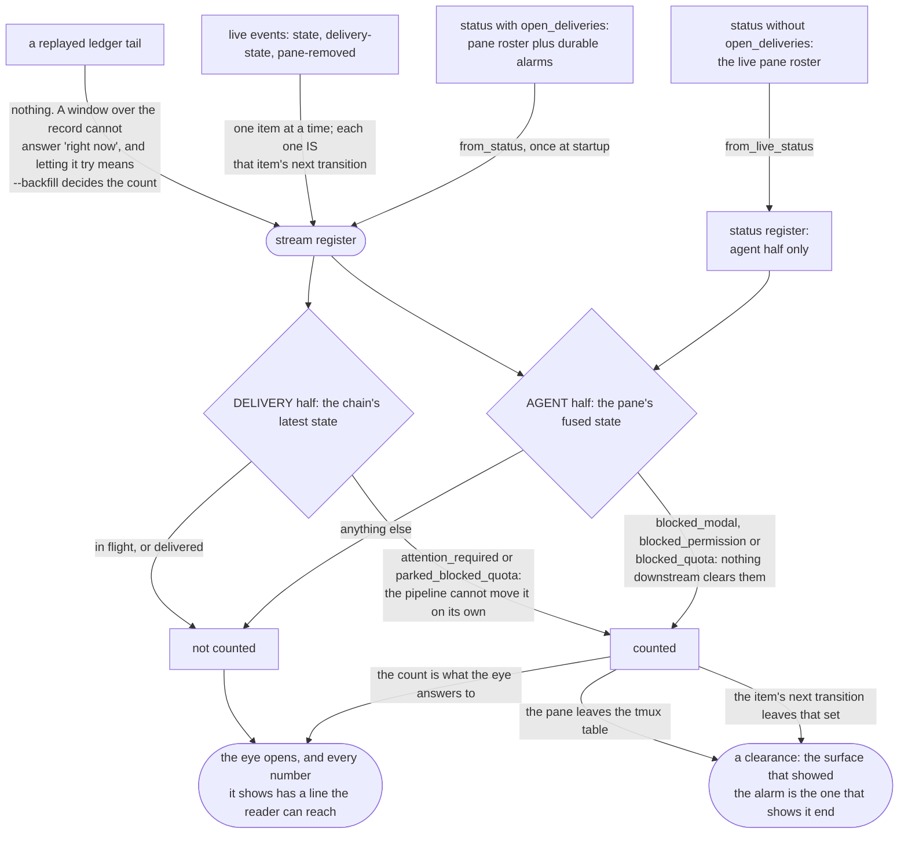
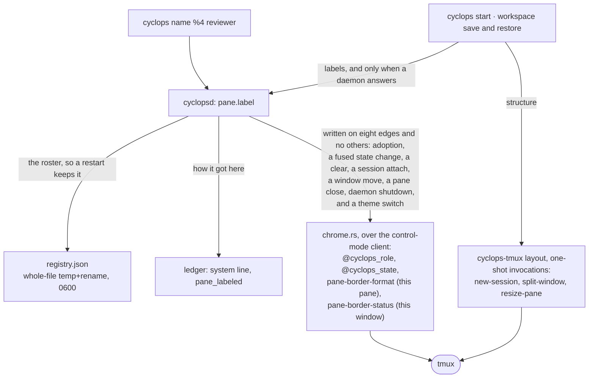

# How a message gets from one pane to another

Cyclops v2 is a tmux-backed coordination daemon for terminal coding agents.
This page follows one message end to end and names, at every fork, the file
that decides. Read it once and you can put your finger on where any
behavior comes from.

The shape is frozen by ADR-001 and by the validation campaign's amendments.
Neither document is in this repository. Both live in the separate
`cyclops-arch` design repo, which this clone does not carry, and you do not
need either to read this page: every frozen decision and every lettered
amendment is tabled at the end of it against the file that implements it,
and the measurements they rest on are [findings.md](../../findings.md).
Everything described here is in the tree and under test. Two delivery paths
coexist. The current default is the durable mailbox plus one safe notification,
specified in [DELIVERY.md](DELIVERY.md). The terminal pipeline diagrams below
document the still-shipped legacy direct-payload compatibility path. They are
not the default `msg.send` contract.

## The shape of it

Four rules hold the whole design up.

- **tmux owns the terminal.** Cyclops never hosts a pty. It asks tmux and
  tmux answers, over the interface tmux calls control mode.
- **The journals are the record.** Append-only NDJSON, one workspace journal
  for mailbox facts and one session journal for pane state and legacy delivery,
  written before anything downstream believes a fact.
- **Nothing polls.** Every recompute rides an event that already happened.
- **Every tmux specific lives in `src/cyclops-tmux`.** Control mode is
  unversioned and moves between releases, so one crate absorbs that.

The sender is never in the request. The daemon resolves it from the peer
credentials on the socket and walks that pid up to a watched pane, so
nothing in a body can forge the header a recipient reads.

## Current mailbox messaging: the durable operation boundary

`src/cyclopsd/src/messaging.rs` contains the internal `WorkspaceMessaging`
Module. The socket handlers authenticate the caller, then hand this Module an
identity and a send, reply, inbox, claim, snapshot, follow, requeue, or exact
pre-write withdrawal request. Alarm administration and attention selection use
the same boundary. They do not receive the workspace journal, mailbox
projection, publication lock, notification worker, unread scheduler, or pane
route.

`WorkspaceMessaging` owns the durable acceptance call and the complete
post-commit sequence: subscribe before worker scheduling, schedule every exact
recipient without revoking an accepted message, invalidate unread projections,
observe the bounded durable receipt state, and resolve body-free pane metadata.
It also owns body-free inbox and message reads, the compatibility-sensitive
claim-locator choice, the durable claim transition, and the exact post-claim
sequence for notification settlement, cancellation, recovery, FIFO advance,
attention reconciliation, and unread invalidation. Socket adapters receive wire
results rather than mailbox projection or claim-outcome types. Requeue and
pre-write withdrawal also stay atomic at this boundary: the Module commits the
durable mutation, then owns notification scheduling, exact cancellation, FIFO
advance, and unread invalidation. Publication synchronization is owned inside
the Module and exposed only through Module operations that require one
consistent transaction.
The Module also owns body-free alarm summaries, administrator clearance, exact
attention-target selection, ambiguity, and recipient visibility. The separate
attention-resolution mechanism receives the selected attempt through a narrow
internal handoff because it must inspect the terminal and may execute one
manifest key. Resolution reservation, durable intent, accepted-action,
consumption, final settlement, and pre-key withdrawal cross back through
`WorkspaceMessaging`; terminal code does not append those facts itself. The
Module also selects exact-owned reconciliation candidates, owns boot-local
worker election and conflict parking, and returns one exact action at a time.
The composition adapter hosts task execution, while the terminal mechanism no
longer scans messaging projections or coordinates reconciliation workers.
Expected payload reconstruction, current route lookup, exact consumption
registration, and deterministic registration cleanup are named Module
operations; terminal code never receives `MailboxService`. The socket adapter
never receives the mailbox record or decides who may inspect it.
Daemon status receives one body-free `WorkspaceMessaging` projection containing
mailbox routes, unread counts, held attention, and the bounded blocked-wake
sample. The same projection owns active composer-candidate cardinality, durable
binding comparison, mailbox-state mapping, recovery policy, and the finished
next action. Status composition supplies only current content-free pane evidence
and keeps the legacy session-ledger fold separate; it does not inspect mailbox
variants, recovery variants, worker ownership, directory fallbacks, or
notification indexes.
The daemon composition root in `src/cyclopsd/src/lib.rs` constructs the Module
and supplies those downstream actions through one narrow effects capability.
Only that composition adapter may upgrade the non-owning daemon-root reference;
the `WorkspaceMessaging` operation code can name capabilities but cannot
traverse `Inner`. The Module remains internal to `cyclopsd`; no messaging crate
has been extracted. Delivery and attention mechanisms report a changed durable
notification head back to the Module; they no longer receive the mailbox
service and call the recipient scheduler themselves. Fusion and authenticated
ACK handling now publish immutable route evidence, while delivery and socket
code invoke named Module operations after durable pre-write, notification,
attention, and force-submit-setting changes. Those callers no longer choose
route reconciliation, reminder, or force-submit workers. The retained runtime
mechanisms are reachable only through the composition adapter; narrowing their
remaining daemon-root capabilities is still an explicit Milestone 3 completion
target.

The append and sync inside `MailboxService` are still the acceptance boundary.
Notification and pane chrome remain effects of that durable fact, never a
condition for whether the message exists.

Fresh pane observation and durable messaging also meet at this boundary for
the first extracted consequence family. Fusion commits the pane cache and
returns an immutable quota-reset observation containing the exact recipient,
pane, and session slot. `WorkspaceMessaging` turns that observation into
`QuotaResetObserved` journal facts and decides the explicit administrator
notice that the daemon composition root commits. The observer does not append
those facts, and reset observation never requeues or writes to the terminal.

## Watching: how the daemon knows what a pane is doing

Notifications are hints, not truth. Truth comes from `list-panes`, and the
daemon re-asks whenever a hint arrives or a doubt exists, so a missed event
costs freshness and never correctness (ADR revision 1, level-triggered
core). `src/cyclops-tmux/src/watcher.rs` owns this loop.

### Fusion: which sensor decides

`src/cyclopsd/src/fusion.rs`, `observe_pane`. Manifest rules are sorted by
priority once at load; every tier below picks the first rule that matches,
and the fused verdict is whichever tier's winner sits earlier in that one
order.

Screen capture is evidence of last resort (amendment h): a pane_title rule
that decides alone skips `capture-pane` entirely. A sensor that fails is
doubt, not evidence, which is why a failed capture keeps the prior verdict
instead of flipping the pane.

A transient hook reading counts as live for 300s and is dropped after three
consecutive recomputes where the rules tier decided against it. A confirmed,
keyed turn start reports `working` immediately and stays active until
process-binding retirement or the authenticated end for that exact key.
An unkeyed confirmed vendor contract may pair runtime start and end events
from the same process binding, but it does not create message-level turn
correlation. Composer holds on that lane still settle from screen evidence.

Claude exposes no key shared by `UserPromptSubmit` and `Stop`. Its prompt hook
therefore publishes provisional `working` immediately but remains only a
dispatch candidate. A later lifecycle-capable visual Working frame confirms
acceptance of the exact pending notification. Fresh visual state then owns the
return to idle. Cyclops does not pair Claude's next `Stop` with that prompt by
arrival order or elapsed time. Blocked states always come from rules because
no tested CLI hook identifies its modals or quota screens.

## Retained compatibility boundary

`src/cyclopsd/src/compatibility.rs` is the explicit entry point for behavior
that predates the workspace mailbox: direct in-process payload delivery,
restart settlement of direct-delivery chains, and replay of session journals
linked across session renames. It does not make those paths the current
messaging contract and does not promise indefinite support.

The direct writer and restart settlement functions in `delivery.rs` require a
private capability value that only `compatibility.rs` owns. The hook self-test
and `Daemon::deliver_payload` therefore cannot reach those writers without
naming the compatibility boundary. `Daemon::deliver_payload` remains
compatibility-sensitive and unchanged; its public support status is unverified.

The history read model asks the same boundary for compatibility sources. That
boundary owns session-journal discovery, safe rename-link traversal, and the
`session-journal:<file>` source label. Ambiguously owned linked files remain
readable and reserve their identifiers, but they cannot authorize restart
settlement. Workspace-owned records still win identity and body collisions.
Nothing in this quarantine rewrites, truncates, or deletes a journal.

## Legacy direct-payload sending: how a message becomes a receipt

This section documents the compatibility pipeline. The public `msg.send`
endpoint uses the mailbox path: it returns durable acceptance, then schedules a
separate notification attempt as specified in [DELIVERY.md](DELIVERY.md). The
`compatibility::deliver_payload` entry point delegates to the retained direct
writer in `delivery.rs`, which writes a session fact and fans out; one FIFO
worker per recipient pane then carries each chain on its own. The boundary is
`src/cyclopsd/src/compatibility.rs`; the pipeline remains in
`src/cyclopsd/src/delivery.rs`.

### The call: what the sender gets back

Steps 5 to 9 run per recipient, so one broadcast returns mixed receipts:
delivered_verified for the idle pane, queued with a position for the busy
one, parked for the one out of quota. `receipt_block_ms` (default 2500) is
one deadline for the whole receipt phase, not one per recipient, so a
broadcast with several idle recipients shares the cap.

A queued receipt is honest, not a failure. The chain keeps moving after the
call returns and every transition still lands in the ledger; the sender is
told where it stood when the daemon answered, which is the only thing the
daemon knew.

The mailbox endpoint does not compose pane waiting onto `msg.send`.
Durable acceptance and pane state are separate facts. The protocol keeps
the old `wait` field only to reject obsolete callers explicitly.

### The chain: gate, paste, submit, prove

Three things in that diagram are the whole reason it is longer than "paste
and press Enter".

The occupant check runs twice, before the paste and again before the submit
key, against the `pane_pid` the gate admitted. A pane whose occupant changed
in between (the agent exited to a shell, another CLI took over) must never
receive the payload or the Enter, because a shell would run it.

Freezing beats expiring. While the control connection is down the daemon
cannot see the pane, so a deadline that ran anyway would fail a delivery
that in fact landed. Every remaining instant shifts by the outage, and the
reattach re-reads the screen before any deadline may fire.

Tier 1 never stops being possible. The registration made at `staged` stays
live until the chain resolves, so a hook ACK that arrives after the window
closed still verifies, whether the chain is still waiting or already
settled on screen evidence.

### The gate

The gate is the guard between a delivery and the wrong pane. It decides in
this order and only in this order (`delivery.rs`, `gate`):

Steps 1 to 5 read the pane table and the manifest binding; step 6 is the
only one that touches the screen, and it runs immediately before pasting so
the snapshot is fresher than any human keystroke round trip.

Holds wake on events, never on a clock. Two timers live in this loop and
neither of them polls: a one-shot settle after a decline, so the dismissal
renders before the screen is re-read, and a one-shot admin ping after
`gate_hold_notify_ms`, which reports a wedged hold without ending it.

### The record of it

Every transition above is a ledger line. The table of legal moves is
`src/cyclops-proto/src/ledger.rs`, `DeliveryState::can_transition_to`:

Three edges are legal and driven by nothing today. The two re-queues have
no verb: an operator resends the message instead, which starts a new chain.
The third cannot happen at all, and the reason is worth knowing, because
its absence is what keeps a park from creating limbo: a chain in
`retry_queued` is being carried inside the worker's own retry loop and is
therefore not in the queue that a park drains.

One transition is missing from the diagram because it has no single source.
A daemon restart closes every chain still in flight to `attention_required`
with cause `daemon_restart`, whatever state it was in
(`compatibility::recover_direct_deliveries` delegates to the retained
`delivery.rs` settlement). Limbo is a bug, so a restart never leaves a chain
open.

## What needs a human, and who owns it

The eye is the signature device, and its vocabulary appears on the stream
header, the `--plain` eye line, and `cyclops status`. All three read
`src/cyclops-proto/src/attention.rs`; none reimplements the state predicates.
The stream and plain follow include durable delivery alarms. Normal
`cyclops status` is intentionally narrower and reports the live pane fleet,
not every durable mailbox alarm. When a live pane has an exact composer
barrier, status reports the separate runtime, composer ownership, write
readiness, notification, message, and next-action facts. Durable recovery and
historical alarms remain on the mailbox, alarm, and stream surfaces.

Two failures shaped that picture. Deriving the count from the displayed
stream made `--backfill 200` and `--backfill 400` disagree about whether
anything was wrong. And a blocked pane that later closed stayed counted
forever, because the snapshot is taken once and re-taking it on a timer
would be polling: `pane-removed` is that pane's last transition and the
only thing that can drop it.

The four states a receipt waits for are not this rule's two. A receipt is
settled once the pipeline will not move the chain on its own, which
includes both delivered states. Whether one still needs a human is this
separate question with this separate owner.

`src/cyclops-proto/tests/one_place.rs` is a tripwire against a second
implementation. Read its header before trusting a green run: it catches
the copies people write without meaning to, and it says plainly that it
cannot catch a determined one.

## Workspaces: how a session comes back

A name lives in exactly two places. The daemon's registry holds it while
the pane is alive; a workspace file holds it when the panes are gone.
`cyclops start` and `cyclops workspace restore` carry names from the file
to the registry, `cyclops workspace save` reads them back out of `status`,
and `pane.label` is the one call where the two paths meet.

The gates exist because a workspace file holds no pane ids and cannot: the
panes it describes are usually gone by the time it is read, and tmux hands
a freed id to the next pane it makes. All the file has to point at a pane
with is WHERE the pane sits, and that points at something only while the
grid still matches and every name already on a pane is where the file puts
it. Pane count is not that check: `ops` and `quad` both hold four panes,
and mapping either onto the other renames every agent onto a pane it does
not own. Never type into the wrong pane (GOALS).

Restore rebuilds panes, sizes, directories and labels. It starts no
process unless you pass `--launch`, and even then tmux runs the command as
the pane's own; no keys are sent anywhere. Details:
`docs/guides/workspaces.md`.

## Writing into tmux

M4 is the first milestone that writes INTO tmux, and it writes on two paths
that never touch each other. Keeping them apart is the whole design: one is
the daemon's, on a control-mode connection it already owns, and one is a
client's, on one-shot invocations against a server no daemon need be
watching.

Each of those eight edges is fired by one function, and no function fires
two:

| Edge | Fired by |
|---|---|
| adoption | `adopt_pane` |
| a fused state change | `apply_pane_observation` |
| a clear | `unadopt_pane` |
| a session attach | `reconcile_adoptions` |
| a window move | `move_chrome` |
| a pane close | `handle_pane_event` |
| daemon shutdown | `restore_all_chrome` |
| a theme switch | `reload_theme` |

The four that paint a set of panes (adoption, session attach, window move,
theme switch) all paint through one function, `paint_adoptions`.
`src/cyclopsd/src/chrome.rs` holds the same table and a test reads this
page against it, so a ninth caller cannot leave these three pages
describing the old set.

Chrome sets options and takes them back. The pane's prior
`pane-border-format` and the window's prior `pane-border-status` are
snapshotted at adoption and put back on `--clear`, on pane close, on a
window move (the window the pane left), and at shutdown. F27 says why the
window scope is unavoidable, F26 why the pane title is never written. The
`chrome = "off"` switch lives in `chrome.rs` and nowhere else, and the
snapshot is taken even when it is off, so a restore never unsets an option
cyclops did not read.

The layout path sets no option, writes no pane title, and sends no keys.
Nothing it does needs undoing, and it cannot collide with the chrome the
daemon owns.

## Where each decision lives

One line per crate. Each crate's own `//!` header states what it owns and
what it deliberately does not; read that before changing one.

| Crate | Owns |
|---|---|
| `cyclops-proto` | Wire types, ledger schema, the delivery state machine, the attention rule. Data only, no IO. Everything compiles against it (docs/reference/PROTOCOL.md). |
| `cyclops-manifest` | Per-CLI detection rules as TOML data: regions, priorities, modal decline keys, injection contract (docs/reference/MANIFESTS.md). |
| `cyclops-tmux` | The tmux adapter and the blast wall: nothing outside it speaks to tmux. Control mode, the reconciling pane table, version parsing, one-shot focus and layout. |
| `cyclopsd` | The daemon: watcher, fusion, delivery pipeline, ledger writer, socket server, adoption registry, pane chrome. |
| `cyclops` | The CLI: a thin NDJSON client plus the human-facing renderers, `cyclops hook`, and the workspace verbs. |
| `cyclops-ui` | The stream behind `cyclops watch`: admin view, firehose, the eye, jump-to-pane, windowed rendering over a 10k ring (docs/guides/ui.md). |
| `cyclops-workspace` | The full-screen workspace behind bare `cyclops`: Ratatui/Crossterm chrome, embedded pane VT runtimes, direct manipulation, dialogs, and persistence. |
| `cyclops-state` | Owner-only state paths beneath one validated root descriptor. Refuses links, unexpected file types, foreign owners, and paths that escape the root. |
| `cyclops-ledger` | Crash-safe append-only NDJSON writer and cursor reader. Fsync before acknowledging; torn final lines are sealed, never rewritten. |
| `cyclops-theme` | The semantic token vocabulary, theme files, 256-color fallback, selection and hot reload (docs/guides/themes.md). |
| `cyclops-testrig` | Test-only. The isolated tmux server and the one statement of its teardown rule. |

Non-crate directories: `resources/manifests/` (shipped detection data for Claude,
Codex, Antigravity, and Cursor), `resources/hooks/` (vendor hook config templates `cyclops hooks install`
renders), `resources/layouts/` (the four workspace presets, compiled in with
`include_str!` so a fresh install has them before it has a config file),
`resources/themes/` (the seventeen shipped token files, and the source of truth
two SHIPPED lists are held to), `demos/` (runnable end-to-end
scripts; `tests/e2e/lib/lib.sh` holds the two rules the scripts must not copy, the
scratch root and the tmux teardown), `tests/e2e/lib/` (the Python probe
harness), `website/` (the
landing page for usecyclops.dev, outside the Cargo workspace and checked by
its own CI job).

### The frozen decisions

| ADR-001 decision | Lives at |
|---|---|
| Single daemon, one `tmux -C` client per session (T3) | `src/cyclops-tmux/src/control.rs`, owned by `cyclopsd` |
| Level-triggered reconciling core, not an event mirror (revision 1, C2) | `src/cyclops-tmux/src/watcher.rs` |
| Sensor fusion with per-sensor readings and observable disagreement (revision 2) | Types in `src/cyclops-proto/src/state.rs`; engine in `src/cyclopsd/src/fusion.rs`; hook sensor fed from `src/cyclopsd/src/ack.rs` |
| Detection rules are per-CLI data, not code (H2) | `cyclops-manifest`, `resources/manifests/{claude,codex,agy,cursor}.toml` |
| NDJSON Unix socket, hello line first, version mismatch warns never rejects (S2) | `src/cyclops-proto/src/wire.rs`; server in `src/cyclopsd/src/server.rs` |
| Append-only NDJSON ledger, monotonic seq plus boot_id, replayable by cursor (C6) | Schema in `src/cyclops-proto/src/ledger.rs`; writer in `cyclops-ledger`. The stream client backfills by reading session files directly; server-side cursor replay on `events.subscribe` is accepted and ignored, with no client that needs it |
| Delivery pipeline: queue, gate, paste, verify, submit, ACK; only proven pre-write failures retry, while after-write outcomes require attention | `src/cyclops-proto/src/ledger.rs` for the machine, `src/cyclopsd/src/delivery.rs` for the pipeline |
| Turn detection from hooks via a `cyclops hook` receiver | `wire.rs` (`agent.state.report`), `src/cyclops/src/hook.rs`, `src/cyclopsd/src/ack.rs` |
| Agent surface: thin CLI speaking NDJSON to the socket | `src/cyclops` |
| v1 keepers: fail-closed ACL, data-only config, explicit pane adoption, identity from socket peer | `src/cyclopsd/src/identity.rs` (peer creds plus a pid-ancestry walk to a watched pane), `src/cyclopsd/src/registry.rs` |
| tmux specifics confined to one adapter, CI against tmux HEAD | `src/cyclops-tmux`; advisory tmux-HEAD CI job. One invocation is outside it: `cyclopsd::probe_tmux` runs `tmux -V` and parses through the adapter, which the adapter's own header names as the exception |

The MCP front-door on the same daemon (option D absorbed) is not built and
is not a dependency of anything shipped.

### The validation amendments

Letters follow the admin's build brief. The related change number from the
validation report's section 8 is in parentheses; that report is in
`cyclops-arch` and not in this tree, so the table below is the whole of it
you need. The report's change 1
(per-agent ACK capability tiers) is a frozen decision in the brief rather
than a lettered amendment; it lives in `cyclops-manifest` `Hooks.ack`
(None means the screen tier), `ledger.rs` `DeliveredUnverified` plus
`VerifiedBy`, and the manifests (`agy.toml` declares no ack).

| | Amendment | Lives at |
|---|---|---|
| a | `pause-after` set on the control connection at attach (2) | `src/cyclops-tmux/src/control.rs` attach handshake; F15 covers the `%extended-output` consequence |
| b | `bracket_paste_flag` unavailable through tmux 3.6a, so post-paste composer verification is the gate (3) | `src/cyclops-tmux/src/version.rs`; verification with `<message_id>` substitution in `src/cyclopsd/src/delivery.rs` |
| c | Daemon self-test proving hooks actually fire, F1: Codex loads zero hooks in untrusted dirs, silently (4) | `src/cyclopsd/src/selftest.rs`: per-pane edge liveness, `hooks.verify` / `hooks.selftest`, the `hooks_verified` bit, one F1 ping per zero-edge pane |
| d | Dedupe hook events on (session_id, turn_id, event), F2: Codex double-fires across config layers (5) | `src/cyclopsd/src/ack.rs`, plus the reporter's own seq |
| e | Unique tmux buffer name per delivery, F4: named buffers are global and concurrent senders race (6) | `src/cyclopsd/src/delivery.rs`: `cyc-<pid>-<seq>` loaded from a 0600 spool file in a 0700 directory |
| f | Terminal `blocked_quota`: park and alert, never auto-retry, F11 (9) | `state.rs` `BlockedQuota`, `ledger.rs` `ParkedBlockedQuota` (terminal in the record; the operator resends after the reset), parking and the urgent notify in `delivery.rs` |
| g | Modal vocabulary is per-CLI data with explicit decline options, never a generic Enter or Escape, F3, F12, F20 (8) | `cyclops-manifest` `decline_keys` plus `auto_dismiss`; `resources/manifests/*.toml` |
| h | Fusion is rare-blocked-state coverage, not steady-state accuracy (7) | `src/cyclops-proto/src/state.rs` module header; the tier order in `src/cyclopsd/src/fusion.rs` |
| i | Delivery behind a trait so per-agent backends can swap without touching the layers above | `src/cyclopsd/src/delivery.rs`: the `Injector` trait (paste, submit, capture) with `TmuxInjector` as the M1 backend; gate, verify and ACK call through the seam only |

## The zero-polling contract

Idle CPU near zero is a hard goal (GOALS.md). Concretely:

- No interval timers re-querying tmux, panes, or files. State changes
  arrive as control-mode notifications and `refresh-client -B` subscription
  reports; hook reports arrive as socket requests.
- Reconciliation is event-triggered: a notification, a socket request, or a
  delivery gate check may trigger authoritative queries. A clock may not.
- Screen capture runs only at gate time or when a hint puts fused state in
  doubt, never on a schedule.
- Daemon stalls are in-band, not watchdog-polled: `pause-after` converts
  falling behind into `%pause` and `%continue` notifications (amendment a).
- Clients never poll the daemon: `events.subscribe` pushes. The stream UI
  backfills by reading the session ledger tails once at startup and rides
  the push from there.

Timers do exist; none of them is an interval. Each is a one-shot tied to
one thing that already happened: the paste verification re-reads, the
tier-1 ACK window, the tier-2 checkpoints, the decline spacing, the gate's
single wedged-hold ping, the per-pane output settle debounce, the watcher's
reconnect backoff, the deadlines a caller asked for, and a candidate
lifecycle settle deadline armed by an authenticated edge. The lifecycle
worker coalesces by pane, attempts each generation once per observation,
and parks until another event.

Sanctioned exceptions, none in the product: the Python probe harness
(`tests/e2e/lib/`) polls because it is a measuring instrument, the test
rigs wait in bounded loops for things a test has no edge to await
(`cyclops-testrig`'s `wait_screen`), and demo scripts may wait in a bounded
loop for process startup or for the record to settle between narration
steps.
