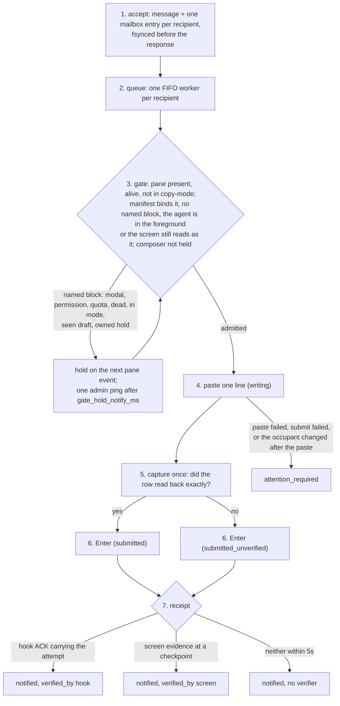

# Delivery: the mailbox and the doorbell

This page owns the delivery decision and the terminal safety contract.
Protocol shapes belong to `src/cyclops-proto` and
[PROTOCOL.md](../reference/PROTOCOL.md). The code is
`src/cyclopsd/src/delivery/` (`gate.rs` decides and writes, `inject.rs` is
the tmux seam, `terminal.rs` renders the bytes, `worker.rs` runs one FIFO per
recipient) and `src/cyclopsd/src/mailbox/` (the durable record).

Delivery is a durable mailbox plus one doorbell line. Ordinary doorbell
delivery writes one line and presses Enter for a bound, live agent process
unless a human draft is positively observed or a named block is present
(modal, permission, quota, dead, copy-mode, durable composer hold). Ambiguous
or absent composer evidence does not hold a doorbell. A raw send bypasses the
composer check entirely and is recorded as an unverified write. Uncertainty
is recorded, never retried automatically.

## The pipeline



1. **Accept.** `msg.send` appends the message and one mailbox entry per
   recipient to the workspace journal and fsyncs before answering. The
   response proves durable acceptance and nothing else. A summary the
   sender did not supply is derived from the subject (the body's first line
   only when the subject is blank), cut to one line of at most 200
   characters; a supplied summary is one non-empty line with no length cap
   (the CLI warns the sender above 160 characters).
2. **Queue.** One worker per durable recipient; notifications to one mailbox
   are strictly FIFO. Broadcast is one message row with one entry and one
   notification record per recipient. A worker retires when its queue
   drains and runs under a supervisor that restarts it once after a failure
   before the write.
3. **Gate.** Three checks, in `gate.rs` `admit`, against one fresh capture:
   the pane is present, alive, and not in copy-mode; a manifest binds the
   pane, no named block is on screen, and the pane's foreground process is
   that agent, or a tool it handed the terminal to while the screen still
   reads as the agent; and the composer is not held. A named block holds the attempt on the next pane event, with one
   admin ping after `gate_hold_notify_ms`. A modal whose rule has
   `auto_dismiss` and `decline_keys` gets those keys, at most `MAX_DECLINES`
   times, and the screen is re-read before the final confirming key.
4. **Paste.** The bytes are spooled into a per-attempt tmux buffer first, the
   occupant is re-checked, then `paste-buffer` runs. Immediately before that
   command the attempt records `writing` with the exact binding (pane root,
   foreground leader, agent generation, manifest) and claims the pane's
   composer hold. From here the attempt is post-write whatever tmux answers.
5. **Capture once.** One escaped capture, with bounded re-reads for a slow
   repaint. If the pasted row reads back exactly the attempt will record
   `submitted`; if it does not, `submitted_unverified`. Nothing is
   re-pasted either way.
6. **Enter.** After one more occupant check, the manifest's submit key is
   pressed once. It is never pressed a second time.
7. **Receipt.** The vendor hook ACK carrying this attempt within
   `ack_timeout_ms` proves it (`verified_by: hook`). Screen evidence at the
   checkpoints proves it more weakly (`verified_by: screen`). Neither within
   `SCREEN_ACK_DEADLINE` (5s), or the occupant changing while waiting, ends
   the attempt as `notified` with no verifier and releases the composer
   hold. A claim by the exact recipient after Enter is also a receipt.

`attention_required` is written only for a physical write failure after the
boundary: `paste_failed`, `submit_failed`, `pane_rebound_after_paste`, or a
journal write that failed after the paste (`transport_outcome_unknown`). It
means the terminal outcome is unknown, not that the recipient did not receive
the line. Inspect the pane before sending again.

Failures proven before the paste never write: a detached session, a missing
manifest, an unrebuildable payload, or an occupant that changed between the
gate and the paste re-enter the gate, bounded by `delivery_retry_max`. A
spool failure, a repeated pre-write failure, or an unprovable binding that
repeats settles as a durable `blocked_pre_write` with its cause
(`session_unavailable`, `manifest_unavailable`, `payload_unavailable`,
`write_readiness_changed`, `spool_failed`, `binding_unprovable`, or
`worker_failed`), visible in `cyclops messages` and withdrawable. A paste
command that tmux provably accepted no byte of corrects `writing` back to
`blocked_pre_write` with cause `paste_command_unwritten` and is never
replayed automatically.

## What holds, and what does not

The composer check is `fusion::composer_is_held`. A positively observed
human draft holds: a manifest rule with `composer_semantic = "human_input"`
matched the capture. So does a hold a delivery owns: a doorbell staged and
not yet consumed, or the turn it started that has not ended. That is the
whole list. An unreadable composer, an ambiguous rule, a manifest with no
composer rule, a working agent, and a pane whose hooks never fired all
proceed. The cost of proceeding is one line the journal marks
`submitted_unverified` when it could not be read back.

The guard depends on the manifest seeing typed text. The five measured
manifests carry a human-input rule; the seven unverified ones do not, so a
doorbell to one of those panes never detects a draft and is effectively a
raw write with a receipt. [INVARIANTS.md](INVARIANTS.md) rule 3 says what
that costs.

The gate's hold causes, as the journal spells them:

| Cause | It means |
|---|---|
| `session_detached` | The session's control connection is down |
| `no_such_pane`, `pane_dead` | The target is not there |
| `pane_in_mode` | A human is reading scrollback in copy-mode |
| `no_manifest` | Nothing binds the pane; Cyclops cannot read it |
| `occupant_unprovable` | The process table could not prove the occupant; held once, then a durable `binding_unprovable` block |
| `foreground_not_agent` | The agent handed the terminal to a tool and the screen does not read as the agent |
| `binding_changed` | The occupant changed between the gate's proof and the write |
| `composer_hold` | A seen human draft, or a doorbell this recipient has not consumed |
| `barrier_held` | Another attempt claimed the composer in the gap; re-read after 50ms |
| `blocked_quota` | The vendor's quota screen is up |
| `blocked:<rule id>` | A modal or permission prompt the manifest does not dismiss |

## The doorbell line

For a non-admin recipient the daemon writes one row, the only format it
writes now:

```text
[cyclops from implementer to reviewer] The rate limiter is ready for review. | cyclops inbox claim m-att_--AAAAAAQACAAAAAAAAAAQ
```

The header names the sender and the recipients from the message's immutable
presentation (`render_recipient_list` in `cyclops-proto`): up to three
recipient labels joined by `, `, then `<first>, <second>, +N`, and `to all`
for a broadcast to every agent. The format number stays 4.
The 22-character token encodes the complete 128-bit notification attempt id
under the reserved `m-att_` namespace. The recipient runs the claim command
and reads the body from the mailbox; the body never reaches the pane on this
path. A narrow pane soft-wraps the row; the written bytes are unchanged and
the readback joins the wrapped rows before comparing. `admin` has no pane
route, so an admin message is accepted and stays in the admin inbox with no
attempt.

A socket claim before the write boundary withdraws the doorbell. An attempt
still `queued`, `gating`, or `blocked_pre_write` settles as `withdrawn` with
cause `claimed_before_write` under the same store lock as the claim, the
worker's next pre-write check (`entry_allows_notification`) finds the entry
claimed and stops, and no pane bytes are written; the recipient's FIFO moves
to its next pending message. A claim after Enter settles the attempt as
`notified`. Journals an older daemon wrote, where the write followed the
claim, replay through the withdrawn state.

## The raw transport

`--raw` exists for exactly the case where the doorbell cannot work: Cyclops's
own composer reading is wrong for this pane, or the recipient is an
unverified vendor. It is recorded, so nothing about it is a bypass of the
record. The attempt is admitted once the pane is present and alive, and that
is re-checked once just before the paste; the whole rendered message
(header, body, reply hint, `[cyclops:end <id>]` sentinel) is pasted, Enter
is pressed, and the attempt closes as `notified` with no verifier. The
`writing` fact carries `transport: raw` and no binding, because nothing
about the occupant was proven. Cyclops never selects this transport on its
own.

## Headless recipients: the mailbox-only path

A headless agent (`cyclops name <label> --self` from a process with no pane,
`headless.register` on the wire) has no terminal, so none of the pipeline
above applies to it. `messaging_runtime::schedule_recipient` sees a headless
recipient that is still on the roster and, under the publication lock,
closes the attempt `queued -> notified` with `transport: mailbox`, no
binding, no doorbell format, and no verifier
(`NotificationContext::record_mailbox_notified`). Being in the mailbox is the
notification: the agent reads it over the socket with `inbox next --wait`
and the body reaches it through the claim alone. The receipt carries
`note: in mailbox, no pane`, and `cyclops messages` prints the same words
for that recipient. A claim that lands first settles the entry before the
close is recorded, and no fact is written for the attempt.

The registration is a process, not a token. The daemon binds the label to
the nearest agent process above the registering peer (`identity::headless_root`)
and retires it when that process exits. The exit is a named one-shot event
(`headless::arm_exit_watcher`): `kqueue` `EVFILT_PROC NOTE_EXIT` on macOS and
`pidfd_open` on Linux, awaited through an `AsyncFd`, never a poll. On a
platform with neither, retirement happens when a resolution next observes
the root dead, and at boot. Retirement republishes the directory and emits
`messages.route_changed`; the label becomes unaddressable, the recipient key
resolves nothing, the snapshot row reads `available: false` beside its
`notified` attempt, pending entries stay pending for the operator's
`msg.read`, and a re-registration mints a new key. A retired recipient with
pending entries parks like any recipient without a route
(`route_unavailable`) rather than being closed as notified. Boot re-verifies
every stored registration by OS boot id and process birth before the first
directory is published.

## Restart

At boot the workspace journal replays and `recover_notifications_after_restart`
closes every attempt still at `writing`, `submitted`, or
`submitted_unverified` to `attention_required` with cause `daemon_restart`.
The one exception is an attempt whose recipient already claimed the message
after Enter: the claim was the receipt, so it becomes `notified`. No composer
hold is restored. Attempts still at `queued` or `gating` are scheduled again
by a fresh worker; nothing was written. Old journals that carry the retired
states below replay unchanged.

`daemon.quiesce` is the pre-restart hold behind `cyclops daemon restart` and
`cyclops update`: workers finish the attempt they are on and start no new
one, an attempt caught at the gate parks back pre-write with cause `quiesce`,
and the daemon waits out everything already past the paste (default 5s,
ceiling 30s). Quiet means nothing is between a paste and a resolved state.

## Withdraw and requeue

A workspace administrator may withdraw one exact attempt while it is
`queued`, `gating`, or `blocked_pre_write` (`notification.withdraw`, `cyclops
notification withdraw`). Those states are durably before `writing`, so the
operation writes one withdrawal fact, cancels the attempt, leaves the message
pending and claimable, and admits the next FIFO item. `writing` and every
later state refuse. `cyclops clear <agent>` does this for every unwritten
attempt to one recipient.

`cyclops requeue <message-id>` starts a fresh attempt for a message whose
current attempt is `attention_required`. It is an explicit operator action
after the cause is understood; it never runs on a timer. `cyclops alarm
clear` acknowledges an alarm and retires nothing.

## States

`cyclops_proto::NotificationState`, one record per message and recipient.
Every transition is a content-free workspace journal fact.

| State | Meaning |
|---|---|
| `queued` | Accepted, waiting for the recipient's FIFO |
| `gating` | The worker owns it and the gate is deciding |
| `blocked_pre_write` | A repeated pre-write proof failed; nothing written; withdrawable |
| `writing` | The paste command was issued |
| `submitted` | Enter pressed after the row read back exactly |
| `submitted_unverified` | Enter pressed once without an exact readback |
| `notified` | A receipt (hook, screen, claim) or none within the deadline; for a headless recipient, the mailbox close (`transport: mailbox`, straight from `queued`) |
| `attention_required` | A physical write failure or a daemon restart; inspect the pane |
| `withdrawn_by_operator` | An administrator withdrew it before the write |
| `superseded` | The message was replaced before the write |
| `withdrawn` | A claim settled a pre-write attempt; only a replayed direct-payload attempt reaches it now |

Replay only, no longer written since 1.1.0, kept so old journals load:
`quota_held`, `quota_reset_observed`, `staged`, `submitting`, and
`withdrawn_after_staging`; the `direct_payload` transport and doorbell
formats 1 to 3.

## Sender identity

Socket peer credentials give uid and pid. A different uid is denied. The
pid's ancestry is walked upward. A process below an agent vendor inside a
watched pane sends as that pane: its label, or its pane id when it has none.
A same-user process with no vendor ancestor is `admin`, even when it sits
inside a watched pane. A vendor process outside every watched pane, or an
ancestry that cannot be proven current, is denied, unless the walk reaches a
registered headless root: then the caller is that headless agent, by the same
descent rule a pane applies. Nothing in the request body can name the sender.

## Configuration

`ack_timeout_ms` (1500), `delivery_retry_max` (1), `receipt_block_ms` (2500),
`gate_hold_notify_ms` (120000), and `chrome`, in `src/cyclopsd/src/config.rs`.
The 1.0 keys `ambiguous_composer_settle_ms`, `unclaimed_reminder_ms`,
`force_notification_submit`, and `force_notification_submit_delay_ms` are
ignored with a warning that says so.
