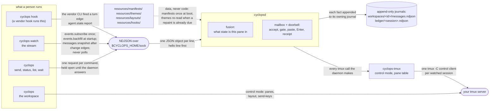

# Cyclops engineering map

A map, not a summary. Where things live, where to start reading for the
job you have been handed, and which decisions were deliberate so you do not
spend a day undoing one.

For current behavior, start with this map and the behavior contracts below.
[NEXT.md](NEXT.md) is the short queue of what is worth doing next. The
[archive index](archive/README.md) holds the revision-bound charters, audits,
reviews, and roadmaps that shaped the system; none of them governs current
behavior, and when one disagrees with the code, the code and the contracts
here win.

Cyclops coordinates terminal coding agents that are already running in your
tmux session. It watches panes, works out whether each agent is idle,
working or blocked, accepts messages into durable workspace mailboxes, and
writes one doorbell line (a summary beside the exact claim command) into the
recipient pane. The full body remains in the authenticated mailbox. Mailbox
facts use one append-only workspace journal. Pane state and each attempt's
own transitions use separate append-only session journals.

For current messaging, start with [send.md](../guides/send.md),
[DELIVERY.md](DELIVERY.md), [PROTOCOL.md](../reference/PROTOCOL.md),
`src/cyclopsd/src/mailbox/`, `src/cyclopsd/src/messaging.rs`, and
`src/cyclopsd/src/delivery/`. `src/cyclopsd/src/session_history.rs` only
discovers and replays session journals across a rename; it writes nothing.

## Documentation map

The repository keeps public operation, technical reference, active engineering
contracts, and historical records separate:

| Layer | Documents | How to use them |
|---|---|---|
| User operation | [User guides](../guides/README.md) | Install, message, monitor, recover, and use the workspace. |
| Stable reference | [Technical reference](../reference/README.md) | Wire methods, manifests, hooks, and measured performance claims. |
| Current behavior contracts | [Architecture](ARCHITECTURE.md), [delivery](DELIVERY.md), [invariants](INVARIANTS.md), [protocol](../reference/PROTOCOL.md), [goals](GOALS.md), and [style](STYLE.md) | Read before changing product behavior, wire behavior, rendering, or tests. |
| What is next | [NEXT.md](NEXT.md) | The short queue on `main`. |
| Measured evidence | [findings.md](../../findings.md) | Probe-backed constraints on current code. This is live evidence, not a roadmap or archive. |
| Archived historical and audit records | [Archive index](archive/README.md) and [changelog](../../CHANGELOG.md) | Revision-bound charters, audits, and design reviews that no longer govern current behavior; the changelog is the immutable release history. |
| Internal release material | [Media plan](../public/README.md) and [archived demo checklist](archive/demo-day-checklist.md) | Maintainer and historical material, not public onboarding. |
| Repository instructions | [Agent entrypoint](../../AGENTS.md), [contributing](../../CONTRIBUTING.md), and [security](../../SECURITY.md) | Rules for automated contributors, human contributors, and vulnerability reports. |

This hierarchy is deliberate. Do not move every internal record back into the
root README. If a historical page conflicts with current code or a normative
contract, the current code and contract win and the history should be labeled
as history rather than rewritten as a new promise.

## The shape



One daemon. One `tmux -C` control client per watched session. Clients never
poll: they subscribe and the daemon pushes.

## Who owns what

The second column is the useful one. Most wrong changes on this codebase
are a rule implemented in a crate that should not have known about it.

| Crate | Owns | Does NOT own |
|---|---|---|
| `cyclops-proto` | Wire types, mailbox and journal schema, the notification state machine, the agent state model, the attention rule (what needs a human), scratch paths | Any IO. It does not know tmux exists, and it renders nothing |
| `cyclops-manifest` | Manifest TOML schema, compiled rules, region parsing, priority evaluation | Deciding a pane's state (that is fusion), reading panes, hot reload (the daemon's job) |
| `cyclops-tmux` | **Every tmux invocation in the product.** Control mode, reply correlation, flow control, the zero-polling pane table, layout capture and apply, focus | What an agent is. It has never heard of manifests, deliveries, or the ledger |
| `cyclops-ledger` | Append, fsync, monotonic seq, strict and lenient torn-tail recovery, the cursor reader | What a line MEANS. The schema is `cyclops-proto`'s |
| `cyclops-theme` | The semantic token vocabulary, the state-to-group mapping, theme files, selection, the reload rule | Painting. It resolves a token to a color; renderers turn colors into escape sequences |
| `cyclops-client` | Hello-first daemon connection facts, bounded frames, request correlation, shared timeout defaults and certainty, refusal decoding, post-write uncertainty, and stream-gap classification | Domain policy, presentation, application retry schedules, projection restoration, or journal reads |
| `cyclopsd` | The daemon: fusion, durable mailboxes, the doorbell pipeline, the socket server, sender identity, the adoption registry, pane border chrome, the hooks self-test, and the journal read side | tmux specifics (adapter), the wire schema (proto), the attention rule (proto). It renders exactly one string: the border format |
| `cyclops` | The CLI: a thin NDJSON client plus rendering on the shared grid | Business logic. `cyclops list` asks `status` for the roster rather than holding a second one |
| `cyclops-ui` | Pure stream and messaging presentation models plus the concrete terminal renderer for `cyclops watch` | Daemon framing, journal paths, or tmux effects; it consumes `cyclops-client`, `events.backfill`, and a launcher focus capability |
| `cyclops-workspace` | The full-screen workspace (`cyclops`): sidebar, tabs, pane canvas, mouse, and the body-free collapsed Messages rail projection | Messaging truth or a second unread queue; it renders authenticated daemon snapshot counts and reads the attention rule from proto |
| `cyclops-testrig` | The isolated tmux server and its teardown rule, in one place | Anything shipped. `publish = false`, test-only |

One honest exception to "every tmux invocation": `cyclopsd::probe_tmux`
spawns `tmux -V` once at boot to read the version. The parsing is
`cyclops_tmux::TmuxVersion`.

Data directories, none of them code paths: `resources/manifests/` (per-CLI
detection), `resources/hooks/` (vendor hook templates), `resources/layouts/` (workspace
presets), `resources/themes/` (palettes), `resources/sounds/` (the workspace's
notification cues), `demos/` (runnable scenarios), `website/`
(the landing page, outside the Cargo workspace and checked by its own CI
job).

`resources/manifests/` and `resources/layouts/` are also compiled into the `cyclops` binary
with `include_str!`, so a fresh install works before it has any files.
The bare `cyclops` front door and `cyclops start` seed the shipped manifests
into the home and never overwrite an edit, because an edited manifest is
worth more than the shipped guess. Layout presets remain compiled data; they
are applied by `cyclops start` when it builds a workspace.

## Where to start reading

### Build and run it

[install.md](../guides/install.md), then `cargo build`. To see durable mailbox
acceptance work without either Cyclops UI or a real agent, run the maintained
messaging demo. It builds its own tmux server and home, then cleans both up.

```bash
./demos/m1-send.sh
```

Then [QUICKSTART.md](../guides/QUICKSTART.md) for the two-agent walk with your own
CLIs. Development loop and gates: [CONTRIBUTING.md](../../CONTRIBUTING.md).
Historical release-demo planning: [archived Demo Day checklist](archive/demo-day-checklist.md).

### Explain a message, end to end

Read in this order:

1. [send.md](../guides/send.md) for acceptance, the doorbell, claim, reply,
   and recovery as a user sees them.
2. [DELIVERY.md](DELIVERY.md) for the pipeline, the gate, the raw transport,
   restart, and the state list.
3. [PROTOCOL.md](../reference/PROTOCOL.md) for `msg.send`, `inbox.list`,
   `inbox.claim`, `msg.reply`, and `messages.snapshot`.
4. `src/cyclops-proto/src/notification.rs`, `NotificationState::can_transition_to`.
   The legal moves are a table you can read in a minute.
5. `src/cyclopsd/src/messaging.rs` for acceptance, claim, requeue, and
   withdrawal, and `src/cyclopsd/src/mailbox/projection.rs` for the durable
   projection behind it.
6. `src/cyclopsd/src/delivery/`: `worker.rs` takes the head of one
   recipient's FIFO; in `gate.rs`, `gate` holds until `admit` proves the
   write may happen, `attempt_delivery` pastes, reads back once, and presses
   Enter, and `settle_without_receipt` closes the attempt when no receipt
   arrives; `attempt_raw_delivery` is the raw lane. `notification_adapter.rs`
   is how every step becomes a journal fact.

The key boundary is durable acceptance before the asynchronous doorbell. The
recipient reads the body only by claiming the exact message; the body reaches
a pane only through `--raw`. `demos/m1-send.sh` demonstrates the acceptance
boundary with `cat` panes that nothing binds: both sends are durable and the
authenticated body-free projection is usable, while the doorbells to those
panes cannot be admitted, which does not undo acceptance or invent delivery.

### Add support for a new agent CLI

It is one TOML file and no code. [MANIFESTS.md](../reference/MANIFESTS.md) is the page;
`resources/manifests/codex.toml` is the closest thing to a template.

Know which copy of the file your daemon is actually reading. With no
`manifest_dir` in the config it takes `$CYCLOPS_HOME/manifests` when that
directory exists, then `./manifests` relative to the daemon's working
directory. The first directory that exists wins. The home copy is seeded
from the binary on the first `cyclops start` and never overwritten after
that, so once you have a home, editing the repo's `resources/manifests/`
changes what a fresh install gets and nothing you are running.

What you have to fill in, and where each part is used:

- `[agent] process_names` binds the file to a pane by its foreground
  command. If the CLI installs as a versioned symlink, add
  `argv_basenames` too, because the kernel reports the resolved name and
  the match silently never fires (F21). A CLI that runs under `node`,
  `python`, `bun`, or `deno` is read by the script name behind the
  interpreter.
- `[[rule]]` blocks read state off the pane title or the screen, by
  priority. Titles are cheap and screens are evidence of last resort, so a
  title rule that decides means the screen is never captured. A rule with
  `composer_semantic = "human_input"` is what lets the gate see a person's
  draft; without one, a doorbell to that CLI never holds for typing.
- `[injection] submit` is the key that sends the line, usually `Enter`.
- `[hooks] ack` if the CLI can run hooks. Declare nothing and the doorbell
  settles on screen evidence, which works.

Prove it with fixtures, not by eye: put real captures in
`src/cyclops-manifest/tests/fixtures/` and add them to
`src/cyclops-manifest/tests/shipped_rules.rs`. Then check it live with
`cyclops list` and pin it
if binding is ambiguous: `cyclops name %3 reviewer --manifest <id>`.

Do not add Rust. The schema has grown twice in its life and both times a
measurement forced it (F19, F21). If you are convinced it needs to grow a
third time, that is a finding first and a schema change second.

### Debug a doorbell that is stuck

[troubleshooting.md](../guides/troubleshooting.md) covers the symptoms. For
the mechanism, **the journals are the debugger.** The workspace journal
holds every notification transition and the session ledger holds every gate
decision, and every line carries a cause.

```bash
workspace_id=$(cyclops --json messages | jq -r .workspace_id)
jq -c 'select(.id == "m-b90b2a")' ~/.cyclops/workspaces/$workspace_id/messages.ndjson
jq -c 'select(.id == "m-b90b2a")' ~/.cyclops/ledger/main.ndjson
```

Read the last state line first, then the gate lines above it. The cause
tells you where to look. These are the causes the daemon writes today:

| Cause | It means | Look at |
|---|---|---|
| `no_such_pane`, `pane_dead`, `session_detached` | The target is not there; the gate holds | The pane table: `cyclops status` |
| `pane_in_mode`, `blocked_quota`, `blocked:<rule id>`, `composer_hold` | The gate is holding on purpose: copy-mode, a quota screen, a modal or permission prompt, or a seen draft or unconsumed doorbell | Fusion: is the state right? `cyclops read <pane> --source detection --raw` |
| `no_manifest` | Nothing bound to the pane | The manifest's `process_names` versus what the pane is actually running |
| `occupant_unprovable`, then `binding_unprovable` | The process table could not prove who holds the terminal; held once, then a durable pre-write block | The process tree of the pane; pin the manifest if binding is ambiguous |
| `foreground_not_agent` | The agent handed the terminal to a tool and the screen does not read as the agent | Wait, or look at what the agent is running |
| `binding_changed`, `write_readiness_changed`, `pane_rebound` | The occupant changed between the gate's proof and the write; nothing was written, the attempt re-enters the gate | Something restarted in that pane |
| `barrier_held` | Another attempt claimed the composer in the gap; re-read after 50ms | Nothing: two doorbells to one pane serialize |
| `session_unavailable`, `manifest_unavailable`, `payload_unavailable`, `spool_failed`, `worker_failed` | A pre-write proof failed repeatedly; nothing written; durably blocked and withdrawable | The named thing; `cyclops health` for a worker failure |
| `paste_command_unwritten` | tmux provably accepted no byte of the paste command; corrected back to a pre-write block | tmux and the control connection |
| `paste_failed`, `submit_failed`, `pane_rebound_after_paste`, `transport_outcome_unknown` | A physical write failure after the boundary: `attention_required` | Inspect the pane before `cyclops requeue` |
| `no_receipt`, `receipt_occupant_changed` | Enter was pressed and no receipt arrived, or the occupant changed while waiting; `notified` with no verifier | Nothing, unless the recipient never claims: then the pane |
| `raw` | A raw write closed as `notified` with no verifier | Nothing: the sender asked for this |
| `quiesce` | A pre-restart hold parked the attempt pre-paste; it re-enters when the pipeline resumes | Nothing: this is the restart machinery working |
| `daemon_restart` | The attempt was between the paste and its receipt when the daemon stopped: `attention_required` | Inspect the recipient pane before `cyclops requeue` |

The thing to internalize: **a hold is waiting on an event, never on a
clock.** So "it is stuck" is always the question "which event never
arrived", and the answer is upstream of delivery, in fusion or the watcher.
A delivery that holds for longer than `gate_hold_notify_ms` pings the admin
once, so a wedged hold is at least visible in the stream.

Two floors to know before you chase a ghost. tmux evaluates format
subscriptions on a 1Hz tick, so a state that appeared and vanished inside
one second was never visible to Cyclops at all (F23). And on a CLI with no
ack hook there is no hook edge, so timing evidence is screen evidence.

### Know which invariants not to break

[INVARIANTS.md](INVARIANTS.md). Ten rules, each with the real-world
damage and the line of code that stops it. If you are touching delivery,
read rules 1 to 4 before you write anything, and rule 3 before you touch
anything that decides whether a doorbell may be written.

## Decisions, and what was rejected

ADR-001 is the formal record. It lives in the separate `cyclops-arch`
design repo, not in this clone, and you do not need it: this section is the
part a newcomer does need, which is what was deliberately NOT done, so you
do not "fix" it.

### tmux control mode, not hosting PTYs

**Chosen:** one `tmux -C` control-mode client per watched session. Cyclops
is a guest in a tmux server it does not own.

**Rejected:** an own-PTY server (ADR-001 option B). Cyclops forks and owns
every agent PTY, embeds a terminal emulator, and ships its own attach
clients. tmux is eliminated and you control everything.

**Why:** the cost was bounded with real numbers rather than argued. zmx
does PTY persistence ALONE in 7.4k lines of Zig; herdr does the full job in
around 206k lines of Rust, with a vendored VT engine and a patched pty
crate. That option scored 3.40 against the
tmux-backed design's 4.15, and it was killed by implementation cost and by
having to rebuild observability tmux already provides. The agents are also
already running in the user's tmux, with their config, keybindings,
scrollback and detach habits, so option B asks people to move house first.
GOALS lists PTY hosting as an anti-goal.

**What it costs, honestly:** everything tmux does oddly is now yours to
work around, and a lot of `findings.md` is that tax. Control-mode lines are
not UTF-8 (F22). tmux sanitizes replies for non-UTF-8 clients (F14). Format
subscriptions tick at 1Hz (F23). A per-pane subscription can never report
that pane's death (F25). The mitigation is that all of it is confined to one
adapter crate. Focused tmux HEAD evidence runs when adapter-owned inputs change,
and the complete tmux HEAD gate remains scheduled and available before release.

### Manifests are data files

**Chosen:** everything Cyclops knows about a vendor TUI is TOML, and
unknown keys are tolerated so authors can keep their evidence next to the
rule.

**Rejected:** a Rust module or a trait implementation per CLI.

**Why:** vendor CLIs change without notice, and a quirk in code means a
review, a build and a release before anyone can send a message again. A
quirk in a manifest is a text edit on the machine that has the problem.
Adding an agent is also the most common thing a user will ever do to this
system, and it should not require a compiler.

**What it costs:** the schema has to be expressive enough, which it was not
twice (F19, F21). Both times the fix was one more declarative field, not an
escape hatch into code.

### The journals are append-only NDJSON

**Chosen:** one mailbox journal per durable workspace and one session
journal per watched session. Each uses one JSON object per line, appended
and fsynced, never rewritten. Corrections are new lines.

**Rejected:** any store that updates a record in place. The pattern was
taken from cmux's `events.jsonl` rather than invented.

**Why:** the record is the product. It has to be readable with `less` and
queryable with `jq` by a person who has never heard of Cyclops, months
after the fact, possibly out of a bug report attachment. It has to survive a
crash mid-write, which append-only gets nearly for free. Every acknowledged
append ends in a newline and is fsynced; newline-terminated records are
immutable. An unterminated final tail was never acknowledged: lenient replay
adds its terminating newline and retains it when it validates, otherwise skips
it; strict workspace replay removes only that tail and logs a warning. Neither
path alters a complete record. And an audit you can edit is not an audit.

**Measured, so it is not a guess:** no index is needed. A 10,000-line scan
takes 7.3ms, which is why `msg.history` is a scan and not a database.

**What it costs:** no queries beyond a scan, and paging across the workspace
journal plus the session files needs an opaque composite cursor rather than
an offset.

### Zero polling

**Chosen:** state changes arrive as control-mode notifications and
subscription pushes; reconciliation is triggered by an event or a request.
The long-lived coordination timers are named one-shots: one 30ms debounce in
the watcher, the bounded timers inside a live delivery (the post-paste
readback re-reads, the ACK window, the screen checkpoints, the decline
spacing, the two bounded re-observations of a hold that announces no event,
and the single wedged-hold ping), one event-armed candidate lifecycle settle
per hook edge, and the deadlines a caller asked for. Nothing runs on an
interval.

**Rejected:** a 1Hz reconcile loop, which is the obvious design and would
have been simpler.

**Why:** idle CPU near zero is a hard goal, and this runs on laptops beside
agents that are already expensive. The deeper reason is that a poll hides a
broken event path: if a loop eventually notices what a subscription should
have pushed, the mechanism carrying every sub-second guarantee can be dead
and everything still looks fine.

**What it costs:** every new state source needs an edge, and sometimes tmux
does not have one, in which case you find another (F25: a per-pane
subscription cannot report a pane's death, so Cyclops arms an all-panes one
instead). You also inherit tmux's own 1Hz resolution ceiling and cannot
poll around it (F23).

### The pane title is a sensor, so Cyclops never writes it

**Chosen:** an adopted pane's name and state go on its tmux **border**.

**Rejected:** writing `role • state` into the pane title, which the brief
originally asked for.

**Why:** several shipped manifests read `#{pane_title}` as a sensor, and
Claude's spinner rules ARE the title tier. Writing the title would blind
detection to paint decoration, feed Cyclops's own decoration back into its
own sensor (F13), and lose the race to any agent that publishes its own
title anyway (F23, F26). The border already displays the title by default,
so replacing the border FORMAT replaces the view without touching the value
underneath.

If you are about to add title writing because the brief mentions it: this
is why it is not there.

### The one trait with one implementation is deliberate

**Chosen:** delivery reaches a pane through an `Injector` seam (spool,
commit, submit, capture). `TmuxInjector` is the only implementation.

**Rejected:** inlining it, which STYLE would otherwise ask for. Two call
sites do not need a trait.

**Why:** it is the escape lane. ADR-001 scored a sixth option, driving each
agent headless behind its vendor protocol (Claude stream-json, Codex
app-server JSON-RPC, Gemini ACP), and it was the only candidate with
contract-grade delivery semantics and no screen scraping at all. It lost
because it discards the native TUIs the operator watches and one of the
three protocols did not exist yet, and it was kept as the designated route
if TUI injection ever becomes untenable. The seam is what makes that a
per-agent backend swap rather than a rewrite: the gate and the receipt wait
call through it and nothing else.

So this is the one place where a single implementation earns an
abstraction, and it is the one place a tidying pass would remove it.

## Corrections this build made

Three things were got wrong first and fixed afterwards. They are here
because each one is a mistake that is easy to make again, and because
"why is it like this" is answered better by the wrong version than by the
right one.

### State color was deleted on a misreading

GOALS says: *exactly two encodings carry meaning, role color and state
glyph; never color alone, states pair glyph + word.* That asks for color to
be **redundant** with the glyph and the word. It was read as "states are
never colored", and all six `state.*` and five `badge.*` tokens were
deleted from the vocabulary. A whole milestone signed that off.

They are back, grouped by what a reader needs to know (healthy, needs-you,
terminal, quiet) rather than one hue per state, with role hues on the agent
name alone so the two encodings never share a cell. The test is unchanged
in spirit: with color off, nothing is lost, and that is asserted rather
than assumed.

The general shape of the mistake: **"never X alone" means X plus something
else, not no X.** It is worth a second read whenever a rule is phrased as a
prohibition.

### The attention rule lived in four files

"What needs a human right now" was implemented in the daemon, in the
status renderer, in the stream's calm view, and in the eye. Every copy was
correct on its own and every test was green. Only two surfaces read side by
side disagreed, which is how a closed eye came to sit over a row saying
action was required.

It now has one owner, `src/cyclops-proto/src/attention.rs`, and no
surface recomputes it. That file is also where the rule's third clause
lives: because the record appends and does not retract, an alarm that ends
gets a second line under it rather than having the first one removed.

The lesson is the general one: a rule with two implementations is a rule
with two answers, and behavior tests cannot find that, because each answer
is self-consistent.

### A guard was asked to prove something undecidable

The obvious follow-up to the previous correction was a static test that
catches ANY second implementation of the attention rule. Two review rounds
were spent demanding it. It cannot exist: deciding whether two pieces of
code compute the same predicate is semantic equivalence, and no scan over
source text decides that. A verifier eventually defeated the guard with a
duplicate that named no state at all, with every gate green.

What shipped instead is a **tripwire** that says in its own header what it
cannot see. `src/cyclops-proto/tests/one_place.rs` catches the four
common shapes of a copied predicate, and states plainly that a green run
means "no file matched a shape below" and never "no second
implementation". Review is named as the real defence.

Keep that honesty if you touch it. A guard that claims more than it can do
is worse than no guard, because people stop looking.

The related process note, worth one line: the reviewers who caught real
defects on this codebase were the ones who wrote probes and ran them. The
one who read code signed off on a lying attention indicator twice.

## What is deliberately not built

`STATUS.md` keeps the current backlog, risks, and known floors, and it is
maintained. Two worth knowing on day one because they look like bugs:

- **A quota screen is a gate hold, not a park.** The doorbell waits for the
  pane to change and never retries on a clock. `cyclops requeue` exists only
  for an attempt that ended in `attention_required`; a held attempt needs
  nothing from you but the vendor's reset.
- **`cyclops start` cannot tell two same-shaped arrangements apart** when
  the daemon holds no names for the session. Naming one pane closes it.
  Grid topology alone genuinely cannot answer it.

One process document lives outside `docs/`:
[The archived Demo Day checklist](archive/demo-day-checklist.md) was the working
checklist for the public launch pass, kept at the root while that work is
in flight.
