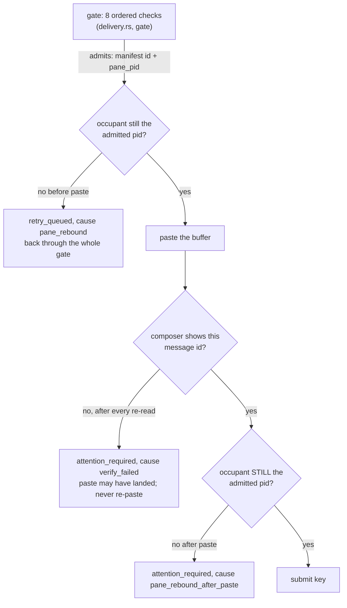

# Rules this system must never break

Twelve of them. They are not style preferences: each one is here because
breaking it does something specific and bad to a person using Cyclops, and
most of them are here because something already went wrong once.

Each rule below says what breaks in the real world, where the code enforces
it, and which test fails if you take the enforcement out. If you are about
to change delivery, fusion, the ledger, or any rendering path, read the
rules that touch it first. If you find one of these rules stated in a
second place, that is the bug: this page is where they live.

| # | Rule | What breaks |
|---|---|---|
| [1](#1-a-payload-never-reaches-a-pane-the-gate-did-not-admit) | A payload never reaches a pane the gate did not admit | A shell executes the message |
| [2](#2-a-modal-is-never-cleared-generically) | A modal is never cleared generically | Escape exits the agent CLI |
| [3](#3-human-typing-always-wins) | Human typing always wins | The human's half-written sentence is sent as part of the message |
| [4](#4-blocked_quota-parks-and-never-auto-retries) | `blocked_quota` parks and never auto-retries | A loop that cannot succeed, against a metered API |
| [5](#5-every-delivery-ends-in-a-named-state) | Every delivery ends in a named state | Nobody chases what has no state |
| [6](#6-the-sender-is-whoever-connected-not-whoever-says-so) | The sender is whoever connected, not whoever says so | The audit trail can be forged |
| [7](#7-secrets-never-enter-the-ledger) | Secrets never enter the ledger | An API key on screen becomes a permanent plain-text record |
| [8](#8-the-record-appends-it-does-not-retract) | The record appends, it does not retract | A corrected line and a forged line look the same |
| [9](#9-zero-polling) | Zero polling | Idle battery burn, and a broken event path that looks fine |
| [10](#10-vendor-quirks-are-data-not-code) | Vendor quirks are data, not code | A vendor ships a new dialog and you ship a release |
| [11](#11-color-is-redundant-and-never-the-only-encoding) | Color is redundant and never the only encoding | The state is invisible under `NO_COLOR`, `--plain`, or a screen reader |
| [12](#12-runtime-idleness-never-implies-terminal-write-readiness) | Runtime idleness never implies terminal write-readiness | A hook edge authorizes a paste over the human's staged text |

## 1. A payload never reaches a pane the gate did not admit

**Resolve, gate, verify, submit. In that order, every time.**

What breaks: a pane whose agent exited is still a pane, and what is sitting
in it is a shell. Paste a message body into a shell and press Enter, and
the shell runs it. A body reading `review the auth change and drop the
stale branch` is a command line. Every other delivery failure can be fixed
by resending; this one cannot be taken back.

The chain is longer than the gate, and that is the part people miss.
Admitting a pane is a decision about a moment, and there are two
irreversible steps after it:

The gate's own eight steps, in order and only in this order: session
attached, pane still in the table, pane not dead, pane not in copy-mode,
a manifest bound, fused state recomputed with the screen sensor forced,
the verdict on that state, and otherwise hold on an event. The diagram for
those eight is in [ARCHITECTURE.md](ARCHITECTURE.md); this page owns the
two re-checks around them, because the gate alone is not the invariant.

The screen read in step 6 is deliberately the last one before the paste. A
gate that reads the screen early and pastes later is admitting a pane as it
was, not as it is, and a human keystroke round-trip fits in that gap.

Verification is the second half of the same rule. Enter is only sent to a
composer that has been seen holding **this** message id. A staging pattern
without an id can only prove that something was pasted once
(`staged_verified` splits id-carrying patterns from generic ones for
exactly that reason).

The irreversible boundary changes retry policy. A detach, missing manifest,
pre-paste occupant rebind, or spool failure is proven before the pane write
and may use the configured bounded retry. A paste failure, failed readback,
post-paste rebind, submit failure, or ACK timeout may have reached the pane;
each goes directly to `attention_required` with its exact cause. That state
means the terminal outcome can be unknown, not that Cyclops proved the
recipient did not receive the message. Inspect the pane before resending.

- Enforced at: `src/cyclopsd/src/delivery.rs`, `gate` (admission),
  `occupant_unchanged` (both re-checks), `attempt_delivery` (the order),
  `inject` and `staged_verified` (verification).
- Proven by: `src/cyclopsd/tests/m1_blockers.rs`,
  `pane_rebound_before_paste_never_pastes_into_the_new_occupant` and
  `pane_rebound_before_submit_withholds_the_submit_key`.

## 2. A modal is never cleared generically

**Decline keys come from the manifest rule that matched. There is no
fallback Enter and no fallback Escape.**

What breaks: Escape on Claude 2.1.220's folder-trust dialog exits the CLI.
Measured, and it cost a soak leg (F20). A generic dismissal is a keystroke
sent to a dialog nobody read, and vendor dialogs disagree about what every
key means.

A rule with `auto_dismiss = false` (trust prompts, permission prompts) is
not Cyclops's to answer at all: the delivery holds and a human is pinged
once. A multi-key decline re-captures the screen before the **final**
confirming key and requires the same rule to still be the winning match, so
a dialog the human answered between keystrokes never receives the confirm.
Declines are bounded, never looped.

- Enforced at: `src/cyclopsd/src/delivery.rs`, `send_decline_keys` and
  `modal_still_matches`; the vocabulary is `decline_keys` / `auto_dismiss`
  in `resources/manifests/*.toml`.
- Proven by: `src/cyclopsd/tests/m1.rs`,
  `modal_declined_with_manifest_keys` and
  `modal_without_auto_dismiss_holds_and_notifies`;
  `src/cyclopsd/tests/m1_fixes.rs`,
  `decline_aborts_when_the_modal_changes_between_keys`.

## 3. Human typing always wins

**A composer with text in it is `idle_with_input`, and `idle_with_input`
holds.**

What breaks: the paste lands in a composer that already holds the human's
half-written sentence, the two concatenate, and the submit key sends the
mixture. The human's text is gone and the agent gets an instruction nobody
wrote. Silent, and it looks like the agent misbehaved.

The hard part is seeing it. On codex, a pristine composer's ghost
suggestion and real typed text are byte-identical in a plain capture; the
only discriminator is that the ghost text is SGR-dim and typed text is bare
(F19). So the manifest carries `line_regex_esc` rules matched against a
`capture-pane -e` capture, and the daemon supplies escaped captures at gate
time whenever the bound manifest has such rules. Take that away and the
gate reads a typing human as an idle agent.

- Enforced at: `src/cyclopsd/src/delivery.rs`, the `AgentState::
  IdleWithInput` arm of `gate`; `src/cyclopsd/src/fusion.rs` supplies
  the escaped capture; `resources/manifests/codex.toml` rules
  `composer_typed_input` and `composer_ghost_suggestion`.
- Proven by: `src/cyclopsd/tests/m1_blockers.rs`,
  `escaped_capture_flips_typed_text_to_idle_with_input_and_gates`.

## 4. `blocked_quota` parks and never auto-retries

**A quota park is terminal in the record. Only an operator sending again
moves it.**

What breaks: a retry against an exhausted quota is a request that cannot
succeed. It costs money on a metered plan, and on some plans it extends the
lockout. Worse, it does not stop: a quota-blocked agent passes every
liveness check there is (F11), so the retry loop looks healthy from the
outside while delivering nothing for hours.

Parking is per recipient, not per delivery: the in-flight delivery and
everything queued behind it park together, because they are all aimed at
the same exhausted agent. The admin is alerted once, with the reset hint
parsed off the screen.

- Enforced at: `src/cyclopsd/src/delivery.rs`, `park_recipient`;
  `ParkedBlockedQuota` has no outgoing transition in
  `cyclops_proto::DeliveryState::can_transition_to` except a fresh queue;
  `cyclops_proto::attention::delivery_needs_human` keeps it in front of a
  human until then.
- Proven by: `src/cyclopsd/tests/m1.rs`,
  `quota_parks_everything_and_never_retries`.

## 5. Every delivery ends in a named state

**`delivered_verified`, `delivered_unverified`, `queued`, `parked`, or
`attention_required`. Limbo is a bug.**

What breaks: a delivery in no state is one nobody chases. It does not
appear in the backlog, it does not open the eye, and the sender believes it
landed. The failure mode is not a wrong answer, it is silence.

The case that produces limbo is a daemon that stops mid-flight, so the
daemon closes them at boot: it replays each session ledger and writes a
state line to `attention_required` (cause `daemon_restart`) for every chain
still in flight, plus one aggregated ping listing them. A `msg` line's
`hosted` list names which recipients' chains live in that file, so a
broadcast recorded in another session's ledger is never falsely closed.

If you add a new failure path to the pipeline, this is the rule you are
most likely to break: an early return that logs and drops is limbo.

- Enforced at: `src/cyclopsd/src/delivery.rs`, `close_limbo`; every
  transition goes through `advance`, which appends a line.
- Proven by: `src/cyclopsd/tests/m1_fixes.rs`,
  `restart_closes_limbo_deliveries`; `src/cyclopsd/tests/m1_blockers.rs`,
  `restart_closes_pre_hosted_field_ledger_chains`.

## 6. The sender is whoever connected, not whoever says so

**The daemon builds the envelope from socket peer credentials. Nothing in
the request body can name a sender.**

What breaks: the record is the product, and its value is that it cannot be
made to lie. If a request could name its own sender, any process on the
machine could append `reviewer: approved` to the audit trail, and a record
you cannot trust is worse than no record, because people act on it.

The resolution walks the peer pid's ancestry until a pid matches a watched
pane's `pane_pid`. Labeled pane: that agent. Unlabeled pane: the pane id.
No watched pane in the ancestry: `admin`, because a same-uid shell outside
every pane is the human. A uid other than the daemon's is denied before any
request is parsed.

`agent.state.report` needs one more thing, because being in the pane is
weaker than it sounds. An adopted pane keeps its label, its adoption and
its manifest pin while its agent is not running, so anyone at that pane's
shell prompt can start anything, and reading the terminal's current
foreground does not help: a hand-started helper holds the tty while it
runs and would present itself as the pane's agent, with the pin agreeing.

What admits a report is descent. The daemon walks from the peer up to the
pane root and takes the first process whose own argv says it is an agent
it ships a manifest for; a hook helper is a child of the agent that ran
it, so that walk lands on the agent whether the agent holds the tty or
handed it over. A peer with no such ancestor is refused, and a pin that
disagrees with the process found is refused rather than believed. The
same proven pid and manifest are what the ACK path re-derives, so both
ends of a report speak about the same process.

- Enforced at: `src/cyclopsd/src/identity.rs`, `peer_of`,
  `resolve_sender` and `vendor_ancestor`; `src/cyclopsd/src/server.rs`,
  `verify_report_origin`; `src/cyclopsd/src/fusion.rs`,
  `vendor_between` and `admitted_vendor`.
- Proven by: `src/cyclopsd/src/server.rs`,
  `msg_send_fails_closed_without_peer_credentials`;
  `src/cyclopsd/tests/m2_hooks.rs`,
  `forged_report_over_the_socket_is_denied_and_ingests_nothing`;
  `src/cyclopsd/src/identity.rs`,
  `a_helper_nobody_started_from_an_agent_is_not_admitted` and
  `a_helper_the_agent_started_is_admitted_as_that_agent`.

## 7. Secrets never enter the ledger

**What the daemon OBSERVES never lands in the record. Rule ids, states and
causes do; screen captures do not.**

What breaks: the ledger is plain text under `~/.cyclops/ledger/`, meant to
be read with `jq`, copied into a bug report, and kept for months. An agent
pane's screen holds whatever the agent just printed: an API key, a `.env`
it opened, a customer's name. Append that once and it is there for good,
because rule 8 means nothing rewrites it.

So a gate line names the matched rule, not the text that matched it, and
the quota hint is parsed down to `resets in 135h57m42s` before anything
leaves the function that captured the screen.

The line to keep straight: message subjects and bodies DO enter the ledger.
Those are what a person deliberately sent, and recording them is the point.
The rule is about what Cyclops reads off a screen on its own.

- Enforced at: `src/cyclops-proto/src/ledger.rs` (schema and the rule);
  `src/cyclopsd/src/delivery.rs`, `gate_line` and `parse_reset_hint`.
- Proven by: `src/cyclopsd/tests/m1.rs`, which asserts the raw modal
  text and the raw quota banner are absent from the ledger;
  `src/cyclopsd/tests/m1_blockers.rs`, same assertion on the park path.

## 8. The record appends, it does not retract

**Lines are never rewritten. A correction is a new line.**

What breaks: an audit you can edit is not an audit. Once a line can be
changed after the fact, a corrected line and a forged line are the same
artifact, and every reader has to take the writer's word for which it is.
The append-only shape is also what makes crash safety cheap: a writer that
never seeks backwards can only ever lose a tail that was never
acknowledged.

This has a consequence on screen that surprises people. When something that
needed a human stops needing one, the alarm line stays where it is and the
resolution arrives as a **second** line. Deleting the alarm would leave a
reader who saw it with no ending, and a calm eye sitting over a row that
still says "action required". `Clearance` distinguishes the two endings
that are not the same story: somebody answered the prompt (`Moved`), or the
pane closed on it (`PaneGone`).

- Enforced at: `src/cyclops-ledger/src/lib.rs`, `LedgerWriter` (append
  only, fsync before acknowledge, torn tails sealed and skipped rather than
  repaired); `cyclops_proto::attention`, rule 3 and `Clearance`.
- Proven by: `src/cyclopsd/tests/restart_eye.rs`,
  `the_restart_ping_never_outlives_the_deliveries_it_names`.

## 9. Zero polling

**No interval timer may re-ask a question nobody asked. Every timer in the
product is one-shot and has a name.**

What breaks two ways. The obvious one: idle CPU and battery on a laptop
that is doing nothing, plus screen captures against a vendor TUI nobody
requested. The subtle one is worse. An interval hides a broken event path.
If a poll eventually notices what a subscription should have pushed,
everything looks fine while the mechanism carrying the sub-second
guarantees is dead, and you find out when a delivery is late by a second
that used to be 30 milliseconds.

What is allowed, and this is the whole list:

- **One debounce.** `RECONCILE_DEBOUNCE`, 30ms, in
  `src/cyclops-tmux/src/watcher.rs`. Change hints arrive in bursts (a
  split touches every pane), so the reconcile they arm is coalesced. No
  hint, no timer: the deadline is armed by an event and disarmed by
  running, never rescheduled on its own.
- **One-shot timers inside a delivery**, each bounded and each listed in
  the header of `src/cyclopsd/src/delivery.rs`: the post-paste
  verification re-reads, the tier-1 ACK window, the screen-evidence
  checkpoints, the decline-key spacing, and the one-shot ping for a hold
  that has lasted too long. None of them repeat, and none of them exists
  when no delivery is in flight.
- **The eye's animation tick**, one shot per state change
  (`src/cyclops-ui`).

A hold waits on an event, not on a clock. If you are about to add a
`interval` or a `loop { sleep }` to product code, the answer is an event
you have not found yet.

Sanctioned exceptions, none of them in the product: the Python probe
harness under `tests/` polls because a measuring instrument must,
`cyclops-testrig` waits in bounded loops for things a test has no edge to
await, and demo scripts pace their narration.

- Enforced at: `src/cyclops-tmux/src/watcher.rs` (the debounce and the
  subscription-driven table); the contract is written out in
  [ARCHITECTURE.md](ARCHITECTURE.md) under "The zero-polling contract".

## 10. Vendor quirks are data, not code

**Everything Cyclops knows about a vendor TUI is a TOML file.**

What breaks: vendor CLIs change without telling anyone. If a quirk lives in
Rust, a new dialog means a code change, a review, a build and a release
before anybody can send a message again. If it lives in a manifest, it is a
text edit a user can make on the machine where the problem is, and Cyclops
tolerates unknown keys so they can keep notes next to the rule.

The schema has grown exactly twice, and both times a measurement forced it:

- `agent.argv_basenames`, because a native Claude install symlinks to
  `versions/2.1.220` and macOS derives the process name from the resolved
  file, so `#{pane_current_command}` reads `2.1.220` and a
  `process_names` match silently never binds (F21).
- rule `line_regex_esc`, because typed text and ghost text differ only in
  SGR attributes (F19, and rule 3 above).

The same principle runs wider than manifests: hook config templates under
`resources/hooks/`, workspace presets under `resources/layouts/`, and theme palettes under
`resources/themes/` are all data files, and none of them is a code path.

- Enforced at: `src/cyclops-manifest` (parse, validate, evaluate, and
  nothing vendor-specific);
  `resources/manifests/{claude,codex,agy,cursor}.toml`.
- Proven by: `src/cyclops-manifest/tests/shipped_rules.rs`, which runs
  the shipped rules against captures taken from real sessions.

## 11. Color is redundant and never the only encoding

**Two encodings carry meaning: role color and state glyph. Color is never
the only one. A compact workspace surface may carry the glyph alone;
every detailed, plain-text, or diagnostic surface still carries a glyph
AND a word.**

What breaks: `NO_COLOR`, `--plain`, a screen reader, a piped log, a CI
transcript, and a reader who cannot distinguish the two hues you picked. In
every one of those, a meaning carried by color alone is simply not there.

Read this rule precisely, because it was already misread once and the fix
was expensive. Redundant means **present and duplicated**, not absent. M3
read "never color alone" as "states are never colored" and deleted all six
`state.*` and five `badge.*` tokens from the vocabulary; the tokens are
back and the CLI paints all nine, grouped by what a reader actually needs
to know (healthy, needs-you, terminal, quiet) rather than one hue per
state. Role hues stay on the agent name alone, so the two encodings never
share a cell.

The workspace's compact surfaces — sidebar rows, inactive pane borders —
are the one narrow exception, and it is not a color standing in for a
word: `○` idle, `●` working, `⚠` needs attention, and `✕` dead are a fixed,
documented glyph vocabulary that a reader can learn once. `idle_with_input`
shares the idle presentation because no turn is running, but it remains a
distinct, unsafe state in diagnostics and delivery. The
glyph is chosen by state, never by theme, so it renders identically under
every theme and under `NO_COLOR`; only the `Style` painted under it changes. A
detailed surface (the focused pane border, dialogs, the sidebar's event
stream), plain-text output, and every diagnostic show the word whenever
there is room for it. None of them may drop straight to hiding the state
just because the word does not fit — the fallback is always the glyph, the
same one the compact surfaces show on purpose.

The check that matters is mechanical: turn color off and read the same
line. If anything is missing beyond a compact surface's own documented
glyph, the glyph or the word is doing too little.

- Enforced at: `src/cyclops-theme` (`state_token`, `delivery_token`,
  and the token vocabulary); `src/cyclops/src/style.rs` and
  `src/cyclops-ui/src/theme.rs` paint through those and nothing else;
  `src/cyclops-ui/src/plain.rs` is the same content with no paint;
  `src/cyclops-workspace/src/decoration.rs`, `DecorationSnapshot::primary_status`,
  which maps the daemon's own attention flag to the glyph and word and
  never raises attention on its own.
- Proven by: `src/cyclops-ui/src/entry.rs`, which asserts the
  color-off rendering of a blocked row and a parked row is the words;
  `src/cyclops-theme/tests/vocabulary.rs`,
  `every_token_in_the_vocabulary_is_painted_by_a_renderer`;
  `src/cyclops-workspace/src/render/sidebar.rs`,
  `sidebar_state_glyph_is_stable_across_theme_and_no_color`, and
  `src/cyclops-workspace/src/render/canvas.rs`,
  `inactive_pane_border_glyph_is_stable_across_theme_and_no_color`, which
  feed the same state through two unrelated themes and `NO_COLOR` and
  assert the glyph never moves while its `Style` does.

## 12. Runtime idleness never implies terminal write-readiness

**A composer write requires current positive clean-input evidence from the
admitted pane, and no conflicting working, blocked, modal, pane-mode,
unknown, or input-present evidence. Hook-derived idle alone never
authorizes a write.**

What breaks: the same damage as rule 3, reached from the opposite
direction. Rule 3 holds when the screen sensor SEES staged text. This rule
covers the case where it sees nothing usable and something else says idle
anyway. A turn-end hook (`Stop` on agy, and its siblings elsewhere) maps to
`Idle`; fusion adopts a live hook reading when the screen rules resolve to
`unknown`; and `unknown` is exactly what a long staged payload produces
when its head scrolls past the fixed bottom region the rules read. So a
pane holding an intact, unsubmitted payload can read `idle`, and a gate
that trusts the fused verdict alone will paste a second message on top of
the first and press Enter.

That path was closed before it could ship: repairing hook identity is what
would have made those hook edges arrive in the first place, so the identity
fix and this rule belong to the same shipping unit. Ship one without the
other and the fleet gains a new way to overwrite a person's draft.

The distinction the rule forces is between two different questions. "Is a
turn running?" is answered by any sensor. "May I write into the composer?"
is answered only by the sensor that can see the composer, saying it is
empty, right now, with nothing live contradicting it. Absence of evidence
is not clean evidence; a contested verdict is not clean evidence.

One clean frame is not clean evidence either, once text has been seen in
the composer. A screen rule reads one frame, and a pane holding somebody's
half-typed message can render clean for a frame while it redraws, or while
the text sits somewhere the rule does not look. So a pane observed holding
text is refused (`composer_hold`) until a TURN proves the text left:
`working` while it was held, then a turn end WITH a clean screen reading.
That is the only positive evidence any vendor gives that a composer was
emptied. Nothing releases it on elapsed time or on a hook that never
arrived, and a person who clears their own draft by hand stays held until
their next completed turn. Conservative, and named in the gate line.

Two dispositions this leaves open, both deliberate. A daemon restart
starts with no cache, so a pane whose draft is staged but invisible in the
first reading has no hold; nothing recorded before the restart can be
recovered, and a timer would not have recovered it either. And a hold
belongs to an occupant: a pane that changes hands starts clear, because
the new agent never staged the old one's text.

- Enforced at: `cyclops_proto::Detection::stamped`, which combines the
  sensor policy with the pane's own mode and writes the verdict onto the
  detection; `src/cyclopsd/src/fusion.rs` stamps before caching, so the
  cache every surface reads already carries it. `src/cyclopsd/src/delivery.rs`
  requires that positive stamp at the gate and again immediately before
  the paste, holding on `not_write_ready:<reason>`. Nothing re-derives the
  answer: a caller that could only see the sensors would answer a
  narrower question and could overwrite an authoritative refusal.
- Proven by: `src/cyclops-proto/src/state.rs`,
  `hook_idle_over_unknown_screen_is_not_write_ready`,
  `hook_idle_alone_is_not_write_ready`,
  `disagreement_is_never_write_ready`,
  `a_pane_that_was_holding_text_refuses_a_clean_frame`, and
  `the_hold_releases_only_on_a_completed_turn`.

## Where these came from

GOALS.md states most of these as one-liners and is the authority on intent.
findings.md holds the measurements several of them rest on (F11, F19, F20,
F21). This page is the operational form: the rule, the damage, and the
line of code that stops it.
