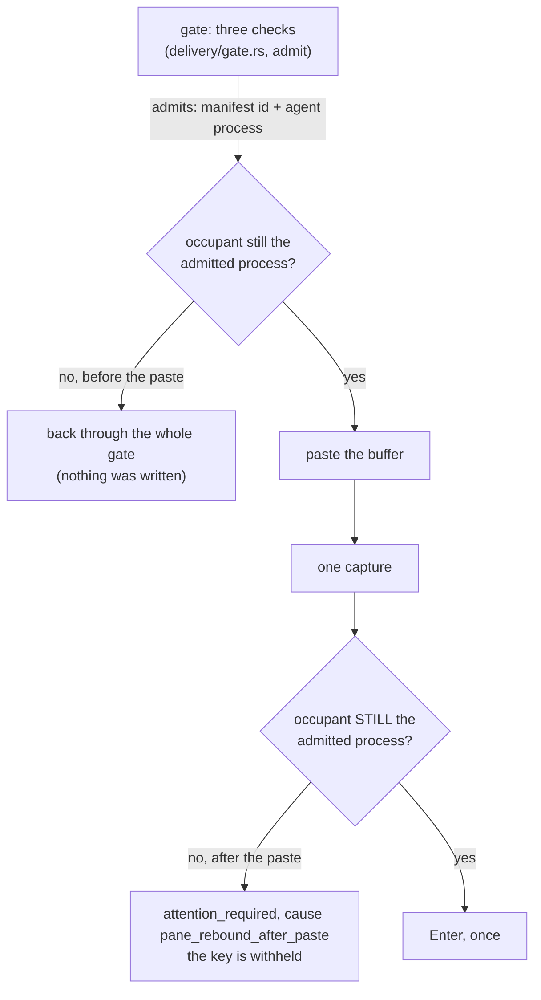

# Rules this system must never break

Ten of them. They are not style preferences: each one is here because
breaking it does something specific and bad to a person using Cyclops, and
most of them are here because something already went wrong once.

Each rule below says what breaks in the real world, where the code enforces
it, and which test fails if you take the enforcement out. If you are about
to change delivery, fusion, the journals, or any rendering path, read the
rules that touch it first. If you find one of these rules stated in a
second place, that is the bug: this page is where they live.

| # | Rule | What breaks |
|---|---|---|
| [1](#1-a-payload-never-reaches-a-pane-the-gate-did-not-admit) | A payload never reaches a pane the gate did not admit | A shell executes the message |
| [2](#2-a-modal-is-never-cleared-generically) | A modal is never cleared generically | Escape exits the agent CLI |
| [3](#3-a-doorbell-is-one-line-and-enter-held-only-by-a-seen-draft-or-a-named-block) | A doorbell is one line and Enter, held only by a seen draft or a named block | A human draft is submitted with the doorbell, or a live agent never hears its doorbell |
| [4](#4-every-delivery-ends-in-a-named-state) | Every delivery ends in a named state | Nobody chases what has no state |
| [5](#5-the-sender-is-whoever-connected-not-whoever-says-so) | The sender is whoever connected, not whoever says so | The audit trail can be forged |
| [6](#6-secrets-never-enter-the-journals) | Secrets never enter the journals | An API key on screen becomes a permanent plain-text record |
| [7](#7-the-record-appends-it-does-not-retract) | The record appends, it does not retract | A corrected line and a forged line look the same |
| [8](#8-zero-polling) | Zero polling | Idle battery burn, and a broken event path that looks fine |
| [9](#9-vendor-quirks-are-data-not-code) | Vendor quirks are data, not code | A vendor ships a new dialog and you ship a release |
| [10](#10-color-is-redundant-and-never-the-only-encoding) | Color is redundant and never the only encoding | The state is invisible under `NO_COLOR`, `--plain`, or a screen reader |

## 1. A payload never reaches a pane the gate did not admit

**Gate, re-check, paste, re-check, Enter. In that order, every time.**

What breaks: a pane whose agent exited is still a pane, and what is sitting
in it is a shell. Paste text into a shell and press Enter, and the shell
runs it. A doorbell line reads `[cyclops from reviewer] ... | cyclops inbox
claim m-att_...`, which is a command line. Every other delivery failure can
be fixed by sending again; this one cannot be taken back.

The chain is longer than the gate, and that is the part people miss.
Admitting a pane is a decision about a moment, and there are two
irreversible steps after it:

The gate's checks, in order: the pane is present, alive, and not in
copy-mode; a manifest binds it and the pane's foreground process is that
agent, not a tool it handed the terminal to; and the composer is not held
(rule 3). The capture that decides the composer is the last read before the
paste, so the snapshot is fresher than any human keystroke round trip.

A raw send (`--raw`) is the one admission that checks only the first
condition. It is admitted once the pane is present and alive, it re-checks
only that before the paste, and it can therefore land in a shell. The sender
asked for exactly that, and the journal records the write as raw and
unverified so nobody mistakes it for a gated delivery.

- Enforced at: `src/cyclopsd/src/delivery/gate.rs`, `gate` and `admit`
  (admission), `occupant_unchanged` (both re-checks), `attempt_delivery`
  (the order), and `attempt_raw_delivery` (the raw lane).
- Proven by: `src/cyclopsd/tests/delivery/gate.rs`,
  `pane_rebound_before_paste_never_pastes_into_the_new_occupant`,
  `pane_rebound_before_submit_withholds_the_submit_key`, and
  `pane_mode_entered_after_admission_withholds_the_paste`;
  `src/cyclopsd/tests/messaging/messaging_coordinator.rs`,
  `a_raw_send_pastes_the_whole_message_and_records_an_unverified_write`.

## 2. A modal is never cleared generically

**Decline keys come from the manifest rule that matched. There is no
fallback Enter and no fallback Escape.**

What breaks: Escape on Claude 2.1.220's folder-trust dialog exits the CLI.
Measured, and it cost a soak leg (F20). A generic dismissal is a keystroke
sent to a dialog nobody read, and vendor dialogs disagree about what every
key means.

A rule with `auto_dismiss = false` (trust prompts, permission prompts) is
not Cyclops's to answer at all: the delivery holds on the rule id and a
human is pinged once. A multi-key decline re-captures the screen before the
**final** confirming key and requires the same rule to still be the winning
match, so a dialog the human answered between keystrokes never receives the
confirm. Declines are bounded by `MAX_DECLINES`, never looped.

- Enforced at: `src/cyclopsd/src/delivery/gate.rs`, step 4 of `admit`,
  `send_decline_keys`, and `modal_still_matches`; `MAX_DECLINES` in
  `src/cyclopsd/src/delivery/mod.rs`; the vocabulary is `decline_keys` and
  `auto_dismiss` in `resources/manifests/*.toml`.
- Proven by: `src/cyclopsd/tests/delivery/gate.rs`,
  `decline_aborts_when_the_modal_changes_between_keys`;
  `src/cyclopsd/tests/messaging/messaging_coordinator.rs`,
  `a_human_modal_holds_one_notification_attempt_until_the_prompt_is_cleared`;
  `src/cyclopsd/src/delivery/tests.rs`, `modal_match_is_rechecked_by_rule_id`.

## 3. A doorbell is one line and Enter, held only by a seen draft or a named block

**Ordinary doorbell delivery writes one line and presses Enter for a bound,
live agent process unless a human draft is positively observed or a named
block is present (modal, permission, quota, dead, copy-mode, durable
composer hold). Ambiguous or absent composer evidence does not hold a
doorbell. A raw send bypasses the composer check entirely and is recorded
as an unverified write. Uncertainty is recorded, never retried
automatically.**

What breaks, in both directions. Hold too little and the paste lands in a
composer that already holds the human's half-written sentence, the two
concatenate, and Enter sends the mixture: the human's text is gone and the
agent gets an instruction nobody wrote. Hold too much and a live, idle agent
sits for hours without hearing about a message that was accepted, because
the daemon was waiting for composer evidence a vendor never paints. The
second failure is what the rule now trades against the first.

The guard against concatenation is a strong guard, not a guarantee. It
depends on the manifest recognizing typed text. On codex, a pristine
composer's ghost suggestion and real typed text are byte-identical in a plain
capture; the only discriminator is that the ghost text is SGR-dim and typed
text is bare (F19), so the manifest carries `line_regex_esc` rules and the
daemon supplies an escaped capture whenever the bound manifest has such
rules. A manifest with no rule that classifies human input, which is every
unverified manifest, never sees a draft. A person can also type between the
final capture and the tmux write; there is no input lease across that gap.
In both cases the concatenation can happen. What the rule guarantees is
that it is never silent: the paste is read back once, and an attempt whose
row did not read back exactly is recorded as `submitted_unverified` before
its receipt, never as a clean delivery.

The rest of the contract, as the gate applies it:

- A positively observed human draft holds. So does a hold a delivery owns:
  a doorbell staged and not yet consumed, or the turn it started that has
  not ended. The hold outlives the frame it was raised on; it releases when
  the draft is seen erased or the turn ends, never on elapsed time.
- A modal, permission prompt, exhausted quota, dead pane, or pane in
  copy-mode holds on its name. Quota is a gate hold like the others: it
  waits for the pane to change and never retries on a clock.
- Anything else proceeds: an idle agent, a working agent, a composer no
  rule can read, a manifest with no composer rule at all. A working agent
  gets its doorbell during the turn; vendors queue the line.
- Enter is pressed exactly once. A swallowed Enter, a missing receipt, or a
  receipt that never arrives ends the attempt as `notified` with no
  verifier, and the next doorbell for that recipient goes through the gate
  again, where a line left in the composer reads as human input.
- `--raw` skips the composer check and every occupant check beyond the
  pane being present and alive, pastes the whole rendered message, and
  presses Enter. The journal records `transport: raw` with no binding and no
  verifier.

- Enforced at: `src/cyclopsd/src/delivery/gate.rs`, step 5 of `admit`
  and `attempt_delivery` (one paste, one capture, one Enter, then
  `record_submitted` or `record_submitted_unverified` in
  `src/cyclopsd/src/notification_adapter.rs`), `settle_without_receipt`,
  and `attempt_raw_delivery`; `src/cyclopsd/src/fusion.rs`,
  `composer_is_held`, which is the whole hold predicate, fed by the
  `composer_semantic = "human_input"` rules in `resources/manifests/*.toml`
  (`composer_typed_input` in `codex.toml` is the measured one).
- Proven by: `src/cyclopsd/tests/delivery/gate.rs`,
  `escaped_capture_flips_typed_text_to_idle_with_input_and_gates`;
  `src/cyclopsd/tests/messaging/messaging_coordinator.rs`,
  `a_human_draft_holds_one_notification_attempt_until_its_turn_finishes`,
  `a_visible_human_draft_cleared_by_backspace_releases_the_same_attempt`,
  `an_indefinitely_ambiguous_idle_composer_submits_doorbell_once`,
  `a_manifest_without_composer_ownership_delivers_to_known_route`,
  `a_working_pane_with_a_proven_clean_composer_submits_one_doorbell`,
  `a_swallowed_enter_records_notified_without_a_verifier`, and
  `a_raw_send_pastes_the_whole_message_and_records_an_unverified_write`;
  `src/cyclopsd/src/delivery/tests.rs`,
  `a_raw_send_pastes_the_whole_message_and_records_transport_raw`;
  `src/cyclops-proto/src/state.rs`,
  `a_pane_that_was_holding_text_refuses_a_clean_frame` and
  `the_hold_releases_only_on_a_completed_turn`.

## 4. Every delivery ends in a named state

**`notified`, `attention_required`, `blocked_pre_write`, `withdrawn`,
`withdrawn_by_operator`, or `superseded`, or still moving through `queued`,
`gating`, `writing`, `submitted`, and `submitted_unverified`. Limbo is a
bug.**

What breaks: a delivery in no state is one nobody chases. It does not
appear in the backlog, it does not open the eye, and the sender believes it
landed. The failure mode is not a wrong answer, it is silence.

The case that produces limbo is a daemon that stops mid-flight, so the
daemon closes those at boot. Every attempt still at `writing`,
`submitted`, or `submitted_unverified` closes to `attention_required` with
cause `daemon_restart`, unless the recipient already claimed the message
after Enter, in which case the claim is the receipt and the attempt
becomes `notified`. No composer hold is restored: the next doorbell for
that recipient goes through the ordinary gate. Attempts still at `queued`
or `gating` are picked up again by a fresh worker; nothing was written.

If you add a new failure path to the pipeline, this is the rule you are
most likely to break: an early return that logs and drops is limbo.

- Enforced at: `src/cyclops-proto/src/notification.rs`,
  `NotificationState::can_transition_to` (the table of legal moves);
  `src/cyclopsd/src/mailbox/store.rs`,
  `recover_notifications_after_restart`; `src/cyclopsd/src/delivery/gate.rs`,
  `fail_attempt`, which turns every failure into a retry, a durable
  pre-write block, a deferred durable attempt, or attention.
- Proven by: `src/cyclopsd/src/mailbox/tests.rs`,
  `restart_closes_every_unreceipted_write_to_daemon_restart_and_restores_nothing`
  and `oldest_pending_notification_is_stable_and_resumes_after_restart`;
  `src/cyclopsd/tests/messaging/messaging_coordinator.rs`,
  `queued_notification_resumes_after_restart_without_a_second_attempt`;
  `src/cyclopsd/src/delivery/tests.rs`,
  `exhausted_prewrite_failures_have_exact_recoverable_causes` and
  `notification_faults_map_to_the_closed_attention_taxonomy`.

## 5. The sender is whoever connected, not whoever says so

**The daemon builds the envelope from socket peer credentials. Nothing in
the request body can name a sender.**

What breaks: the record is the product, and its value is that it cannot be
made to lie. If a request could name its own sender, any process on the
machine could append `reviewer: approved` to the audit trail, and a record
you cannot trust is worse than no record, because people act on it.

The resolution walks the peer pid's current ancestry and identifies supported
vendor processes. A same-uid shell with no vendor ancestor is `admin`, including
inside a watched pane. A vendor process gets the pane's durable identity only
when its ancestry reaches that current pane generation. Unprovable ancestry,
a vendor outside every watched pane, and a uid other than the daemon's are
denied before request handling.

`agent.state.report` needs one more thing, because being in the pane is
weaker than it sounds. An adopted pane keeps its label, its adoption and
its manifest pin while its agent is not running, so anyone at that pane's
shell prompt can start anything, and reading the terminal's current
foreground does not help: a hand-started helper holds the tty while it
runs and would present itself as the pane's agent, with the pin agreeing.

What admits a report is descent. The daemon walks from the peer up to the
pane root and takes the first process whose own argv says it is an agent
it ships a manifest for; a hook helper is a child of the agent that ran
it, so that walk lands on the agent whether the agent holds the tty or
handed it over. A peer with no such ancestor is refused, and a pin that
disagrees with the process found is refused rather than believed. The
same proven pid and manifest are what the ACK path re-derives, so both
ends of a report speak about the same process.

- Enforced at: `src/cyclopsd/src/identity.rs`, `peer_of`,
  `resolve_sender` and `vendor_ancestor`; `src/cyclopsd/src/server.rs`,
  `verify_report_origin`; `src/cyclopsd/src/fusion.rs`,
  `vendor_between` and `admitted_vendor`.
- Proven by: `src/cyclopsd/src/server.rs`,
  `msg_send_fails_closed_without_peer_credentials`;
  `src/cyclopsd/tests/delivery/m2_hooks.rs`,
  `forged_report_over_the_socket_is_denied_and_ingests_nothing`;
  `src/cyclopsd/src/identity.rs`,
  `a_helper_nobody_started_from_an_agent_is_not_admitted` and
  `a_helper_the_agent_started_is_admitted_as_that_agent`.

## 6. Secrets never enter the journals

**What the daemon OBSERVES never lands in the record. Rule ids, states and
causes do; screen captures do not.**

What breaks: the journals are plain text under `~/.cyclops/`, meant to be
read with `jq`, copied into a bug report, and kept for months. An agent
pane's screen holds whatever the agent just printed: an API key, a `.env`
it opened, a customer's name. Append that once and it is there for good,
because rule 7 means nothing rewrites it.

So a gate line names the matched rule, not the text that matched it, and a
notification fact carries states, causes, and process identities, never the
row that was read back from the composer.

The line to keep straight: message subjects and bodies DO enter the
workspace journal. Those are what a person deliberately sent, and recording
them is the point. The rule is about what Cyclops reads off a screen on its
own. The body's own boundary is rule 1's cousin: a body reaches a pane only
through `--raw`, and reaches a reader only through an authenticated claim.

- Enforced at: `src/cyclops-proto/src/ledger.rs` (schema and the rule);
  `src/cyclops-proto/src/notification.rs`, whose facts have no field a
  capture could go in; `src/cyclopsd/src/delivery/gate.rs`, `gate_line`.
- Proven by: `src/cyclopsd/tests/delivery/gate.rs`,
  `escaped_capture_flips_typed_text_to_idle_with_input_and_gates`, which
  asserts the typed draft is absent from the session ledger;
  `src/cyclopsd/tests/messaging/messaging_coordinator.rs`,
  `private_body_shapes_never_reach_the_notification_pane`;
  `src/cyclopsd/tests/messaging/body_privacy.rs`,
  `history_and_thread_release_bodies_only_after_the_exact_claim`.

## 7. The record appends, it does not retract

**Lines are never rewritten. A correction is a new line.**

What breaks: an audit you can edit is not an audit. Once a line can be
changed after the fact, a corrected line and a forged line are the same
artifact, and every reader has to take the writer's word for which it is.
The append-only shape is also what makes crash safety cheap. Every
acknowledged append ends in a newline and is fsynced. Newline-terminated
records are immutable. An unterminated final tail was never acknowledged:
lenient replay adds its terminating newline, retains it when it validates, and
skips it when it does not. Strict workspace replay removes only that tail and
logs a warning. A malformed complete line is rejected, not repaired. No
acknowledged record is silently deleted, truncated, or rewritten.

This has a consequence on screen that surprises people. When something that
needed a human stops needing one, the alarm line stays where it is and the
resolution arrives as a **second** line. Deleting the alarm would leave a
reader who saw it with no ending, and a calm eye sitting over a row that
still says "action required". `Clearance` distinguishes the two endings
that are not the same story: somebody answered the prompt (`Moved`), or the
pane closed on it (`PaneGone`).

- Enforced at: `src/cyclops-ledger/src/lib.rs`, `LedgerWriter` (append only,
  fsync before acknowledge, distinct strict and lenient handling for one
  unacknowledged unterminated tail); `cyclops_proto::attention`, rule 3 and
  `Clearance`.
- Proven by: `src/cyclops-ledger/src/lib.rs`,
  `torn_tail_is_sealed_and_skipped`,
  `lenient_replay_seals_and_retains_a_valid_unterminated_tail`, and
  `strict_replay_removes_only_an_unterminated_tail`; plus
  `src/cyclopsd/tests/boot_and_sessions/restart_eye.rs`,
  `the_restart_ping_never_outlives_the_deliveries_it_names`.

## 8. Zero polling

**No interval timer may re-ask a question nobody asked. Every timer in the
product is one-shot and has a name.**

What breaks two ways. The obvious one: idle CPU and battery on a laptop
that is doing nothing, plus screen captures against a vendor TUI nobody
requested. The subtle one is worse. An interval hides a broken event path.
If a poll eventually notices what a subscription should have pushed,
everything looks fine while the mechanism carrying the sub-second
guarantees is dead, and you find out when a delivery is late by a second
that used to be 30 milliseconds.

The following are the long-lived coordination timers. Each one is named,
one-shot, armed by a specific state or request, and event-driven after it
fires:

- **One debounce.** `RECONCILE_DEBOUNCE`, 30ms, in
  `src/cyclops-tmux/src/watcher.rs`. Change hints arrive in bursts (a
  split touches every pane), so the reconcile they arm is coalesced. No
  hint, no timer: the deadline is armed by an event and disarmed by
  running, never rescheduled on its own.
- **One-shot timers inside a delivery**, each bounded and each listed in
  the header of `src/cyclopsd/src/delivery/mod.rs`: the post-paste
  readback re-reads, the tier-1 ACK window, the screen-evidence
  checkpoints, the decline-key spacing, the two bounded re-observations of
  a hold that announces no event (an unreadable process table, a refused
  barrier claim), and the one-shot ping for a hold that has lasted too
  long. None of these timers exists when no delivery is in flight.
- **One dispatch settle per candidate hook edge.** A vendor that runs
  every matching hook concurrently reports a prompt before it knows whether
  a sibling hook blocked it, so `src/cyclopsd/src/hook_lifecycle.rs` holds
  the edge until a later watcher event supplies visual evidence. The
  deadline is armed by the edge and consumed by the next observation.
- **The eye's animation tick**, one shot per state change
  (`src/cyclops-ui`).

A hold waits on an event, not on a clock. If you are about to add an
`interval` or a `loop { sleep }` to product code, the answer is an event
you have not found yet.

Sanctioned exceptions, none of them in the product: the Python probe
harness under `tests/e2e/lib/` polls because a measuring instrument must,
`cyclops-testrig` waits in bounded loops for things a test has no edge to
await, and demo scripts pace their narration.

- Enforced at: `src/cyclops-tmux/src/watcher.rs` (the debounce and the
  subscription-driven table); the contract is written out in
  [ARCHITECTURE.md](ARCHITECTURE.md) under "The zero-polling contract".
- Proven by: `src/cyclopsd/tests/evidence/idle_observation_perf.rs`, which counts
  watcher wakes, recompute starts, and screen captures over a quiet window
  after proving each counter moves; `src/cyclopsd/tests/delivery/gate.rs`,
  `long_gate_hold_notifies_the_admin_once`.

## 9. Vendor quirks are data, not code

**Everything Cyclops knows about a vendor TUI is a TOML file.**

What breaks: vendor CLIs change without telling anyone. If a quirk lives in
Rust, a new dialog means a code change, a review, a build and a release
before anybody can send a message again. If it lives in a manifest, it is a
text edit a user can make on the machine where the problem is, and Cyclops
tolerates unknown keys so they can keep notes next to the rule.

The schema has grown exactly twice, and both times a measurement forced it:

- `agent.argv_basenames`, because a native Claude install symlinks to
  `versions/2.1.220` and macOS derives the process name from the resolved
  file, so `#{pane_current_command}` reads `2.1.220` and a
  `process_names` match silently never binds (F21).
- rule `line_regex_esc`, because typed text and ghost text differ only in
  SGR attributes (F19, and rule 3 above).

The same principle runs wider than manifests: hook config templates under
`resources/hooks/`, workspace presets under `resources/layouts/`, and theme
palettes under `resources/themes/` are all data files, and none of them is
a code path.

- Enforced at: `src/cyclops-manifest` (parse, validate, evaluate, and
  nothing vendor-specific); the twelve files in `resources/manifests/`.
- Proven by: `src/cyclops-manifest/tests/shipped_rules.rs`, which runs
  the shipped rules against captures taken from real sessions and pins
  which manifests claim to be measured and which say `unverified`.

## 10. Color is redundant and never the only encoding

**Two encodings carry meaning: role color and state glyph. Color is never
the only one. A compact workspace surface may carry the glyph alone;
every detailed, plain-text, or diagnostic surface still carries a glyph
AND a word.**

What breaks: `NO_COLOR`, `--plain`, a screen reader, a piped log, a CI
transcript, and a reader who cannot distinguish the two hues you picked. In
every one of those, a meaning carried by color alone is simply not there.

Read this rule precisely, because it was already misread once and the fix
was expensive. Redundant means **present and duplicated**, not absent. M3
read "never color alone" as "states are never colored" and deleted all six
`state.*` and five `badge.*` tokens from the vocabulary; the tokens are
back and the CLI paints all nine, grouped by what a reader actually needs
to know (healthy, needs-you, terminal, quiet) rather than one hue per
state. Role hues stay on the agent name alone, so the two encodings never
share a cell.

The workspace's compact surfaces, including sidebar rows and inactive pane
borders, are the one narrow exception, and it is not a color standing in for a
word: `○` idle, `●` working, `⚠` needs attention, and `✕` dead are a fixed,
documented glyph vocabulary that a reader can learn once. `idle_with_input`
shares the idle presentation because no turn is running, but it remains a
distinct state in diagnostics and delivery. The glyph is chosen by state,
never by theme, so it renders identically under every theme and under
`NO_COLOR`; only the `Style` painted under it changes. A detailed surface
(the focused pane border, dialogs, the sidebar's event stream), plain-text
output, and every diagnostic show the word whenever there is room for it.
None of them may drop straight to hiding the state just because the word
does not fit: the fallback is always the glyph, the same one the compact
surfaces show on purpose.

The check that matters is mechanical: turn color off and read the same
line. If anything is missing beyond a compact surface's own documented
glyph, the glyph or the word is doing too little.

- Enforced at: `src/cyclops-theme` (`state_token`, `delivery_token`,
  and the token vocabulary); `src/cyclops/src/style.rs` and
  `src/cyclops-ui/src/theme.rs` paint through those and nothing else;
  `src/cyclops-ui/src/plain.rs` is the same content with no paint;
  `src/cyclops-workspace/src/decoration.rs`, `DecorationSnapshot::primary_status`,
  which maps the daemon's own attention flag to the glyph and word and
  never raises attention on its own.
- Proven by: `src/cyclops-ui/src/entry.rs`, which asserts the
  color-off rendering of a blocked row and a parked row is the words;
  `src/cyclops-theme/tests/vocabulary.rs`,
  `every_token_in_the_vocabulary_is_painted_by_a_renderer`;
  `src/cyclops-workspace/src/render/sidebar.rs`,
  `sidebar_state_glyph_is_stable_across_theme_and_no_color`, and
  `src/cyclops-workspace/src/render/canvas.rs`,
  `inactive_pane_border_glyph_is_stable_across_theme_and_no_color`, which
  feed the same state through two unrelated themes and `NO_COLOR` and
  assert the glyph never moves while its `Style` does.

## Where these came from

GOALS.md states most of these as one-liners and is the authority on intent.
findings.md holds the measurements several of them rest on (F11, F19, F20,
F21). This page is the operational form: the rule, the damage, and the
line of code that stops it.
