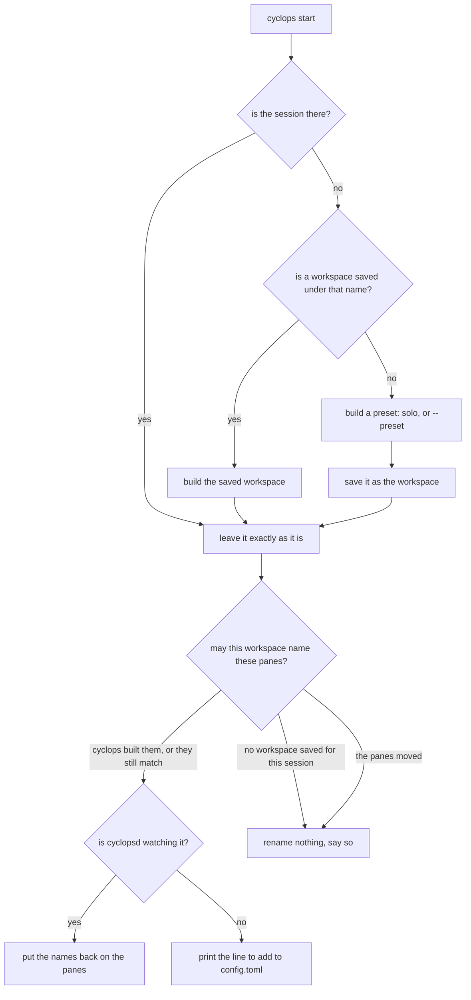

# Workspaces

A workspace is the shape of a session: which panes, how big, what they are
called, and where they start. It is one file you can read, edit and commit.

## Open one

For the normal full-screen workspace UI, run bare `cyclops`. Use `cyclops
start` when you need to construct or restore a specific saved workspace or
preset before opening it:

```bash
cyclops start --preset duo
cyclops
```

`start` performs the setup and exits. If you deliberately want native tmux
without the Cyclops sidebar, tabs, Messages pane, file panel, or workspace
controls, attach directly instead:

```bash
cyclops start --preset duo
tmux attach -t main
```

```
✔ workspace ready · 3 agents
  started cyclopsd, logging to ~/.cyclops/cyclopsd.log

Next:
  1  cyclops  open the full workspace UI and start your agents
```

`start` is safe to run as often as you like. A session that is already
there is left exactly as it is, and the list only shows what is still
undone.

The check is heavy because cyclopsd answered for those three agents. A
light `✓` means it could not be asked, which happens with `--no-daemon`
or when starting one failed, and the line under it says which. That is
the same rule as `✔ delivered · verified` against
`✓ delivered · unverified (screen)`: the weight says who confirmed the
thing beside it.

What it decides:



Which workspace it means, first answer wins: `--workspace`, the
`default_workspace` key in `~/.cyclops/config.toml`, the first watched
session, then `main`. The session takes the workspace's name unless
`--session` says otherwise.

Building from a preset writes the workspace file, so the next run opens
your workspace rather than guessing at a preset again. A workspace file
that already exists is never overwritten by `start`; `save` is the verb
that updates one.

### When start will not name anything

`start` puts names on panes only when it is sure which pane is which.
Three things have to hold, and if any of them does not, it renames
nothing and says why:

1. **The workspace is this session's.** Either cyclops built the session
   from it just now, or it was saved for it. A session you arranged
   yourself is never named from a preset, because a preset is a shape
   cyclops offers and not one you chose. Naming is explicit
   ([panes.md](panes.md)).
2. **The session still has the workspace's shape**: the same windows,
   the same rows in each, the same panes in each row. Sizes are not part
   of it, because resizing a pane moves no agent.
3. **Every name already on a pane is where the workspace puts it.** Swap
   two panes and the shape is identical while the agents are not, so this
   is the check that catches it.

A workspace file holds no pane ids. It cannot: the panes it describes are
usually gone by the time it is read, and tmux hands a freed id to the next
pane it makes. Position is all it has, and these three keep position
meaning something.

```
✓ workspace ready · 0 agents
  main no longer has the shape of workspace "main": row 1 of window "ops" has 2 panes and the workspace describes 3 panes. Nothing was renamed. Save the session as it is now: cyclops workspace save main --session main
```

### The number in the ready line

`N agents` is how many panes cyclops can address, and it comes from the
best source available:

1. cyclopsd, when it is watching the session. That is the roster, it is
   the same number `cyclops list` shows, and the line takes the heavy
   check: `✔ workspace ready`.
2. The workspace itself, when there is no daemon to ask, and only while
   `start` may name the session at all. Nobody has confirmed those names,
   so the line takes the light check: `✓ workspace ready`.
3. Otherwise nothing is claimed: the count is 0 and a line underneath
   says why nothing was renamed.

## The four presets

Each is the one before it plus a pane, and the names carry over.

| Preset | Panes | What it is |
|---|---|---|
| `solo` | 1 | One agent. The first rung: one pane, one name. |
| `duo` | 2 | Two agents side by side: one writes, one reviews. |
| `quad` | 4 | Four agents in even quarters: implement, review, test, document. |
| `ops` | 3 + dock | Three agents with the stream docked underneath. |

```bash
cyclops start --preset ops
```

The preset only applies when there is nothing to open yet. Once the
session exists, `start` never rearranges it.

### Why the ops dock is that size

The dock is full width and 30% of the height, and both numbers come from
the stream rather than from taste.

Full width, because the stream does not wrap: it draws on a strict grid
and lets the terminal clip its own edge. Its widest routine line is a
clearance for an eleven-column label,

```
12:04:31  implementer  ✔ cleared · was ⚠ blocked_permission
```

which is 59 columns. A side dock at 30% of a 160-column terminal is 48
columns and cuts off the state word, which is the one word that line
exists to carry.

30% of the height, because that is where both halves stay usable. On a
48-line terminal the dock gets 14 lines, the header plus a dozen entries,
and each agent keeps 33, still more than a classic 24-line screen.

The dock has no name. Names are how you address an agent and nothing
addresses the stream, which is why `ops` reports three agents and not
four.

## Save a session

```bash
cyclops workspace save              # the session you are watching, under its own name
cyclops workspace save review-setup # the same session, under a second name
```

```
✔ workspace saved · main · 4 panes · 3 agents · ~/.cyclops/workspaces/main.toml
```

Save reads the session's real geometry and turns it into ratios, picks up
each pane's working directory, records anything running that is not a
shell as a launch hint, and asks cyclopsd for the names.

### Save when nobody can answer for the names

Names live in two places: cyclopsd's registry, and this file. Save keeps
the ones the file already has rather than writing a file with none
whenever nobody can answer for the roster. That is two situations, not
one: no daemon, and a daemon that is watching with an empty registry. A
daemon that just restarted is the second one until its sessions reattach,
and an empty roster is not the claim that these panes have no names.

With no daemon, the light check says the agent count was not confirmed by
anybody, and the line under it says exactly what happened:

```
✓ workspace saved · main · 4 panes · 3 agents · ~/.cyclops/workspaces/main.toml
  cyclopsd isn't watching "main", so no names could be read. The 3 names already in ~/.cyclops/workspaces/main.toml were kept as they were. Start it and save again to capture the roster.
```

With a daemon watching and nothing on its roster, the file's names are
kept the same way. Only the cause and the next step differ:

```
✓ workspace saved · duo · 2 panes · 2 agents · ~/.cyclops/workspaces/duo.toml
  cyclopsd is watching "duo" but has no names on its roster, so none could be read. The 2 names already in ~/.cyclops/workspaces/duo.toml were kept as they were. Name the panes with cyclops name <pane> <label>, then save again to capture the roster.
```

If the session's shape has changed too, those names have no pane left to
sit on, and saving would put the geometry on disk and delete a roster
that exists nowhere else. So it writes nothing at all and exits 1:

```
~/.cyclops/workspaces/main.toml holds 3 names and main no longer has its shape: row 1 of window "ops" has 2 panes and the workspace describes 3 panes. Nothing was written, because cyclops can't tell which pane each of those names belongs to now. Start cyclopsd and save again, and the names come from the roster instead of the file. Or save this shape under another name.
```

Save refuses a window it cannot describe honestly: one with a zoomed pane
(unzoom it first) and one whose panes are not a grid of rows. Both name
the window and the next step.

## Restore it

```bash
cyclops workspace restore main --session review
cyclops workspace restore main --launch
```

```
✔ workspace restored · review · 4 panes · 3 agents
```

Restore always builds a NEW session, so it can never rearrange one you are
working in. `--session` says which; without it, the session takes the
workspace's name.

The names usually arrive a moment later than the panes. cyclopsd connects
to a new session on its own schedule, and until it has, no pane in that
session can be named. Restore says so and prints the command that finishes
the job:

```
✓ workspace restored · main · 4 panes · 0 agents
  cyclopsd hasn't connected to "main" yet, so nothing was named. The names are in the workspace. Put them on with: cyclops start
```

`cyclops start` is that command because it never rebuilds a session that
exists: on an existing session it only puts the workspace's names back.

`demos/m4-workspace.sh` walks the whole loop against an isolated tmux
server: build, name, save, kill the session outright, restore, and put the
names back. It ends by diffing the pane rectangles, the roster names, and
a second save of the restored session against what was there before, so it
is a smoke test as well as a walkthrough.

One thing a restore cannot do: give a second session the same names. A
name is an address, unique across every watched session, so restoring a
copy alongside the original leaves the copy unnamed and says which names
were refused.

Panes come back empty. A workspace restores structure, not running
processes: the panes, their sizes, their directories and their names.
`--launch` runs each pane's recorded command instead, as the pane's own
command, so the pane closes when that command exits. Cyclops never types
into a pane to start something.

## The file

`~/.cyclops/workspaces/<name>.toml`. A window is rows top to bottom, a row
is panes left to right, and every size is a ratio.

```toml
name = "main"

[[windows]]
name = "ops"

[[windows.rows]]
ratio = 0.6957

[[windows.rows.panes]]
label = "implementer"
ratio = 0.3333
cwd = "/Users/you/projects/gateway"

[[windows.rows.panes]]
label = "reviewer"
ratio = 0.3333
cwd = "/Users/you/projects/gateway"

[[windows.rows.panes]]
label = "tests"
ratio = 0.3333
cwd = "/Users/you/projects/gateway"

[[windows.rows]]
ratio = 0.3043

[[windows.rows.panes]]
ratio = 1.0
cwd = "/Users/you/projects/gateway"
command = "cyclops watch"
```

Ratios are relative: they are normalized by their own row or window, so
`34/33/33` and `0.34/0.33/0.33` say the same thing. Saved files use
fractions of the pane cells, which is why a 70/30 split saved off a real
window reads as `0.6957 / 0.3043`: tmux spends one line between stacked
panes, and that line belongs to tmux, not to the layout.

Every field except `name`, `ratio` and the window name is optional. A pane
with no `label` is not an agent. A pane with no `cwd` starts wherever the
workspace was built from. A pane with no `command` has nothing to launch.

The shipped presets are the same format, in [resources/layouts/](../../resources/layouts/), and
they are compiled into the `cyclops` binary so a fresh install has them
before it has a config file.

## Names, and where they live

Names are the roster: they say who a message is from, who it is to, and
what `--all` means. Two things keep them.

- cyclopsd keeps a name on a pane that is still alive, across its own
  restarts. It drops one whose pane is gone, because tmux reuses pane ids.
- The workspace file keeps the names when the panes themselves are gone.
  `restore` and `start` put them back.

`start` only names panes when it can tell which pane is which: see
[when start will not name anything](#when-start-will-not-name-anything).
If you have split, closed or swapped panes since, it says so and leaves
every name alone rather than guessing. Save the session as it is now and
the names have somewhere to go again.

Guessing is the thing this avoids, and the reason is not tidiness. A name
is the address every later `send`, `wait` and reply resolves through, so a
name put on the wrong pane types the next message into the wrong agent,
and nothing about the output would look wrong while it happened.

## Sizes and resizing

A workspace is built at the size of the terminal you run `cyclops start`
in. That matters more than it looks: tmux hands out the cells from a
window resize evenly rather than in proportion, so a workspace built at
tmux's own 80x24 default and then attached from a 200x50 terminal arrives
with the `ops` dock at 41% of the screen instead of 30%. Building at your
real size is what makes a preset look like its design.

If you build one detached (in a script, or with output piped) tmux picks
the size, and the ratios apply to that window.

## Config

Two keys in `~/.cyclops/config.toml` matter here:

```toml
sessions = ["main"]           # what cyclopsd watches
default_workspace = "main"    # what `cyclops start` opens by default
```

`cyclops start` writes that file on a first run, when there is none. After
that the file is yours: if it does not name the session, `start` prints
the line to add and changes nothing.
