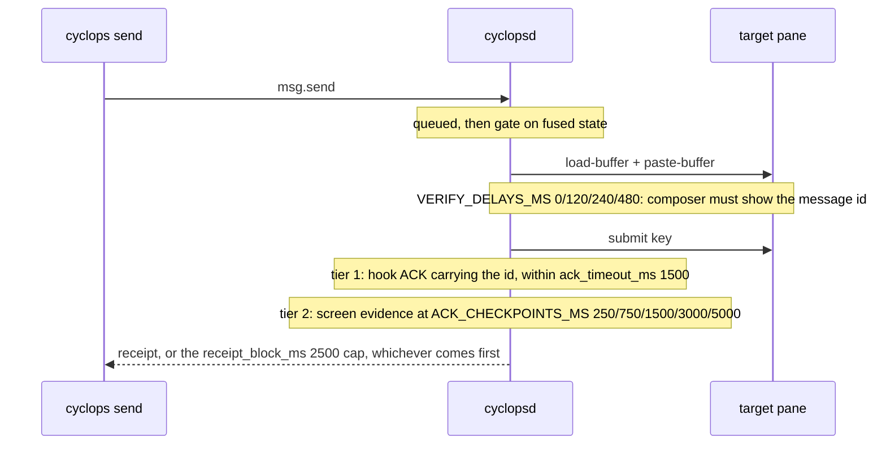

# How fast it is

Every number on this page names where it came from: a source file, a test
name, or a run on the machine described below. Nothing is estimated and
nothing is rounded up from a hope. Where a figure does not exist, this page
says so instead of inventing one.

Two things get measured. Delivery, which the previous implementation also
did, so it can be compared directly. And the workspace, which is new, so it
is measured against itself.

## The machine

Everything labeled "measured here" ran on this box on 2026-08-08, in the
`release` profile.

```
$ sysctl -n machdep.cpu.brand_string
Apple M5 Pro
$ sysctl -n hw.ncpu
18
$ sw_vers -productVersion
26.5.2
$ tmux -V
tmux 3.6a
$ rustc --version
rustc 1.97.1 (8bab26f4f 2026-07-14) (Homebrew)
$ cyclops --version
cyclops 0.1.0 (08676d4)
```

Read every wall-clock figure with two caveats. The working tree carried
uncommitted edits under `src/cyclops-workspace` while these ran, so the
commit alone does not reproduce the tree byte for byte. And the box was
compiling in another checkout at the same time, which is the contention
`.agents/planning/2026-08-03-cyclops-workspace-tui/implementation/baselines.md`
already documents as worth 1.6x to 9x on some metrics. Trust shapes over
absolute milliseconds, and rerun anything that matters.

## What is being compared

Cyclops is the Rust implementation: `cyclopsd` holds one tmux control-mode
connection per watched session, an append-only NDJSON ledger records every
message and state change, and delivery ends in a named state with a receipt
that says how it was verified.

commPact v1 is the previous implementation, read-only at branch `v1` and tag
`v1-final`. It is a shell toolkit: `bin/commPact` at 890 lines plus nine
sibling scripts, 86,101 bytes across that tree's bin directory in total.
There is no daemon. Every verb is a process that starts, shells out to tmux
one command at a time, and exits.

What v1's `send` actually does, read from the tag:

1. Resolve the target label, check the sender's session ACL, and read pane
   state through a series of `display-message` calls.
2. Take a `mkdir` lock on the target pane, retried every 100ms.
3. Re-resolve the target and confirm it did not change under the lock.
4. Decide the pane is ready by matching a prompt glyph (`READY>`, `>`, `›`,
   `❯`) against the last eight lines, with a hardcoded allowlist for two
   Claude placeholder strings, or by recognizing the pane's command as one
   of six known agent names.
5. `load-buffer`, `paste-buffer`, then poll `capture-pane` up to twenty
   times at 100ms spacing looking for its own marker.
6. `send-keys Enter` and return `SUBMITTED`.

`SUBMITTED` is v1's terminal answer. Nothing confirms the recipient's model
read the message. There is no ledger, no history, no threads, and no live
state: `commPact-state-watchdog` is a manual file-age check whose own usage
text says it does not create a watcher.

That difference is the reason the two are not one benchmark. v1 answers "I
pressed Enter". Cyclops answers "this ended in this state, verified this
way". The tables below compare them at the one milestone they share and then
report the work Cyclops does past it.

## Delivery latency

### The deadlines, and what each one bounds

Every one of these is a one-shot bounded by a delivery in flight. None is an
interval. [INVARIANTS.md](../development/INVARIANTS.md) rule 9 is the rule
they answer to.

| Deadline | Default | What it bounds | Source |
|---|---|---|---|
| `receipt_block_ms` | 2500ms | How long `msg.send` blocks for a receipt on the idle path | `src/cyclopsd/src/config.rs`, `Config::defaults` |
| `ack_timeout_ms` | 1500ms | The tier-1 window: how long a delivery waits for the manifest hook ACK before falling back to screen evidence | `src/cyclopsd/src/config.rs`, `Config::defaults` |
| `gate_hold_notify_ms` | 120000ms | One admin ping for a delivery wedged in gating. The hold itself keeps waiting on events | `src/cyclopsd/src/config.rs`, `Config::defaults` |
| `SCREEN_ACK_DEADLINE` | 5s | Neither ACK tier by then means `attention_required`, cause `ack_timeout` | `src/cyclopsd/src/delivery.rs` |
| `ACK_CHECKPOINTS_MS` | 250, 750, 1500, 3000, 5000 | One-shot screen-evidence checks after submit. Events also wake the waiter; these cap the captures per delivery | `src/cyclopsd/src/delivery.rs` |
| `VERIFY_DELAYS_MS` | 0, 120, 240, 480 | Post-paste composer re-reads, because paste rendering can lag a frame | `src/cyclopsd/src/delivery.rs` |
| `DECLINE_SPACING` | 250ms | Spacing between a manifest's modal decline keys | `src/cyclopsd/src/delivery.rs` |
| CLI connect / read | 2s / 5s | The `cyclops` client's own socket budget. The 5s read budget has to exceed `receipt_block_ms`, and does | `src/cyclops/src/client.rs` |
| Workspace `IO_TIMEOUT` | 250ms | The full-screen workspace's budget for its small decoration, naming, and confirmation requests to the daemon. It never sends messages through this path | `src/cyclops-workspace/src/daemon.rs` |
| `WAIT_DEFAULT_MS` / `WAIT_MAX_MS` | 60s / 600s | `--wait` and `agent.wait` | `src/cyclopsd/src/delivery.rs` |

The tiers those deadlines serve, in full, are in
[DELIVERY.md](../development/DELIVERY.md); the receipts a user sees are in
[send.md](../guides/send.md).



### Measured here, on a fixture pane

An isolated tmux server, one pane running `cat`, one manifest that reports
the pane idle and verifies the message id in the composer before submit
(the `CAT_MANIFEST` shape from `src/cyclopsd/tests/common`). No hooks, so
every delivery resolves on screen evidence, which is exactly what a fresh
install does before `cyclops hooks install`.

Twelve sends, timing taken from the wall clock at process start and from the
`kind=state` lines the daemon wrote to its own ledger:

| Milestone | Min | Median | Max |
|---|---|---|---|
| `queued`, the daemon has the message | 4ms | 4.0ms | 5ms |
| `gating`, the gate is evaluating | 7ms | 8.0ms | 11ms |
| `pasting`, payload written to the pane | 14ms | 14.0ms | 19ms |
| `staged`, composer verified to carry the message id | 18ms | 18.5ms | 141ms |
| `submitted`, Enter sent | 21ms | 21.5ms | 144ms |
| `delivered_unverified`, screen evidence accepted | 276ms | 276.5ms | 400ms |

The `cyclops send` process itself returned at a median of 295ms across a
separate run of twelve, about 18ms after the delivery resolved.

The shape is worth reading. Everything up to and including Enter costs
21.5ms. The remaining 255ms is not work, it is the wait for the first
screen-evidence checkpoint at 250ms. A tier-1 recipient with hooks wired
does not pay it: the hook ACK resolves the delivery when it arrives, and the
soak below measures that at a p50 of 12ms for Claude Code.

Against `DELIVERY.md`'s own budgets (send to paste under 1s, receipt under
2s on the idle path), the measured figures are 14ms and 276.5ms.

### The same milestone, in v1

The same box, the same shape of rig: an isolated tmux server, a target pane
that echoes instantly, a ready prompt in view, the marker verified before
Enter. Ten sends through `bin/commPact` at tag `v1-final`.

| | v1 `SUBMITTED` | Cyclops `submitted` |
|---|---|---|
| Median | 196ms | 21.5ms |
| Range | 184 to 209ms | 21 to 144ms |
| Verified before Enter | Yes, marker in a `capture-pane` poll | Yes, message id in the composer |
| What happens after Enter | Nothing. `SUBMITTED` is the final word | Two ACK tiers, a receipt, and a ledger line per transition |

Roughly nine times faster to the same milestone, and the milestone is not
where Cyclops stops.

Two honesty notes on that table. The v1 numbers are v1's best case: the
target echoed the paste immediately, so its verification loop hit on the
first attempt and none of its twenty 100ms polls were spent. A real agent
TUI that renders a frame later costs v1 100ms per extra poll. And v1's
readiness heuristic refused the third consecutive send in this rig with
`PANE_UNKNOWN`, because the echoed payloads had pushed the prompt out of the
eight-line window it reads; the ten timed runs above reset the prompt
between sends so v1 was measured succeeding, not failing.

### Measured against real agent CLIs

`tests/e2e/m1_soak.py` drives Claude Code, Codex CLI, and Antigravity CLI in
isolated tmux servers and reconciles every delivery against the ledger.
Two runs are committed under `tests/raw/`. Timestamps in those ledgers put
both on 2026-08-02.

`tests/raw/m1-soak-2/summary.json`, verdict PASS, 251.9s wall, zero detach
events, zero shutdown wedges:

| CLI | Sent | Verified | Unverified | Lost | Retries | ACK p50 | ACK p95 | End-to-end p50 | End-to-end p95 |
|---|---|---|---|---|---|---|---|---|---|
| claude | 100 | 100 | 0 | 0 | 0 | 12ms | 1270ms | 447ms | 2422ms |
| codex | 100 | 66 | 34 | 0 | 0 | 37ms | 3006ms | 176ms | 3145ms |
| agy | 21 | 0 | 20 | 0 | 0 | 256ms | 257ms | 394ms | 408ms |

ACK is the harness's own definition: last `submitted` to the first delivery
evidence after it, hook tier or screen tier, whichever resolved. End-to-end
is the first state line to the last. The agy leg stopped at 21 because the
vendor quota parked it, which is the designed outcome, not a failure.

`tests/raw/m1-soak/summary.json` is the earlier run, verdict FAIL: the
Claude leg lost one delivery and stopped at seq 29. Both are kept because
the pair is the evidence for the fixes listed under M1 in
[CHANGELOG.md](../../CHANGELOG.md), and because a benchmarks page that
publishes only the green run is advertising.

The p95 columns show where the tiers separate. Codex's 3006ms is the 3000ms
screen checkpoint: a third of its deliveries never produced a matching hook
ACK and resolved on screen evidence instead. Claude's 12ms p50 is the hook
tier working.

## Throughput

Three different things get called throughput here. They are not
interchangeable.

**Pane bytes.** `baseline_pane_runtime_feed_and_grid_throughput` in
`src/cyclops-workspace/tests/baseline.rs` feeds 1 MiB of mixed ASCII, SGR
color, and CJK wide characters through a `PaneRuntime` in 4096-byte chunks,
one frame per chunk. Measured here:

| Pane size | Feed throughput | Grid build (test path) | Direct cell walk (production path) |
|---|---|---|---|
| 80x24 | 145.2 MB/s | 9.77us/frame | 7.74us/frame |
| 200x50 | 83.1 MB/s | 52.24us/frame | 45.06us/frame |

**Sustained output under a real tmux.**
`sustained_output_backlog_drains_continuously` in
`src/cyclops-workspace/tests/perf_contract.rs`, measured here: 7,000,074
bytes drained in 93 batches at the 8ms render cadence, peak batch 87,388
bytes, longest run of empty cycles while the stream was active: 5.

**Stream events.** `frame_build_stays_under_16ms_at_10k_entries` in
`src/cyclops-ui/tests/perf.rs` fills the event ring to its 10,000-entry cap,
adds a real attention backlog, and builds one frame at 80x60. The test
asserts a 16ms budget, one 60Hz frame. Measured here:

| Open attention items | Firehose view | Admin view |
|---|---|---|
| 0 | 0.042ms | 0.100ms |
| 100 | 0.117ms | 0.180ms |
| 400 | 0.138ms | 0.268ms |
| 1000 | 0.164ms | 0.285ms |

The worst case is 0.285ms against a 16ms budget, at 10,000 entries with a
thousand open items.

**Message throughput is not measured, by anybody, including this page.** The
soak paces itself: each leg sends, waits for a terminal delivery state, then
sleeps a uniform 0.1 to 0.6s. That works out to 0.42 deliveries per second
per leg in `m1-soak-2`, which is a property of the harness and of how long a
vendor CLI takes to start a turn, not of the daemon. No saturation test
exists. Do not quote a deliveries-per-second number from this repo.

## The workspace

### Render

`full_frame_paint_duration_scales_with_pane_count` in
`src/cyclops-workspace/src/render/canvas.rs` paints complete frames, tab bar
plus every pane, into a real Ratatui buffer over 200 iterations. Each pane
is 30 columns by 48 rows holding 8 KB of mixed content, so the 8-pane canvas
is 256x51. Two runs on this box:

| Panes | Canvas | Median, run 1 | Median, run 2 | p90, run 2 |
|---|---|---|---|---|
| 1 | 32x51 | 62.5us | 63.6us | 87.0us |
| 4 | 128x51 | 274.1us | 253.6us | 344.2us |
| 8 | 256x51 | 555.5us | 543.4us | 674.1us |

The test records; it asserts no wall-clock budget. That is deliberate. The
module doc on `src/cyclops-workspace/tests/baseline.rs` names the reason:
`src/cyclops-ui/tests/perf.rs` does assert a wall-clock budget and has
flaked under parallel CPU load. F45 in [findings.md](../../findings.md)
generalizes it, listing three distinct ways a starved runner invalidates a
timing test's premise, which is why the perf-contract tests check
signatures instead of clocks.

For scale, `RENDER_DEBOUNCE` in `src/cyclops-workspace/src/app.rs` is 8ms,
so an 8-pane frame at 543us uses about 7% of the window it has.

### Input

`key_to_control_write_latency` and
`key_to_control_write_latency_during_output_flood` in
`src/cyclops-workspace/tests/perf_contract.rs`, measured here, n=500 each:

| Pane condition | p50 | p95 | Max |
|---|---|---|---|
| Idle | 0.5us | 0.8us | 4.9us |
| Flooding (7,600,768 bytes delivered during the sampling loop) | 11.4us | 18.8us | 68.7us |

A flooding pane costs roughly 23x the median of an idle one and stays under
70us at the observed maximum.

### Reconciliation and hydration

`baseline.rs` keeps the pre-refactor shapes alongside the current ones so
the comparison survives. Measured here:

| Windows | Old fan-out (`list-sessions` + membership + `list-windows` + `list-panes` per window) | Current `workspace_snapshot` |
|---|---|---|
| 1 | 13.69ms, 4 commands (W+3) | 0.18ms, 2 commands (fixed) |
| 4 | 22.93ms, 7 commands (W+3) | 0.28ms, 2 commands (fixed) |
| 8 | 36.22ms, 11 commands (W+3) | 0.33ms, 2 commands (fixed) |

| Panes | Old serial `hydrate_pane` loop | Current concurrent `hydrate_panes` |
|---|---|---|
| 1 | 0.17ms | 0.28ms |
| 4 | 0.57ms | 0.30ms |
| 8 | 1.68ms | 0.38ms |

At eight windows the snapshot is about 110x faster in wall time and the
command count stops scaling with window count at all. At one pane the
concurrent hydration is slightly slower than serial, which is the expected
floor: there is nothing to overlap with a single pane.

### Coalescing and flow control

Measured here, from `perf_contract.rs`:

- 100 decoration signals sent in 0.001ms produced exactly one refresh,
  35.03ms after the first signal. `DECORATION_DEBOUNCE` is 30ms and is armed
  once by the first event in a burst, never pushed back by a later one.
- 34 signals spread over 200ms produced 5 refreshes at 30.7, 66.8, 103.3,
  138.2 and 174.5ms, gaps of 34.9 to 36.4ms. The deadline arms once per
  burst and fires; it does not slide.
- Flow control round trip: pause to confirmed continue 0.11ms, continue to
  rehydrate complete 0.16ms.

## Cost

### Processes

The mechanism difference is the whole cost story. Measured here against an
isolated tmux server, n=100 each:

| Operation | Cost |
|---|---|
| One-shot `tmux display-message` process | 4.51ms |
| One-shot `tmux capture-pane -p -J -S -500` process | 4.26ms |
| One command over the daemon's open control connection | about 0.09ms (`workspace_snapshot` issues 2 in 0.18ms) |

A v1 send was instrumented here by putting a counting shim ahead of `tmux`
on PATH. One successful send spawned **24 one-shot tmux processes**, and
that is the shortest path: it assumes the target resolves first try, the
lock is free, and post-paste verification hits on attempt one. Each extra
verification attempt adds one `capture-pane` process and 100ms of sleep, so
the worst successful path is 43 processes and about 1.9 additional seconds.

A Cyclops send spawns **zero**. `cyclopsd` holds one long-lived
`tmux -u -L <socket> -f /dev/null -C attach-session` per watched session
(`src/cyclops-tmux/src/control.rs`), and the delivery path writes through it:
the `Injector` implementation in `src/cyclopsd/src/delivery.rs` calls
`load_buffer`, `paste_buffer`, `send_keys` and `capture_pane` on the
`ControlClient`, never a subprocess. Confirmed in `ps` during the timed
sends: one control client, no new tmux processes.

### Idle

`cyclopsd` was left watching an idle session for 60 seconds with nothing
happening. CPU time before: `0:00.03`. CPU time after: `0:00.03`. Resident
set flat at 7,664 KB. The tmux control client it owns reported `0:00.00` and
2,656 KB. At the 10ms resolution `ps` reports, an idle daemon consumed no
measurable CPU, which is what rule 9 exists to produce.

This is a single 60-second observation on one machine, not a certified
number. Nothing in the test suite counts wakeups.

### Record

The ledger is the cost of having a record at all. `m1-soak-2` wrote 1,727
lines and 513,773 bytes for 221 deliveries: 1,251 state lines, 248 gate
lines, 221 message lines, 7 system lines. That is about 2.3 KB per delivery,
retained forever, queryable by `cyclops history` and `cyclops thread`.

v1 wrote nothing. Its cost here is zero bytes and no history.

### Footprint

| | Size |
|---|---|
| v1, ten shell scripts at tag `v1-final` | 86,101 bytes |
| `cyclops` release binary, this build | 8,630,256 bytes |
| `cyclopsd` release binary, this build | 7,255,584 bytes |

The two binaries together are roughly 185 times v1's bytes. That is a real
cost and it buys the ledger, the state machine, the control-mode reader,
four detection manifests, seventeen themes, and the workspace UI.

## What is not fast, and what is not measured

**Pane contrast re-grounding is the known open item.** `matched_ground` and
`readable_fg` in `src/cyclops-workspace/src/render/mod.rs` run per cell on
every pane frame with colors on: a luminance and WCAG contrast computation
per cell, plus a color emit. The operator reports this path costing about
662us per frame against a truecolor ground. **No committed test isolates
that cost, and this page did not reproduce it.** The full-frame paint test
above builds its theme with `Paint::for_test()`, which is `Theme::default()`
with `truecolor: false`, so its 543us at eight panes measures the
256-color path, not the truecolor one. Treat the 662us figure as an
operator report awaiting a benchmark, not as a measurement from this repo.

**Resize on a runtime holding scrollback is the most expensive single
workspace operation measured.** 50 alternating 80x24 to 120x40 resizes on a
runtime holding 2000 lines of history: 22.91ms total, 457.74us average,
1045us maximum, measured here by `baseline_resize_cost_with_scrollback`.
One average resize costs about 0.84x an entire 8-pane frame paint, and the
worst one costs 1.9x. Resize coalescing (at most one tmux resize per render
deadline) exists to stop paying that once per mouse-move during a drag.

**`DELIVERY.md`'s tier-1 ACK claim does not match the committed soak data.**
That page says the hook ACK's "measured p95 is under 40ms". The committed
summaries do not show that: in `m1-soak-2` Claude's ACK p95 was 1270ms and
Codex's was 3006ms. The p50s are the figures in that range (12ms and 37ms).
Either the claim means p50, or it comes from a measurement outside this
repo. It should be corrected or sourced.

**Not measured anywhere, by anything:**

- Idle wakeup counts. Rule 9 is enforced by the debounce structure and by
  review, not by a test that counts timer fires.
- Cold start, ledger replay time at boot, and memory growth over a long
  session.
- Delivery under concurrency. Every measurement above is one delivery at a
  time per recipient, which is also what the per-recipient FIFO guarantees.
- Anything on Linux. Every figure here is macOS on Apple silicon. CI runs
  the suites on Ubuntu but records no timings.
- v1 under any condition except its best one. The comparison above gave v1
  an instantly-echoing target and a fresh prompt before every send.

**Known slow by design, and correctly so:** a delivery held in gating waits
as long as the recipient is working, a human is typing in the composer, or a
modal needs a person. Those are unbounded on purpose. The only clock on them
is `gate_hold_notify_ms`, and all it does is tell the admin the hold exists.

## Reproducing every number

Machine context:

```bash
sysctl -n machdep.cpu.brand_string; sysctl -n hw.ncpu
sw_vers -productVersion; tmux -V; rustc --version
```

Render, throughput, hydration, reconciliation, resize:

```bash
CARGO_INCREMENTAL=0 cargo test --release -p cyclops-workspace \
  --test baseline -- --nocapture --test-threads=1
CARGO_INCREMENTAL=0 cargo test --release -p cyclops-workspace \
  --test perf_contract -- --nocapture
CARGO_INCREMENTAL=0 cargo test --release -p cyclops-workspace \
  --lib render::canvas::tests::full_frame_paint_duration_scales_with_pane_count \
  -- --nocapture
CARGO_INCREMENTAL=0 cargo test --release -p cyclops-ui --test perf -- --nocapture
```

The soak numbers are read, not rerun: `tests/raw/m1-soak/summary.json` and
`tests/raw/m1-soak-2/summary.json`. Rerunning `tests/e2e/m1_soak.py` needs
Claude Code, Codex CLI, and Antigravity CLI installed and takes about four
minutes; it writes a fresh `summary.json` and per-CLI ledgers into
`tests/raw/`.

The delivery milestone table came from a disposable rig: an isolated tmux
server (`tmux -L <name> -f /dev/null -u`), a `CYCLOPS_HOME` pointed at a
scratch directory with a `config.toml` naming that socket and a manifest of
the `CAT_MANIFEST` shape from `src/cyclopsd/tests/common`, `cyclopsd`
started against it, one pane named with `cyclops name`, then twelve
`cyclops send` runs with the wall clock recorded at process start and the
milestones read back out of the session ledger under
`$CYCLOPS_HOME/ledger/`.

The v1 figures came from the same shape of rig, built from the script that
`git show v1-final:bin/commPact` prints, with `COMMPACT_SOCKET` pointed at
an isolated tmux server, a target pane whose last line is a `READY>`
prompt, and `@commPact_agent_roles` set on the session. The process count
came from putting a shim named `tmux` ahead of the real one on PATH,
logging each invocation and exec'ing through.

Both rigs used their own tmux servers and their own home directories, and
both were torn down afterwards. Never point either at a live session.
