# The socket

Anything the UI does, a script can do. The CLI is a thin client over one
Unix socket at `$CYCLOPS_HOME/sock`, and the wire is NDJSON: one JSON object
per line, in both directions.

Every official socket adapter accepts at most 1,048,576 bytes for the JSON
object. The terminating newline is required and is not part of that count. An
official client rejects an oversized request before writing any request bytes,
so that outcome is known not sent. The daemon drops an oversized inbound frame
before dispatch. It never emits an oversized hello, response, or event. When a
response result is too large but its correlation id still fits in a bounded
error, the daemon returns `frame_too_large` and states that the request outcome
is unknown; otherwise it closes the connection. Clients recover uncertain
outcomes from authoritative state instead of guessing or retrying blindly.

Examples show current protocol shapes. Additive optional fields may be omitted
when they are not relevant to the behavior being explained.
Message ids are abbreviated for readability. Newly minted ids use `m-`
followed by all 32 lowercase hexadecimal UUID digits.

## Talk to it

```bash
printf '{"id":1,"method":"ping","params":{}}\n' | nc -U ~/.cyclops/sock
```

The daemon writes one hello line as soon as you connect, then one response
line per request.

```
{"cyclops":"0.1.1-beta","build":"abc1234","proto":1,"boot_id":"b4ce18e9-c6d6-4473-af9b-a43b525106fe"}
```

`boot_id` changes on every daemon restart, so a client can tell which
daemon run wrote a line and see where a restart fell. It does NOT mean a
journal sequence restarted: each writer continues from that journal's tail.
Sequences are ordered within their owning journal, not across session ledgers
and the workspace message journal. Messaging snapshots and invalidations name
their workspace journal position explicitly as `workspace_seq`.

`cyclops` is the Cargo workspace version compiled into the running daemon;
`build` is its exact source build. Official clients compare both with their
own identity. CLI, stream, and health output name both exact identities. The
full workspace keeps a compact warning visible even when its sidebar is
collapsed; `cyclops health` gives the exact pair when narrow chrome cannot.
A mismatch does not disconnect: the additive protocol keeps a newer client and
an older daemon working. A daemon old enough to omit `build` remains explicitly
unverified.

`proto` follows the same tolerant rule. A mismatch warns and continues because
unknown fields are ignored in both directions. Package and source identity are
runtime facts; they do not assign, move, or publish a public release tag.

```mermaid
sequenceDiagram
    participant C as client
    participant D as cyclopsd
    C->>D: connect
    D-->>C: hello
    C->>D: {"id":1,"method":"status","params":{}}
    D-->>C: {"id":1,"result":{...}}
    C->>D: {"id":2,"method":"events.subscribe","params":{}}
    D-->>C: {"id":2,"result":{"subscribed":true}}
    Note over C,D: this connection is now in push mode
    D-->>C: {"event":"messages.changed","data":{"changed":["mailboxes"],"workspace_seq":16},"seq":16}
    D-->>C: {"event":"state","data":{...},"seq":17}
```



## Requests and responses

A request is `{"id": <anything>, "method": "<name>", "params": {...}}`. The
`id` is echoed back verbatim; use numbers or strings. Omitted `params` reads
as null, and methods whose params all default accept that.

A response carries exactly one of `result` or `error`:

```
-> {"id":1,"method":"ping","params":{}}
<- {"id":1,"result":{"pong":true,"ts":1785744820815}}
```

```
-> {"id":12,"method":"nope.nope","params":{}}
<- {"id":12,"error":{"code":"unknown_method","message":"unknown method \"nope.nope\""}}
```

Error codes are stable; messages are for humans. Common codes include:

| Code | When |
|---|---|
| `unknown_method` | no such method |
| `unimplemented` | the method name is reserved but its milestone has not shipped |
| `bad_request` | the params did not parse, or a value is not allowed |
| `frame_too_large` | a response could not fit the official frame envelope; the request outcome is unknown until authoritative state is inspected |
| `no_such_target` | no mailbox recipient or pane answers to that address |
| `no_such_message` | the named message does not exist or is not visible to this caller |
| `message_not_pending` | the named mailbox entry is no longer claimable, for example because it was superseded |
| `denied` | the caller may not do this, or its exact mailbox identity could not be proven |
| `mailbox_unavailable` | the workspace mailbox service is not available |
| `ambiguous_attention` | more than one attention item could match the requested action |
| `attention_evidence_failed` | the terminal safety evidence changed before the action |
| `discard_unsupported` | this notification cannot be cleared with discard |
| `conflict` | a valid mailbox or notification mutation conflicts with current durable state |
| `timeout` | `agent.wait` only: the deadline passed. `data.state` carries the state the target was last in |
| `occupant_changed` | `agent.wait` only: the pinned pane died or changed occupant |
| `notification_unavailable` | `msg.send` only: an obsolete caller requested the removed send-and-wait composition |
| `attention_action_uncertain` | an attention action may have crossed its terminal write boundary; inspect the pane and do not retry |
| `tmux_error` | `pane.read` only: tmux refused the capture |
| `internal` | `pane.label` only: the registry file could not be written |
| `chrome_not_restored` | `pane.label` with `"label": null` only: the name came off and the border could not be put back |

Object keys come out in alphabetical order, not struct order. Match on one
field or use `jq`; a pattern spanning two keys is a pattern about the
alphabet.

## Methods

| Method | What it does |
|---|---|
| `ping` | Liveness and round trip |
| `status` | Every watched session and pane, with fused state |
| `health.snapshot` | Last committed daemon status without pane capture or state mutation |
| `pane.read` | A pane's screen, its recent output, or the detection view |
| `pane.label` | Give a pane a name, or take it back |
| `session.watch` | Start watching a tmux session the daemon was not booted with |
| `msg.send` | Durably accept a message into one or more recipient mailboxes |
| `msg.reply` | Reply using routing and subject derived from a visible message |
| `inbox.list` | List pending mailbox metadata without bodies |
| `inbox.claim` | Atomically claim one message and return its payload |
| `messages.snapshot` | Read body-free inbox, outbound, and notification state |
| `messages.follow` | Page losslessly through body-free message changes after a sequence |
| `msg.requeue` | Explicitly requeue a notification that permits the transition |
| `notification.withdraw` | Suppress one exact `queued`, `gating`, or `blocked_pre_write` wake while leaving its mailbox item pending |
| `notification.force_submit.get` | Read the administrator's automatic post-paste Enter recovery |
| `notification.force_submit.set` | Persist and apply that recovery with a 0 to 20 second delay |
| `alarm.preview` | Preview unresolved notification alarms older than a duration |
| `attention.show` | Read safety checks for one staged notification attempt |
| `attention.complete` | Submit one exact staged notification attempt |
| `attention.discard` | Clear one exact staged notification attempt without submitting it |
| `alarm.clear` | Append clearance facts for explicit alarm identifiers |
| `msg.history` | Messages from the record, filtered and paged |
| `msg.thread` | One message, its replies, and its full delivery chain |
| `agent.wait` | Block until a pane is idle, blocked, or reaches an observed working-to-idle state sequence |
| `agent.state.report` | A hook reporting a turn edge. Only from inside the pane |
| `hooks.verify` | Hook liveness for a pane: tier and last-seen edges |
| `hooks.selftest` | One no-op delivery that proves the ack hook fires |
| `events.backfill` | Read one bounded, body-free stream-history projection |
| `events.subscribe` | Switch this connection to push mode |
| `admin.notify` | Raise something for the human |
| `theme.reload` | Re-read the theme selection and repaint every named pane's border |
| `daemon.quiesce` | Hold the delivery pipeline at a restart-safe boundary |
| `daemon.shutdown` | Stop one exact authenticated daemon generation after quiesce |
| `workspace_ui.get` | Last-active workspace and tab for the terminal workspace UI |
| `workspace_ui.set` | Persist last-active workspace and tab (not a ledger fact) |

### status

```
-> {"id":2,"method":"status","params":{"open_deliveries":true}}
<- {"id":2,"result":{"boot_id":"b4ce18e9-...","daemon_version":"0.1.1-beta",
    "daemon_build":"abc1234","daemon_executable":"/Users/me/.local/bin/cyclopsd",
    "daemon_process":{"pid":8123,"birth":981221},"pid":8123,
    "manifests":{"dir":"/private/tmp/cyclops-wire.l3llB0/home/manifests","ids":["demo"]},
    "admin_unread":0,"blocked_notifications_total":0,
    "proto":1,"workspace_id":"2863a6ef-0f58-46ad-a87d-7b4157ba8e6a",
    "sessions":[{"attached":true,"name":"main",
      "identity":{"live_session_key":{"workspace_id":"2863a6ef-0f58-46ad-a87d-7b4157ba8e6a",
        "os_boot_id":"boot-a","tmux_server":{"pid":7001,"birth":188221},
        "tmux_session_id":"$1"},
        "session_instance_id":"a0e630f6-96d6-4050-9cf2-e158f43ab723"},"panes":[
      {"agent":"implementer","current_command":"bash","dead":false,"height":11,
       "hooks_verified":false,"in_mode":false,"manifest":"demo","pane_id":"%0",
       "composer":"composer_clean","composer_proof":"manifest_rule","state":"idle",
       "state_ms":4011,"title":"","width":80,"window_id":"@0",
       "window_name":"zsh","write_ready":true},
      {"agent":"reviewer","current_command":"bash","dead":false,"height":11,
       "hooks_verified":false,"in_mode":false,"manifest":"demo","pane_id":"%1",
       "composer":"composer_clean","composer_proof":"manifest_rule","state":"idle",
       "state_ms":3988,"title":"","width":80,"window_id":"@0",
       "window_name":"zsh","write_ready":true}]}],
    "tmux_version":"3.6a","uptime_ms":4032}}
```

(Wrapped here for reading; the wire is one line.)

`agent` is present only on named panes, `manifest` only on panes a manifest
bound. `state` is one of `unknown`, `idle`, `idle_with_input`, `working`,
`blocked_modal`, `blocked_permission`, `blocked_quota`, `dead`.

Runtime, composer ownership, write readiness, notification state, and mailbox
state are separate fields. `working_confirmed:false` means an authenticated
start edge made runtime state `working` before current visual confirmation.
`composer` uses the six closed ownership states. `composer_proof` names the
evidence strength. An unresolved projection can carry `composer_reason`, a
unique `notification_attempt`, and `composer_candidates`. The latter preserves
the number of durable barriers when no single attempt can be selected safely.
`notification_state`, `message_state`, and `next_action` remain body-free.
`submitting` is a durable submit intent, not proof that a terminal key was sent.

`workspace_id` names the exact state domain serving the answer. Each session's
optional `identity` is the durable live-session binding used for mailbox
routing. Absence means the daemon cannot prove the mapping or predates this
field. Health compares these runtime facts with the owner-only identity records;
it does not infer identity from a display label or pane number.

Status refreshes live panes concurrently under one request-wide budget. A pane
that does not finish within that budget reports runtime `unknown`, refuses
writing with `status_refresh_incomplete`, and downgrades composer ownership. It
keeps any already-known durable attempt and mailbox facts so an incomplete live
read cannot hide recoverable work.

`manifests` is always there, empty set included, and it is how you tell two
different problems apart when a pane reads `unknown`: `ids: []` means this
daemon loaded no detection rules at all and nothing on the machine can be
addressed, while a full list means the rules are loaded and none of them
binds that pane.

`open_deliveries: true` adds two arrays, kept apart. `open_deliveries` is the
legacy session-ledger half: every direct delivery whose latest recorded state
still needs a human, folded from the whole record, each entry
`{id, to, state, ts, cause}`. `mailbox_attention` is the durable mailbox half:
one row per live attempt for every open `attention_required` attempt and for
every held queue head whose record is `attention_required` (an operator
clearance only acknowledges and does not remove the row), `quota_held`,
`quota_reset_observed`, or `blocked_pre_write`, each entry the same shape
plus `recipient` (the exact key) and `attempt_id`. The row vocabulary has two
words a human must act on, so held states project onto them with the cause
naming the real state: `blocked_pre_write` rows read `attention_required`
with cause `blocked_pre_write:<pre-write cause or wake block>`; the two quota
states read `parked_blocked_quota` with `quota_held` or
`quota_reset_observed` as cause. A pre-write-blocked head is a
`mailbox_attention` row even though `status` also details it under
`blocked_notifications`: the eye counts this array and a snapshot has no
other, and a renderer that prints both dedups the detailed row by attempt
id, so one attempt is one row with one reason and one next action. Identity
is typed and durable: a row is keyed by its exact recipient
(the label only for a legacy row that never carried a key) plus message id,
and by `attempt_id`; every surface's attention register keys its items the
same way and resolves a label-only reference to an exact row only when
exactly one exact recipient carries that label for that message, so an alias
can never merge two exact recipients. The next action a surface prints
follows the state: `attention_required` with an attempt, inspect with
`attention show --diff` then complete or discard, or the recipient claims;
`blocked_pre_write`, fix the named cause and let the next route or composer
evidence reopen the wake (the daemon refuses `requeue` for that state), or
the recipient claims now; `quota_reset_observed`, `requeue`; `quota_held`,
wait for the reset, then `requeue`. Operator pings are events and never rows.
`cyclops status`, the stream, and the durable-alarm surfaces all read this
projection, so every eye counts the same record.

`admin_unread` is the number of pending messages in the workspace
administrator's durable inbox. Older daemons omit it and clients read zero.
`blocked_notifications` is a bounded body-free sample of pre-write failures.
`blocked_notifications_total` is the complete count, so omitted sample rows are
visible without making normal status output grow with the journal.

### health.snapshot

`health.snapshot` accepts no parameters. It returns the same `StatusResult`
shape as `status`, but reads only the daemon's last committed projection. It
does not capture panes, recompute detection, append facts, acknowledge
delivery, or schedule work. Operational diagnostics use this method so health
inspection remains read-only.

### daemon.quiesce

`daemon.quiesce` accepts optional `timeout_ms`. The daemon pauses new delivery
writes, waits up to the bounded timeout for attempts already past the paste
boundary to resolve, and returns `{quiet, in_flight}`. `quiet: true` means the
pipeline is safe to stop and remains paused for the bounded restart window;
pre-write attempts do not block it because restart recovery requeues them. A
false result names each unresolved `"<message id> -> <recipient>"`, resumes the
pipeline, and requires the caller to refuse the restart.

### daemon.shutdown

`daemon.shutdown` accepts the exact cached daemon process generation, boot id,
and an optional bounded quiesce timeout:

```text
-> {"id":4,"method":"daemon.shutdown","params":{"daemon_process":{"pid":8123,"birth":981221},"boot_id":"b4ce18e9-...","timeout_ms":5000}}
<- {"id":4,"result":{"stopping":true}}
```

The daemon rejects a process-generation or boot-id mismatch before quiescing.
It then applies the same delivery boundary as `daemon.quiesce` and answers
`{stopping, in_flight?}`. `stopping: false` leaves the daemon live and names
the unresolved attempts. For `stopping: true`, the connection writes the
success response completely before requesting internal shutdown. An older
daemon that returns `unknown_method` cannot be stopped safely by path or pid
alone; unattended update must refuse and direct the operator to the documented
old-client migration.

`diagnostics` is omitted when empty. A `deadlock_risk` entry identifies one
exact notification attempt whose durable route is `gating` while the routed
pane is `working` and the terminal's foreground process is `cyclops watch`.
It carries only the message id, notification attempt id, recipient key,
recipient label, and pane id. Missing route or process evidence produces no
diagnostic.

### pane.read

`source` is `visible` (the screen), `recent` (the screen plus scrollback),
or `detection`. The first two return `text` and take an optional `lines`
cap; the third returns the reasoning behind a state.

```
-> {"id":3,"method":"pane.read","params":{"target":"reviewer","source":"detection"}}
<- {"id":3,"result":{"detection":{"decided_by":"title_idle","disagreement":false,"stale":false,"write_ready":true,
    "readings":[{"rule":"title_idle","sensor":"title","state":"idle","ts":1785744822828},
                {"rule":"composer_empty","sensor":"screen","state":"idle","ts":1785744822831}],
    "state":"idle"},"pane_id":"%1","target":"reviewer"}}
```

The screen reading is not decoration. Had the title rule been the only
sensor to report, the same `idle` state would have come back with
`write_ready:false` and `write_block:"no_write_safe_composer_evidence"`: a
title says the turn ended, and only a measured screen rule can prove the
composer is empty or contains a vendor ghost suggestion that is safe to replace.

`unknown_reason` is present only when `state` is `unknown`, and it is the
daemon's answer rather than each client's. `unknown` is the one state that
is not a statement about the agent: it says Cyclops could not read one, so
the reason and the remedy travel with it. It appears on `pane.read`
detection and on every `status` pane, from the same cached verdict, so two
surfaces cannot tell one operator two different stories about one pane. A
client must not reconstruct it from manifests, from the `state` label, or
from its own heuristics.

The set is closed at the producer and open at the reader. These are the
values a client may receive:

| Value | Meaning |
|---|---|
| `lifecycle_incomplete` | The matched manifest does not declare both turn roles, so no sequence of events could complete a turn. Messaging, unread and claim are unaffected. |
| `no_current_boot_edge` | The manifest declares turn events and none has been observed for the exact current binding since the daemon started. |
| `binding_unproven` | The pane's occupant could not be proven, so no evidence can be attributed to it. |
| `unsupported_vendor` | Nothing running in the pane matches a manifest Cyclops has. |
| `integration_not_installed` | The vendor supports a lifecycle integration and it is not installed. |
| `integration_outdated` | An installed integration is at a version this daemon cannot use. |

A daemon emits only reasons it can evidence, so a value in that table may
never appear from a given build; absence of a reason is not absence of a
cause. A client that receives a value it does not recognise must render it
as itself and must not treat it as any known reason. Reasons are added over
time and an unrecognised one is never an error.

`decided_by` names the manifest rule that won. `readings` is what each
sensor saw, one per sensor that read anything (`title`, `screen`, `hook`).
`disagreement` is true when sensors contradicted each other. An authenticated
keyed turn-start hook reports runtime `working` before visual output appears
and remains active until the exact keyed end or process-binding retirement. An
unkeyed Claude prompt hook reports provisional `working` immediately. A later
lifecycle-capable visual Working frame confirms that exact pending dispatch.
Fresh visual state then owns the return to idle. Cyclops does not assign a
later Stop to that prompt by arrival order or elapsed time. Visual blocked
states remain authoritative. Other disagreements keep the higher-priority
manifest rule as the runtime verdict.

Two additive fields carry the authorization answer, which is a different
question from the runtime state. `stale` is true when this verdict is a
retained earlier one, kept because the sensor read that should have
refreshed it failed; the state may still be the best guess available, but
nothing in it was observed just now. `write_ready` is always present and
answers it directly; `write_block` is absent when a terminal write into the
composer is allowed right now, and otherwise carries the content-free reason
it is not (`stale_screen_evidence`, `sensor_disagreement`,
`no_write_safe_composer_evidence`, `conflicting_evidence`). A working pane may
be write-ready only when the same fresh capture contains a live screen
`working` reading, positively proves a clean or ghost composer, and has no
conflicting state; runtime `working` alone never authorizes a write. An agent
can be `idle` and still carry a `write_block`:
idleness says no turn is running, while write-readiness says the composer was
proven empty just now. Delivery gates on the second answer, never the first.

A `detection` read is not free and not passive: it forces the full sensor
set, which means a `capture-pane` the daemon would otherwise have skipped.
That is the point of it (reconcile on doubt), but do not put it in a loop.

### msg.send

```
-> {"id":4,"method":"msg.send","params":{"to":["reviewer"],
    "subject":"Review the rate limiter",
    "summary":"The rate limiter is ready for review. Check the burst path for regressions.",
    "body":"gateway.rs:120 drops the burst path"}}
<- {"id":4,"result":{"deliveries":[{"notification_state":"queued",
    "state":"queued","to":"reviewer"}],"inserted":true,
    "msg_id":"m-7fe0df","seq":7}}
```

`to` takes several labels, or `"*"` for every named pane. Interactive clients
may instead send `to: []` with `recipient_keys`, an array of exact durable
recipient identities returned by `messages.snapshot`. The two selectors cannot
be combined. Exact keys must still be present in the current mailbox directory,
and the daemon snapshots their current labels only for display. A rename cannot
retarget a selected key. `reply_to` derives its recipient from the referenced
message and therefore permits neither selector.

`summary` is additive on the wire for compatibility but required by the
`cyclops send` and `cyclops reply` CLIs. It must contain exactly two sentences
on one line and no more than 240 characters. The daemon validates it before
acceptance and includes it in the semantic request digest. Other optional
params are `fyi` (an announcement), `client_key`
(sender-scoped exact-retry key), and `supersedes` (one unclaimed message with
the same sender, recipient, and thread). The deprecated `wait` field is retained
in protocol v1 only so the daemon can reject old callers with
`notification_unavailable` instead of silently ignoring their request.

The sender is never in the request. The daemon resolves it from the calling
process. A same-user shell with no agent-vendor ancestor is `admin`, including
inside a watched pane. A vendor process gets an agent identity only when its
current ancestry reaches a watched pane; an unprovable ancestry or a vendor
outside every watched pane is denied. Nothing in a body can forge the header
the recipient reads.

The response proves durable acceptance. `inserted` is false when the
sender-scoped `client_key` resolves to an existing exact request. Each
`deliveries` entry names one recipient mailbox. Its compatibility `state` is
`queued`; `notification_state` is the authoritative asynchronous wake state.
`position`, when present, is the number of older pending entries in that
recipient's FIFO.

Default CLI send and reply validate this acceptance envelope independently of
the closed receipt enums: `msg_id` must be a valid message id, `seq` must be a
positive journal sequence, and `deliveries` must be an array. Once those fields
prove acceptance, a receipt state added by a newer daemon still exits 0. Plain
output prints the acceptance and an unknown-wake-receipt compatibility warning;
JSON preserves the raw response. An invalid or incomplete acceptance envelope
exits 1 in both modes. `--require-wake` instead requires full receipt decoding
under the stronger rule below.

`DeliveryReceipt.wake_block` is an optional `MessageWakeBlock`. It is present
when the recipient FIFO head has no live notification owner and is absent for
a worker-owned head or an ordinary item queued behind that head. It does not
change durable acceptance or `notification_state`; the message remains
claimable. The closed values are `daemon_stopping`, `route_unavailable`,
`attention_resolution_pending`, `worker_faulted`, `worker_supervisor_exited`,
`enqueue_refused`, and `scheduler_state_unavailable`.

`DeliveryReceipt.pre_write_cause` is the separate optional terminal-boundary
reason for a durable `blocked_pre_write` attempt, such as
`binding_unprovable`. `msg.send` subscribes to `messages.changed` before
scheduling an immediately decidable head, then reads the exact durable
recipient, message, and attempt projection. The event is only an invalidation;
the projection supplies the receipt. The shared observation deadline changes
no state. A message queued behind an older head reports `not_started` and its
position, with neither the head's `wake_block` nor its `pre_write_cause`.

The CLI's `--require-wake` flag sets the additive `require_wake` request field.
For an immediately decidable FIFO head, the same bounded response observation
continues past `writing`, `staged`, and `submitting` until the exact attempt
reaches `submitted` or `notified`, reaches a terminal refusal, or hits the
existing `receipt_block_ms` cap. It does not poll and never waits for agent work
or message completion. Exit 0 requires every mailbox receipt to carry
`notification_state: "submitted"` or `"notified"`. When
`notification_state` is absent on a supported legacy direct-delivery receipt,
`state: "submitted"`, `"delivered_verified"`, or `"delivered_unverified"`
is equivalent proof. Any other notification state, `pre_write_cause`,
`wake_block`, a delivery state that requires human action, or a missing or
unknown state exits 1. The message is already durably accepted, so that exit
must not trigger an unkeyed resend.

For a non-admin recipient, a CLI-originated message with a summary selects
Format 4 at the terminal write boundary:

```text
[cyclops from implementer] The rate limiter is ready for review. Check the burst path for regressions. | cyclops inbox claim m-att_--AAAAAAQACAAAAAAAAAAQ
```

The 22-character URL-safe token encodes the complete 128-bit notification
attempt id. The `m-att_` namespace is reserved for this locator and is disjoint
from production message ids, which are always `m-` plus 32 lowercase hex
characters. Older clients already accept it as a positional claim argument.
Only the daemon's `inbox.claim` handler interprets the canonical locator; other
message-id consumers do not. It resolves only the current attempt for that
exact authenticated recipient and appends the claim under the same store lock.
A delayed command for a replaced attempt cannot claim its replacement. The
preview is presentation only. The authenticated claim returns the immutable
routing header and full technical body that the recipient must read before
acting.

Format 4 may visually soft-wrap across terminal rows when the recipient pane
is narrow. The written bytes remain one exact notification containing both the
supplied summary and claim command. Verification joins soft-wrapped terminal
rows before comparing those bytes, so width never causes Cyclops to discard
the summary or replace it with a shorter notification.

Summaryless legacy clients retain the Format 3 capability path and canonical
direct-payload fallback. Current CLI sends and replies require a summary and
therefore queue Format 4. Working state does not discard the wake, while human
input or ambiguous composer evidence keeps it waiting before the write
boundary.

The compatibility wire states are `not_started`, `queued`, `gating`, `writing`,
`staged`, `submitted`, `notified`, `attention_required`, and `superseded`. This
closed vocabulary remains decodable by older clients. Current doorbell claims
settle the mailbox body without withdrawing a queued or staged pane
notification. The mailbox and human-visible notification therefore complete
independently. Legacy direct-payload attempts may still use the compatibility
settlements `withdrawn` and `withdrawn_after_staging`; `submitting` reports
`staged` until terminal IO succeeds. `superseded` is reserved for actual
message replacement.
An ambiguous terminal outcome moves to `attention_required` and never triggers
an automatic second write. A doorbell message remains pending until claim. A
successful direct fallback settles the mailbox entry as `delivered_direct`.
For an exact-attempt doorbell with a complete binding, an exact recipient
claim can start reconciliation of `attention_required` with cause `ack_timeout`.
The claim leaves that state and its FIFO barrier unchanged until Cyclops clears
the exact staged doorbell or proves the same bound composer is clean. One
dedicated fact then moves the attempt to `notified` and retires the barrier
atomically. It does not settle other attention causes or prove task completion.

An exact-attempt `verify_failed` doorbell with a complete binding enters
automatic exact-owned recovery only when the current normalized composer is an
exact match and terminal action is safe. A pending mailbox selects `complete`
and one submit key. An exact recipient claim ordered after `writing` selects
`discard` and the manifest's measured clear sequence. Selection and durable
intent are one mailbox transaction, so a concurrent claim lands wholly before
or after that boundary. Any changed binding, human or trailing text, modal, or
unprovable content leaves one attention item and sends no key.

Every current `verify_failed` transition also carries `verify_outcome`. It is
content-free: a closed failure kind (`mismatch`, `timeout`, `owner_missing`, or
`ambiguous`) plus the observed composer class. It never contains captured
terminal bytes. `messages.snapshot` and `attention.show` expose the same
durable outcome. Older journal rows and older peers omit it and decode as an
unknown legacy outcome.

A `blocked_pre_write` transition may carry `wake_block`, the exact closed
scheduler outcome that left the attempt without a live owner. The projection
retains it across replay and exposes it on
`MessageNotificationSummary.wake_block`. Current values distinguish daemon
shutdown, missing route, pending attention resolution, worker fault, worker
supervisor exit, enqueue refusal, and unproven complete composer ownership.
Historical `blocked_pre_write` rows without `wake_block` remain readable and
project no scheduler outcome. The daemon never reconstructs a scheduler result
from notification state. New scheduler ownership failures record a specific
outcome or fail the request if that fact cannot be persisted. A durable
resolution intent projects
`attention_resolution_pending` into message snapshots and send receipts for
that exact attempt until it settles. Attention and quota states alone never
invent a scheduler outcome.

The sole live correction out of `writing` is
`blocked_pre_write` with `pre_write_cause: "paste_command_unwritten"`. It is
valid only when the tmux command pipe reports that its first paste-command
write accepted zero bytes. The transition clears the projected terminal
binding and doorbell format, restores pre-write withdrawal, and is appended
before the runtime composer hold is released. Partial command writes, flush
failures, tmux command errors, reply timeouts, and disconnects do not qualify;
they remain `attention_required` with the post-write `paste_failed` cause.

Admin has no pane route, so an accepted admin message reports `not_started` and
remains in the durable admin inbox without a notification attempt.

The Writing transition carries `transport: "doorbell" | "direct_payload"`
beside `binding`. A current CLI notification carries `doorbell_format: 4`,
which fixes the summary and reserved attempt-locator command bytes for later
recovery. Format 3 is the summaryless exact attempt command. Format 2 is the
older message id plus a lossless attempt-token comment. Format 1 is the older
message-only compact claim command. Formats 1 and 2 replay with their original
bytes. A missing format identifies the original verbose doorbell. Unknown
numeric formats replay but cannot authorize an attention recovery action.
Current binding records contain
the recipient, pane-root generation, foreground leader generation, admitted
agent generation, and manifest. Older rows without pane-root or leader
generation replay but cannot authorize a later terminal action. Transport and
doorbell format are delivery metadata, not occupant identity. Later transitions
retain the projected values without repeating them. A Writing fact with no
transport means the original doorbell format.

Current `notification_resolved` facts carry `proof_version: 1`. Version 1
requires the matching terminal-action intent and the resolution-specific
action and consumption evidence. A missing proof version is accepted only for
historical format 1 or older doorbells and legacy direct payloads with the
incomplete process binding. This compatibility path cannot authorize a new
terminal action. Replay also accepts the historical direct `staged` to
`submitted` edge for those same records. Live writes still require the current
`submitting` boundary.

`writing` is also the durable composer-barrier boundary. Its content-free
binding records the exact recipient, pane-root generation, foreground leader
generation, admitted agent generation, and manifest. Older incomplete rows
still arm the barrier but cannot authorize Enter or exact-clear recovery. A
later `writing` compacts an older barrier only for the same exact recipient.

Outside the compatibility path below, after a daemon restart only `notified`,
which carries receipt proof, or an
exact staged-claim clearance may retire from a fresh clean screen for the same
composer occupant. Earlier post-write states and `attention_required` restore a
hold first. A recovered hold can then bind an exact manifest-declared turn
observed after restart. Its matching end and a later fresh clean screen produce
a content-free `notification_barrier_retired` fact before the runtime hold is
released.
One upgrade-only compatibility path handles a stable `attention_required` or
`notified` format 1 or original doorbell whose `writing` fact lacks a pane-root
generation. The exact durable recipient claim must follow that attempt's
`writing` fact, and the same recipient and manifest must prove a semantic
`clean` composer with exact visible empty extraction. Cyclops then appends only
`notification_barrier_retired` with cause
`recipient_claimed_composer_clear`. It sends no terminal key, clears no bytes,
leaves the mailbox `claimed` and preserves the historical notification state,
and proves retrieval only. Legacy direct payloads do not qualify.
Foreground leader changes do not change composer ownership; guarded terminal
actions still require the exact recorded leader. Agent-generation or manifest
replacement, guarded resolution, and proven physical pane loss are
the other retirement paths. Session-local pane removal alone is not pane loss.

### mailbox and notification control

`inbox.list` accepts an optional `limit` and authoritative `sender` recipient
key. Sender filtering happens before the limit, so the result is the oldest
matching pending message. Bodies never appear in this result:

```text
-> {"id":5,"method":"inbox.list","params":{"limit":20}}
<- {"id":5,"result":{"entries":[{"message_id":"m-7fe0df",
    "sender":{"kind":"admin","workspace_id":"2863a6ef-0f58-46ad-a87d-7b4157ba8e6a"},
    "sender_label":"admin","subject":"Review the rate limiter",
    "thread_root":"m-7fe0df","ts":1785744824837}]}}
```

`inbox.claim` takes one exact `message_id`, atomically claims that caller's
mailbox entry, and returns the immutable payload:

```text
-> {"id":6,"method":"inbox.claim","params":{"message_id":"m-7fe0df"}}
<- {"id":6,"result":{"disposition":"claimed","message":{
    "body":"gateway.rs:120 drops the burst path","kind":"msg",
    "message_id":"m-7fe0df",
    "recipient_label":"reviewer",
    "sender":{"kind":"admin","workspace_id":"2863a6ef-0f58-46ad-a87d-7b4157ba8e6a"},
    "sender_label":"admin",
    "subject":"Review the rate limiter",
    "summary":"The rate limiter is ready for review. Check the burst path for regressions.",
    "thread_root":"m-7fe0df"}}}
```

`recipient_label` is the immutable label paired with the authenticated
claimant when the message was accepted. It is additive and optional because
older daemons omit it. Plain clients use it to frame the claimed payload as
`TO`, `FROM`, and `SUBJECT`, followed by the authenticated body, the reply
instruction when applicable, and `[cyclops:end <message-id>]`. When an older
daemon omits it, clients retain the legacy header rather than inventing a
recipient.

A fresh claim of a message that is not the caller's oldest pending one also
returns the additive optional `skipped_oldest`: the oldest pending message id
at claim time, which still holds that recipient's FIFO head and its wake. The
field is absent for oldest-first claims, for repeat claims, and in answers to
clients that predate it; those clients ignore it.

When the `message_id` is the canonical reserved `m-att_` locator from a format
3 doorbell, `inbox.claim` resolves the current attempt and claims its bound
message under one mailbox-store lock. A stale or foreign issued attempt never
falls back to a literal message claim. If an imported legacy message uses the
same locator bytes, Cyclops reports a conflict instead of choosing either
target. No other method interprets the reserved locator.

Reclaiming the same id returns `already_claimed` with the same payload and
appends no second claim. An entry that is no longer claimable returns
`message_not_pending`; a subscribed receive client should list again within its
original deadline. Claiming the mailbox body does not withdraw the independent
human-visible doorbell. A claimed pre-write doorbell keeps its recipient FIFO
position and continues through the ordinary gate. A claim at `staged` does not
prove Enter. Cyclops must re-prove the exact doorbell and complete binding,
clear those bytes once, and positively identify a visible empty composer under
the same manifest and binding. One
`notification_claimed_staged_cleared` fact then changes the state to
`withdrawn_after_staging` and retires the exact composer barrier together. If
that append fails, both projections remain unchanged and Cyclops repeats only
the idempotent settlement once. A second failure keeps the exact worker and
FIFO barrier active under `notification_settlement_storage_failed`; it does
not repeat clear or Enter. Recovery is `cyclops health`, repair state storage,
then restart the daemon. Restart recovery may settle a claimed durable
`staged` attempt whose doorbell is already gone only when the current manifest
wins a `composer_semantic = "clean"` rule and exact extraction returns visible
empty bytes under the same complete process binding. An unsupported or
unprovable process binding, hidden pane state, or positively observed nonempty
human composer content remains a terminal-input boundary. An authenticated idle
or working pane with merely inconclusive composer extraction receives the one
notification and submit. A claim at `submitting`
succeeds once, but the reserved terminal key may still submit the same message
id. `Submitting` is appended under the workspace journal lock before terminal
IO and is the linearization point against claim. It is not proof that a key was
sent. Only an actual `submitted` doorbell can then advance to `notified`.
`Writing`, direct-payload post-write states, and the `attention_required`
notification state are unchanged by claim. The upgrade-only path above may
retire its barrier, but it never hides or resolves the terminal outcome. A
claim proves retrieval, not task completion.

`messages.snapshot` returns one atomic body-free projection for the
authenticated caller. Agents see only messages they sent or received. The
workspace administrator sees all message metadata. Every active message is
returned along with a bounded recent settled tail controlled by
`recent_settled` (default 20, maximum 100). Counts cover every visible message,
including settled rows outside that tail. Rows carry per-recipient mailbox and
FIFO state, current notification attempt and cause, attention clearance,
guarded resolution, pre-key intent, accepted-action and consumption state, and
a workspace sequence
watermark. A notification resolution is reported separately as `complete` or
`discard`; a resolved attempt is not open attention. The additive `caller`
field carries the exact authenticated `RecipientKey`; older daemons omit it.
Direction is relative to the caller: `inbound`, `outbound`, `self_addressed`,
or administrator-only `workspace`. Both the message and each recipient row carry their own direction
and `needs_action` answer. A per-recipient surface must use the recipient fields
so one broadcast mailbox cannot inherit another's state. Counts include
caller-relative inbox, outbound, and Work totals even when settled rows are
outside the returned tail. An agent's Work is a pending mailbox item for that
agent. Administrator Work also includes messages with an uncleared attention
attempt. `needs_action` applies the same rule to each returned row.
Per-recipient `can_manage_attention` is the daemon-owned authority for an
operator action on that exact row. It defaults false for older records and is
false for non-administrators, resolved or cleared attempts, and uncertain
resolution intent. This field governs fresh attention actions. A
`resolution_intent` records only the pre-key boundary. It never proves that a
terminal action was accepted. A matching `resolution_action_accepted` permits
only the same action to recover. Complete additionally requires
`resolution_consumption_observed` before it may enter no-key reconciliation.
A Complete intent without accepted-action evidence, or an accepted Complete
without consumption evidence, permits neither a retry nor reconciliation. A
matching intent-only Discard exposes only no-key reconciliation. It does not
require a Working observation because two fresh exact-empty and binding checks
prove its requested effect. The opposite action remains unavailable. A client
must not infer authority from `needs_action`.

The answer also carries `mailbox_attention`: the same durable mailbox rows
`status` serves, read from the same projection and stamped by this snapshot's
`workspace_seq`, so a stream that refreshes on `messages.changed` moves its
eye on the edge it was invalidated by, through the snapshot its refresh gate
accepts, with no second uncorrelated read. Older daemons omit it; clients
treat absence as an empty half.

`messages.follow` is the lossless event-driven companion to the bounded queue
snapshot. The authenticated caller supplies `after_seq` and a bounded `limit`.
The daemon returns only body-free rows visible to that caller, plus the verified
`through_seq` cursor and `has_more`. A follower advances only to `through_seq`
and immediately requests the next page while `has_more` is true. Labels are
display metadata. Active filters bind to durable recipient keys before waiting,
so a rename cannot strand or retarget a watch.

A recipient with no notification attempt reports `not_started`; the read model
never invents a queued attempt. Per-recipient `available` comes from the current
durable route directory keyed by recipient identity. It is current route
metadata and is not covered by `workspace_seq`. Mailbox state can be `pending`,
`claimed`, `delivered_direct`, or `superseded`; `delivered_direct` authorizes
body access for that exact recipient but reports no claimant. A replacement
process or session therefore cannot inherit the old recipient's availability.
Bodies, terminal captures, notification bindings, and diffs never appear in
the result.

For a live mailbox surface, subscribe to `messages.changed` on the stream
connection before requesting this snapshot on a second connection. The event
and snapshot both carry a workspace sequence. An event at or below the
snapshot sequence is already represented. A higher sequence requires one
new snapshot.

`msg.reply` takes `message_id`, optional wire `summary`, `body`, and optional
`client_key`. The public CLI requires the validated two-sentence summary. The daemon
derives the sole recipient, thread root, and `Re: ` subject from the visible
parent. The `reply_to` field on `msg.send` uses the same validation. The default
CLI reply exits 0 after this response proves durable acceptance; it does not
infer task completion or require terminal wake proof.

`admin` is a first-class durable mailbox recipient, not a pane. An agent may
send or reply to admin. Admin messages create no notification attempt and no
terminal wake. The authenticated admin caller lists and claims that inbox with
the same methods above. The `admin_unread` status field is its pending count.
Broadcast `*` addresses adopted agent panes only.

`msg.requeue` takes one `message_id`. `alarm.preview` takes `older_than_ms`.
Before minting fresh attempts, requeue resolves the complete selected recipient
set. A current exact-attempt `verify_failed` composer barrier must be resolved
first. If any selected attempt owns such an exact barrier, or a post-write
barrier whose binding is absent or lacks pane-root or foreground-leader
generation, the whole request returns `conflict` and appends nothing. The
existing attempt remains
visible and claimable.
`alarm.clear` takes a non-empty list of explicit alarm ids; there is no
clear-all or age-selected daemon mutation. The human CLI implements
`alarm clear --older-than <age>` by calling preview once, printing the exact
selected ids, naming the count and cutoff in its confirmation, and sending
only that frozen id set to `alarm.clear`. Alarms created after the preview
cannot be swept into the request. Requeues and clearances are append-only
workspace facts. The clear response includes additive body-free summaries for
only the requested ids. Those summaries are captured under the same mailbox
store lock as the clearance, so the CLI does not issue an unbounded preview or
describe state that changed between a read and the clear.

`attention.show` takes `id` and optional `diff`. The id is an exact
notification attempt id, or a message id only when that message has one
unresolved attention attempt. It returns five checks: `notification_exact`,
`trailer_anchored`, `process_matches`, `manifest_matches`, and
`terminal_action_safe`. These prove the exact selected transport payload, its
measured terminal layout, the full foreground and agent process generations,
the manifest, and a positively classified staged composer. With `diff`, it
also returns the expected payload and safely extracted composer content so the
CLI can compute a local diff. A direct fallback diff contains the message body
and is available only to the authenticated workspace administrator or the
exact durable recipient of that attempt. Other recipients receive the same
denial for unknown, ambiguous, and unauthorized ids, so the endpoint does not
leak attempt existence. Diff bytes are never journaled, logged, or emitted as
events. `attention.complete` and `attention.discard` remain administrator-only.
`attention.complete` and `attention.discard` take the same id shape. Complete
requires all five checks again immediately before the submit key. Discard uses
the same guarded clear sequence when the exact notification remains staged.
When a fresh screen rule proves the composer empty, discard instead requires
the recorded process and manifest bindings, a manifest-owned
`composer_semantic = "clean"` rule, exact visible empty composer extraction,
and terminal safety. It rechecks them before recording the resolution and sends
no terminal key. Unsupported extraction, hidden content, an unprovable layout,
or typed content never qualifies. Before a terminal-key action, the daemon
appends a content-free `notification_resolution_intent` fact. A known refusal
before the key appends `notification_resolution_intent_withdrawn` and may be
retried. Ordinary `attention.complete` and keyed `attention.discard` actions
use accepted-key ordering: only a claim ordered after
`notification_resolution_action_accepted` may count as consumption. The
force-submit fallback instead adds one content-free
`notification_resolution_action_reserved` fact after its final proofs and
before terminal IO. That reservation is appended under the same workspace
journal lock as `inbox.claim`: a claim ordered before it prevents terminal IO,
while a later claim retrieves the message without revoking the one reserved
key. That later claim may count as consumption only after the accepted-action
fact. Reservation proves neither terminal acceptance nor composer consumption;
a reserved but unaccepted action remains uncertain and cannot send a second key
after recovery. When the
terminal accepts the action key, the daemon appends a content-free
`notification_resolution_action_accepted` fact. Acceptance is not composer
consumption or settlement. A fresh Complete must then observe either an
authenticated exact-payload receipt from the same binding or an exact
recipient claim ordered after this action. A generic Working edge is not
message correlation. The daemon appends a content-free
`notification_resolution_consumption_observed` fact. It finally requires fresh
exact-binding and visible-empty composer proof. A keyed Discard requires the
accepted action and the same final empty-composer proof. A no-key Discard
instead requires two current positive empty-composer observations, then
appends one atomic `notification_resolved_without_terminal_action` fact with
no prior intent on a fresh path. The same atomic path may settle a matching
intent-only Discard and still sends no key. Terminal-key settlement appends
`notification_resolved`.
Missing evidence leaves the attention
item and composer barrier open and never sends a second key. A later call may
reconcile Complete without a key only when the matching intent,
accepted-action, and consumption facts exist. Keyed Discard needs matching
intent and accepted-action facts; intent-only Discard uses the exact-empty
atomic path above. An intent-only or accepted-but-unconsumed Complete
remains uncertain even if the composer later looks empty. Exact staged bytes,
typed or trailing content, hidden or unprovable content, a modal, or a changed
binding keep the action unresolved. A call requesting the other resolution
refuses.

`notification.force_submit.get` and `notification.force_submit.set` are also
administrator-only. Set takes `enabled`, `delay_seconds` from 0 through 20,
and `protocol_version`. It persists the operator choice before updating the
live daemon. This is not a second delivery path: only an exact current
Doorbell Format 3 or 4 attempt in `attention_required` with cause
`verify_failed` qualifies, after notification bytes crossed the write boundary.
The timer rechecks that the mailbox entry is pending and that the recipient,
pane process generation, agent generation, manifest, live pane, and tmux mode
still match. It appends `notification_resolution_intent` with `forced: true`
before its final route and payload proofs. It then appends
`notification_resolution_action_reserved` only while that exact mailbox entry
is still pending, before sending the manifest submit key, then uses the
ordinary action-accepted, consumption, and settlement facts. The reservation,
not intent alone, is the final claim-ordering boundary. A claim, withdrawal,
replacement, or settlement ordered before reservation refuses without terminal
IO. The persisted setting update and reservation share one gate, so a
successful disable ordered before reservation also refuses. A claim ordered
after reservation is still a normal authenticated retrieval, but it does not
cancel the one reserved key; neither does a later setting change.
The forced path bypasses only composer-content proof and may therefore submit
human input.

### msg.history and msg.thread

The next example is a legacy direct-delivery record. Standard mailbox and
notification state is read through `messages.snapshot`; history retains old
delivery fields so earlier journals remain readable.

```
-> {"id":5,"method":"msg.history","params":{"with":"reviewer","limit":2}}
<- {"id":5,"result":{"lines":[{"body":"gateway.rs:120 drops the burst path",
    "boot_id":"b4ce18e9-...","deliveries":[{"attempts":1,"cause":"hook_ack",
    "state":"delivered_verified","to":"reviewer","ts":1785744824861,
    "verified_by":"hook"}],"from":"admin","id":"m-7fe0df","kind":"msg","seq":7,
    "subject":"Review the rate limiter","to":["reviewer"],"ts":1785744824837}],
    "next_cursor":7}}
```

Filters: `with` (both directions plus broadcasts), or `from` and `to`. Pick
one shape. Lines come back oldest first, so the newest is last. Each line's
`deliveries` are folded to the current state per recipient at read time; the
files themselves are never rewritten.

Message metadata and body access are separate. A sender can read its authored
body. A recipient receives no `body` field until it claims that exact message
or its mailbox records `delivered_direct` for the exact direct attempt.
An admin can inspect workspace metadata, but sees a body only when the admin
sent or claimed that message. Pre-upgrade session records have no durable
sender and recipient identities, so their bodies are always omitted. Messages
where the caller is neither sender nor recipient stay absent from history and
answer `no_such_message` from thread lookup.

Page with `next_cursor` fed back as `cursor`. With more than one watched
session the daemon issues `next_cursor2` instead and takes it back as
`cursor2`, because a per-file seq would skip lines hiding behind another
file's numbering.

`msg.thread` returns the message plus every reply chaining to it plus its
whole delivery chain, oldest first. The chain is one line per transition,
all sharing the message id:

```
-> {"id":6,"method":"msg.thread","params":{"id":"m-7fe0df"}}
<- {"id":6,"result":{"lines":[
    {"kind":"msg","seq":7,"from":"admin","to":["reviewer"],"subject":"Review the rate limiter",...},
    {"kind":"state","seq":8,"data":{"from":"queued","to_state":"gating",...},...},
    {"kind":"gate","seq":9,"data":{"action":"proceed","rule":"title_idle","to":"reviewer"},...},
    {"kind":"state","seq":10,"data":{"from":"gating","to_state":"pasting",...},...},
    {"kind":"state","seq":11,"data":{"from":"pasting","to_state":"staged",...},...},
    {"kind":"state","seq":12,"data":{"from":"staged","to_state":"submitted",...},...},
    {"kind":"state","seq":13,"data":{"cause":"hook_ack","from":"submitted",
                                     "to_state":"delivered_verified",...},...}]}}
```

(Fields elided at the `...` are the ones already shown above: `boot_id`,
`id`, `ts`, `from`, `to`, `deliveries`, and inside `data` the recipient and
a null `cause`. The full lines are in the ledger file.)

That chain is the legacy direct delivery: `queued`, `gating`, the gate's own
decision line, `pasting`, `staged`, `submitted`, `delivered_verified`. New
mailbox notification transitions are content-free system facts instead.

### agent.wait

```
-> {"id":7,"method":"agent.wait","params":{"target":"reviewer","until":"idle","timeout_ms":5000}}
<- {"id":7,"result":{"outcome":"reached","pane_id":"%1","state":"idle",
    "target":"reviewer","until":"idle","waited_ms":0}}
```

`until` is `idle`, `turn_ended`, or `blocked`. `turn_ended` requires an observed Working
state followed by Idle or IdleWithInput for the same pane occupant. The daemon
watches its own state stream and holds the response; nothing polls, on either
side. Set your read deadline above `timeout_ms`.

This wait observes pane state. It does not identify a turn, correlate the
transition to a message, prove write readiness, or prove that a specific task
completed.

Servers accept the former `done` wire value only for compatibility with older
clients. New clients emit `turn_ended`; the CLI spelling is `turn-ended`.

Two failures have their own codes rather than an outcome: `timeout` (its
`data` carries the state the target was last in) and `occupant_changed`, the
pinning rule. The wait records the pane and its process at the start, and if
either changes it refuses to answer for whoever lives there now.

### pane.label

```
-> {"id":10,"method":"pane.label","params":{"target":"%1","label":"reviewer"}}
<- {"id":10,"result":{"detects_as":"demo","label":"reviewer","manifest":null,"pane_id":"%1","target":"%1"}}
```

`"label": null` takes the name back. `"manifest": "claude"` pins which CLI
is in the pane instead of working it out from the process.

`manifest` echoes the pin you sent, so it is usually null. `detects_as` is
what binds the pane now, read back after the name went on, and null means
nothing does:

```
-> {"id":13,"method":"pane.label","params":{"target":"%0","label":"watcher"}}
<- {"id":13,"result":{"detects_as":null,"label":"watcher","manifest":null,"pane_id":"%0","target":"%0"}}
```

That pane has a name and can receive nothing: a delivery to it ends in
`attention_required` with cause `no_manifest`. Check the field rather than
the absence of an error.

Four labels are refused with `bad_request`, and each refusal prevents a
real confusion: `*` (the broadcast word), `admin` (the human), anything
starting with `%` (a tmux pane id), and a name another pane already
answers to. A control character is refused too, because it cannot survive
onto a tmux command line and the border would then wear a different name
than the record.

### session.watch

```
-> {"id":16,"method":"session.watch","params":{"session":"extra"}}
<- {"id":16,"result":{"added":true,"session":"extra","watching":true}}
```

`sessions` in `config.toml` is what the daemon watches from boot. This is
how a session created afterwards joins that set -- the terminal workspace
UI creates tmux sessions on the fly and needs the daemon to see one without
a restart. It does not touch `config.toml`: a restart goes back to
watching only the configured list, not whatever a client added here in the
meantime.

A runtime watch remains pending if the session has not appeared yet. Its
creator calls `session.watch` again after it creates or restores the tmux
session; `cyclops start` does this automatically. After a runtime watch has
attached, positive tmux evidence that its session was removed retires the watch
from `status`. Recreating the same display name then creates a fresh session
identity and watcher while reusing the durable ledger.

Configured sessions are different: they remain persistent while absent and
wait for the post-creation request. A configured slot recovered from a durable
rename identity is stricter: the request checks the recorded target; if
control mode can connect, the daemon validates identity before publishing a
route. It cannot authorize a different same-named session to replace the
recorded identity.

An unavailable tmux socket is not evidence that a session disappeared. Before
its first attachment, and after a previously live server socket vanishes, a
watched slot retains its durable state and waits for `session.watch`
without opening control mode. Other tmux failures remain honest uncertainty:
before its first attachment the task waits for an explicit `session.watch`
edge, while after a live observation it uses the ordinary transient reconnect
path.

For an already watched session, `added` is false: the daemon opens no second
ledger or watcher. If that task is detached and waiting after a confirmed
absence or unavailable server socket, the same idempotent request is an
availability edge for its existing task. The daemon checks tmux before
attaching, so the edge is not proof that an absent session is live.

```
-> {"id":17,"method":"session.watch","params":{"session":"extra"}}
<- {"id":17,"result":{"added":false,"session":"extra","watching":true}}
```

An absent, non-string, or empty/whitespace-only `session` is `bad_request`.
A session name that does not exist yet on the tmux server is not an error
either: the daemon records a pending watch. Call `session.watch` again after
creating that tmux session to supply its availability notification.

### agent.state.report

This is the one method a script should not call. It is how a vendor hook
reports a turn edge, and being inside the pane is not enough to post one.

The connection's kernel peer credentials place the process in a pane, and
then the daemon walks from that process up to the pane's root looking for
one whose own argv says it is an agent cyclops ships a manifest for. That
ancestor is the reporting agent, and the report is filed under it. A peer
with no such ancestor is refused, however deep inside the pane it sits,
because an adopted pane keeps its name and its manifest while its agent
is not running, and anyone at that shell prompt can start anything. A
manifest pin that disagrees with the process found is also refused,
rather than believed.

```
-> {"id":11,"method":"agent.state.report","params":{"agent":"reviewer","event":"Stop","payload":{}}}
<- {"id":11,"error":{"code":"denied","message":"hook reports for \"reviewer\" are only
    accepted from a process inside that pane; this peer is not (admin cannot post hook
    reports)"}}
```

Real hooks pass by construction: `cyclops hook` runs as a child of the
agent CLI, so the walk lands on that CLI whether it holds the terminal
itself or handed it to the helper. So neither a verified receipt nor the
`hooks verified` bit can be forged by something that merely shares your
user id, or by something merely sharing the pane.

### hooks.verify and hooks.selftest

```
-> {"id":8,"method":"hooks.verify","params":{"target":"reviewer"}}
<- {"id":8,"result":{"events":[{"event":"UserPromptSubmit","last_seen_ms_ago":14203},
    {"event":"Stop","last_seen_ms_ago":14195}],"hooks_verified":true,
    "manifest":"demo","pane_id":"%1","target":"reviewer","tier":1}}
```

`tier` 1 means this CLI has a hook whose payload can prove a delivery
arrived; tier 2 means screen evidence is the best available. An event with
no `last_seen_ms_ago` has never fired this daemon run. Liveness belongs to
the pane's current occupant: restart the CLI and it starts over.

`hooks.selftest` answers the same question the hard way. It sends one real
`fyi` through the normal delivery pipeline and reports whether the ack hook
fired carrying its marker, so it costs the target one trivial turn.

```
-> {"id":14,"method":"hooks.selftest","params":{"target":"reviewer"}}
<- {"id":14,"result":{"hook_ack":true,"manifest":"demo","msg_id":"m-ee4bed",
    "state":"delivered_verified","target":"reviewer","tier":1,"waited_ms":26}}
```

`hook_ack: false` with `state: "delivered_unverified"` is the interesting
answer: the message landed and the hook did not fire. Optional
`timeout_ms` caps the wait.

### admin.notify

```
-> {"id":15,"method":"admin.notify","params":{"level":"action_required",
    "subject":"disk is filling","body":"92% on /"}}
<- {"id":15,"result":{"notified":true,"seq":15}}
```

`level` is `fyi`, `action_required`, or `urgent`. The line lands in every
watched session's ledger and reaches every subscriber as an `admin-notify`
event. Pick `fyi` unless a person genuinely has to do something: an
`action_required` ping that names nothing a client can later see resolved
sits in the calm stream under a closed eye until the daemon restarts.

### events.backfill

One bounded connection-epoch projection for stream presentations. The daemon
owns the retained session-journal source set and returns only body-free facts;
clients do not discover or open journal paths.

```
-> {"id":1,"method":"events.backfill","params":{"limit":200}}
<- {"id":1,"result":{"lines":[]}}
```

`limit` defaults to 200. The result is oldest first. `max_seq` is meaningful
only when one journal supplied the projection and is omitted for several
sources. If a retained source is unreadable or the official frame bound forces
older rows out, `gap` reports `unreadable_sources` and `omitted_rows`. A normal
bounded tail does not call its intentionally older rows a gap.

This method is a snapshot, not subscription replay. Mailbox views recover
durable progress with `messages.follow` instead.

### events.subscribe

Sending it switches the connection to push mode. Responses to earlier
requests still arrive; unsolicited event lines now arrive too.

```
-> {"id":1,"method":"events.subscribe","params":{"kinds":["messages","state"]}}
<- {"id":1,"result":{"subscribed":true}}
<= {"event":"messages.changed","data":{"changed":["mailboxes","notifications"],
    "workspace_id":"00000000-0000-0000-0000-000000000001","workspace_seq":15},"seq":15}
```

`kinds` filters by event-name prefix; leave it empty for everything. An
event line has no `id` and never answers a request, so tell the two apart by
the presence of `event`. `seq` is the ledger seq when the event corresponds
to a ledger line.

Subscriptions are ephemeral invalidation and observation streams. A legacy
`cursor` field is accepted for wire compatibility but never promises replay;
use `events.backfill`, a current snapshot, or `messages.follow` according to
the projection being rebuilt.

Use a second connection for the stream if you also want to make requests.
`cyclops watch --json` is exactly this.

### theme.reload

```
-> {"id":2,"method":"theme.reload","params":{}}
<- {"id":2,"result":{"theme":"dark"}}
<= {"event":"theme","data":{"name":"dark"}}
```

No params. The daemon reads the `theme` key out of `$CYCLOPS_HOME/config.toml`
itself, so a client and the config can never disagree about what is on.
Write the key, then call this; `cyclops theme <name>` is those two steps.

It repaints every adopted pane's tmux border and returns the name now
active. That name is what is ON SCREEN, which is not always what you just
asked for: a theme file that will not load, or one caught mid-save, is
refused and the borders keep the palette they had (docs/guides/themes.md). With no
theme file anywhere the answer is `built-in`, the compiled default table.

The `theme` event carries the name and no colors. Every surface resolves
its own from the same selection; one that took a palette off the wire could
show a theme no file on the machine holds.

### workspace_ui.get

```
-> {"id":2,"method":"workspace_ui.get","params":{}}
<- {"id":2,"result":{"last_active_session":"main","last_active_window":"@2"}}
```

Returns the last workspace and tab the terminal UI focused. Absent fields
mean nothing was saved yet. Not a ledger fact; losing it costs one click
after a daemon restart.

### workspace_ui.set

```
-> {"id":2,"method":"workspace_ui.set","params":{"session":"main","window_id":"@2"}}
<- {"id":2,"result":{"saved":true}}
```

Persist last-active workspace/tab for the terminal UI. Additive: older
daemons answer `unknown_method` and the UI falls through its reopen chain.

## Events

Every event the daemon emits. `kinds` on `events.subscribe` filters by
name prefix, so these are the strings to filter on.

| Event | What happened | `seq` |
|---|---|---|
| `msg` | body-free metadata says a message entered the legacy direct-delivery session record | yes |
| `messages.changed` | the durable workspace messaging projection changed | yes |
| `messages.route_changed` | live mailbox route availability changed | no |
| `delivery-state` | one legacy direct delivery moved to a new state | yes |
| `gate` | the legacy direct-delivery gate decided about a recipient | yes |
| `state` | a pane's fused state changed | yes |
| `readiness` | a pane's write-readiness changed, its state did not | no |
| `session` | a watched session attached or detached, or a pane was named | yes |
| `admin-notify` | something was raised for the human | yes |
| `pane-removed` | a watched pane closed | no |
| `theme` | the active theme was re-read | no |

`readiness` carries `pane_id`, `write_ready`, and `write_block`. It exists
because the two answers move independently: a pane can be `idle` before
and after a composer hold lifts, so there is no state edge, and anything
waiting on the refusal would wait through its own release. It is
deliberately not a `state` line. Nothing happened to the pane's runtime
state, and writing one to the record would be a transition that never
occurred.

`messages.changed` is a content-free invalidation signal. Its data contains
exactly `workspace_id`, `workspace_seq`, and `changed`. The changed set uses
the closed values `messages`, `mailboxes`, `notifications`, and `attention`.
Clients fetch `messages.snapshot` for current state. The event never carries a
subject, body, recipient, terminal capture, diff, pane content, or notification
attempt details.

`messages.route_changed` is the matching content-free edge for live session
and pane availability, which is intentionally outside the workspace journal
watermark. It carries no message or recipient data. A mailbox client responds
by fetching the same authenticated whole snapshot.

`seq` is the ledger seq of the line the event corresponds to, so a client
can go from an event to the record and back. For `messages.changed`, both
`seq` and `data.workspace_seq` name the workspace journal line. Three events
have no line behind them. A pane closing appends nothing to the ledger, so `pane-removed`
is the only notice a subscriber gets that a pane is gone; it is still a
fact about a pane and the UI shows it in the stream. `theme` is the one
event that is not a fact about the record at all: nothing happened to any
message or pane, only to how they are drawn. `cyclops-ui` special-cases it
(`src/cyclops-ui/src/data.rs`) into a wake-up rather than a stream entry.

`session` carries two different facts under one name, told apart by their
fields: `{name, attached}` is the control connection to a session going up
or down, and `{name, pane_labeled, label}` is a pane being named or a name
being taken back (`label` is null then).

`admin-notify` may carry one more field naming what the ping is ABOUT:
`pane_id` for a pane a human must unblock, `to` for one delivery, or
`deliveries` (a list of `{to, id}`) when one ping covers a batch, which is
what a daemon restart produces. A client showing the ping beside a count
holds it against those, so a ping about something already resolved stops
being shown.

Real compatibility lines from two isolated rigs follow. The `msg`, `gate`, and
`delivery-state` events belong to legacy direct delivery. Standard messaging
invalidates clients with `messages.changed` and never puts a message body on
the event stream. The legacy `msg` push is body-free too; authorized message
content is read through `msg.history` or `msg.thread`, never from a resting
stream row.

```
{"event":"msg","data":{"from":"admin","fyi":false,"id":"m-ebefe2","reply_to":null,"subject":"second","to":["reviewer"]},"seq":22}
{"event":"gate","data":{"action":"proceed","cause":null,"id":"m-ebefe2","rule":"title_idle","to":"reviewer"},"seq":24}
{"event":"delivery-state","data":{"attempts":1,"cause":"hook_ack","from":"submitted","id":"m-ebefe2","note":null,"to":"reviewer","to_state":"delivered_verified","verified_by":"hook"},"seq":28}
{"event":"pane-removed","data":{"pane_id":"%1","session":"main","ts":1785744861218}}
{"event":"session","data":{"label":"reviewer","name":"main","pane_labeled":"%0"},"seq":4}
{"event":"state","data":{"decided_by":"title_working","disagreement":false,"pane_id":"%0","prior":"idle","state":"working","target":"reviewer"},"seq":5}
{"event":"admin-notify","data":{"body":"92% on /","id":"e-5a4ee9","level":"action_required","subject":"disk is filling"},"seq":7}
{"event":"session","data":{"attached":false,"name":"main"},"seq":8}
```

New event names are additive: an unknown one is a line with an `event` your
client does not know, and ignoring it is correct.

## The records underneath

The canonical mailbox record is one append-only workspace journal. Discover
its durable id from the body-free projection instead of assuming a directory
name:

```bash
workspace_id=$(cyclops --json messages | jq -r .workspace_id)
cyclops_home="${CYCLOPS_HOME:-$HOME/.cyclops}"
jq -c 'select(.id == "m-914b34")' \
  "$cyclops_home/workspaces/$workspace_id/messages.ndjson"
```

This journal holds immutable message bodies, mailbox mutations, notification
transitions, composer-barrier retirement facts, and guarded recovery facts.
Barrier retirement records one of exact lifecycle reconciliation, clean
receipt-bearing composer observation, recipient-claimed legacy clean-composer
reconciliation, occupant replacement, or proven physical pane loss.
Notification facts and events are content-free. `msg.history`,
`msg.thread`, and `messages.snapshot` apply the authenticated caller's
visibility rules rather than exposing raw journal bytes.

Session records remain separately under
`$CYCLOPS_HOME/ledger/<session>.ndjson`. They own pane state and legacy direct
delivery compatibility. They are not the mailbox journal. Both record families
are append-only owner-only state and can be read without a running daemon.

## Or just use the CLI

Every command takes `--json` and prints exactly what came off the socket:

```bash
cyclops --json status | jq '.sessions[].panes[] | {agent, state}'
cyclops --json history --with reviewer --limit 20
cyclops watch --json | jq -c 'select(.event == "state")'
```

The one exception is `cyclops ui`, which has no `--json` form and says so:
the machine stream is `cyclops watch --json`, which is this page's
`events.subscribe` with the hello line stripped.

Exit codes are documented per command, and scripts branch on them: `0`
fine, `1` needs a human or the daemon is unreachable, `2` a usage error or
a `cyclops wait` timeout, and `3` from `cyclops wait` for the occupant
change.
