# How the Cyclops workspace TUI currently works

Research record only. This page describes the implementation that exists; it
does not recommend changes or synthesize the Herdr and Ratatui research lanes.

## Scope and evidence

- Repository commit: `3b5c768eb6f2d03337d50fb0bae305f8f19eab35`
- Commit date: 2026-08-05
- Primary scope: `crates/cyclops-workspace`
- Supporting scope: `cyclops-tmux`, `cyclops-theme`, `cyclops-proto`,
  `docs/workspace-ui.md`, `docs/INVARIANTS.md`, and findings F34-F37
- Dependency versions: Ratatui 0.30.2, direct Crossterm 0.28.1,
  `ratatui-crossterm`'s Crossterm 0.29.0, `alacritty_terminal` 0.26.0,
  Tokio 1.53.1, and test-only `vt100` 0.16.2
- Verification: `cargo test -p cyclops-workspace` passed all 141 tests on
  2026-08-05 when run outside the filesystem sandbox so its isolated Unix
  sockets and tmux servers could operate.

## Executive description

The workspace is a tmux client with its own full-screen presentation, not a
PTY host. tmux remains authoritative for sessions, windows, panes, layout,
focus, pane dimensions, scroll-producing output, and child-process lifetime.
Cyclops attaches one tmux control-mode client, builds a local model from tmux
list commands, hydrates the visible panes from tmux captures, and then keeps
those panes live from control-mode output notifications.

Each visible pane has an `alacritty_terminal` emulator. The emulator turns raw
tmux output bytes into a normalized cell grid. A Ratatui render pass blits
those grids one cell for one cell, then composes Cyclops-owned chrome around
them: sidebar, tab bar, pane gutters and borders, state decoration, menus,
dialogs, selection, and drag feedback. Ratatui performs the terminal-buffer
diff and a Crossterm backend writes the changed cells.

The main loop is event-armed. Input, tmux notifications, daemon events,
resizes, and bounded reconnect deadlines feed one application channel. A
visible change arms one 8 ms render deadline; later events do not postpone it.
There is no idle render tick or interval reconciliation loop.

```mermaid
flowchart LR
    term["outer terminal\nCrossterm events"] --> input["blocking input thread"]
    tmux["tmux server"] -->|"control-mode notifications\nand pane output bytes"| forward["notification task"]
    daemon["cyclopsd event subscription"] --> deco["decoration snapshot thread"]
    input --> q["unbounded AppMsg channel"]
    forward --> q
    deco --> q
    q --> loop["Tokio app loop\n8 ms event-armed deadline"]
    loop --> router["dialog / menu / selection /\nbinding / pass-through routing"]
    router -->|"intents and send-keys"| tmux
    loop --> model["tmux-authoritative model\nvisible runtime registry"]
    tmux -->|"hydration captures"| vt["Alacritty VT per visible pane"]
    forward -->|"output batches"| vt
    vt --> grid["normalized CellGrid"]
    model --> paint["Ratatui render pass"]
    grid --> paint
    paint --> buffer["Ratatui Buffer diff"]
    buffer --> backend["CrosstermBackend stdout"]
```

## Ownership and module boundaries

| Module | Current responsibility |
|---|---|
| `app.rs` | Boot, application state, event producers, event loop, input priority, mouse actions, reconciliation scheduling, drawing, and shutdown |
| `model.rs` | Session/tab/workspace structs and the registry of visible pane runtimes |
| `sync.rs` | Synchronous tmux list snapshots and asynchronous pane hydration |
| `intent.rs` | Named structural actions expressed through `cyclops-tmux` APIs and tmux commands |
| `runtime/alacritty.rs` | VT parsing, scrollback viewport, cursor extraction, and text selection |
| `runtime/grid.rs` | The renderer-facing cell, color, attribute, cursor, and hydration types |
| `layout.rs` | Parsing tmux layout strings and transforming tmux cell geometry into pane slots plus chrome gaps |
| `render.rs` | All Ratatui buffer painting and construction of mouse hit regions |
| `input/router.rs` | Prefix/direct binding state machine and pane pass-through decision |
| `input/mouse.rs` | Typed hit targets, render-built hit regions, and menu state |
| `bindings.rs` | Default/configured action bindings and the help rows generated from them |
| `selection.rs`, `drag.rs` | Mouse selection/clipboard export and drag state machines |
| `decoration.rs` | cyclopsd status mapped to pane identity, compact state, and attention decoration |
| `theme.rs` | Cyclops semantic tokens converted to Ratatui styles |
| `term_guard.rs` | Raw mode, alternate screen, mouse/paste reporting, and panic restoration |
| `persist.rs` | Sidebar/order preferences and last-active workspace/tab |
| `resilience.rs` | Bounded, one-shot control-link reconnect schedule |

Two explicit ownership rules are enforced by tests: workspace source contains
no direct `Command::new("tmux")`, and it contains no interval timer. tmux
operations go through `cyclops-tmux`; the attention predicate is consumed
from `cyclops-proto` rather than recomputed.

## Boot and terminal lifecycle

`run()` creates a multithreaded Tokio runtime and enters `run_async()`. Boot
then:

1. Loads workspace preferences and tmux configuration.
2. Lists sessions and selects the last active, configured/default, first, or
   a new `main` session.
3. Spawns a tmux control client in attach or create mode.
4. Starts the Crossterm input thread, tmux-notification task, and cyclopsd
   decoration thread.
5. Detects the theme before entering the alternate screen so warnings remain
   visible.
6. Enables raw mode, enters the alternate screen, and best-effort enables
   mouse capture and bracketed paste under `TermGuard`.
7. Fetches the tmux model, selects the persisted tab, declares a tmux client
   size with Cyclops chrome removed, and hydrates visible panes.
8. Constructs `Terminal<CrosstermBackend<Stdout>>`, draws once, and waits for
   events.

Drop restores bracketed paste, mouse capture, the primary screen, and cooked
mode. A panic hook constructs the same restoration path before delegating to
the previous hook. The entry sequence creates the guard only after raw mode
and alternate-screen entry succeed; mouse and paste enable failures are
deliberately ignored. Normal shutdown drops the Ratatui terminal, drops the
guard, and then shuts down the control client.

The crate directly consumes Crossterm 0.28 event types while Ratatui 0.30.2's
backend adapter brings Crossterm 0.29. Both versions are present in the lock
file. Their types do not cross this implementation boundary: the direct
version supplies events and terminal commands, while Ratatui holds the
backend writer.

## Application state and authority

`WorkspaceModel` holds a sidebar roster of tmux sessions plus the active
session's tabs. A tab holds its stable tmux window id, display name, resolved
tmux layout tree, active pane id, and zoom flag. `RuntimeRegistry` holds only
pane runtimes on the visible tab; switching tabs discards runtimes that are no
longer visible.

Structural intent functions generally do not mutate this model. They tell
tmux what to do, and a subsequent notification or reconciliation installs
tmux's answer. Focus and tab-selection paths mirror a successful selection
locally and immediately hydrate when needed, while still treating tmux ids as
the identities and tmux snapshots as authoritative.

The model has two update paths:

- Cheap structural notifications apply layout, zoom, active-pane, session
  selection, or rename data directly when the notification contains enough
  information.
- Window membership changes, ambiguous/legacy notification shapes, stale hit
  targets, and other incomplete changes set `needs_reconcile`. The next
  render deadline runs the list snapshot once, installs it, resizes, and
  hydrates.

This collapses bursts of structural events onto the same deadline used for
painting. Hydration is separately deferred with `needs_hydrate` when only
visible pane geometry changed.

## Event loop and redraw behavior

The outer terminal reader is a dedicated blocking thread around
`crossterm::event::read()`. It forwards key, mouse, bracketed-paste, and resize
events into an unbounded Tokio channel. Key-release events are dropped;
presses and repeats are accepted. Focus gained/lost and other Crossterm event
variants are ignored.

The tmux forwarder is a Tokio task. It combines adjacent output notifications
into one batch and concatenates bytes per pane without changing byte order
inside a pane. Non-output notifications are converted into typed `AppMsg`
variants. The cyclopsd forwarder is a blocking Unix-socket thread: it
subscribes once, waits for pushed events, and performs one bounded status
snapshot for each pushed decoration event.

`arm()` creates one render deadline 8 ms in the future only when none is
pending. It never moves an existing deadline, so continuous input cannot
indefinitely defer a frame. `next_wake()` first checks whether a deadline is
already due, then uses a biased `tokio::select!` between the message channel
and the one-shot sleep. At the deadline the loop, in order, applies live
divider motion, reconciles or hydrates if requested, and draws.

The only other loop deadline is reconnect state. Loss of the tmux control
link schedules at most four one-shot attempts after 100, 300, 800, and 2,000
ms. Exhaustion leaves the last frame visible in `ServerGone` state and ignores
further input.

Errors cannot be printed safely while the alternate screen owns stderr, so
runtime errors append a timestamped line to `workspace.log`.

## Pane hydration and VT emulation

Hydration obtains, per visible pane, dimensions, an escaped visible capture,
an optional escaped alternate-screen capture, cursor position, and the
alternate-screen flag. A runtime is reused only when its dimensions still
match. Otherwise it is rebuilt and hydrated from the authoritative visual
snapshot.

Hydration is explicitly visual rather than parser-exact. It resets every
Alacritty parser and terminal state bit, enters alternate-screen mode when
the snapshot says it is active, replays capture rows with CRLF rather than
bare LF, and finally restores the cursor position. This prevents old private
modes, saved cursors, and primary/alternate buffers from surviving a
continuity break.

Live `%output` bytes then advance the Alacritty parser. Parsing only marks the
renderer-facing grid dirty; the full grid conversion is delayed until paint
or selection asks for cells. Scroll wheel input calls Alacritty's display
scroll and records whether the viewport is at the live tail. New output does
not reset that offset, and the hardware cursor is shown only for a focused
pane at the tail.

The normalized grid carries one `char`, a wide-character spacer flag,
foreground/background as default, indexed, or RGB color, and five text
attributes: bold, dim, italic, underline, and reverse. It does not expose the
full Alacritty cell surface. For example, Alacritty's stored zero-width
characters, hyperlink metadata, underline color, and other flags have no
field in `GridCell`; this is a direct boundary of the current normalization.
`CursorShape` is computed as block, underline, or bar, but the render context
currently forwards only cursor position to Ratatui.

The committed corpus records 12 VT cases: plain text, indexed and truecolor,
attributes, cursor movement, wrapping, CJK width, alternate screen, bracketed
paste, and synthetic Codex/Claude sequences. `alacritty_terminal` passes all
12; test-only `vt100` passes five. This measurement is findings F34-F35 and
is why the production path calls `AlacrittyVt` directly rather than through a
multi-engine trait.

## Geometry and composition

The full frame is partitioned manually rather than through Ratatui layout
constraints:

- An optional sidebar occupies a clamped 22-42 columns and never more than
  half the terminal.
- An optional 40-column event panel takes the right side only when enough
  width remains.
- A one-row tab strip sits above the remaining pane canvas.
- The pane canvas has a one-cell outer margin.

Cyclops transforms tmux's resolved binary layout tree into visible pane
slots. Internal sibling gaps are two cells in either direction, one border
cell owned by each neighboring pane. Before it declares the client size to
tmux, it subtracts the outer chrome and the maximum layout gap overhead.
During paint it restores those cells as gutters and borders. Pane content is
therefore not scaled: one tmux cell maps to one Ratatui cell.

`paint_window()` fills the canvas ground, paints pane grids, paints selection,
then draws inactive frames and the focused frame last so the accent wins at
intersections. Divider hits are layered above generic frame hits, and pane
title/split-control hits are layered above dividers. Menus and dialogs paint
after the entire window so they visually and interactively shadow content.

Ratatui widgets are used for blocks, paragraphs, wrapping, and lines, while
pane grids, borders, compact controls, and most overlay text are written
directly into `Buffer`. Every draw constructs the full desired buffer;
Ratatui's terminal machinery compares it with the preceding buffer and emits
changed cells through `CrosstermBackend`.

## Visual language

The chrome uses semantic tokens resolved by `cyclops-theme`; renderers do not
contain raw theme RGB values. Theme detection happens at boot. Exact RGB is
used only when `COLORTERM` equals `truecolor`; otherwise semantic colors map
to their 256-color values.

`NO_COLOR` disables Cyclops chrome colors. Active fills, hover, and selection
retain non-color feedback through reverse video or bold where implemented.
Child pane colors are not theme colors and are still reproduced from their
VT cells. State meaning remains redundant with glyphs and words:

- `○ idle`
- `● working` (also the compact treatment of `idle_with_input`)
- `⚠ needs attention`
- `✕ dead`

Unknown stays distinct in the model but is omitted from primary chrome. Pane
titles are not modified; identity and state are painted into the Cyclops pane
border so the tmux pane title remains a detection sensor. The focused pane
shows a full compact state where width permits; inactive/narrow panes keep at
most the glyph. The sidebar and tab bar roll attention up with a textual
glyph, not color alone.

Sidebar hierarchy, menu/dialog elevation, focused borders, and selected tabs
are expressed through three semantic grounds (`chrome.panel`,
`chrome.raised`, and the accent fill), plus surface, role, state, and eye
tokens. Pane bodies use the child terminal's own foreground/background.

## Keyboard and paste routing

The routing priority for a key is:

1. Ignore it when the control link is permanently gone.
2. If a menu is open, close the menu and consume any key.
3. Let Escape cancel selection or dragging and consume that Escape.
4. If a dialog is open, route only through its dialog action table.
5. Otherwise run the workspace binding router.
6. Forward an unbound key to the focused pane through tmux `send-keys`.

The prefix itself is hardcoded as `Ctrl+B`. It remains armed until the next
key; there is no timeout. A known suffix becomes a named action, an unknown
suffix is consumed, and ordinary unprefixed keys pass through. Configuration
can replace action chords with another prefix suffix or a direct modified
key, and the in-app keybinding reference is generated from the same active
map.

Pass-through converts Crossterm keys to tmux names, including arrows,
navigation, function keys, BackTab, and combined Control/Alt/Shift prefixes.
Plain characters are sent literally. The send is unconfirmed, while
structural intent commands await their correlated control-mode replies.

Outer-terminal bracketed paste is a separate event. An input dialog keeps
printable characters and removes controls. A pane paste is loaded once into
a uniquely named tmux buffer and pasted once into the focused pane; failure
after the load removes the server-global buffer best-effort. It is not sent
as one command per character.

Destructive dialogs make Enter and Escape cancel; `y` or the explicit Yes
button confirms. Input dialogs make Enter confirm. Each dialog stores the
stable pane/window/session target captured when it opened, rather than
looking up whichever item is active at confirmation time.

## Mouse, hit testing, selection, and drag

Mouse capture belongs entirely to Cyclops in this release; mouse-aware child
programs do not receive mouse events. Every structural mouse action also has
a keyboard action, while selection and direct manipulation add convenience.

The renderer rebuilds a `HitMap` every frame from the rectangles it actually
painted. Hit lookup walks regions in reverse insertion order, so the last
painted/specific overlay wins. Typed targets cover pane bodies and frames,
split controls, dividers, tabs, workspace and agent rows, disclosure arrows,
menus, dialog buttons, and create buttons.

The interaction priority is modal:

- An open dialog owns mouse scroll/clicks.
- An open menu owns its item clicks; any keyboard key closes it.
- Scroll over a pane moves that runtime's Alacritty viewport by three rows.
- Right-click focuses the pointed object where necessary and opens a menu
  carrying its stable target id.
- Left-click can focus/switch, toggle sidebar expansion, activate controls,
  start selection, or begin a drag.

Drag targets are divider, tab, workspace row, agent row, and sidebar width.
Most require three cells of motion; adjacent sidebar rows use a one-cell
threshold. Divider movement is coalesced at render deadlines into tmux
`resize-pane` steps. Tab drops either swap windows or move a window to a
workspace. Workspace and agent drops update persisted display order without
changing tmux identity.

Pane selection begins only after a press moves to another cell. Release
extracts text using Alacritty selection and immediately copies it.
Double-click uses a local ASCII word classifier; triple-click selects the
row. The word path builds a UTF-8 string but treats ASCII letters, digits,
underscore, and hyphen as word characters, so its implemented token model is
ASCII-oriented.

Clipboard export first writes OSC 52 to stdout. That path reports success
when the escape sequence was written, not when terminal support was
acknowledged. A write failure falls back to the first available `wl-copy`,
`xclip`, or `pbcopy`. Selected text is not persisted or logged. This behavior
is recorded in finding F36.

## Daemon decoration and attention

The workspace does not derive agent attention from raw pane state. A daemon
status snapshot is converted into `DecorationSnapshot`, and
`Attention::from_status` remains the owner of the attention rule. Pane
decoration adds stable pane/window ids, explicit label, manifest/display
name, exact state, and whether attention names that pane.

The primary chrome deliberately compresses the full agent-state vocabulary.
Explicit label wins over manifest display name, which wins over manifest id.
Named and detected agents are assigned to sidebar workspaces through stable
window ids, so session renames do not orphan them. User ordering prefers
stable name keys and falls back to live pane ids for unnamed agents.

The event panel currently turns each attention item into its Rust debug
representation and displays the resulting lines. It is fed by the same
event-driven decoration snapshots and has no independent timer.

## Persistence and resilience

Workspace preferences share `config.toml` with other components. Reads ignore
unknown keys. Saves merge the `[workspace]` table, preserve other settings,
write and sync a process-specific temporary file, and rename it over the
destination. Existing symlinks are resolved so a dotfiles-managed link
remains a link.

Persisted fields are sidebar visibility and width, workspace display order,
and agent display order. Last-active session/window state goes through
cyclopsd's `workspace_ui.get` and `workspace_ui.set`; the setter waits for an
acknowledgement so rapid switches cannot be processed out of order on
different connections.

On a control-link pause, pane output is not trusted: continuation discards
the runtime and requests fresh hydration. On a complete link loss, reconnect
uses the session currently in the model, not the name captured at boot.

## Test evidence

The crate contains 141 tests across unit, isolated-tmux, rendering, corpus,
and guard layers:

- Pure state tests cover binding routing, input encoding, layout transforms,
  modal safety, drag/selection state, preferences, reconnection, and compact
  agent decoration.
- Ratatui `TestBackend` tests inspect pane cells, gutters, titles, cursor
  coordinates, sidebars, menus, dialogs, hit-region alignment, narrow-width
  behavior, selection, and no-color interaction styles.
- Isolated `cyclops_testrig::TmuxServer` tests cover boot, structural intents,
  concurrent change convergence, focus across windows/workspaces, tab
  hydration, resize, and mid-stream capture recovery.
- The VT corpus compares the production and comparison engines and asserts
  that production passes all fixtures.
- Static guards reject interval timers and direct tmux process spawning in
  workspace source.

The full package command passed 131 library tests, 1 boot test, 4 corpus
tests, 2 guard tests, and 3 hydration tests. The same command initially
failed inside the managed filesystem sandbox because that sandbox denied
Unix socket/tmux-server operations; the required outside-sandbox rerun passed
without source changes.

## Directly observed implementation boundaries

These are facts about the current code surface, not change recommendations:

- `app.rs` is 2,883 lines and `render.rs` is 2,347 lines; application
  orchestration and painting are each concentrated in one large module.
- The message channel is unbounded. The tmux task batches adjacent output,
  but the application has no explicit queue capacity or backpressure policy.
- Only visible-tab VTs stay live. Returning to a tab requires hydration from
  tmux rather than replaying output received while it was hidden.
- Mouse events are reserved for workspace chrome, scrollback, selection, and
  direct manipulation; child mouse protocols are outside the current path.
- Focus gained/lost events are ignored, and keyboard enhancement modes are
  not enabled by `TermGuard`.
- `GridCell` and `CellAttrs` intentionally expose a subset of Alacritty's
  terminal model, and rendered cursor shape is not carried to Ratatui.
- Theme selection is detected at workspace boot; daemon decoration is updated
  during the run by subscription events.
- The application redraws a complete desired buffer on an armed frame, while
  Ratatui limits terminal writes to buffer differences.
- The crate compiles two Crossterm versions because direct input/lifecycle and
  Ratatui's backend depend on different releases.

## Source map

| Question | Primary evidence |
|---|---|
| Boot, producers, event loop, priority, draw | [`app.rs`](../../crates/cyclops-workspace/src/app.rs) |
| Model and visible-runtime policy | [`model.rs`](../../crates/cyclops-workspace/src/model.rs) |
| tmux snapshot and hydration | [`sync.rs`](../../crates/cyclops-workspace/src/sync.rs) |
| Structural commands | [`intent.rs`](../../crates/cyclops-workspace/src/intent.rs) |
| VT behavior and cell conversion | [`runtime/alacritty.rs`](../../crates/cyclops-workspace/src/runtime/alacritty.rs), [`runtime/grid.rs`](../../crates/cyclops-workspace/src/runtime/grid.rs) |
| Geometry | [`layout.rs`](../../crates/cyclops-workspace/src/layout.rs) |
| Composition and visuals | [`render.rs`](../../crates/cyclops-workspace/src/render.rs), [`theme.rs`](../../crates/cyclops-workspace/src/theme.rs) |
| Keyboard | [`input/router.rs`](../../crates/cyclops-workspace/src/input/router.rs), [`input.rs`](../../crates/cyclops-workspace/src/input.rs), [`bindings.rs`](../../crates/cyclops-workspace/src/bindings.rs) |
| Mouse and direct manipulation | [`input/mouse.rs`](../../crates/cyclops-workspace/src/input/mouse.rs), [`selection.rs`](../../crates/cyclops-workspace/src/selection.rs), [`drag.rs`](../../crates/cyclops-workspace/src/drag.rs) |
| Agent/attention chrome | [`decoration.rs`](../../crates/cyclops-workspace/src/decoration.rs) |
| Terminal restoration | [`term_guard.rs`](../../crates/cyclops-workspace/src/term_guard.rs) |
| Persistence and reconnect | [`persist.rs`](../../crates/cyclops-workspace/src/persist.rs), [`resilience.rs`](../../crates/cyclops-workspace/src/resilience.rs) |
| User-visible contract | [`docs/workspace-ui.md`](../../docs/workspace-ui.md) |
| Invariants | [`docs/INVARIANTS.md`](../../docs/INVARIANTS.md) |
| VT and tmux measurements | [`findings.md`](../../findings.md) (F34-F37) |
| Locked dependency versions | [`Cargo.lock`](../../Cargo.lock), [`crates/cyclops-workspace/Cargo.toml`](../../crates/cyclops-workspace/Cargo.toml) |
