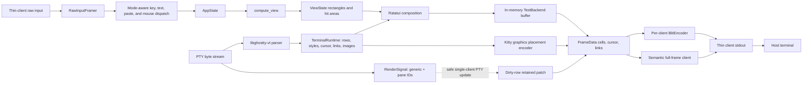

# Herdr TUI rendering and visual system

## Scope and provenance

This report is a source-level study of Herdr's TUI: composition, terminal
emulation, visual styling, input routing, resizing, frame streaming, damage
tracking, and rendering tests. It records Herdr-specific findings only. It is
not a Cyclops adoption plan.

The inspected upstream revision was
[`2863b715132fe29e53089e06f105943d1df0b3b4`](https://github.com/herdrdev/herdr/tree/2863b715132fe29e53089e06f105943d1df0b3b4),
authored and committed on 2026-08-05 at 19:34:24 +03:00. The commit subject is
`feat(windows): support remote attach to unix hosts (#2329)`. All source links
below are pinned to that revision.

Unless a paragraph says **Inference**, statements below are direct evidence
from the linked source. I inspected source and tests; I did not run Herdr or
capture a live terminal session.

## Executive summary

Herdr is not simply a conventional Ratatui application drawing through a
Crossterm backend. It has three cooperating rendering systems:

1. Ratatui composes the application chrome, pane rectangles, terminal cells,
   overlays, and cursor into a cell buffer.
2. A vendored `libghostty-vt` terminal engine parses each PTY stream and exposes
   terminal rows, styles, cursor state, hyperlinks, scrollback, and Kitty image
   placements. Herdr translates those cells into Ratatui cells.
3. In the normal persistent-server architecture, Herdr renders to an in-memory
   Ratatui `TestBackend`, converts that buffer into a stable wire-owned semantic
   frame, and either sends the frame or converts it to per-client ANSI diffs.
   The thin client writes the result to the real terminal.

The direct-terminal path still exists for monolithic/no-session mode, but the
product identity is explicitly a background server whose terminals outlive the
client ([README, lines 29-37](https://github.com/herdrdev/herdr/blob/2863b715132fe29e53089e06f105943d1df0b3b4/README.md#L29-L37)). The headless server is therefore the more revealing path.

The strongest architectural choices are:

- geometry is computed before drawing and retained in `ViewState`, so rendering
  is read-only and hit testing uses the same rectangles that produced the UI;
- render requests are event-driven and coalesced by origin, with a 16 ms render
  floor;
- ordinary frames are per-client because clients may have different dimensions,
  themes, encodings, cursor policies, and graphics caches;
- PTY-only output can bypass full UI composition by patching dirty terminal rows
  into the last semantic frame, but only behind conservative correctness gates;
- a frame baseline is committed only after the frame enters the client's bounded
  writer queue, so backpressure cannot corrupt later diffs;
- visual state uses a centralized semantic palette, display-width-aware text,
  global border-junction composition, responsive desktop/mobile layouts, and
  explicit overlay z-order;
- embedded-terminal fidelity is a first-class subsystem, not a `Paragraph` of
  captured text.

## Architecture and data flow

Herdr pins Crossterm 0.29, Ratatui 0.30 with rendered-line information, and
`unicode-width` 0.2. PTYs use a locally patched `portable-pty`
([Cargo.toml, lines 22-49](https://github.com/herdrdev/herdr/blob/2863b715132fe29e53089e06f105943d1df0b3b4/Cargo.toml#L22-L49)).

### Two host-rendering paths

The monolithic path calls `ratatui::init()`, enables bracketed paste, focus
events, mouse capture, host color-scheme reports, and keyboard enhancement
flags, then calls `App::run`. Both normal shutdown and the panic hook disable
those modes, clear Herdr-owned graphics, and restore Ratatui
([main.rs, lines 797-882](https://github.com/herdrdev/herdr/blob/2863b715132fe29e53089e06f105943d1df0b3b4/src/main.rs#L797-L882)).

The persistent path does not enter raw mode or read server stdin. Its module
contract says it owns PTYs, renders to a virtual Ratatui buffer, streams frames,
routes client input into the normal input pipeline, and survives disconnects
([headless.rs, lines 1-15](https://github.com/herdrdev/herdr/blob/2863b715132fe29e53089e06f105943d1df0b3b4/src/server/headless.rs#L1-L15)). The thin client negotiates a render encoding and reports terminal columns,
rows, and optional cell pixel size during its handshake
([wire.rs, lines 37-44](https://github.com/herdrdev/herdr/blob/2863b715132fe29e53089e06f105943d1df0b3b4/src/protocol/wire.rs#L37-L44),
[lines 340-360](https://github.com/herdrdev/herdr/blob/2863b715132fe29e53089e06f105943d1df0b3b4/src/protocol/wire.rs#L340-L360)).

`CursorTrackingBackend` wraps Ratatui's `TestBackend` to retain explicit cursor
intent. Virtual rendering computes the client-sized view, draws the same shared
UI, clones the buffer, then separately resolves whether the focused terminal,
popup terminal, or UI owns the host cursor
([render_stream.rs, lines 200-281](https://github.com/herdrdev/herdr/blob/2863b715132fe29e53089e06f105943d1df0b3b4/src/server/render_stream.rs#L200-L281),
[lines 283-399](https://github.com/herdrdev/herdr/blob/2863b715132fe29e53089e06f105943d1df0b3b4/src/server/render_stream.rs#L283-L399)).

The thin client enters Ratatui's terminal mode only after the server handshake
succeeds, configures mouse/focus/paste/keyboard protocols, and disables host
autowrap because its ANSI blitter controls row movement. A drop guard and panic
hook restore line wrap and all input modes
([client/mod.rs, lines 328-417](https://github.com/herdrdev/herdr/blob/2863b715132fe29e53089e06f105943d1df0b3b4/src/client/mod.rs#L328-L417),
[lines 566-601](https://github.com/herdrdev/herdr/blob/2863b715132fe29e53089e06f105943d1df0b3b4/src/client/mod.rs#L566-L601),
[lines 1183-1210](https://github.com/herdrdev/herdr/blob/2863b715132fe29e53089e06f105943d1df0b3b4/src/client/mod.rs#L1183-L1210)).

## Render lifecycle

### Local application loop

`App::run` drains bounded internal events, API requests, title changes, and due
tasks before drawing. It waits in a `tokio::select!` over API, internal events,
raw input, the next deadline, and render notification
([app/mod.rs, lines 903-1039](https://github.com/herdrdev/herdr/blob/2863b715132fe29e53089e06f105943d1df0b3b4/src/app/mod.rs#L903-L1039),
[lines 1098-1144](https://github.com/herdrdev/herdr/blob/2863b715132fe29e53089e06f105943d1df0b3b4/src/app/mod.rs#L1098-L1144)).

Every local draw is wrapped in DEC synchronized output. A forced full redraw
invalidates Ratatui's prior buffer by marking cells skipped and swapping
buffers. Drawing then computes geometry, renders the UI, and paints Kitty
graphics afterward. The loop records the render time and immediately continues
so already-ready work can be drained
([app/mod.rs, lines 165-181](https://github.com/herdrdev/herdr/blob/2863b715132fe29e53089e06f105943d1df0b3b4/src/app/mod.rs#L165-L181),
[lines 1039-1095](https://github.com/herdrdev/herdr/blob/2863b715132fe29e53089e06f105943d1df0b3b4/src/app/mod.rs#L1039-L1095)).

Rendering is capped at approximately 60 Hz with a 16 ms minimum interval. The
normal local runtime also checks terminal size every 100 ms
([app/mod.rs, lines 35-37](https://github.com/herdrdev/herdr/blob/2863b715132fe29e53089e06f105943d1df0b3b4/src/app/mod.rs#L35-L37),
[app/runtime.rs, lines 269-288](https://github.com/herdrdev/herdr/blob/2863b715132fe29e53089e06f105943d1df0b3b4/src/app/runtime.rs#L269-L288)).

### Headless server loop

The server loop has a clear phase order: observe coalesced render state; drain
internal events; drain API work; accept clients; drain client/server events;
process deadlines and deferred work; render; then wait
([headless.rs, lines 526-680](https://github.com/herdrdev/herdr/blob/2863b715132fe29e53089e06f105943d1df0b3b4/src/server/headless.rs#L526-L680),
[lines 680-839](https://github.com/herdrdev/herdr/blob/2863b715132fe29e53089e06f105943d1df0b3b4/src/server/headless.rs#L680-L839)). Render impact is ranked `None < Graphics < Full`, while PTY work is classified as clean, hidden, or visible before selecting a render plan
([headless.rs, lines 134-182](https://github.com/herdrdev/herdr/blob/2863b715132fe29e53089e06f105943d1df0b3b4/src/server/headless.rs#L134-L182)).

`RenderSignal` coalesces a generic dirty bit and a set of dirty pane IDs. Only
the idle-to-pending transition needs to wake the render loop, and source IDs are
retained so output from panes hidden from every client can be skipped
([render_signal.rs, lines 7-56](https://github.com/herdrdev/herdr/blob/2863b715132fe29e53089e06f105943d1df0b3b4/src/render_signal.rs#L7-L56)).

With no attached clients, the server still renders an effective 80x24 virtual
view. This maintains geometry while no host surface exists
([headless.rs, lines 257-259](https://github.com/herdrdev/herdr/blob/2863b715132fe29e53089e06f105943d1df0b3b4/src/server/headless.rs#L257-L259),
[lines 4036-4059](https://github.com/herdrdev/herdr/blob/2863b715132fe29e53089e06f105943d1df0b3b4/src/server/headless.rs#L4036-L4059)).

## Layout and composition

### Geometry before painting

Herdr explicitly separates `compute_view` from `render`. The first phase may
normalize scroll offsets and resize PTYs; the second reads `AppState` without
mutating it. A separate compute entry point lays out a background client's frame
without resizing the shared pane runtimes
([ui.rs, lines 108-156](https://github.com/herdrdev/herdr/blob/2863b715132fe29e53089e06f105943d1df0b3b4/src/ui.rs#L108-L156)).

Desktop geometry divides the surface into sidebar and main areas, optionally
reserves one tab-bar row, computes pane and split rectangles, normalizes
scrolling, and stores every clickable area in `ViewState`
([ui.rs, lines 191-324](https://github.com/herdrdev/herdr/blob/2863b715132fe29e53089e06f105943d1df0b3b4/src/ui.rs#L191-L324)). At the configured narrow-width threshold, mobile geometry replaces the sidebar and tab bar with a two-row header and uses the remaining rows for the terminal surface
([ui.rs, lines 326-386](https://github.com/herdrdev/herdr/blob/2863b715132fe29e53089e06f105943d1df0b3b4/src/ui.rs#L326-L386)).

Pane tiling is a binary space-partition tree. Every split retains direction and
ratio; layout emits both `PaneInfo` rectangles and `SplitBorder` records used by
mouse dragging. Ratios are clamped to 0.1 through 0.9
([layout.rs, lines 32-92](https://github.com/herdrdev/herdr/blob/2863b715132fe29e53089e06f105943d1df0b3b4/src/layout.rs#L32-L92),
[lines 125-136](https://github.com/herdrdev/herdr/blob/2863b715132fe29e53089e06f105943d1df0b3b4/src/layout.rs#L125-L136),
[lines 274-305](https://github.com/herdrdev/herdr/blob/2863b715132fe29e53089e06f105943d1df0b3b4/src/layout.rs#L274-L305)).

### Paint order and overlays

The paint order is explicit: navigation chrome, tab bar, terminal panes or the
empty state, ambient notifications, an optional popup terminal, and finally the
interactive overlay selected by `Mode`. Notifications therefore appear above
panes but beneath dialogs and mode overlays
([ui.rs, lines 389-462](https://github.com/herdrdev/herdr/blob/2863b715132fe29e53089e06f105943d1df0b3b4/src/ui.rs#L389-L462)). Toast and clipboard feedback rectangles are adjusted so simultaneous ambient messages do not cover each other
([ui.rs, lines 480-548](https://github.com/herdrdev/herdr/blob/2863b715132fe29e53089e06f105943d1df0b3b4/src/ui.rs#L480-L548)).

Shared modal helpers clear the underlying cells before drawing a panel, enforce
minimum popup geometry, compute stacked modal regions, and standardize buttons
and choice rows
([widgets.rs, lines 11-60](https://github.com/herdrdev/herdr/blob/2863b715132fe29e53089e06f105943d1df0b3b4/src/ui/widgets.rs#L11-L60),
[lines 70-249](https://github.com/herdrdev/herdr/blob/2863b715132fe29e53089e06f105943d1df0b3b4/src/ui/widgets.rs#L70-L249)). Individual feature modules still own their content and interaction geometry; the `ui` module is an orchestrator over dialogs, menus, mobile, navigator, onboarding, panes, settings, sidebar, status, tabs, text, and widgets
([ui.rs, lines 8-101](https://github.com/herdrdev/herdr/blob/2863b715132fe29e53089e06f105943d1df0b3b4/src/ui.rs#L8-L101)).

### Pane chrome

Pane content geometry handles borders, gaps, titles, and scrollbars before a PTY
is resized or rendered. In a multi-pane layout, adjacent panes can share one
border instead of drawing two. With borders disabled, an optional one-cell gap
is created by shrinking only panes that have a neighbor to the right or below
([panes.rs, lines 90-129](https://github.com/herdrdev/herdr/blob/2863b715132fe29e53089e06f105943d1df0b3b4/src/ui/panes.rs#L90-L129)).

When scrollbars are enabled and the pane is wide enough, Herdr reserves the
scrollbar column even when no thumb is visible. Terminal width therefore does
not jump when scrollback first appears
([panes.rs, lines 34-45](https://github.com/herdrdev/herdr/blob/2863b715132fe29e53089e06f105943d1df0b3b4/src/ui/panes.rs#L34-L45),
[lines 146-167](https://github.com/herdrdev/herdr/blob/2863b715132fe29e53089e06f105943d1df0b3b4/src/ui/panes.rs#L146-L167)).

The pane renderer paints each terminal, its scrollbar, unfocused dimming,
copy-mode search and selection, and the copy cursor before drawing the global
border layer. Border connectivity is accumulated across panes and then mapped
to Unicode line/junction glyphs, avoiding broken T-junctions at nested splits
([panes.rs, lines 302-374](https://github.com/herdrdev/herdr/blob/2863b715132fe29e53089e06f105943d1df0b3b4/src/ui/panes.rs#L302-L374),
[lines 445-547](https://github.com/herdrdev/herdr/blob/2863b715132fe29e53089e06f105943d1df0b3b4/src/ui/panes.rs#L445-L547),
[lines 614-685](https://github.com/herdrdev/herdr/blob/2863b715132fe29e53089e06f105943d1df0b3b4/src/ui/panes.rs#L614-L685)). A popup terminal is a real terminal runtime inside a cleared, centered, bordered panel rather than a text approximation
([panes.rs, lines 407-435](https://github.com/herdrdev/herdr/blob/2863b715132fe29e53089e06f105943d1df0b3b4/src/ui/panes.rs#L407-L435)).

## Visual language

### Palette and host-theme integration

All application chrome draws from a 17-token `Palette`: accent, panel and
sidebar backgrounds, three surface levels, two overlay levels, primary and
secondary text, and semantic mauve/green/yellow/red/blue/teal/peach colors. The
default is Catppuccin Mocha, and a terminal-native palette uses named 16-color
values and reset backgrounds
([state.rs, lines 99-166](https://github.com/herdrdev/herdr/blob/2863b715132fe29e53089e06f105943d1df0b3b4/src/app/state.rs#L99-L166),
[lines 191-212](https://github.com/herdrdev/herdr/blob/2863b715132fe29e53089e06f105943d1df0b3b4/src/app/state.rs#L191-L212)). The source includes dark and light variants of Catppuccin, Tokyo Night, Gruvbox, One, Solarized, Kanagawa, Rose Pine, plus Dracula, Nord, and Vesper
([state.rs, lines 559-582](https://github.com/herdrdev/herdr/blob/2863b715132fe29e53089e06f105943d1df0b3b4/src/app/state.rs#L559-L582)).

Theme configuration can auto-switch dark/light base themes and override any
token. Color parsing accepts reset aliases, short and long hex, `rgb()`, and
named terminal colors; an invalid value logs a warning and becomes cyan
([theme.rs, lines 4-50](https://github.com/herdrdev/herdr/blob/2863b715132fe29e53089e06f105943d1df0b3b4/src/config/theme.rs#L4-L50),
[lines 52-118](https://github.com/herdrdev/herdr/blob/2863b715132fe29e53089e06f105943d1df0b3b4/src/config/theme.rs#L52-L118)).

Herdr queries host default foreground/background and all 256 palette slots. It
infers dark versus light from background luminance unless the host explicitly
reports a color scheme, propagates the resulting terminal theme into every pane
emulator, and requests a generic render when the application palette changes
([terminal_theme.rs, lines 23-38](https://github.com/herdrdev/herdr/blob/2863b715132fe29e53089e06f105943d1df0b3b4/src/terminal_theme.rs#L23-L38),
[lines 57-88](https://github.com/herdrdev/herdr/blob/2863b715132fe29e53089e06f105943d1df0b3b4/src/terminal_theme.rs#L57-L88),
[theme_sync.rs, lines 38-113](https://github.com/herdrdev/herdr/blob/2863b715132fe29e53089e06f105943d1df0b3b4/src/app/theme_sync.rs#L38-L113)). This integrates both Herdr chrome and child terminal defaults with the outer terminal.

### Text, symbols, and status

Truncation and middle elision use Unicode display width rather than byte or
scalar counts. The tests include Chinese text
([text.rs, lines 1-68](https://github.com/herdrdev/herdr/blob/2863b715132fe29e53089e06f105943d1df0b3b4/src/ui/text.rs#L1-L68),
[lines 70-88](https://github.com/herdrdev/herdr/blob/2863b715132fe29e53089e06f105943d1df0b3b4/src/ui/text.rs#L70-L88)). Pane-title tests also assert CJK placement and display width
([panes.rs, lines 983-1044](https://github.com/herdrdev/herdr/blob/2863b715132fe29e53089e06f105943d1df0b3b4/src/ui/panes.rs#L983-L1044)).

Agent state indicators have two configurable glyph families. The dot family
uses filled/open/small dots; the symbol family uses `×`, `◐`, `✓`, `○`, and `·`.
Colors are semantic: blocked red, working yellow, unseen completion teal, seen
idle green, and unknown muted overlay. A separate label function supplies the
text `blocked`, `working`, `done`, or `idle` when a view includes state text
([status.rs, lines 196-245](https://github.com/herdrdev/herdr/blob/2863b715132fe29e53089e06f105943d1df0b3b4/src/ui/status.rs#L196-L245)).

## Embedded terminal rendering

### VT engine and graphemes

Each pane wraps a mutex-protected Ghostty terminal and render state, plus
keyboard, theme, OSC, cursor-shape, and cursor-settle trackers
([pane/terminal.rs, lines 141-186](https://github.com/herdrdev/herdr/blob/2863b715132fe29e53089e06f105943d1df0b3b4/src/pane/terminal.rs#L141-L186)). `build.rs` compiles the vendored Zig `libghostty-vt` into a static library
([build.rs, lines 32-92](https://github.com/herdrdev/herdr/blob/2863b715132fe29e53089e06f105943d1df0b3b4/build.rs#L32-L92)). The vendored base is Ghostty commit `c5a21edf...`
([vendor metadata](https://github.com/herdrdev/herdr/blob/2863b715132fe29e53089e06f105943d1df0b3b4/vendor/libghostty-vt.vendor.json#L1-L4)).

Herdr carries an explicit local patch enabling DEC private mode 2027 as a
default, including after RIS. Its rationale is that flags, ZWJ emoji, and other
multi-codepoint graphemes must occupy one emulator cell when Herdr renders cells
directly. The patch file documents removal conditions and regression probes
([patch rationale, lines 1-40](https://github.com/herdrdev/herdr/blob/2863b715132fe29e53089e06f105943d1df0b3b4/vendor/libghostty-vt.patches.md#L1-L40),
[patch, lines 1-21](https://github.com/herdrdev/herdr/blob/2863b715132fe29e53089e06f105943d1df0b3b4/vendor/patches/libghostty-vt/0001-default-grapheme-cluster-mode.patch#L1-L21)).

### PTY bytes to Ratatui cells

The PTY reader feeds bytes into Ghostty, collects terminal replies, clipboard
writes, reported working directory, keyboard-mode changes, and cursor state,
then requests a pane-scoped render. A render notification is sent only for the
first idle-to-pending transition
([pane.rs, lines 1856-1904](https://github.com/herdrdev/herdr/blob/2863b715132fe29e53089e06f105943d1df0b3b4/src/pane.rs#L1856-L1904)).

When the child has DEC synchronized output enabled, a partial write does not
request an immediate Herdr frame. Kitty graphics and one platform cursor-settle
case may instead schedule a delayed render
([pane/terminal.rs, lines 1207-1255](https://github.com/herdrdev/herdr/blob/2863b715132fe29e53089e06f105943d1df0b3b4/src/pane/terminal.rs#L1207-L1255)). This keeps Herdr from exposing a child's intermediate synchronized-output state.

For a full pane render, Herdr updates Ghostty's render state, resolves default
colors against the host theme, iterates rows and cells, copies grapheme symbols
and styles into the Ratatui buffer, fills unused cells, clears Ghostty's dirty
flags, and maps the terminal cursor into the pane rectangle
([pane/terminal.rs, lines 1915-2021](https://github.com/herdrdev/herdr/blob/2863b715132fe29e53089e06f105943d1df0b3b4/src/pane/terminal.rs#L1915-L2021)). Runtime resize is idempotent, clamps panes to at least 4 columns by 2 rows, resizes both emulator and PTY, and preserves pixel cell dimensions
([pane.rs, lines 2493-2518](https://github.com/herdrdev/herdr/blob/2863b715132fe29e53089e06f105943d1df0b3b4/src/pane.rs#L2493-L2518)).

Hyperlinks and cursor are not inferred from rendered text. They are separately
read from the terminal runtime and attached to `FrameData`; OSC 8 URI indices
are deduplicated while cells are converted from Ratatui
([wire.rs, lines 452-519](https://github.com/herdrdev/herdr/blob/2863b715132fe29e53089e06f105943d1df0b3b4/src/protocol/wire.rs#L452-L519),
[lines 521-579](https://github.com/herdrdev/herdr/blob/2863b715132fe29e53089e06f105943d1df0b3b4/src/protocol/wire.rs#L521-L579)).

### Kitty graphics

Kitty images take a separate path because they are not Ratatui cells. The
graphics layer tracks cell pixel size plus per-host image and placement
signatures. It is active only in terminal mode with known cell size; changing
views, source images, clipping, scrollback, or placement geometry produces
upload, display, move, or delete commands
([kitty_graphics.rs, lines 20-145](https://github.com/herdrdev/herdr/blob/2863b715132fe29e53089e06f105943d1df0b3b4/src/kitty_graphics.rs#L20-L145),
[lines 178-233](https://github.com/herdrdev/herdr/blob/2863b715132fe29e53089e06f105943d1df0b3b4/src/kitty_graphics.rs#L178-L233),
[lines 295-429](https://github.com/herdrdev/herdr/blob/2863b715132fe29e53089e06f105943d1df0b3b4/src/kitty_graphics.rs#L295-L429)).

Image data is base64-chunked at 3,072 raw bytes. The encoder distinguishes
image upload from placement so unchanged images need not be retransmitted
([kitty_graphics.rs, lines 720-782](https://github.com/herdrdev/herdr/blob/2863b715132fe29e53089e06f105943d1df0b3b4/src/kitty_graphics.rs#L720-L782),
[lines 984-999](https://github.com/herdrdev/herdr/blob/2863b715132fe29e53089e06f105943d1df0b3b4/src/kitty_graphics.rs#L984-L999)). Graphics bytes are inserted before the frame's synchronized-output end and wrapped with save/restore cursor in the semantic-client path
([render_stream.rs, lines 158-168](https://github.com/herdrdev/herdr/blob/2863b715132fe29e53089e06f105943d1df0b3b4/src/server/render_stream.rs#L158-L168),
[client/mod.rs, lines 2085-2102](https://github.com/herdrdev/herdr/blob/2863b715132fe29e53089e06f105943d1df0b3b4/src/client/mod.rs#L2085-L2102)).

## Interaction model

Raw host input is framed into keys, committed text, paste, mouse, focus,
terminal-color replies, color-scheme changes, and cell-size replies. The local
reader runs on a blocking thread and sends events through a bounded channel
([raw_input.rs, lines 126-208](https://github.com/herdrdev/herdr/blob/2863b715132fe29e53089e06f105943d1df0b3b4/src/raw_input.rs#L126-L208),
[lines 597-639](https://github.com/herdrdev/herdr/blob/2863b715132fe29e53089e06f105943d1df0b3b4/src/raw_input.rs#L597-L639)). In thin-client mode, Unix forwards framed raw bytes and the server performs the same semantic parsing; Windows reframes terminal control bytes surfaced through its console path
([client/input.rs, lines 1-12](https://github.com/herdrdev/herdr/blob/2863b715132fe29e53089e06f105943d1df0b3b4/src/client/input.rs#L1-L12),
[lines 65-184](https://github.com/herdrdev/herdr/blob/2863b715132fe29e53089e06f105943d1df0b3b4/src/client/input.rs#L65-L184)).

Keyboard dispatch is mode-first. Popup terminals capture keys before the normal
mode dispatcher. Terminal, prefix, navigate, and copy modes have dedicated
paths; dialog, settings, launcher, help, and navigator modes handle their own
keys. Text and paste similarly go to the popup PTY, the active modal text input,
or the focused pane PTY
([app/input/mod.rs, lines 77-207](https://github.com/herdrdev/herdr/blob/2863b715132fe29e53089e06f105943d1df0b3b4/src/app/input/mod.rs#L77-L207)).

Mouse routing follows visual z-order: popup terminal, interactive overlay,
sidebar divider, modified hyperlink click, pane focus, and then the general
geometry-driven action handler. The latter can produce semantic focus, move,
resize, settings, or modal actions
([app/input/mod.rs, lines 329-477](https://github.com/herdrdev/herdr/blob/2863b715132fe29e53089e06f105943d1df0b3b4/src/app/input/mod.rs#L329-L477)). Popup mouse coordinates are translated from host space into pane-local coordinates. Wheel input follows the emulated terminal's current protocol: application mouse report, alternate-screen scroll keys, or Herdr scrollback
([app/input/mod.rs, lines 479-535](https://github.com/herdrdev/herdr/blob/2863b715132fe29e53089e06f105943d1df0b3b4/src/app/input/mod.rs#L479-L535)).

The same `ViewState` rectangles produced during layout are consumed by hit
testing. This avoids an independent interaction layout that could drift from
painted geometry.

## Diffing, damage, streaming, and backpressure

### Stable semantic frame

Herdr owns a serializable `CellData` instead of putting Ratatui's `Cell` on the
wire. Each cell contains a grapheme string, packed colors, modifier bits, the
Ratatui skip flag, and an optional hyperlink-table index. `FrameData` adds
dimensions, cursor, hyperlink table, and graphics bytes
([wire.rs, lines 452-519](https://github.com/herdrdev/herdr/blob/2863b715132fe29e53089e06f105943d1df0b3b4/src/protocol/wire.rs#L452-L519)).

Semantic clients receive changed full `FrameData` values. ANSI clients keep a
per-client `BlitEncoder`, sequence number, and repaint flag. Identical frames
are skipped in both modes
([render_stream.rs, lines 12-110](https://github.com/herdrdev/herdr/blob/2863b715132fe29e53089e06f105943d1df0b3b4/src/server/render_stream.rs#L12-L110)).

### ANSI cell diff

The ANSI encoder performs a full draw for the first frame, forced repaint, or
dimension change, and otherwise compares visual cell contents. It wraps output
in DEC synchronized output, hides the cursor before cell writes, resets OSC 8
state, batches adjacent changed cells, avoids redundant SGR, restores final
cursor position/shape/visibility, and on non-Windows platforms repeats the
final cursor anchor after the sync block for IME placement
([render_ansi.rs, lines 1-27](https://github.com/herdrdev/herdr/blob/2863b715132fe29e53089e06f105943d1df0b3b4/src/protocol/render_ansi.rs#L1-L27),
[lines 55-140](https://github.com/herdrdev/herdr/blob/2863b715132fe29e53089e06f105943d1df0b3b4/src/protocol/render_ansi.rs#L55-L140),
[lines 447-521](https://github.com/herdrdev/herdr/blob/2863b715132fe29e53089e06f105943d1df0b3b4/src/protocol/render_ansi.rs#L447-L521)).

The diff accounts for current and previous grapheme display widths so replacing
a wide glyph reveals cells it formerly covered. It also sanitizes OSC 8 URIs by
removing escape, bell, and control characters
([render_ansi.rs, lines 523-542](https://github.com/herdrdev/herdr/blob/2863b715132fe29e53089e06f105943d1df0b3b4/src/protocol/render_ansi.rs#L523-L542),
[lines 677-729](https://github.com/herdrdev/herdr/blob/2863b715132fe29e53089e06f105943d1df0b3b4/src/protocol/render_ansi.rs#L677-L729),
[lines 757-825](https://github.com/herdrdev/herdr/blob/2863b715132fe29e53089e06f105943d1df0b3b4/src/protocol/render_ansi.rs#L757-L825)).

### Retained PTY dirty-row path

Ghostty exposes clean, partial, or full damage. For partial damage, Herdr copies
entire dirty rows into `CellData`; selection, hyperlinks, emulator errors, or
full damage force a fallback. Dirty flags are cleared only after a complete
patch has been built
([pane/terminal.rs, lines 2121-2290](https://github.com/herdrdev/herdr/blob/2863b715132fe29e53089e06f105943d1df0b3b4/src/pane/terminal.rs#L2121-L2290)). This damage is row-granular, not a list of individual cell spans.

The headless server may patch those rows directly into the last semantic frame,
refresh its cursor, and stream the result without recomposing sidebar, tabs,
overlays, and every pane. The fast path requires exactly one app render target,
a matching prior frame, no pending render or active graphics, and a plain
terminal-mode application state with no popup, selection, copy mode, context
menu, toast, feedback, or forced redraw. A dirty row that intersects existing
hyperlink metadata also falls back
([headless.rs, lines 3823-3958](https://github.com/herdrdev/herdr/blob/2863b715132fe29e53089e06f105943d1df0b3b4/src/server/headless.rs#L3823-L3958)).

This optimization is deliberately conservative: a false negative costs a full
render, while a false positive could leave stale chrome or metadata.

### Per-client rendering and transactional baselines

Each connection retains its dimensions, cell size, host theme, input parser,
activity timestamp, render baseline, graphics cache, deferred-render state, and
writer channels
([clients.rs, lines 31-73](https://github.com/herdrdev/herdr/blob/2863b715132fe29e53089e06f105943d1df0b3b4/src/server/clients.rs#L31-L73)). App clients, direct terminal attachments, and terminal observers are separate modes
([clients.rs, lines 8-21](https://github.com/herdrdev/herdr/blob/2863b715132fe29e53089e06f105943d1df0b3b4/src/server/clients.rs#L8-L21)).

The most recently active full-app client is the foreground client. Render
targets are sorted with it last
([clients.rs, lines 268-321](https://github.com/herdrdev/herdr/blob/2863b715132fe29e53089e06f105943d1df0b3b4/src/server/clients.rs#L268-L321)). A foreground client render may resize the shared PTYs; background client frames use their own geometry without doing so, and their scroll-normalization mutations are restored afterward
([headless.rs, lines 4062-4116](https://github.com/herdrdev/herdr/blob/2863b715132fe29e53089e06f105943d1df0b3b4/src/server/headless.rs#L4062-L4116)).

Prepared render state is committed only after `try_send` succeeds. A full writer
queue records a deferred full render and leaves the old baseline intact; a
closed queue removes the client. Graphics cache state follows the same commit
rule
([headless.rs, lines 4180-4317](https://github.com/herdrdev/herdr/blob/2863b715132fe29e53089e06f105943d1df0b3b4/src/server/headless.rs#L4180-L4317),
[render_stream.rs, lines 121-147](https://github.com/herdrdev/herdr/blob/2863b715132fe29e53089e06f105943d1df0b3b4/src/server/render_stream.rs#L121-L147)). Deferred priority is full frame over graphics-only update
([clients.rs, lines 138-173](https://github.com/herdrdev/herdr/blob/2863b715132fe29e53089e06f105943d1df0b3b4/src/server/clients.rs#L138-L173)).

### Resizing

The thin client has a dedicated resize thread. Every 100 ms it combines terminal
size/cell-size observation with a platform resize signal; it reports even a
signal that returns to the previous dimensions, invalidates its host-side diff
baseline, and sends `ClientMessage::Resize`
([client/mod.rs, lines 1512-1525](https://github.com/herdrdev/herdr/blob/2863b715132fe29e53089e06f105943d1df0b3b4/src/client/mod.rs#L1512-L1525),
[lines 2179-2277](https://github.com/herdrdev/herdr/blob/2863b715132fe29e53089e06f105943d1df0b3b4/src/client/mod.rs#L2179-L2277)).

On the server, a direct terminal attachment resizes that terminal immediately;
an observer changes only its view; a full app client becomes foreground and
resizes the shared runtime to the effective size
([headless.rs, lines 2961-3021](https://github.com/herdrdev/herdr/blob/2863b715132fe29e53089e06f105943d1df0b3b4/src/server/headless.rs#L2961-L3021)).

## Rendering tests and observability

Herdr's rendering tests are close to the mechanisms they protect:

- `tab_surface` renders full desktop and mobile application frames and pins a
  SHA-256 digest plus important geometry, cursor, split, and hyperlink facts
  ([tab_surface.rs, lines 291-325](https://github.com/herdrdev/herdr/blob/2863b715132fe29e53089e06f105943d1df0b3b4/src/ui/tab_surface.rs#L291-L325)).
- Pane tests assert display-width-aware CJK titles, single shared dividers,
  borders with and without gaps, and junction composition
  ([panes.rs, lines 983-1141](https://github.com/herdrdev/herdr/blob/2863b715132fe29e53089e06f105943d1df0b3b4/src/ui/panes.rs#L983-L1141)).
- The ANSI encoder has byte-level tests for synchronized output, cursor ordering
  and shapes, OSC 8 sanitization, minimal changed-cell output, resizing, wide
  graphemes, half-width voiced kana, and replay of diffs
  ([render_ansi.rs, lines 972-1050](https://github.com/herdrdev/herdr/blob/2863b715132fe29e53089e06f105943d1df0b3b4/src/protocol/render_ansi.rs#L972-L1050),
  [lines 1363-1538](https://github.com/herdrdev/herdr/blob/2863b715132fe29e53089e06f105943d1df0b3b4/src/protocol/render_ansi.rs#L1363-L1538),
  [lines 1831-1975](https://github.com/herdrdev/herdr/blob/2863b715132fe29e53089e06f105943d1df0b3b4/src/protocol/render_ansi.rs#L1831-L1975)).
- Headless tests cover different per-client sizes, ANSI clients, queue-full
  baseline safety, identical-frame suppression, hidden panes, retained-row
  streaming, retained-versus-full frame equality, cursor-only updates, overlay
  fallbacks, hyperlink fallbacks, and graphics-cache gates
  ([headless.rs, lines 8124-8762](https://github.com/herdrdev/herdr/blob/2863b715132fe29e53089e06f105943d1df0b3b4/src/server/headless.rs#L8124-L8762),
  [lines 8799-9515](https://github.com/herdrdev/herdr/blob/2863b715132fe29e53089e06f105943d1df0b3b4/src/server/headless.rs#L8799-L9515)).
- The grapheme patch records focused regression commands for reset survival,
  flag emoji, and ZWJ family emoji
  ([libghostty-vt.patches.md, lines 34-40](https://github.com/herdrdev/herdr/blob/2863b715132fe29e53089e06f105943d1df0b3b4/vendor/libghostty-vt.patches.md#L34-L40)).

Render profiling is opt-in through `HERDR_RENDER_PROF`. It aggregates named
counters and count/average/max timings in one-second windows. Instrumented
measurements include loop activity, full versus retained causes, dirty rows and
cells, frame build/serialization/send, ANSI scanned/changed cells and runs, and
PTY parser time
([render_prof.rs, lines 1-87](https://github.com/herdrdev/herdr/blob/2863b715132fe29e53089e06f105943d1df0b3b4/src/render_prof.rs#L1-L87),
[lines 90-135](https://github.com/herdrdev/herdr/blob/2863b715132fe29e53089e06f105943d1df0b3b4/src/render_prof.rs#L90-L135)).

## Reusable patterns observed in Herdr

These are descriptive patterns, not Cyclops recommendations.

- Keep layout computation, PTY resize, pure drawing, host encoding, and host IO
  as distinct phases.
- Retain rendered geometry as shared state for cursor resolution, hyperlinks,
  graphics placement, and mouse hit testing.
- Treat the embedded terminal as a protocol implementation with explicit cursor,
  style, grapheme, hyperlink, mouse, keyboard, synchronized-output, and image
  state.
- Give the wire protocol its own stable semantic cell representation instead of
  serializing a UI library's private types.
- Maintain a render baseline per output surface and advance it only after the
  frame is accepted for delivery.
- Make damage shortcuts conservative and test their output against the normal
  full-render path.
- Reserve optional chrome lanes, such as scrollbars, so content geometry remains
  stable when the chrome becomes visible.
- Build split borders as a global connectivity layer rather than drawing each
  pane border independently.
- Combine structural frame characterizations with focused cell/escape-sequence
  assertions and operational performance counters.

## Cautionary patterns and costs

- The architecture has several buffers and baselines: Ghostty render state,
  Ratatui buffers, semantic frames, ANSI encoder history, graphics caches, and
  bounded writer queues. Correctness depends on disciplined invalidation and
  commit order.
- The retained PTY path is valuable only under a narrow gate. Popups, selections,
  copy mode, context menus, ambient messages, hyperlinks, active graphics,
  multiple clients, missing baselines, or size mismatches all force a full
  composition.
- Background clients have independent frame geometry but share one PTY size.
  Only the foreground render resizes the shared runtimes. This is a deliberate
  compromise inherent in multiple differently sized views over one terminal
  process.
- Kitty graphics require a second damage/cache system and physical cell sizes.
  They also enlarge the permitted frame from the ordinary 2 MiB limit to 32 MiB
  ([wire.rs, lines 18-25](https://github.com/herdrdev/herdr/blob/2863b715132fe29e53089e06f105943d1df0b3b4/src/protocol/wire.rs#L18-L25)). Oversized graphics are dropped with a text-only fallback.
- Invalid custom theme colors become cyan after a warning rather than rejecting
  the theme. This is robust but can make configuration errors visually loud.
- Herdr intentionally contains polling: 100 ms local/thin-client resize checks
  and a 250 ms idle server wake because its nonblocking client listener is not
  integrated into `tokio::select!`
  ([headless.rs, lines 265-272](https://github.com/herdrdev/herdr/blob/2863b715132fe29e53089e06f105943d1df0b3b4/src/server/headless.rs#L265-L272)). This exact mechanism cannot be copied verbatim into Cyclops because Cyclops' local invariant 9 forbids polling.
- The vendored VT engine and local grapheme patch provide fidelity but add Zig
  toolchain, vendoring, security-update, and upstream-rebase obligations.

## Explicit inferences

1. **The normal product path optimizes transport as much as painting.** The
   presence of per-client virtual frames, two negotiated encodings, transactional
   baselines, graphics framing, and bounded writer backpressure indicates that
   remote/persistent attachment is a core rendering requirement, not a thin
   wrapper around a local TUI.
2. **Foreground-last rendering leaves shared geometry aligned with the client
   that owns PTY size.** `render_targets` sorts the foreground client last, and
   only that render permits pane resize. This appears intended to leave
   `AppState.view` consistent with the controlling surface after a multi-client
   render pass.
3. **There are two levels of damage optimization.** The retained Ghostty path
   avoids full Ratatui composition by patching dirty rows. The ANSI encoder then
   reduces the resulting semantic-frame change to host-terminal cell writes.
   They optimize different costs and can compose.
4. **The full-frame SHA digests are characterization snapshots without snapshot
   files.** They lock broad output compactly, while focused tests explain the
   intended behavior when the digest changes.

## Source map

| Subsystem | Primary source |
|---|---|
| Dependencies and direct terminal lifecycle | [Cargo.toml](https://github.com/herdrdev/herdr/blob/2863b715132fe29e53089e06f105943d1df0b3b4/Cargo.toml#L22-L49), [main.rs](https://github.com/herdrdev/herdr/blob/2863b715132fe29e53089e06f105943d1df0b3b4/src/main.rs#L797-L882) |
| Local render/event loop | [app/mod.rs](https://github.com/herdrdev/herdr/blob/2863b715132fe29e53089e06f105943d1df0b3b4/src/app/mod.rs#L903-L1144), [app/runtime.rs](https://github.com/herdrdev/herdr/blob/2863b715132fe29e53089e06f105943d1df0b3b4/src/app/runtime.rs#L269-L288) |
| Headless server loop and retained rendering | [server/headless.rs](https://github.com/herdrdev/herdr/blob/2863b715132fe29e53089e06f105943d1df0b3b4/src/server/headless.rs#L526-L849), [retained path](https://github.com/herdrdev/herdr/blob/2863b715132fe29e53089e06f105943d1df0b3b4/src/server/headless.rs#L3823-L4034) |
| Per-client state | [server/clients.rs](https://github.com/herdrdev/herdr/blob/2863b715132fe29e53089e06f105943d1df0b3b4/src/server/clients.rs#L8-L173) |
| Virtual Ratatui backend | [server/render_stream.rs](https://github.com/herdrdev/herdr/blob/2863b715132fe29e53089e06f105943d1df0b3b4/src/server/render_stream.rs#L1-L399) |
| Semantic frame and protocol | [protocol/wire.rs](https://github.com/herdrdev/herdr/blob/2863b715132fe29e53089e06f105943d1df0b3b4/src/protocol/wire.rs#L37-L44), [frame types](https://github.com/herdrdev/herdr/blob/2863b715132fe29e53089e06f105943d1df0b3b4/src/protocol/wire.rs#L452-L625) |
| ANSI diff encoder | [protocol/render_ansi.rs](https://github.com/herdrdev/herdr/blob/2863b715132fe29e53089e06f105943d1df0b3b4/src/protocol/render_ansi.rs#L1-L140), [diff loop](https://github.com/herdrdev/herdr/blob/2863b715132fe29e53089e06f105943d1df0b3b4/src/protocol/render_ansi.rs#L757-L825) |
| UI geometry and composition | [ui.rs](https://github.com/herdrdev/herdr/blob/2863b715132fe29e53089e06f105943d1df0b3b4/src/ui.rs#L108-L462), [tab_surface.rs](https://github.com/herdrdev/herdr/blob/2863b715132fe29e53089e06f105943d1df0b3b4/src/ui/tab_surface.rs#L10-L159) |
| Pane layout and chrome | [layout.rs](https://github.com/herdrdev/herdr/blob/2863b715132fe29e53089e06f105943d1df0b3b4/src/layout.rs#L1-L136), [ui/panes.rs](https://github.com/herdrdev/herdr/blob/2863b715132fe29e53089e06f105943d1df0b3b4/src/ui/panes.rs#L20-L685) |
| Widgets and overlays | [ui/widgets.rs](https://github.com/herdrdev/herdr/blob/2863b715132fe29e53089e06f105943d1df0b3b4/src/ui/widgets.rs#L1-L249), [overlay dispatch](https://github.com/herdrdev/herdr/blob/2863b715132fe29e53089e06f105943d1df0b3b4/src/ui.rs#L418-L461) |
| Palette and theme sync | [app/state.rs](https://github.com/herdrdev/herdr/blob/2863b715132fe29e53089e06f105943d1df0b3b4/src/app/state.rs#L99-L212), [config/theme.rs](https://github.com/herdrdev/herdr/blob/2863b715132fe29e53089e06f105943d1df0b3b4/src/config/theme.rs#L4-L118), [app/theme_sync.rs](https://github.com/herdrdev/herdr/blob/2863b715132fe29e53089e06f105943d1df0b3b4/src/app/theme_sync.rs#L3-L113) |
| Input and interaction | [raw_input.rs](https://github.com/herdrdev/herdr/blob/2863b715132fe29e53089e06f105943d1df0b3b4/src/raw_input.rs#L126-L208), [app/input/mod.rs](https://github.com/herdrdev/herdr/blob/2863b715132fe29e53089e06f105943d1df0b3b4/src/app/input/mod.rs#L77-L207), [mouse routing](https://github.com/herdrdev/herdr/blob/2863b715132fe29e53089e06f105943d1df0b3b4/src/app/input/mod.rs#L329-L535) |
| VT terminal rendering | [pane/terminal.rs](https://github.com/herdrdev/herdr/blob/2863b715132fe29e53089e06f105943d1df0b3b4/src/pane/terminal.rs#L141-L210), [full render](https://github.com/herdrdev/herdr/blob/2863b715132fe29e53089e06f105943d1df0b3b4/src/pane/terminal.rs#L1915-L2021), [dirty patches](https://github.com/herdrdev/herdr/blob/2863b715132fe29e53089e06f105943d1df0b3b4/src/pane/terminal.rs#L2121-L2290) |
| Kitty graphics | [kitty_graphics.rs](https://github.com/herdrdev/herdr/blob/2863b715132fe29e53089e06f105943d1df0b3b4/src/kitty_graphics.rs#L20-L233), [cache updates](https://github.com/herdrdev/herdr/blob/2863b715132fe29e53089e06f105943d1df0b3b4/src/kitty_graphics.rs#L295-L429) |
| Render request coalescing and profiling | [render_signal.rs](https://github.com/herdrdev/herdr/blob/2863b715132fe29e53089e06f105943d1df0b3b4/src/render_signal.rs#L7-L56), [render_prof.rs](https://github.com/herdrdev/herdr/blob/2863b715132fe29e53089e06f105943d1df0b3b4/src/render_prof.rs#L1-L135) |
